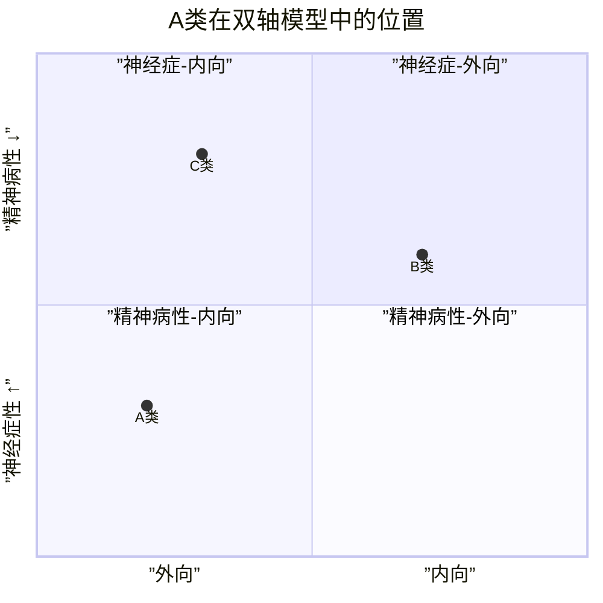
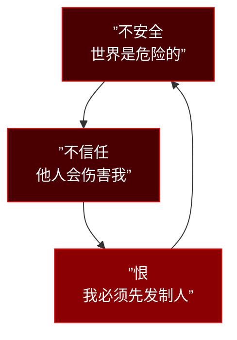
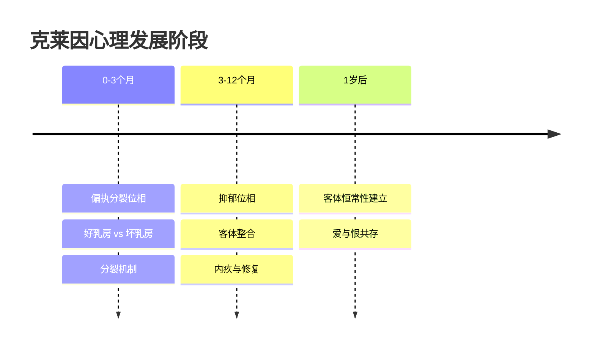

# 第10课：A类：偏执型人格

## Learning Objectives

- 理解偏执型人格的核心三要素及其动力学来源
- 掌握克莱因偏执分裂位相的理论意义
- 学会将偏执型特质应用于人物小传创作
- 识别偏执型在编剧中的积极社会功能与陷阱

---

## 一、A类编码：古怪型

本课开始进入**X轴（性格类型）** 的逐一深度拆解。在双轴模型中，参见 [[0004-y-axis-x-axis|Y轴与X轴框架]]，A类编码为"**古怪型（Odd Cluster）**"，其气质基线偏**内向**（中位线以下）。



A类人格的气质偏向内向—精神病性象限（第三象限），其核心特征是**与现实的疏离**。

> [!NOTE] 人格类型就像器官
> 人格类型不是一堆特质的简单加总，而是一个**组织（organization）**。正如心脏不仅仅是肌肉细胞的集合，人格类型是"整体大于部分之和"的有机结构。偏执型中的"不信任"不是孤立特质，而是与其他所有特质协同运作的组织原则。

---

## 二、偏执型的核心三要素

偏执型人格可浓缩为三个内核词：

1. **不安全（Insecurity）** —— 世界是危险的
2. **不信任（Distrust）** —— 他人是会伤害我的
3. **恨（Hatred）** —— 我必须先发制人

这三者形成一个自循环闭环：



外围特征包括：高度警觉、记仇、对忠诚的病态检验、无法放松、难以原谅。核心特质与外围特征的关系是：**核心驱动外围**。如果你的角色有记仇行为，追问背后是否来自不安全→不信任→恨的循环。

> [!TIP] 编剧箴言
> **偏执型角色最吸引人的地方不是他的"疯狂"，而是他的"逻辑"**。在一个偏执狂的世界里，一切都是有逻辑的——只是他的前提假设与常人不同。

---

## 三、克莱因的偏执分裂位相

梅兰妮-克莱因（Melanie Klein）认为，人类出生后的**头三个月**处于"偏执分裂位相（Paranoid-Schizoid Position）"。



在这个阶段，婴儿无法整合"好"与"坏"——母亲喂奶时是"好乳房"，母亲不在时是"坏乳房"。偏执型人格的**发展固着**就在于未能度过这一位相，导致成年后仍然**分裂地看待世界**：非黑即白，非友即敌。

### 早期母婴关系：温暖比乳汁重要

哈里-哈洛（Harlow）的恒河猴实验是绕不开的经典：

> [!QUOTE] 哈洛猴子实验
> 幼猴宁愿选择没有乳汁但包裹绒布的"温暖妈妈"，也不选择有乳汁但铁丝做成的"冰冷妈妈"。接触性安慰（contact comfort）是安全感的生物学根基。

偏执型人物的小传中，**一岁前与母亲的分离经历**几乎是必写项：母亲产后抑郁、母婴分离住院、寄养等。

> [!WARNING] 养育的个体化原则
> 养育遵循 **principle-based（原则导向）** 而非 **protocol-based（流程导向）**。没有哪本育儿手册能替代母亲对婴儿信号的敏感回应。偏执型的形成往往源于早期环境的"不可预测性"——婴儿无法建立"我一哭就有人来"的安全预期。

---

## 四、偏执型的防御机制

```mermaid
mindmap
  root((偏执型防御))
    高度警觉
      扫描环境威胁
      过度解读
    耻感文化
      羞耻驱动行为
      面子即生命
    虚体自恋
      详见[[0013-type-b-narcissistic|自恋型人格]]
      脆弱的自尊
      需要外部持续确认
    嫉妒
      投射自身敌意
      他人都是竞争者
```

### 空洞感与深层抑郁

偏执型人格的外壳是坚硬（敌意、攻击、警觉），但内核是**空洞**。长期处于高度警觉状态消耗大量心理能量，底层是一种深刻的抑郁——他们不相信自己值得被爱，所以也不相信别人会真诚对待自己。

> [!IMPORTANT] 生理关联
> 研究发现偏执型与**多巴胺**和**肾上腺素**系统高度相关。多巴胺系统过度活跃导致"过度归因"（将无意义事件解读为针对自己的信号），肾上腺素持续升高维持警觉状态。这为偏执型角色的表演提供了生理依据：这类角色可以"察觉"到其他人察觉不到的细节——这正是编剧可以大做文章的地方。

---

## 五、偏执型人物的社会功能

并非所有的偏执型都是病态的。**高功能偏执型（High-Functioning Paranoid）** 在特定职业中表现出色：

| 职业 | 偏执优势 | 潜在风险 |
|------|---------|---------|
| 科学家 | 质疑公认观点，反复验证 | 钻牛角尖，无法合作 |
| 律师 | 识别对方逻辑漏洞 | 过度诉讼倾向 |
| FBI探员 | 从蛛丝马迹发现犯罪模式 | 草木皆兵 |
| 安全专家 | 预判最坏情况 | 无法信任团队成员 |
| 调查记者 | 坚持追查真相 | 陷入阴谋论 |

编剧最爱的偏执型原型之一：**高智商独行侠**。

---

## 六、电影案例深度拆解

### 案例一：《肖申克的救赎》安迪-杜佛兰

安迪是高功能偏执型的完美化身：

- **不信任**：从不向任何人透露全部计划
- **高度警觉**：19年如一日观察监狱环境
- **系统化思维**：挖洞、做账、建立图书馆，每一步都是精密计算
- **深层目标**：不是对抗监狱，而是"逃出去"——这就是偏执型的正向驱动力

> [!NOTE] 安迪不是神经症水平
> 安迪的偏执是中性的工具，他没有被恨驱动，而是被**希望**驱动。这是安迪"迷人"而非"可怕"的根本原因——他在偏执的结构中注入了爱的内容。

### 案例二：《危情三日》约翰-布伦南

这是编剧值得研究的一个特殊变体：**一个有爱的能力的偏执狂**。

- 妻子被控谋杀，约翰坚信妻子无辜
- 他系统化地研究越狱方案（偏执型的计划性）
- 他的不信任指向外部系统（司法不公），而非指向妻子（爱的能力保留）
- 这是一次**偏执防御机制的创造性使用**——用偏执来守护爱

---

## 七、偏执型人物小传创作清单


**人物小传必填字段：**
1. **核心创伤**：一岁前分离经历、母亲产后抑郁、早期丧失
2. **关系模板**：偏执型的"关系模板"是什么？他认为别人是威胁、工具、还是潜在敌人？
3. **安全岛**：世界上有没有一个人让他暂时放下警觉？（如果完全没有，角色会过于扁平）
4. **偏执对象**：他的偏执集中指向什么？（体制/某个人/某类人/抽象概念如"不公"）
5. **功能水平**：在Y轴的哪个位置？神经症水平偏执（<普通人的多疑>）vs 精神病性水平偏执（被害妄想）

---

> [!QUESTION] 自我检查题
> 
> 1. 偏执型人格的三个核心要素是什么？它们之间形成了什么样的自我循环？
> 2. 克莱因"偏执分裂位相"对应出生后哪个阶段？偏执型人格的发展固着在哪一点？
> 3. 为什么哈洛的恒河猴实验对理解偏执型有重要意义？
> 4. 《肖申克的救赎》安迪和《危情三日》约翰都是偏执型角色，他们的关键区别是什么？
> 5. 如果你要设计一个偏执型反派，他在Y轴上的位置应该如何安排才能避免角色扁平化？
> 
> <details>
> <summary>参考答案</summary>
> 
> 1. 不安全、不信任、恨。三者形成闭环：不安全催生不信任，不信任累积为恨，恨反过来印证不安全。
> 
> 2. 出生后头三个月（0-3个月）。发展固着在于未能整合"好客体"与"坏客体"，导致成年后仍然以分裂的方式看待世界——非黑即白，非友即敌。
> 
> 3. 哈洛实验证明接触性安慰（温暖/拥抱）比食物更重要。偏执型的早期创伤往往不是物质匮乏，而是情感回应的不可预测性——婴儿无法建立"我一表达需求就有人回应"的安全预期。
> 
> 4. 安迪的偏执是工具性的（用偏执的程序来守护希望），而约翰的偏执是有爱的对象的（偏执指向外部不公系统，爱的能力完整保留）。两人的偏执都是"中性偏执"，而非恶意偏执。
> 
> 5. 避免扁平化的关键是：让他在Y轴上处于偏神经症水平（而非精神病性水平），保留部分现实检验能力；同时给角色一个"安全岛"——一个让他产生矛盾情感的人或价值，这样角色就有了内在张力。
> 
> </details>

---

## 下集预告

下一课：[[0011-type-a-schizoid|第11课：A类 — 分裂型与分裂样人格]]。我们将探讨另一种A类人格——分裂型（活在内在幻想中的天真者）和分裂样（真正无欲无求的哲人），并分析《被嫌弃的松子的一生》和《少年派的奇幻漂流》中的人格类型。