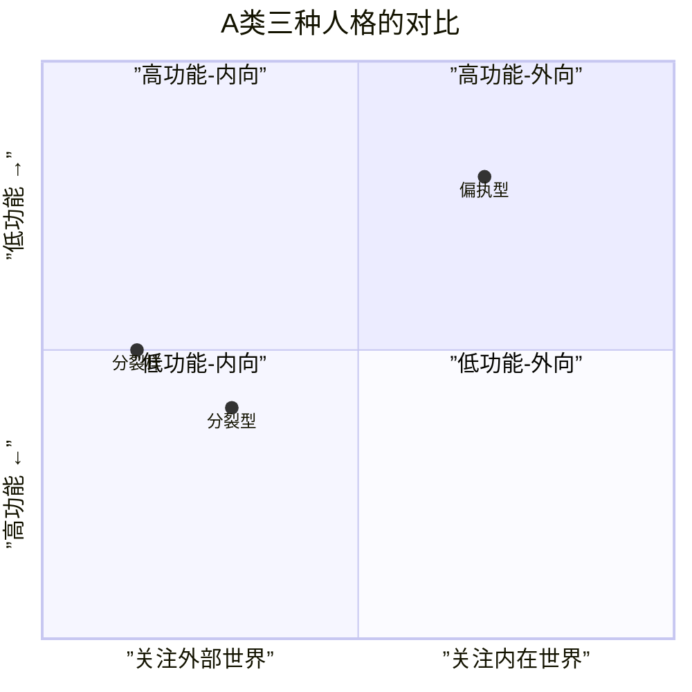
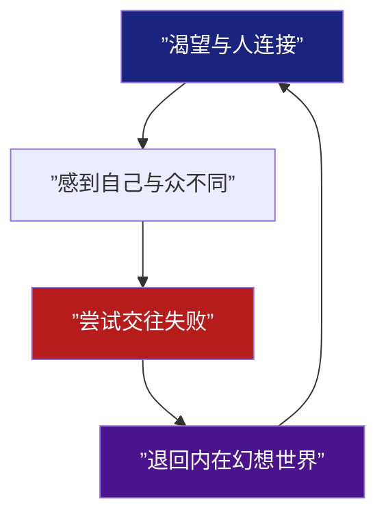
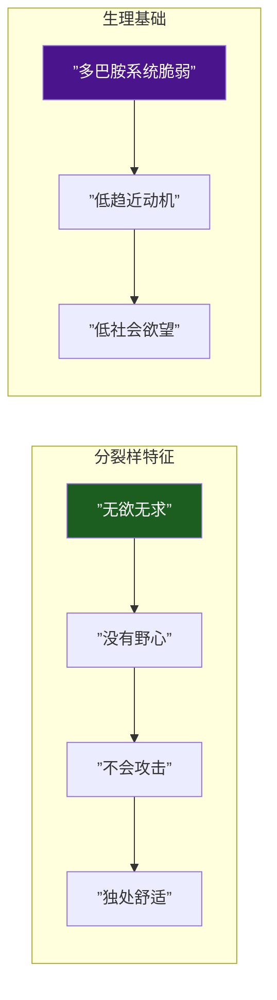

# 第11课：A类：分裂型与分裂样人格

## Learning Objectives

- 区分分裂型与分裂样两种人格的核心差异
- 理解分裂型的生理基础（联觉与神经细胞迁移异常）
- 掌握分裂样"无欲无求"的动力学本质
- 运用两类人格特征进行角色差异化设计

---

## 一、从偏执到分裂：A类内部的连续谱

上节课我们学习了 [[0010-type-a-paranoid|第10课：偏执型人格]]。偏执型的核心是"对外部威胁的过度警觉"，而本课的两种类型则展现出不同的A类模式——**从外部世界撤回注意力**。

**偏执型**仍然高度关注外部世界（只是以"威胁侦测"的方式），而**分裂型**和**分裂样**则逐渐向内撤退。

> [!IMPORTANT] 重要区分
> **分裂型（Schizotypal）** 与**分裂样（Schizoid）** 在中文仅一字之差，但在人格病理学上是两个完全不同的诊断。简而言之：**分裂型"想要但得不到"；分裂样"根本不想要"**。

---

## 二、分裂型人格：无法被理解的内在幻想

### 核心特征

分裂型的核心动力是：**渴望交往，但深感自己与他人不同，最终被疏离**。

分裂型人格有明显的"**古怪感**"——言行、思维、穿着都可能偏离社会常规。他们不是不想融入，而是**不知道如何融入**。

### 生理基础：局部放电

分裂型与精神分裂症的生理区别：

- **精神分裂症** = 全皮层短路（广泛性认知功能损害）
- **分裂型** = 局部放电（特定区域的神经电活动异常）

### 联觉现象

分裂型人格中常见**联觉（Synesthesia）** ——一种感官刺激引发另一种感官体验（如"听到颜色"或"看到声音"）。研究发现这与**神经细胞迁移异常**有关——大脑发育过程中，神经元没有准确迁移到预定区域，导致感官区域之间的边界模糊。

> [!NOTE] 联觉与创作天赋
> 联觉在艺术家和创作者中比例偏高。分裂型的"古怪感"如果得到恰当引导，可以转化为独特的艺术敏感性。编剧在创作"天才疯子"类型角色时，分裂型是比精神分裂症更合适的选择——保留了功能，但不失古怪魅力。

---

## 三、分裂型的创作应用：《被嫌弃的松子的一生》

松子是分裂型人格的极佳案例——也是编剧需要警惕的类型陷阱。

### 松子的分裂型结构

- **天真**：松子始终相信"只要我足够努力讨好，他就会爱我"
- **离群索居**：每次被抛弃后缩回一个人的世界
- **活在内在幻想中**：她对每个男人都投射了一个拯救者幻想
- **讨好型分裂型**：分裂型的罕见亚型——用过度讨好来掩饰社交笨拙

### 编剧分析

| 特质 | 表现 | 叙事功能 |
|------|------|---------|
| 渴望连接 | 不断投入新关系 | 驱动情节推进 |
| 社交笨拙 | 用鬼脸、讨好来应对 | 制造痛点 |
| 幻想替代现实 | 相信"从今以后会幸福" | 铺垫反转 |
| 回归孤独 | 被伤害后独自生活 | 结构循环 |

> [!WARNING] 创作警示
> 松子类角色的悲剧根源不是"遇人不淑"，而是**人格结构决定了她的关系选择模式**。编剧如果只写"松子遇到坏男人"而不揭示"松子的人格注定她会选择什么样的男人"，人物就会沦为命运的受害者而非自己人格的产物。

---

## 四、分裂样人格：无欲无求的哲人

### 核心特征

分裂样的核心动力是：**对人际关系和社交没有兴趣，不渴望亲密，不在乎他人评价**。

### 经典典故："请不要挡我的阳光"

古希腊哲学家狄奥根尼（Diogenes）是分裂样人格的古典原型。亚历山大大帝站在他面前说："我是亚历山大大帝，我可以满足你任何愿望。"狄奥根尼回答："那就请不要挡我的阳光。"

> [!QUOTE] 分裂样的核心宣言
> "请不要挡我的阳光"——分裂样不被权力、财富、名望所诱惑，因为这些东西的前提是"在乎他人的看法"。分裂样不在乎。

### 多巴胺系统脆弱

分裂样的大脑多巴胺系统处于**低激活**状态。这意味着：
- 缺乏"趋近动机"——不想追求任何东西
- 没有野心——升职加薪没有吸引力
- 不会攻击——竞争本身就没有意义
- 低社会欲望——独处不需要理由

> [!TIP] 编剧价值
> 分裂样在荧幕上是"最难写"但也"最出彩"的类型之一。因为这类角色**不按常规动机行事**——金钱、权力、爱情都不能驱动他。要驱动分裂样角色，必须找到那个"例外"——那件唯一能让他从内在世界走出来的事情。

---

## 五、高智商分裂样：理论科学的天才

分裂样在以下几个领域表现出惊人的能力：

| 领域 | 原因 | 代表人物 |
|------|------|---------|
| 理论物理 | 不需要人际合作，纯思维活动 | 爱因斯坦 |
| 天体物理 | 远离人类社会，与宇宙对话 | 霍金 |
| 纯数学 | 符号世界的自足性 | 陈景润 |
| 哲学 | 概念思辨不需要外部验证 | 维特根斯坦 |

### 爱因斯坦

爱因斯坦在童年表现出明显的分裂样特征：语言发育迟缓（被怀疑智力障碍）、不喜欢和同龄人玩耍、沉浸在自己的幻想世界中。但这些"社交缺陷"恰恰是他思考"与光同行"的物理学问题时所需要的——**不被社交束缚的思维自由**。

### 陈景润

陈景润是中国数学史上的分裂样典型：不善言辞、极度内向、几乎不与外界交流，但在哥德巴赫猜想的证明中展现出非凡的思维深度。他的社会功能几乎全部投射到了数学符号系统中。

> [!WARNING] 误区警示
> 不要把分裂样写成"自闭症"。分裂样是**人格类型**（主动选择远离社交），自闭症是**神经发育障碍**（社交能力缺损机制不同）。两者在行为上可能相似，但内在动机完全不同。分裂样是"不想"，自闭症是"不能"。

---

## 六、少年派：分裂样角色的电影化塑造

《少年派的奇幻漂流》中的**派（Pi）** 更接近分裂样而非分裂型：

### 派的分裂样特征

1. **内在世界自足**：派同时信仰三种宗教——不是因为他社交需求，而是他内在的精神渴望
2. **独处舒适**：在救生艇上与老虎理查德-帕克共处227天，他的核心挑战不是孤独，而是生存
3. **无欲无求的动力反转**：派的驱动力来自**好奇和探索**而非社交认可
4. **与动物的关系**：老虎不是敌人，而是他内在的投射——这才是分裂样的深层叙事结构

### 分裂样角色的叙事策略

---

## 七、分裂型 vs 分裂样：对照表

| 维度 | 分裂型 | 分裂样 |
|------|--------|--------|
| 社交愿望 | 渴望但无法实现 | 根本不渴望 |
| 痛苦来源 | "我无法被理解" | 无痛苦（社交不是需求） |
| 情感范围 | 古怪但丰富 | 平淡、克制 |
| 思维特点 | 魔法性思维、联觉 | 抽象、系统化 |
| 观众感受 | 同情（他想融入） | 敬畏（他不需要我们） |
| 典型角色 | 松子、艾米丽 | 爱因斯坦、少年派 |
| 编剧难度 | 中等 | 高（缺乏外部驱动力） |

---

> [!QUESTION] 自我检查题
> 
> 1. 分裂型与分裂样的核心区别是什么？用一句话概括。
> 2. 为什么联觉现象在分裂型中更常见？其生理基础是什么？
> 3. 松子的"讨好型分裂型"特征在叙事中如何驱动情节？
> 4. 分裂样角色创作的最大挑战是什么？如何解决？
> 5. 爱因斯坦"社交缺陷"与他成为理论物理学家的关系是什么？
> 
> 

> 
参考答案

> 
> 1. 分裂型是"想要但得不到"——渴望社交但感到自己无法被理解；分裂样是"根本不想要"——社交不是需求，独处是舒适态。
> 
> 2. 神经细胞迁移异常导致大脑感官区域之间的边界模糊。在分裂型中这是"局部"异常（保留大部分功能），而在精神分裂症中是多区域的广泛异常。
> 
> 3. 松子的讨好行为（鬼脸、顺从、牺牲自我）驱动了"认识新男人→投入关系→被伤害→退回孤独"的循环结构。每次循环中，讨好的失败不是偶然，是她人格结构的必然。
> 
> 4. 最大挑战是分裂样缺乏常规的外在驱动力。解决策略：设置"例外动机"——那个唯一能让他走出内在世界的事件（如《少年派》中的海难）。对例外动机的挖掘就是人物弧光的起点。
> 
> 5. 爱因斯坦的分裂样特质（低社交需求、沉浸内在思维）恰恰给了他"不被社交束缚的思维自由"。这是"缺陷即优势"的典型叙事结构——如果爱因斯坦是社交达人，他可能没有那么多时间思考相对论。
> 
> 

---

## 下集预告

下一课：[[0012-type-b-antisocial|第12课：B类 — 反社会型人格]]。我们将从A类转向B类，面对编剧最着迷但也最容易写崩的人格类型——反社会型。残忍、缺乏共情、操控——如何塑造一个有魅力的反社会角色而不踩伦理红线？