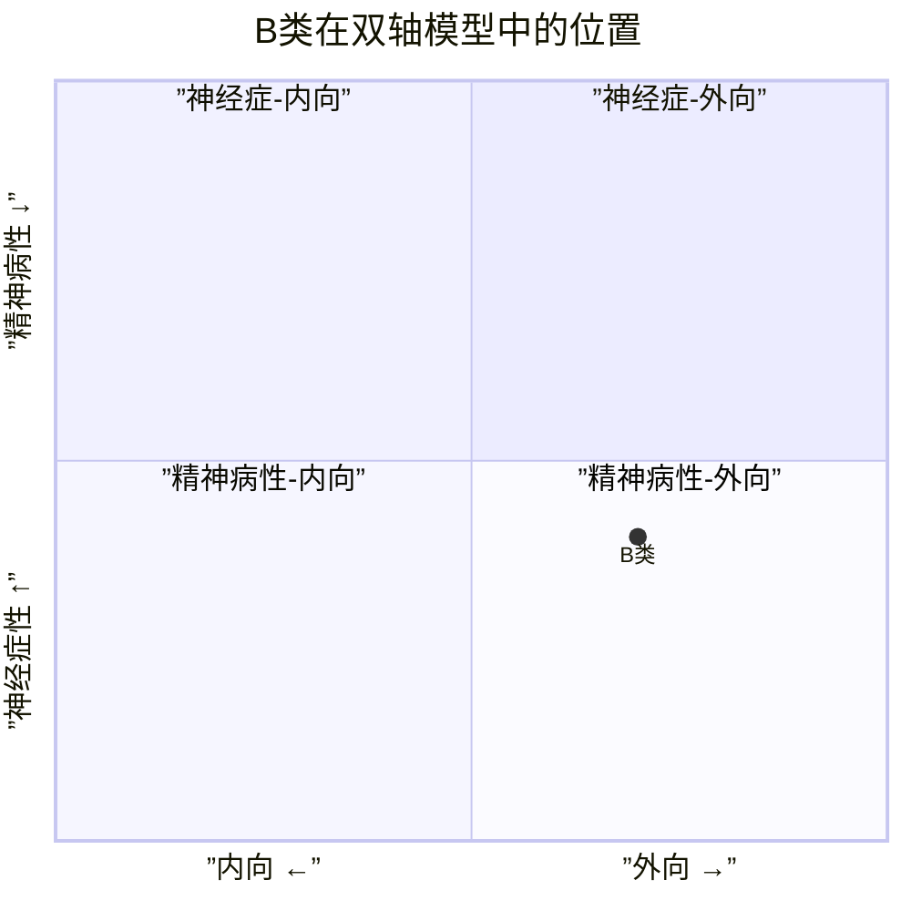
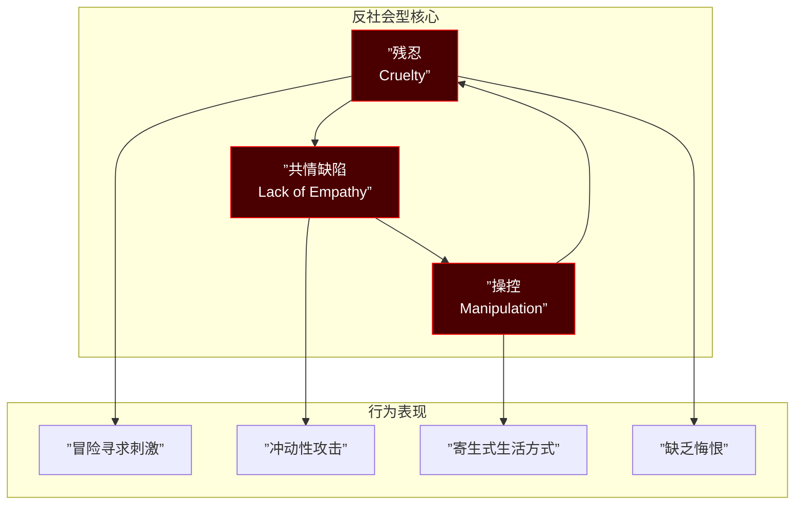
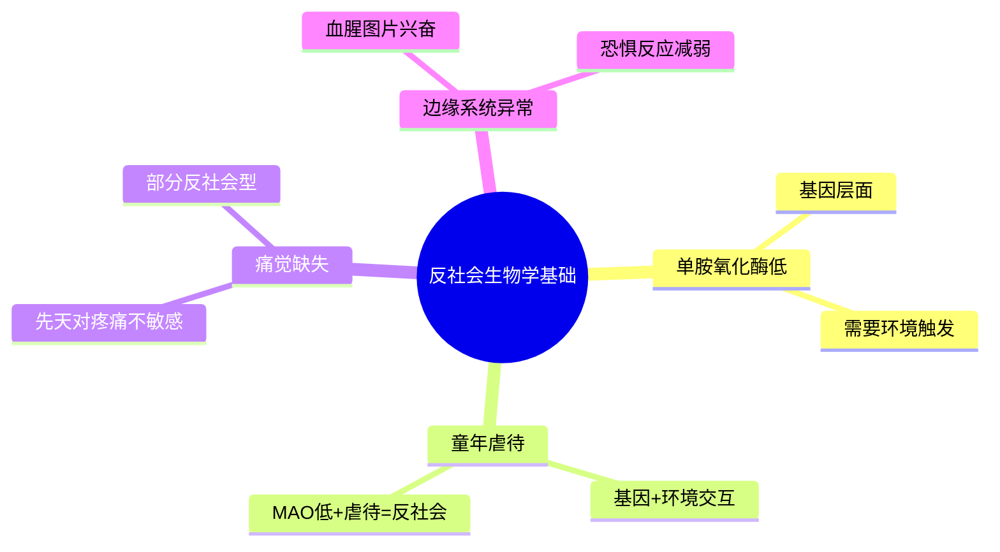
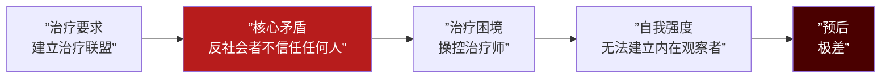
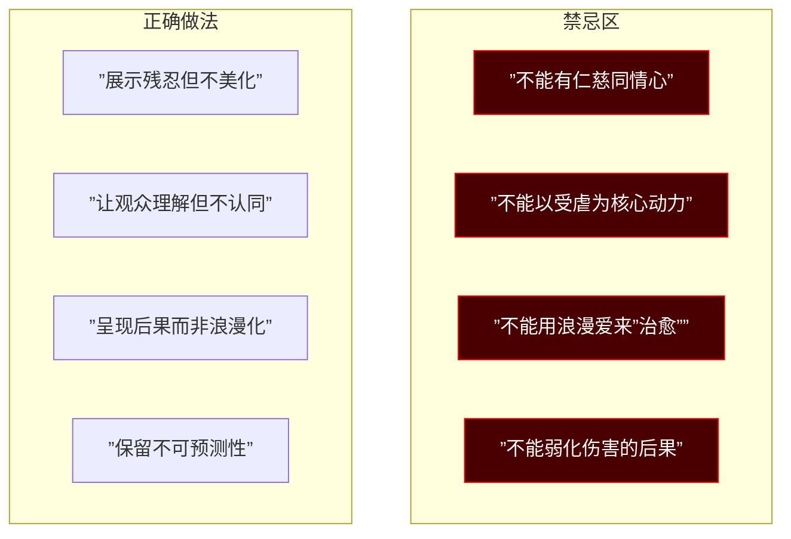

# 第12课：B类：反社会型人格

## Learning Objectives

- 掌握反社会型人格的核心结构（残忍、共情缺陷、操控）
- 理解反社会型的生物学基础（MAO、痛觉缺失、边缘系统反应）
- 区分Psychopath与反社会人格的诊断范围
- 在高功能反社会角色塑造中守住伦理边界

---

## 一、进入B类：情绪不稳定型

从本课开始，我们进入**B类（Cluster B）——情绪不稳定型**。参见 [[0004-y-axis-x-axis|Y轴与X轴框架]]，B类位于双轴模型的"情绪不稳定-外向"区域，是编剧最钟情的类型群。

B类人格的共同特征：**情绪强度高、冲动控制差、人际关系混乱、自我认同不稳定**。反社会型是B类中最具攻击性、也最让编剧着迷的类型。

---

## 二、反社会型的核心结构

### 铁三角：残忍 + 共情缺陷 + 操控

> [!WARNING] 重要区分
> **残忍**不是"偶尔伤害别人"——残忍是一种**愉悦驱动的攻击性**。普通人在伤害他人时会产生不适（这是共情的生理反应），反社会者在伤害他人时**没有不适**，甚至可能感到兴奋。这是编剧在塑造反社会角色时必须忠实呈现的核心。

---

## 三、生物学基础

反社会型人格有非常坚实的生物学基础，这也是为什么**跨文化发病率一致**（约1-3%）——不论社会制度、文化背景、教育水平如何，发病率始终稳定。

### MAO：单胺氧化酶

**单胺氧化酶（MAO）** 是反社会型最重要的生物学标记之一：

- MAO水平低的个体，攻击性和冲动性显著偏高
- **但MAO低 ≠ 反社会**——只有当低MAO + 童年虐待同时出现时，反社会人格才大概率形成
- 这是"**基因与环境交互**"的经典案例

### 血腥图片兴奋实验

脑科学研究发现：看到血腥/痛苦图片时，普通人的**杏仁核**和**前额叶**会产生强烈的负面反应（厌恶、恐惧、同情），而反社会者的反应要么**平淡**，要么**兴奋**——这正是"残忍"的生物学根源：他人的痛苦在他们的大脑中不被编码为负面信号。

> [!NOTE] 先天还是后天？
> 这是一个经典争议。目前的共识是：**生物易感性 + 环境触发**。一个人可以生来就有反社会的生物基础（低MAO、杏仁核低反应），但如果在支持性环境中成长，未必发展成反社会人格。反之，没有生物基础的个体，即使经历严重创伤，也未必成为反社会（更可能发展成B类其他类型或C类）。

---

## 四、Psychopath vs 反社会人格

这是编剧必须掌握的专业区分：

| 维度 | Antisocial（反社会人格） | Psychopath（精神病态） |
|------|------------------------|---------------------|
| 范围 | 较窄，DSM诊断分类 | 更广泛，包含情感层面 |
| 核心 | 行为层面（违法、冲动） | 情感层面（冷漠、无共情） |
| 冲动性 | 高冲动 | 可高可低（有"冷血"型） |
| 关系 | 混乱不稳定 | 可有策略性稳定关系 |
| 智力 | 不特定 | 通常高智力 |
| 恐惧 | 恐惧反应减弱 | 恐惧反应几乎缺失 |

> [!TIP] 编剧实用建议
> 不必在剧本中严格区分两者，但**理解差异有助于角色深度**：
> - **反社会角色**适合"失控型"反派——突然暴怒、冲动犯罪、行为混乱
> - **Psychopath角色**适合"冷血型"反派——精密计划、情感空白、极度操控

### 恶性自恋是共同特征

无论是反社会还是Psychopath，**恶性自恋（Malignant Narcissism）** 是两者的交集——参见 [[0013-type-b-narcissistic|第13课：自恋型人格]]。恶性自恋 = 自恋 + 反社会 + 攻击性 + 偏执的混合体。

---

## 五、高功能反社会

不是所有反社会者都在监狱里。**高功能反社会**可以达到神经症以下的Y轴水平，在社会中伪装成正常甚至成功人士。

### 认知共情 vs 情感共情

这是理解反社会者行为的钥匙：

- **认知共情**：能理解"你在想什么"、"你接下来会做什么" —— 反社会者往往**很强**
- **情感共情**：能感受到"你在感受什么" —— 反社会者**缺失**

这意味着：反社会者可以精确预测你的行为（认知共情强），但不在乎你的痛苦（情感共情缺失）。这样的角色可以做**完美的操控者**。

### 电影案例

| 角色 | 电影 | 高功能特征 |
|------|------|-----------|
| 汉尼拔-莱克特 | 《沉默的羔羊》 | 超高智商、优雅、对克劳福德的心理操控 |
| 小丑 | 《黑暗骑士》 | 混乱中的秩序、对蝙蝠侠的心理战 |
| 威尔-亨廷 | 《心灵捕手》 | 高智商但破坏关系、不告而别 |

> [!QUOTE] 反社会角色的魅力公式
> **高功能反社会 = 高智商 + 认知共情 + 情感空白 + 不可预测**
> 
> 观众被他们的智力吸引，被他们的不可预测性紧张，被他们的情感空白感到寒意——这就是"魅力型反派"的配方。

---

## 六、心理治疗与自我强度

反社会人格在心理治疗中面临巨大困难：

> [!IMPORTANT] 编剧启示
> 反社会角色的**角色弧光**不应是"被治好"——这在心理学上不现实，也会削弱角色魅力。反社会角色的弧光可以有三种更合理的方向：
> 1. **自我认识**：意识到自己是"异类"（但不改）
> 2. **找到替代满足**：将残忍转化为可接受的形式（如法医、战地记者）
> 3. **被更强者制衡**：遇到比ta更强大的力量（情感或智力上）

---

## 七、反社会角色设计的禁忌红线

这是编剧在创作反社会角色时必须遵守的**伦理底线**：

### 红线详解

1. **不能有仁慈同情心**：反社会者的"友善"都是策略性的。如果一个角色发自内心地关心他人，ta就不是反社会型
2. **不能以受虐为核心**：反社会是攻击性人格，受虐是BDSM或C类人格的特征，两者不兼容
3. **不能用爱情治愈**：爱情不能给予反社会者情感共情——这不是浪漫，是误导
4. **不能弱化伤害后果**：反社会角色的"魅力"不能掩盖ta对他人的真实伤害

> [!WARNING] 伦理警示
> 近年来大量影视作品浪漫化反社会角色，这是一个需要警惕的趋势。作为编剧，你可以呈现反社会角色的魅力，但**不要欺骗观众**——展示伤害的后果，让观众在"着迷"的同时保持警觉。

---

> [!QUESTION] 自我检查题
> 
> 1. 反社会型人格的核心三要素是什么？
> 2. 什么是MAO？MAO低为什么会增加反社会风险？
> 3. 认知共情和情感共情在反社会者身上分别呈现什么状态？
> 4. Psychopath和反社会人格的核心区别是什么？
> 5. 反社会角色创作的四大禁忌是什么？为什么？
> 
> 

> 
参考答案

> 
> 1. 残忍（愉悦驱动的攻击性）、共情缺陷（情感共情缺失）、操控（利用认知共情预测并操纵他人行为）。
> 
> 2. MAO是单胺氧化酶，调节神经递质（多巴胺、去甲肾上腺素、血清素）的代谢。MAO低导致神经递质调节异常，增加攻击性和冲动性。但MAO低本身不直接导致反社会，需要叠加童年虐待等环境因素。
> 
> 3. 认知共情强（能理解你在想什么、做什么）——这让他们成为高效操控者；情感共情缺失（不在乎你的感受）——这让他们能冷酷地伤害他人。
> 
> 4. 反社会人格是DSM诊断分类，侧重于行为层面（违法、冲动）；Psychopath范围更广，包含情感层面（冷漠、无共情、情感空洞）。Psychopath可以是"冷血计划型"，而反社会更偏向"冲动失控型"。
> 
> 5. 四大禁忌：① 不能有发自内心的仁慈同情；② 不能以受虐为核心动力；③ 不能用爱情"治愈"反社会；④ 不能弱化伤害的后果。这些禁忌的存在是为了避免对反社会人格的浪漫化和误导——反社会不是"坏得可爱"，而是真实且有破坏性的。
> 
> 

---

## 下集预告

下一课：[[0013-type-b-narcissistic|第13课：B类 — 自恋型人格]]。如果说反社会型是B类中最危险的，自恋型就是B类中**最多变**的——正派反派皆可，是编剧的"万能钥匙"。我们将用Kohut自体心理学拆解自恋结构，区分实体自恋与虚体自恋。