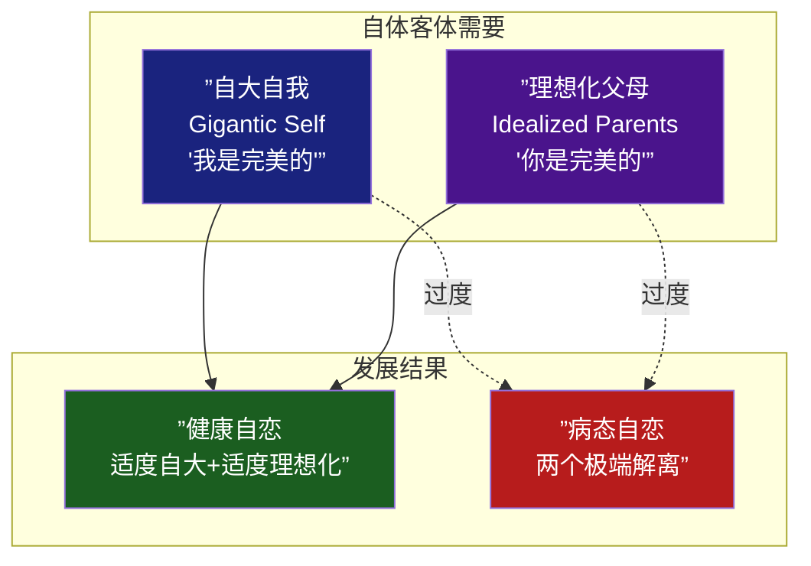
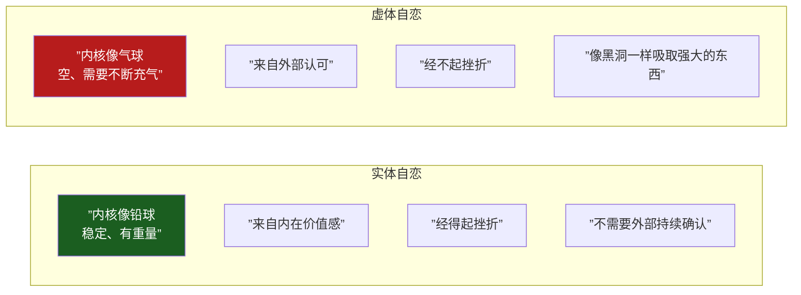
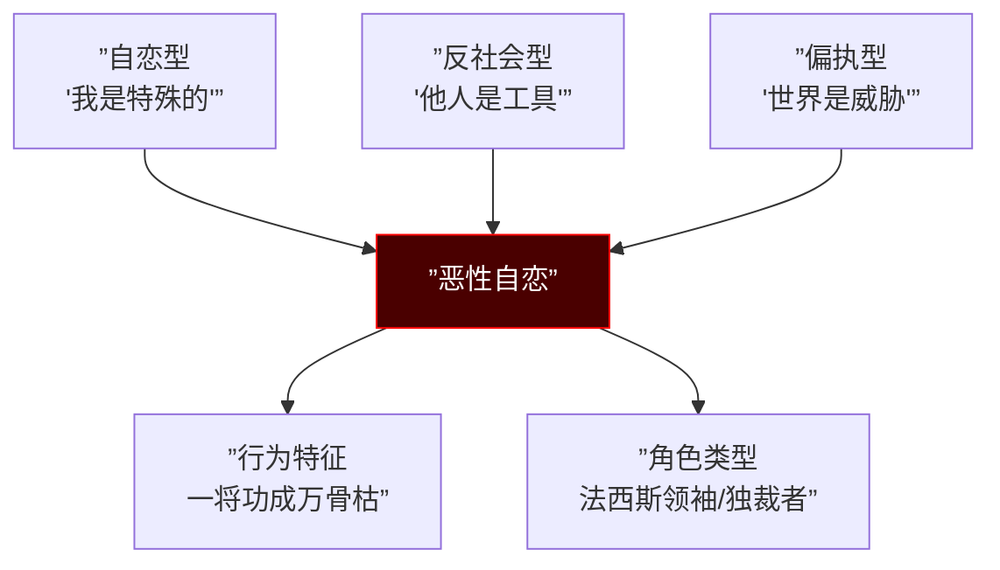
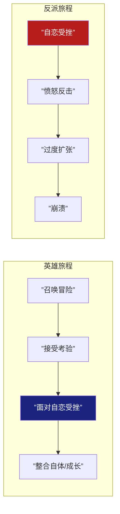

# 第13课：B类：自恋型人格

## Learning Objectives

- 理解Kohut自体心理学框架下的自恋结构
- 区分自大自我与理想化父母两个极端的解离
- 掌握自恋四象限分析工具
- 区分实体自恋与虚体自恋并应用于角色设计

---

## 一、自恋：编剧的"万金油"

在上节课学习了 [[0012-type-b-antisocial|第12课：反社会型人格]] 之后，我们进入B类中最**多变的类型**——自恋型。反社会型角色功能相对单一（反派/反派），但自恋型几乎可以出现在任何角色中：

| 角色方向 | 自恋类型 | 案例 |
|---------|---------|------|
| 正面主角 | 实体自恋（健康） | 美国队长 |
| 正面主角 | 实体自恋（边界上） | 超人 |
| 争议主角 | 虚体自恋 | 天才雷普利 |
| 反派 | 恶性自恋 | 希特勒式角色 |
| 配角 | 虚体自恋 | 需要外部确认的副手 |

> [!TIP] 编剧箴言
> **自恋不是"坏"，自恋是"结构"**。健康的自恋让人有自我价值感和追求卓越的动力；病态的自恋让人无法承受挫折、需要不断从外部汲取认可。区别在于：你的角色到底有多少"内核"。

---

## 二、Kohut自体心理学：自恋的核心结构

海因茨-科胡特（Heinz Kohut）的自体心理学（Self Psychology）认为，自恋不是一个需要被消灭的阶段，而是**一条独立的发展线**。

### 两个核心结构



### 两个极端的失衡

科胡特的核心洞见：婴儿在早期需要两种体验：

1. **自大自我（Gigantic Self）**：婴儿需要被镜映（mirroring），需要有"我是完美的"的体验
2. **理想化父母（Idealized Parents）**：婴儿需要有一个"完美的他人"可以去崇拜和融合

**健康发展**：随着成长，自大自我被适度挫折，转化为现实的抱负和自尊；理想化父母被适度挫折，转化为价值观和理想。

**病态发展**：如果两个极端没有被适度挫折，就会形成**解离**——自大自我和理想化父母长期同时存在却无法整合。

> [!NOTE] 熊孩子 vs 乖孩子
> - **只有自大自我，没有理想化父母** = 熊孩子（自我中心、无法崇拜任何高于自己的存在）
> - **只有理想化父母，没有自大自我** = 乖孩子（过度顺从、没有自我价值感、"空心人"）
> 
> 真正的自恋型人格障碍，是"有自大自我，也有理想化父母，但两者**交替出现却无法整合**"。

---

## 三、自恋四象限

运用一个分析工具来定位你的角色：

```mermaid
quadrantChart
    title 自恋四象限分析
    x-axis ”低自爱 ↓” --> ”高自爱 ↑”
    y-axis ”低爱他人 ↓” --> ”高爱他人 ↑”
    quadrant-1 ”健康自恋<br/>爱自己也爱他人”
    quadrant-2 ”奉献型<br/>爱他人不爱自己”
    quadrant-3 ”虚无型<br/>不爱自己也不爱他人”
    quadrant-4 ”自恋型/NPD<br/>爱自己不爱他人”
    美国队长: [0.8, 0.8]
    天才雷普利: [0.3, 0.9]
    传统反派: [0.1, 0.9]
    刘峰(芳华): [0.2, 0.9]
    普通健康: [0.6, 0.6]
```

> [!TIP] 四象限使用指南
> - 右下象限（高自爱-低爱他人）= **自恋型人格障碍（NPD）** 的典型位置
> - 右上象限（高自爱-高爱他人）= **健康自恋**——可以爱自己，也可以真正爱他人
> - 左上象限（低自爱-高爱他人）= **奉献型**——圣母型角色，实际上是过度使用理想化父母
> - 左下象限（低自爱-低爱他人）= **虚无型**——抑郁/分裂样倾向

---

## 四、虚体自恋 vs 实体自恋

这是编剧塑造自恋型角色最核心的概念区分。



### 虚体自恋：水质型自我

**虚体自恋（水质型自我）** 的核心是"**自身没有内核，需要不断从外部汲取**"。

> [!QUOTE] 黑洞隐喻
> 虚体自恋者的自我就像一个**黑洞**——自身是空的，需要吞噬外部的"强大"来填充。这就是为什么虚体自恋者总是被强者吸引，但无法真正爱任何人——因为他们爱的不是对方，而是对方身上的"强大"可以被自己吸收。

### 《天才雷普利》——虚体自恋的极端表现

汤姆-雷普利是电影史上最经典的虚体自恋案例：

- **没有自己的身份**：不断模仿、伪装、窃取他人的身份
- **被强者吸引**：迷恋迪基的富裕和生活态度
- **吞噬的过程**：杀死迪基后，他只是"成为迪基"，但没有自己的情感反应
- **无法停止**：一个身份被识破后，立刻寻找下一个——这就是虚体自恋者的命运循环

### 实体自恋：铅球型自我

实体自恋者的自我像**铅球**——沉重、有内核、不会因为外界的风浪而飘摇：

| 特质 | 实体自恋 | 虚体自恋 |
|------|---------|---------|
| 面对批评 | "我听听看有没有道理" | "你凭什么否定我" |
| 面对失败 | "这是这次，不是我" | "我完了，我是失败者" |
| 与他人的关系 | 可以欣赏他人而不嫉妒 | 嫉妒一切比我好的 |
| 成长方式 | 慢慢积累自体的密度 | 不断寻找更大的"强大"来吞噬 |

---

## 五、自恋型角色设计案例

### 正面案例：美国队长

美国队长（史蒂夫-罗杰斯）是**实体自恋**的极致表现：

- 没有被认可的需要——即使全世界都反对他，他也坚持自己的选择
- 内核稳定——血清改造的是身体，不是人格
- 经得起挫折——从冰封中醒来，世界变了，但他的价值观没变

> [!NOTE] 美国队长的自恋结构
> 队长也有"自大自我"——他相信自己的判断是对的。但他的自大不是来源于"我是完美的"，而是来源于"我相信的是对的"。这是一种**以价值观为载体的自恋**——自恋的内容不是自我，而是信仰。

### 恶性自恋：一将功成万骨枯

当自恋 + 反社会 + 偏执 + 攻击性结合在一起时，就是**恶性自恋（Malignant Narcissism）**。



---

## 六、自恋型角色的叙事功能



自恋角色的关键叙事节点永远是**自恋受挫（Narcissistic Injury）**——那个让他意识到"我不是完美的"或"我得不到我想要的"的时刻。角色如何回应这个受挫，决定了他是主角还是反派。

> [!QUESTION] 自我检查题
> 
> 1. 科胡特自体心理学中的两个核心结构是什么？
> 2. 什么叫"只有自大自我 = 熊孩子，只有理想化父母 = 乖孩子"？
> 3. 实体自恋和虚体自恋的核心区别是什么？用两个比喻说明。
> 4. 《天才雷普利》中的汤姆-雷普利是哪种自恋？他的黑洞隐喻如何体现在剧情中？
> 5. 什么是"恶性自恋"？它由哪四种人格特质混合而成？
> 
> <details>
> <summary>参考答案</summary>
> 
> 1. 自大自我（Gigantic Self——"我是完美的"的镜映需要）和理想化父母（Idealized Parents——"你是完美的"的崇拜需要）。
> 
> 2. "熊孩子"只有自大自我——他们相信自己是世界的中心，无法认同任何高于自己的存在；"乖孩子"只有理想化父母——他们把他人的需求放在首位，没有自己的价值判断。真正的自恋型人格是两者交替出现但无法整合——时而目空一切，时而无底线崇拜他人。
> 
> 3. 实体自恋 = 铅球（沉重、有内核、经得起风浪）；虚体自恋 = 气球（空、需要不断从外部充气、经不起挫折）。前者自体内核稳固，后者需要不断汲取外部认可来维持自体完整。
> 
> 4. 虚体自恋（水质型自我）。黑洞隐喻体现在：雷普利自身没有稳定的身份/内核，他不断被"强大的人"吸引（迪基），吞噬对方的身份来填充自己。杀死迪基后他"成为迪基"，但这不是出于恨或爱，而是出于空。
> 
> 5. 恶性自恋 = 自恋型 + 反社会型 + 偏执型 + 攻击性。表现为"一将功成万骨枯"——为了自身伟大不择手段，视他人为工具甚至祭品。典型角色：法西斯独裁者、宗教极端领袖。
> 
> </details>

---

## 下集预告

下一课：[[0014-type-b-histrionic|第14课：B类 — 表演型与癔症型人格]]。我们将探讨B类中的"表演者"——他们需要观众的掌声正如植物需要阳光。入戏与出戏、解离与多重人格、内隐自尊与外显自尊，这些概念将帮你塑造最"抓眼球"的角色。