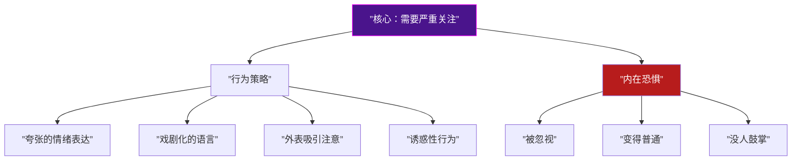
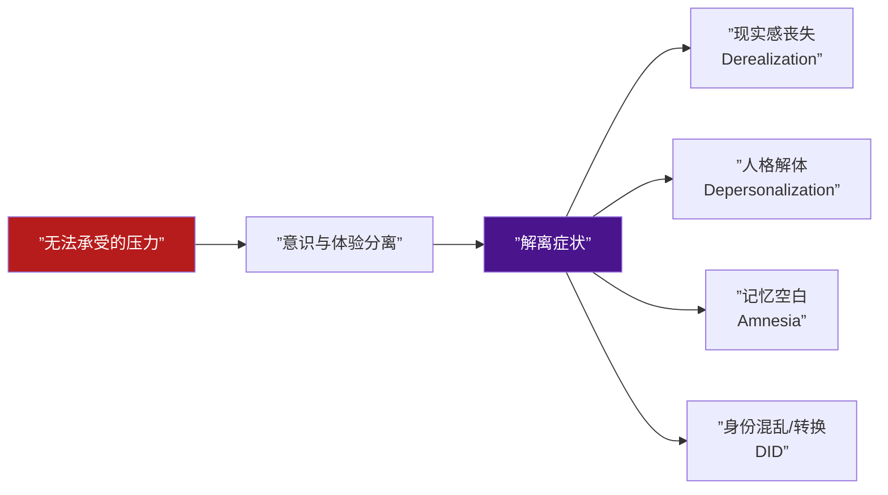
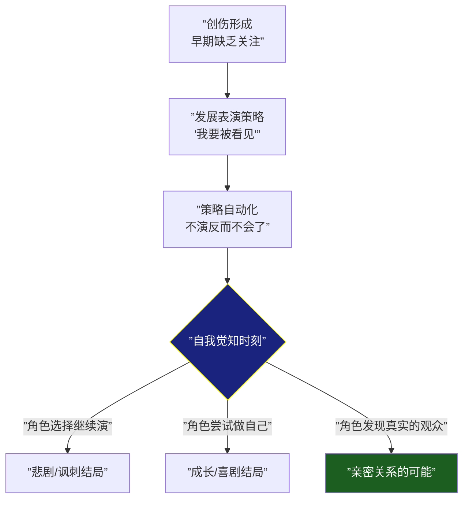

# 第14课：B类：表演型与癔症型人格

## Learning Objectives

- 理解表演型人格"需要严重关注"的核心动力
- 区分解离与多重人格（DID）的病理机制
- 掌握内隐自尊与外显自尊在表演型中的矛盾关系
- 区分表演型与癔症型的意识层次差异

---

## 一、表演型人格：聚光灯下的生命

从 [[0013-type-b-narcissistic|第13课：自恋型人格]] 的自恋内核，我们进入B类中最**夺目**的类型——表演型人格。如果说自恋型需要"被崇拜"，表演型需要的是"**被看见**"。



### 入戏与出戏：两种表演者

不夸张地说，**所有人在某种程度上都在"表演"**——社会本身就是舞台。但表演型人格的"表演"是生存策略，不是社交技巧。

| 类型 | 模式 | 代表 | 特征 |
|------|------|------|------|
| **入戏型** | 演自己——入戏出不来 | 张国荣 | 角色与自我边界模糊，长期浸入角色后难以抽离 |
| **出戏型** | 职业演员——入戏能出戏 | 刘德华 | 清晰地知道"我在演"，表演是工具而非身份 |

> [!NOTE] 入戏型的心理机制
> 入戏型的表演者不是"演技好"——而是**边界模糊**。他们的自体结构本身就不清晰，角色的情感可以轻易渗入。这就是为什么入戏型表演者往往演得非常动人，但也容易被角色"消耗"甚至"吞噬"。

---

## 二、内隐自尊 vs 外显自尊

这是理解表演型人格的关键概念。

```mermaid
quadrantChart
    title 自尊结构分析
    x-axis ”低内隐自尊” --> ”高内隐自尊”
    y-axis ”低外显自尊” --> ”高外显自尊”
    quadrant-1 ”健康型<br/>表里如一”
    quadrant-2 ”谦逊型<br/>低调有料”
    quadrant-3 ”自我否定<br/>全面低自尊”
    quadrant-4 ”表演型<br/>外强中干”
    丁春秋: [0.2, 0.9]
    王熙凤: [0.4, 0.85]
    普通人: [0.6, 0.6]
```

### 丁春秋 vs 王熙凤

**丁春秋（《天龙八部》）** —— 外显自尊爆表，内隐自尊极低：
- 吹拉弹唱、排场盛大、众星捧月
- 但内核极脆弱——被揭穿"星宿老仙"的真面目后立刻崩溃
- 这是**典型表演型**——所有的表演都是为了掩饰内在的空洞

**王熙凤（《红楼梦》）** —— 外显自尊高，内隐自尊中等偏上：
- "笑着出场"——这是最高段位的表演
- 不需要排场来证明自己，一句笑谈就能掌控全场
- 她"演"但不是因为恐慌——她是为了权力，不是为了避免崩溃

> [!TIP] 编剧的观察指南
> - 一个角色是**丁春秋式**（需要吹拉弹唱排场）还是**王熙凤式**（笑着就能控场）？
> - 前者指向表演型人格——内在的恐慌驱动外在的夸张
> - 后者指向高功能的社会角色——表演是工具，不是防御

---

## 三、解离与多重人格

### 压力下的解离

表演型人格在**压力下容易出现解离症状**。解离（Dissociation）是一种当心理压力超过个体承受能力时，意识与体验发生分离的防御机制。



### DID：解离性身份障碍（多重人格）

表演型人格并不是DID，但表演型人格在极端创伤下更容易沿着解离的路径发展为DID。两者的关系是：

- 表演型 → 易感解离 → 极端创伤 → DID
- 表演型的情感丰富 + 边界模糊 = 解离的"温床"

> [!WARNING] 重要区分
> 表演型的"扮演"是**有意识的社交表演**；DID的身份转换是**无意识的防御机制**。两者虽然表面都是"扮演不同角色"，但一个是演员选择换戏服，一个是身体自动切换操作系统。编剧不要在两者之间画等号。

---

## 四、情感丰富但肤浅

表演型人格的情感特征是：**来势汹汹，去也匆匆**。

- 丰富：情感表达范围广、强度高
- 肤浅：情感深度不够，转换快
- 观众感：表演型的人在表达情感时，潜意识中始终有"观众"在场

> [!QUOTE] 对表演型者的精准描述
> "表演型的人不是在感受情绪——他们是在**表演**感受情绪。但表演到一定程度，他们自己也分不清是真的还是演的。"
> ——这正是表演型人格的悲剧核心：**连真实的情感都可能被怀疑是表演**。

---

## 五、表演型 vs 癔症型

这是编剧最需要掌握的区分之一。

| 维度 | 癔症型（Hysterical） | 表演型（Histrionic） |
|------|---------------------|---------------------|
| 表演意识 | **无意识**——本人不觉得在演 | **意识/前意识**——知道自己在演 |
| 防御本质 | 压抑和转换（经典的"癔症性转换"） | 解离和表演 |
| 心理负担 | 较轻（不自知） | 较重（有觉察） |
| 身体症状 | 可有躯体化症状（癔症性瘫痪、失明） | 少有躯体化 |
| 社交功能 | 可能正常，只是有"表演气质" | 影响人际关系 |
| 治疗预后 | 较好（潜意识内容可被意识化） | 较难（防御深度嵌入人格） |

### 现代视角

在当代临床实践中，癔症型已不再作为独立诊断（被归入表演型或特定特质），但这个**概念区分在编剧层面极其有用**：

- **癔症型角色**：不知道自己"在演"——观众看得到，角色不知道
- **表演型角色**：知道自己"在演"——观众和角色都隐约知道，但都不说破

---

## 六、电影案例分析

### 《爱德华大夫》

希区柯克的《爱德华大夫》是**癔症型**的经典呈现：

- 男主（格里高利-派克）有"谋杀爱德华医生"的记忆
- 实际上这些记忆是癔症性转换——他"记得"没有发生过的事情
- 治疗目标：让无意识的冲突进入意识

这种"被自己欺骗"的机制，正是癔症型的核心——**无意识的表演**。

### 《律政俏佳人》

艾尔-伍兹（Elle Woods）是**高功能表演型**的典范：

- 她极度关注外表、穿着粉红色、有社交表演倾向
- 但她的表演型不是缺陷，而是**工具**——她利用"看起来像花瓶"的优势来出奇制胜
- 她有实体内核（聪明、坚韧），表演只是包装

> [!NOTE] 高功能表演型
> 艾尔-伍兹展示了表演型的**优势面**：当表演型特质被一个强大的内核所引导，它就可以从"防御"转化为"社交优势"。艾尔不需要被"治好"——她只需要**被认真对待**。

---

## 七、创伤情结的自我觉知

表演型人格创作中最动人的主题是：**当角色意识到自己一直在"演"**。



**创伤情结的自我觉知**是表演型角色最有力量的角色弧光节点——那个"我意识到我一直在讨好所有人，但我不知道我不讨好的时候是谁"的时刻。

---

> [!QUESTION] 自我检查题
> 
> 1. 表演型人格的核心需求是什么？与自恋型的区别？
> 2. "入戏型演员"和"出戏型演员"的心理机制有何不同？
> 3. 丁春秋（吹拉弹唱排场）和王熙凤（笑着出场）分别代表哪种自尊类型？
> 4. 表演型与癔症型的核心区别：
> 5. 《爱德华大夫》和《律政俏佳人》分别代表哪种子类型？
> 
> <details>
> <summary>参考答案</summary>
> 
> 1. 表演型的核心需求是"被看见/被关注"，自恋型的核心需求是"被崇拜/被认可"。前者需要观众——不管观众怎么想，只要在看就行；后者需要崇拜者——必须是正面评价。简单说：表演型渴望注意力（任何注意力），自恋型渴望仰视。
> 
> 2. 入戏型（如张国荣）的自我边界模糊，角色的情感可以直接渗入自体中，导致难以抽离。出戏型（如刘德华）的自我边界清晰，"表演"是工具而非常态。入戏型更容易出现表演型人格或解离倾向。
> 
> 3. 丁春秋 = 高外显自尊 + 低内隐自尊（典型的表演型结构——外在夸张是因内核空洞）；王熙凤 = 高外显自尊 + 较高内隐自尊（表演是权力工具而非防御）。
> 
> 4. 癔症型的表演是无意识的——本人不觉得在演；表演型的表演是意识或前意识的——隐约知道自己有表演成分。因此癔症型心理负担较轻（不自知），表演型心理负担较重（有觉察但没有能力不演）。
> 
> 5. 《爱德华大夫》是癔症型的经典呈现——男主的"记忆"是癔症性转换，无意识的冲突伪装成记忆；《律政俏佳人》是高功能表演型——艾尔的表演型特质被强大的自体内核所引导，表演从防御转化为工具。
> 
> </details>

---

## 下集预告

下一课：[[0015-type-b-borderline|第15课：B类 — 边缘型人格]]。B类的压轴类型——边缘型，也是人格障碍中**最痛苦、最危险、也最具戏剧张力**的类型。情绪失调、非黑即白、害怕被抛弃、自残行为——我们将拆解边缘型人格的生物学基础和角色设计策略。