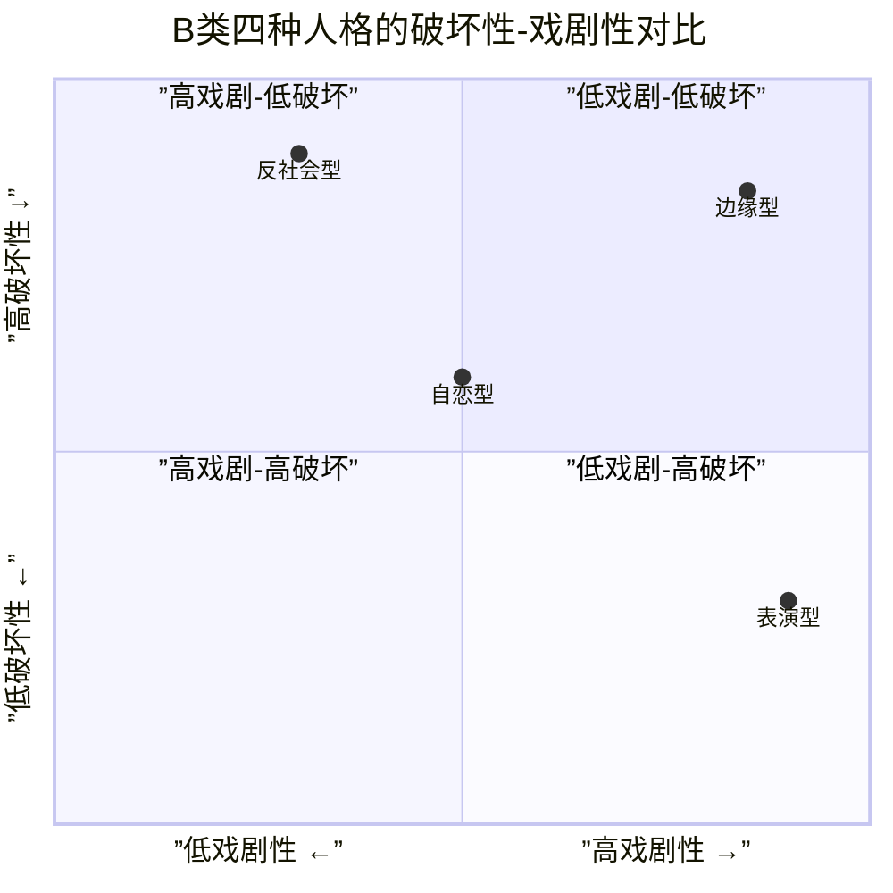
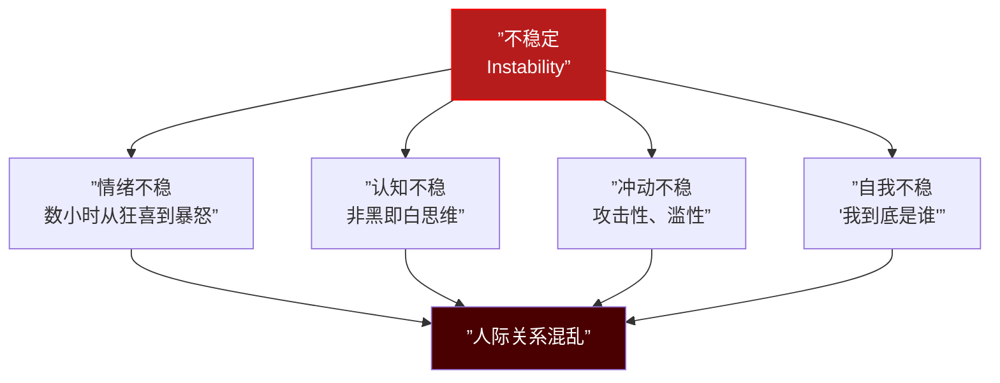
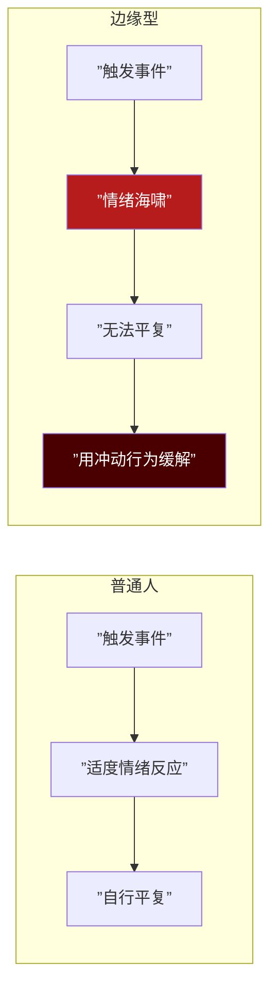
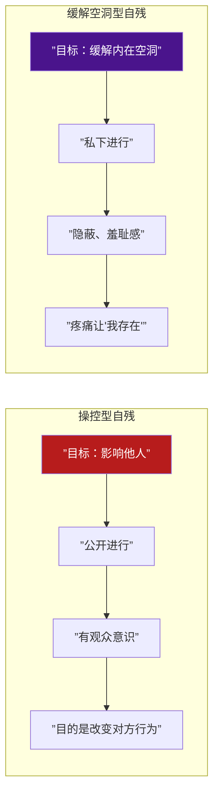
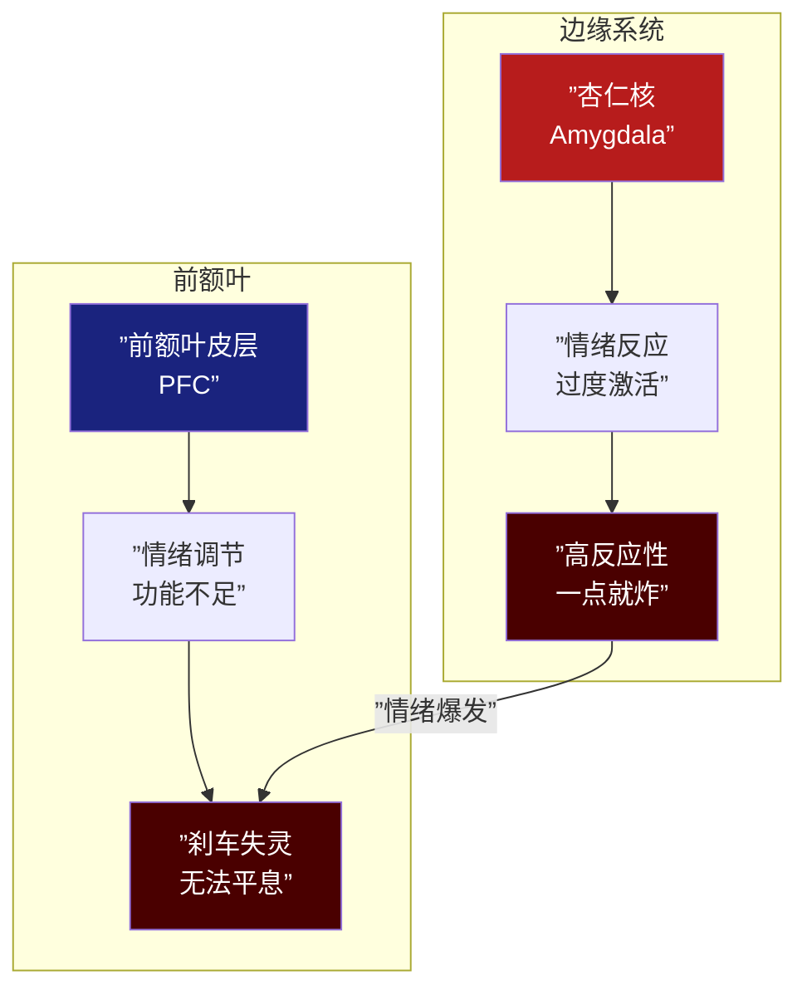
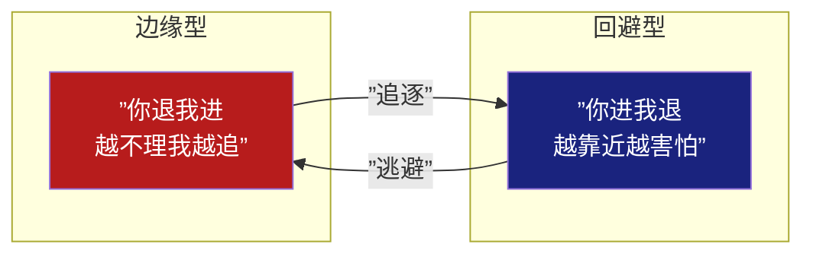

# 第15课：B类：边缘型人格

## Learning Objectives

- 理解边缘型人格"不稳定"的核心轴
- 掌握情绪失调、冲动性、非黑即白思维、害怕被抛弃四大特征
- 区分两种自残类型（操控型 vs 缓解空洞型）
- 理解边缘型角色的生物学基础与角色设计策略

---

## 一、B类的压轴：边缘型人格

经过 [[0012-type-b-antisocial|反社会型]]、[[0013-type-b-narcissistic|自恋型]]、[[0014-type-b-histrionic|表演型]]，我们抵达B类中最**具毁灭性和戏剧张力**的类型——边缘型人格。

边缘型位于**高戏剧性-高破坏性**区域——它的情绪强度不亚于表演型，破坏性不亚于反社会型。

> [!WARNING] 边缘型不是"边缘人"
> 边缘型人格的名称来自"Borderline"——最初被认为是"介于神经症和精神病的边界"。这不是说他们是边缘人，而是说他们在**正常与失常之间反复横跳**。

---

## 二、最核心的字：不稳定

如果要用一个字概括边缘型人格，就是**"不稳"**。

### 历史由来

- **Otto Kernberg**：最早系统描述边缘型人格组织的人，将边缘型定位于介于神经症和精神病性之间的**人格组织水平**
- **John Gunderson**：制定了边缘型人格障碍的诊断标准，将"害怕被抛弃"确立为最核心的特征

两人的贡献可以概括为：Kernberg说了"边缘型**是什么**"，Gunderson说了"边缘型**怎么诊断**"。

---

## 三、四大核心特征

### 1. 情绪失调

边缘型的情感体验是**指数级放大**的。普通人遇到挫折可能难过30分钟，边缘型可能因此崩溃3天。

### 2. 冲动性（攻击 + 滥性）

边缘型的冲动性有两个主要出口：

- **攻击性冲动**：愤怒爆发、摔东西、物理攻击
- **性冲动**：滥交、不安全性行为、用性来缓解情绪

这是"情绪失调→冲动行为→短暂缓解→更多问题"的恶性循环。

### 3. 害怕被抛弃

这是**边缘型最核心的恐惧**。但需要注意的是，边缘型害怕的"抛弃"可能非常微小：对方没有及时回消息、朋友取消约会、伴侣多看别人一眼——这些都可能触发"被抛弃"的恐惧。

> [!NOTE] 边缘型的悖论
> **越害怕被抛弃，越做出导致被抛弃的行为。** 因为害怕被抛弃，边缘型可能：
> - 疯狂打电话确认对方是否还在（把对方推远）
> - 先发制人地攻击/分手（"我先抛弃你"）
> - 过度索取情感保证（让对方窒息）
> 这正是不稳定内核导致的自我实现预言。

### 4. 非黑即白思维

在边缘型的心理世界中，人是不够好的。这是一神"极端理想化"和"极端贬低"的交替：

- 初见某人："TA太完美了，是我见过最好的人"（理想化）
- 某次冲突后："TA太差劲了，我怎么会信任这种人"（贬低）
- 这不是策略，这是**他们真实的感受**——在那一刻，他们确实只看到了单一面

---

## 四、空洞感与自残

### 空洞感

边缘型人格最痛苦的体验之一不是"愤怒"或"悲伤"，而是**空洞**——一种"内心什么都没有"的虚无感。这种空洞感比痛苦更难忍受，因为它包含着**没有存在的实感**。

### 自残的两种类型

这是编剧最需要准确呈现的部分。自残（Self-Harm）在边缘型中有两种截然不同的功能：

| 类型 | 动机 | 方式 | 编剧意义 |
|------|------|------|---------|
| 操控型 | "你不理我，我就伤害自己" | 公开、可被看见 | 反映关系动力（注意：不是"假的伤害"，伤害本身是真实的） |
| 缓解空洞型 | "我感受不到自己存在" | 隐秘、独自进行 | 反映深层痛苦——疼痛是用来"确认自己还活着"的 |

> [!IMPORTANT] 自杀风险
> 边缘型人格的自杀风险是普通人的**50倍**。这是所有人格障碍中最高的自杀率之一。这不是文学修辞——在塑造边缘型角色时，编剧需要对这个数据负责，**不要美化或轻描淡写**自残和自杀行为。

---

## 五、流行病学数据

| 数据 | 内容 |
|------|------|
| 患病率 | 人群中约1-2% |
| 性别比例 | **75%为女性**（部分争议认为男性漏诊率高） |
| 童年性侵经历 | **75%患者报告有童年性侵经历** |
| 违法犯罪 | **50-70%女犯人为边缘型人格** |
| 自杀风险 | 普通人的50倍 |

### 无效的家庭环境（Invalidating Environment）

Marsha Linehan（辩证行为疗法的创始人）认为，边缘型的形成核心是**无效的家庭环境**：

- 孩子的情绪体验被否定（"你不应该这么难过"、"你太敏感了"）
- 孩子学不会调节情绪——因为没有人教ta情绪是"可调节的"
- 情绪只能不断积压→爆发→积压→爆发

---

## 六、生物学基础

### 老鼠实验的启示

边缘系统的经典老鼠实验：
- 正常老鼠：受到威胁 → 杏仁核激活 → 前额叶评估 → 适当反应
- "边缘型"老鼠：杏仁核**过度激活** + 前额叶**调节不足**
- 类比到人类边缘型：**油门踩到底，刹车失灵**

这个生物学模型解释了为什么边缘型"知道"自己的反应是过度的，但**无法停止**——前额叶不是不想刹车，是刹车"踩不动"。

---

## 七、边缘型角色设计

### 玉娇龙（《卧虎藏龙》）

玉娇龙是华语电影中最经典的边缘型角色：

| 特征 | 在玉娇龙身上的表现 |
|------|-------------------|
| 情绪不稳 | 上一秒天真烂漫，下一秒暴戾决绝 |
| 非黑即白 | 对李慕白从崇拜到对抗，对俞秀莲从姐妹到敌人 |
| 冲动性 | 偷剑、逃婚、大闹酒楼、跳崖 |
| 害怕被抛弃 | 不敢真正承诺任何关系 |
| 空洞感 | "我找不到自己"——全片的核心挣扎 |
| 自残倾向 | 最终跳崖（自我毁灭的极致） |

### 玛蒂尔达（《这个杀手不太冷》）

玛蒂尔达是**边缘型+表演型**的混合，但边缘型特征更突出：

- 家庭创伤（被家人虐待→这也是边缘型常见的背景）
- 情绪极端：对里昂从信任到怀疑再到依恋
- 冲动行为：闯入DEA大楼、跟踪目标
- 害怕被抛弃："如果你死了，我也活不下去"

### 边缘型+回避型的互动

这是编剧最值得研究的**人格配对**之一：

**边缘型突破回避型防御罩**是极具戏剧张力的情节点：
- 回避型建造了厚厚的"个人空间"
- 边缘型的情绪海啸直接冲垮防御
- 在这个过程中，边缘型感受到了"被接住"（如果对方没有逃开），回避型感受到了"被突破防线的亲密"
- 这可以走向治愈，也可以走向更加混乱

---

## 八、边缘型角色弧光的设计原则

> [!TIP] 核心原则
> 边缘型角色的弧光不是"被治愈"——辩证行为疗法（DBT）需要数年才能见效。更合理的弧光方向：
> 1. **建立信任**：找到一个"够稳"的客体（关系、信仰、使命）
> 2. **情绪耐受**：从不调节到开始尝试"暂停"
> 3. **整合好坏**：从非黑即白到"这个人既有好也有坏"
> 4. **确认存在**：从空洞感中找到"我在这里"的证据

---

> [!QUESTION] 自我检查题
> 
> 1. 边缘型人格的"不稳定"体现在哪四个维度？
> 2. Kernberg和Gunderson分别对边缘型的研究做出了什么贡献？
> 3. 操控型自残和缓解空洞型自残的核心区别是什么？
> 4. 为什么边缘型的自杀风险是普通人的50倍？
> 5. 边缘型+回避型的互动模式为什么极具戏剧张力？
> 6. 玉娇龙在哪些方面体现了边缘型人格特征？
> 
> 

> 
参考答案

> 
> 1. 情绪不稳（数小时内剧烈波动）、认知不稳（非黑即白/分裂思维）、冲动不稳（攻击性和滥性行为）、自我不稳（身份认同混乱——"我是谁"的持续困惑）。
> 
> 2. Kernberg将边缘型定位于介于神经症和精神病性之间的人格组织水平——从结构层面定义了什么是边缘型；Gunderson制定了边缘型的诊断标准，并将"害怕被抛弃"确立为最核心的临床特征。
> 
> 3. 操控型自残的目的是影响他人行为（公开进行，有观众），缓解空洞型自残的目的是通过疼痛确认自己"还活着"（隐秘进行，羞耻感）。需要强调：两种都是真实的伤害，没有"假自残"。
> 
> 4. 边缘型同时具备：①情绪极点极端且无法自行平复；②冲动控制障碍（无法阻止自毁行为）；③空洞感（生命缺乏实感）；④反复的自残经验降低了疼痛的恐惧阈值。这些因素叠加使自杀率极高。
> 
> 5. 边缘型是"你退我进"（越不理我越追逐），回避型是"你进我退"（越靠近越害怕）。两人的防御机制正好触发对方的痛点，形成循环追逐。当边缘型的情绪海啸突破回避型的防御罩时，既有危险（对双方都是刺激）也有治疗的可能（回避型第一次被"剖开"）。
> 
> 6. 玉娇龙的情绪不稳（上一秒天真下一秒暴戾）、非黑即白思维（对人从崇拜到敌对的急剧切换）、冲动行为（偷剑、逃婚、大闹）、害怕被抛弃（不敢真实承诺任何关系）、空洞感（"我找不到自己"是全片核心）、以及自我毁灭倾向（跳崖）——全面展现了边缘型人格的临床画像。
> 
> 

---

## 下集预告

下一课：[[0016-type-c-compulsive|第16课：C类 — 强迫型人格]]。完成B类，我们进入**C类（焦虑型）**。如果说B类让我们直面情绪的"火"，C类则让我们理解**控制与秩序**——强迫型人格如何用规则来管理焦虑，以及这种人格为何被编剧称作"最实用的全能型配角"。