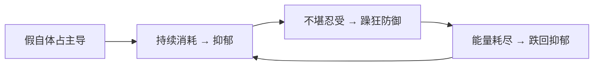

# 第17课：C类：抑郁型人格

## Learning Objectives
- 理解抑郁型人格的核心：自我虚弱与假自体
- 掌握温尼科特"真自体 vs 假自体"理论
- 学会用"支架效应"理解成长创伤
- 将抑郁型人格应用于角色设计

## Core Idea

抑郁型人格常被误认为"抑郁症"。区别在于：抑郁症是一种状态，抑郁型人格是一种**结构**——一种与世界和他人建立关系的固定模式。其核心不是悲伤，而是**自我虚弱**。

### 空心病：假自体的牢笼

英国精神分析家温尼科特（D.W. Winnicott）提出的"真自体（True Self）vs 假自体（False Self）"是理解抑郁型人格的理论基石：

```mermaid
graph TB
    subgraph ”健康的自体结构”
        TS[真自体<br/>True Self] -->|”自发、真实、有活力”| EXP[真实体验]
    end
    subgraph ”抑郁型的自体结构”
        FS[假自体<br/>False Self] -->|”顺从、讨好、空洞”| COMP[补偿性行为]
        FS -->|”保护”| HIDDEN[隐藏的真自体]
        HIDDEN -->|”越来越微弱”| VOID[空虚感]
    end
```

假自体的形成路径：当婴儿的自发姿态（真自体的萌芽）不被母亲回应，反而被母亲自己的需求覆盖时，婴儿学会**顺从**——发展出一个"母亲想要的我"而非"本真的我"。这就是"乖孩子"的起源。

> [!WARNING] 乖孩子的代价
> 太乖的孩子往往不是天性善良，而是**不敢不乖**。理想化父母的形象过大，吞噬了孩子的真自体空间。

### 支架效应与失败的意义

温尼科特有一个著名的比喻：母亲应该是"支架（scaffolding）"而非"建筑师"。支架支持孩子自己建造，而不是替孩子建造。

错误的方式：直接把孩子抱上十层楼（替孩子解决问题）。
正确的方式：搭一个支架，让孩子**自己爬**上去，即使会摔倒几次。

**失败体验比成功更重要。** 每一次跌倒后的爬起，都在强化真自体的存在感。被过度保护的"乖孩子"恰恰缺少这种"安全跌倒"的经验——所以成年后面对挫折时，假自体容易崩塌，露出底下空洞的真自体。

### 口欲期固着与进食障碍

抑郁型人格的固着点通常在**口欲期**（生命最初的6个月）。这个阶段的核心需求是"被喂养、被温暖、被抱住"。如果此阶段严重受挫，成年后可能出现：
- 对"被照顾"的无限渴望
- 进食障碍（暴食/厌食）——口欲期满足的替代性行为
- 对亲密关系的矛盾态度（渴望融合又害怕被吞没）

### 抑郁与躁狂的转化

躁狂不是抑郁的反面，而是抑郁的**另一面**。双向情感障碍中，躁狂阶段可以理解为"假自体的狂欢"——突然充满能量、不需要睡眠、有宏大计划。但这种能量是虚假的，因为它不是来自真自体，而是来自对空虚感的拼命逃避。



### 抑郁型人格的投射机制

抑郁型人格倾向于将**攻击性向内投射**。当他们对某人感到愤怒时，往往不是表达愤怒，而是认为自己"不够好"、"不值得被爱"、"搞砸了一切"。这种内射机制在写作中可以用来制造极具内心张力的角色。

### 慢性抑郁：心境恶劣

抑郁型人格的常态不是重度抑郁发作，而是**心境恶劣（Dysthymia）**——一种低度、持续的阴郁底色。他们能工作、能社交，但总有一层灰色的滤镜罩在生活之上。用他们的话说："没有什么真正让我开心。"

### 治疗原则：穿过抑郁，握住真自体的手

治疗抑郁型人格的路径不是"消除抑郁"，而是**透过抑郁与真实自体握手**。抑郁症状是真自体的求救信号——它在说"我在这里，但没人看见我"。当来访者开始触碰到自己的真实感受（即使是痛苦的真实），生命力就开始回流。

### 喜剧演员的抑郁

为什么那么多喜剧演员抑郁？因为舞台上的幽默是**假自体的精湛表演**。观众的笑声喂养了假自体，但散场后，真自体在后台空洞地坐着。罗宾·威廉姆斯、金·凯瑞——他们不是"抑郁的喜剧演员"，他们是"戴着喜剧假面具的抑郁型人格"。

> [!QUOTE] 科恩《颂歌》
> 人生自有裂痕，此乃光照之地。
> （There is a crack in everything. That's how the light gets in.）

假自体的裂痕，恰恰是真自体透光的入口。编剧可以利用这个意象设计角色的"裂痕时刻"——一个完美假自体终于出现裂缝的瞬间，也是观众第一次看见角色真自体的瞬间。

### 爱情三个层面

抑郁型人格在爱情中有三个递进层面：

1. **世俗层面**——寻找一个"照顾者"。对方的功能是补偿内心的空虚。
2. **心灵层面**——寻找一个"镜映者"。对方能看见并回应真自体的微弱信号。
3. **灵魂层面**——两个真自体的相遇。不是"你填补我"，而是"我在这里，你也在这里"。

### 同类相吸：抑郁型人格的配对

抑郁型人格往往被同类吸引——不是因为他们"喜欢抑郁"，而是因为他们能在对方眼中看到同样的空洞。这种默契超越了语言。

电影**《花样年华》**中的周慕云（梁朝伟）和苏丽珍（张曼玉）就是典型。他们都有抑郁型底色——克制、隐忍、自我压抑、无法直接表达情感。走廊上的擦肩而过、欲言又止的沉默、雨夜的独行——这些不是情节，是**自体状态的投射**。他们不需要说"我很难过"，因为对方看得见。

> [!QUESTION] Self-check
> 抑郁型人格的"乖孩子"现象最可能源于以下哪种早期关系模式？
> A. 父母过度溺爱
> B. 父母将自己的需求覆盖在孩子自发性之上
> C. 父母完全忽视孩子
> D. 父母之间存在激烈冲突

<details>
<summary>Reveal answer</summary>

**B正确。** 假自体的形成源于母亲（或主要照顾者）无法回应婴儿的自发姿态，反而用她自己的需求覆盖婴儿。孩子学会"顺从"——发展出"母亲想要的我"而非本真的我。这不同于完全忽视（C），也不同于溺爱（A）。B描述的是一种"替代性满足"的亲子关系。
</details>

## Worked Example

**角色草图：建筑师方静**

38岁，独立建筑师，业内小有名气但从不觉得自己"够好"。每个项目结束后都会经历两周的情绪低谷——不是因为项目失败，而是因为项目的成就感无法渗透到内心。母亲是完美主义者，从小灌输"你还可以更好"。方静有一个"阳光开朗"的社交面具（假自体），但独处时除了Netflix什么也不想做。

**抑郁型特征**：心境恶劣底色、假自体社交模式、成功但不满足、对亲密关系既渴望又回避。

**冲突设计**：接到一个大型公共建筑项目，合作方是[[0013-type-b-narcissistic.md|自恋型人格]]的设计总监。对方需要方静的技术能力，但试图完全主导创意方向。方静的假自体倾向于顺从，但项目的灵魂需要她的真自体站出来。

**角色弧光**：从"我无所谓"到"我有所谓"——真自体在对抗中逐渐浮现。

## Next Step

继续学习[[0018-type-c-masochistic.md|第18课：C类：受虐与施虐受虐型人格]]，探索"痛苦"如何在人格结构中转化为道德优越感。