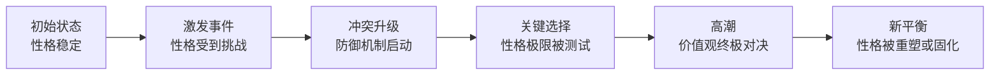

# 第20课：性格、人物关系与剧情

## Learning Objectives
- 理解性格如何决定三重关系
- 掌握剧情张力的发展脉络
- 分析高潮的本质：价值观冲突
- 理解黑化机制（投射认同与价值观同化）

## Core Idea

性格不仅仅是角色的"设定"，它是整个剧本的**发动机**。性格决定了角色与三重世界的关系，而这三重关系构成了剧情的全部。

### 性格决定三重关系

```mermaid
graph TB
    C[角色性格] --> R1[关系一：与世界的关系]
    C --> R2[关系二：与他人的关系]
    C --> R3[关系三：与自己的关系]
    R1 -->|”世界观”| P1[”角色如何看待社会规则、正义、命运<br/>例：偏执型→世界是危险的<br/>例：强迫型→世界是有秩序的”]
    R2 -->|”人际模式”| P2[”角色如何建立和维持关系<br/>例：自恋型→他人是镜映<br/>例：回避型→他人是威胁”]
    R3 -->|”自我认同”| P3[”角色如何看待自己<br/>例：抑郁型→我是空洞的<br/>例：边缘型→我是不稳定的”]
```



这三个关系层构成了角色的**初始状态**。剧情就是让角色在这三个维度上经历挑战、动摇、重建的过程。

### 剧情张力发展脉络

一个完整的剧情张力发展过程可以描述为：



每一阶段都对应着性格的某个方面被"摇晃"的程度。编剧要做的不是编情节，而是**设计那些恰好能摇晃角色性格的事件**。

> [!TIP] 创作检验
> 如果你把主角换成一个不同性格的人，剧情会完全改成另一个故事吗？如果答案是不会，说明你的剧情脱离了性格——剧情是装饰性而非结构性。

### 高潮的本质：价值观冲突

所有的高潮戏，无论动作片还是文艺片，本质上都是**价值观的冲突**。打斗只是价值观的物理化呈现。

**《爆裂鼓手》的高潮**：不是Andrew能不能打好鼓，而是两个价值观的对决——
- Fletcher的价值观："极致大于一切，包括人的尊严"
- Andrew的价值观："我值得被看见，即使以痛苦为代价"

他们两个在最后一场戏中达成了**共生**——Fletcher得到了他想要的极致演奏，Andrew得到了他想要的被看见。但这个高潮之所以震撼，是因为没有人在这个对决中"错"了——这是一场两个正确价值观的不可调和的对撞。

> [!NOTE] 价值观冲突 vs 善恶冲突
> 善恶冲突（好人打坏人）是最低级的剧情张力。高级的剧情张力是"善vs善"——两个观众都认同的价值观彼此对立。这样的冲突才有悲剧深度。

### 黑化机制：投射认同与价值观同化

"黑化"是编剧经常使用的工具，但很多剧本的黑化过于突兀——角色突然就"变坏了"。真正的黑化有一个心理机制：**投射认同（Projective Identification）**。

**投射认同的黑化三部曲：**

1. **对手投射**——反派将其价值观投射到主角身上（"你和我是一类人"）
2. **情境逼迫**——制造极端情境，让主角不得不借用反派的逻辑来应对
3. **价值观同化**——借用的次数多了，就不再是借用，而成为了主角的一部分

**案例分析：《黑暗骑士》**

| 角色 | 人格类型 | 是否黑化 | 原因 |
|------|---------|---------|------|
| 蝙蝠侠 | 偏执型+强迫型 | **否** | 偏执的坚守+强迫型的超我=不可动摇的价值观核心 |
| 哈维·丹特 | 表演型+虚体自恋 | **是** | 虚体自恋失去外部镜映后崩解，被小丑的投射认同攻破 |

蝙蝠侠没有被黑化，不是因为他更坚强，而是因为他的性格结构中**有坚固的内核**。偏执型的"我不信任任何人"和强迫型的"规则是神圣的"组合在一起，形成了反黑化的免疫力。而哈维——"光明骑士"——他的正义感依赖于外部的认可（表演型的镜映需求），当这个外部支撑被摧毁（瑞秋的死），他的价值观就崩塌了。

### 反认同：人物命运的分水岭

反认同（Negative Identity）是埃里克森（Erikson）提出的概念：一个人物不是"成为什么样的人"，而是**"坚决不成为什么样的人"**。

对编剧来说，反认同比认同更有戏剧性。因为它带来的是**对抗的张力**而非"寻找"的焦虑。

一个角色说"我想成为一个好警察"（认同）——这是一个**目标**。
一个角色说"我绝不能像我父亲那样"（反认同）——这是一个**命运**。

反认同是编剧更强大的工具，因为它是**防御性**的——它驱动的不是追求，而是避免。而当人生迫使你成为你最不想成为的人时，悲剧就发生了。

```mermaid
graph TB
    subgraph ”反认同的戏剧结构”
        A[反认同形成] -->|”绝不像父亲那样”| B[行为模式]
        B -->|”压抑、克制、反向形成”| C[性格面具]
        C -->|”极端情境”| D[面具破裂]
        D -->|”发现自己在重复父亲的模式”| E[存在危机/第二次成长]
    end
```

> [!QUESTION] Self-check
> 小丑之所以能击溃哈维·丹特但无法击溃蝙蝠侠，最合理的性格学解释是什么？
> A. 蝙蝠侠战斗力更强
> B. 蝙蝠侠有超级英雄体制
> C. 哈维的正义感依赖外部确认，蝙蝠侠的价值观有内在锚点
> D. 小丑不想击溃蝙蝠侠

<details>
<summary>Reveal answer</summary>

**C正确。** 哈维·丹特是表演型+虚体自恋——他的"光明骑士"身份依赖于他人的认可和瑞秋的爱。当这些外部支撑崩塌，他的价值观失去了根基。蝙蝠侠是偏执型+强迫型——偏执型天生不信任外部世界，强迫型有强大的内在超我，两者的组合形成了"不受外部评价影响"的价值观内核。即使瑞秋死了，蝙蝠侠也不会黑化（虽然会痛苦），因为他的"不杀人原则"来自内在而非外在。
</details>

## Worked Example

**分析：《教父》迈克尔·柯里昂的黑化**

迈克尔初始状态：非反社会型——他明确与家族划清界限，有正常的道德感和爱的能力。

激发事件：父亲遇刺——他不得不介入家族事务。

第一次杀人：在医院和餐厅——他用的是情境所迫的逻辑（"我没有选择"），但此时他已经开始了投射认同的接纳。

关键转折：去西西里避难、妻子被炸死——外部支撑（正常生活的可能性）被彻底摧毁。

完全黑化：成为新的教父——不是"变成了坏人"，而是他接受了"世界就是这样运转的"（偏执型的世界观内化）。最后关上门，妻子被隔绝在外——**爱的能力被关闭**，这是他黑化的终极标志。

## Next Step

进入[[0021-character-pairing.md|第21课：主角与对手的性格搭配]]，学习如何为你的主角找到最适合的对手。