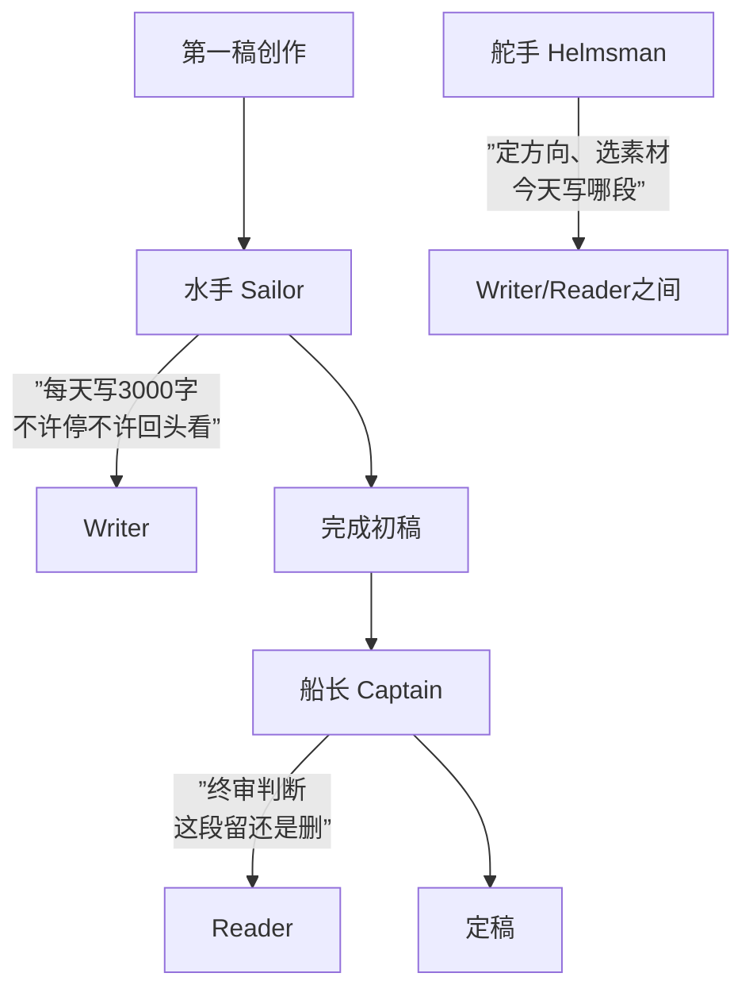

# 第23课：编剧思维 — Writer与Reader

## Learning Objectives

- 区分Writer心态（创作生成）与Reader心态（评估判断），理解两者互斥关系
- 掌握"迎头枪"与"游根起"两种核心编剧技巧
- 建立创意保护意识，理解"丑陋的婴儿"阶段的价值
- 认识"水手-舵手-船长"团队协作模型

## Core Idea

编剧最核心的思维冲突，来自体内的两个"人"——**Writer**与**Reader**。这是两种**完全互斥**的状态。

> [!WARNING] Writer与Reader互斥
> Writer负责**从零到一的创作生成**——此时你像斯蒂芬·金所说的"恐龙化石挖掘大法"：先让角色动起来，让对话自然流淌，把最初杂乱无章的草稿写完，不要边写边改。Reader负责**评估判断**——此时你像麦基那样分析范本，但麦基只告诉你"为什么好剧本长这样"，不告诉你"如何写出好剧本"。**让Reader监督Writer，Writer就无法创作。**

**Writer推荐阅读**：斯蒂芬·金《写作这回事》（On Writing）。金用"恐龙化石挖掘"比喻创作——化石（故事）已经埋在那里，你的工作只是把周围的泥土挖开。第一稿是"关起门来写给自己看的"，不要有任何评判者。

**Reader推荐阅读**：麦基《故事》。麦基的贡献在于**拆解经典范本的结构密码**，但他只做分析，不做生产。记住：**麦基不能帮你写出一场好戏——他只能帮你判断一场戏为什么好。**

---

### 两大核心技巧

#### 迎头枪

"迎头枪"源自中国表演大师[[0022-film-analysis-intouchables|石挥]]的理论——**最好的开场，是子弹已经飞在空中。** 没有铺垫，没有预热，故事的第一句话就把观众拽进冲突中心。

> [!EXAMPLE] 迎头枪
> 电影《拯救大兵瑞恩》的开场——诺曼底登陆的血腥画面。没有任何前情提要，观众直接被扔进战场。这不是"铺垫然后进入高潮"，而是**高潮就是开场**。

#### 游根起

"游根起"同样是石挥的概念——**让看似无关的线索从不同方向慢慢汇聚。** 多条叙事线索各自漂移，最终在某个节点奇妙交汇。

> [!TIP] 游根起
> 适合悬疑片和多线叙事。每个"根"看似独立，观众直到最后一刻才看清它们是如何缠绕在一起的。如《撞车》（Crash）中多条线索的编织。

---

### 创意保护：皮克斯的"丑陋的婴儿"

皮克斯有一个著名的文化信条——**"丑陋的婴儿"（Ugly Baby）**。任何一个创意刚诞生时都是丑陋的、脆弱的、不堪一击的。此时如果让Reader出来说话，这个婴儿会被扼杀在摇篮里。

> [!NOTE] 创意保护三步法
> 1. **隔离期**：初稿阶段，只让Writer工作，不允许Reader进入
> 2. **孵化期**：存放创意，让它在潜意识中发酵
> 3. **评估期**：只有Writer说"我写完了"，Reader才被允许进入

---

### 水手-舵手-船长模型

编剧团队的三种角色分工：

- **水手**：只管写，不问好坏。每天的写作量是硬指标。
- **舵手**：在写作过程中微调方向——"今天写哪场戏"、"这场戏从谁的视角切入"。
- **船长**：只有初稿完成后才出现。船长负责删、改、决定哪些留哪些走。

> [!QUOTE] 元好问《论诗》
> "奇外无奇更出奇，一波才动万波随。"
> 
> 创作如涟漪——只要Writer投下第一颗石子（一波），后续的千万波（灵感、人物行动、情节展开）会自然跟随。不要在第一波还没落下时，就让Reader伸手去捞。

---

## Worked Example

**场景**：你正在写一个开场戏，主角在咖啡厅遇到前女友。

- **Writer模式**：直接写。让他们说话。让情绪流动。不要管这段会不会被删。
- **Reader模式习惯**：写到一半就开始想"这对话太弱了"、"场景太平了"，于是删掉重写。
- **正确做法**：先写完完整的第一稿草稿（Writer），然后放三天，再用Reader视角重新阅读评估。

---

## Practice

> [!QUESTION] 自测题
> 你正在写一部悬疑剧本的开场。以下哪种做法是纯正的Writer思维？
> 
> A. 先花一周研究《西北偏北》的开场结构，画好节拍表再动笔
> B. 不管好坏先写5000字草稿，写完后放三天再回头修改
> C. 写完第一场就发给朋友求反馈
> D. 同时写三个不同版本的开场，然后对比选择

查看答案

**答案：B**

A是Reader思维——先分析再创作，这是用麦基的方式干扰Writer。C是大忌——"丑陋的婴儿"期不适合外部反馈。D看起来像在创作，实际上是在用Reader的标准同时评估三个版本，同样干扰了Writer的单一流动。

B是纯正的Writer思维：先写、写完、再改。斯蒂芬·金说："第一稿是关起门来写给自己看的。"

---

## Next Step

继续学习 [[0024-genre-hooks-theme|第24课：类型、钩子与主题]]，了解剧本评估的九维度框架。