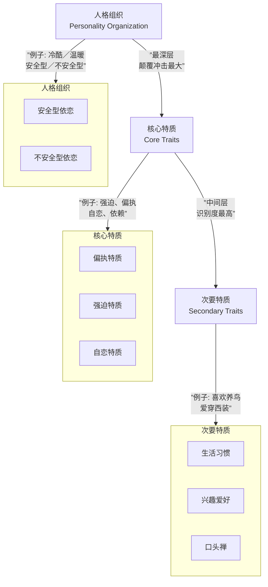

# 第25课：人物目标与特质改变

## Learning Objectives

- 掌握三层目标体系的构建方法
- 理解人物特质三个层级与颠覆技巧
- 学会用人物关系创新驱动剧作创新
- 认识三层次喜剧理论的内涵

## Core Idea

### 一、三层目标体系

人物的目标不是单一的——真正的立体角色拥有**三层目标**：

1. **外在目标**：角色在故事中明确追求的东西——拯救世界、赢得比赛、找到凶手。这是情节的驱动力。
2. **内在目标**：角色内心真正渴望但未必自知的东西——被认可、被爱、被原谅。这是情感的驱动力。
3. **社会心理价值**：故事对观众产生的深层价值共鸣——自由、尊严、正义。这是主题的驱动力。

> [!NOTE] 外在职业生涯 vs 内在职业生涯
> - **外在职业生涯**：角色的社会身份和职业目标——"我想当上总裁""我要成为最棒的拳击手"
> - **内在职业生涯**：角色作为人的成长路径——"我要学会信任他人""我要接纳自己的脆弱"
> 
> 伟大的剧本让两条线同步推进：外在成功了但内在失败了，或者外在失败了但内在成功了，都是好故事。

---

### 二、人物特质三个层级

[[0021-character-pairing|人物性格]]可以拆解为三个层级，从表到里逐层深入：

- **人格组织**：最底层结构——一个人是安全型还是不安全型依恋，是温暖还是冷酷。**颠覆这个层级对观众的冲击最大，但难度也最高。**
- **核心特质**：中间层——强迫特质、偏执特质、自恋特质等。改变核心特质而不动人格组织，是中等颠覆。
- **次要特质**：表面层——生活习惯、兴趣爱好、小癖好。这个层级的颠覆最简单，也最常用。

---

### 三、人物颠覆的三个层级

以**杀手**形象为例：

**第一层：颠覆次要特质——鸟变绿萝**
- 常规：杀手喜欢养鸟（硬汉+小动物的反差）
- 颠覆：杀手喜欢养绿萝（植物比动物更静态，反差更微妙）
- 冲击力：★★

**第二层：颠覆核心特质——话痨杀手、拖家带口杀手**
- 常规：杀手沉默寡言、冷酷高效
- 颠覆：杀手是个**话痨**（《低俗小说》文森特）或**带着孩子执行任务**（《这个杀手不太冷》中莱昂和玛蒂尔达的互动）
- 冲击力：★★★★

**第三层：颠覆人格组织——冷酷变暖男（Leon）**
- 常规：杀手的依恋模式是不安全型、隔离型
- 颠覆：杀手其实渴望温暖、渴望连接（莱昂从孤立到为玛蒂尔达付出生命）
- 冲击力：★★★★★ — **这是《这个杀手不太冷》成功的根本原因**

> [!TIP] 《疯狂动物城》的颠覆分析
> - **兔子**：次要特质颠覆——兔子不是种胡萝卜的（常规），而是当警察的（颠覆）
> - **狐狸**：核心特质颠覆——狐狸不是狡猾的（常规），而是善良的（颠覆）
> - **树懒**：人格组织颠覆——树懒不是慢吞吞的（常规），而是飙车党（颠覆）

---

### 四、人物关系创新即剧作创新

很多时候编剧绞尽脑汁想新情节，却忽略了最直接的创新路径——**改变人物关系**。

- 师生变情侣 → 改变故事基调
- 仇人变亲人 → 埋下情感炸弹
- 陌生人变失散兄妹 → 《星球大战》经典反转

> [!QUOTE] 改变人物关系 = 创造新情节
> 不要问"接下来发生什么"，问"他们之间是什么关系"。关系决定了冲突的性质和情感的烈度。

---

### 五、三层次喜剧理论

喜剧有三个逐层进阶的层次：

1. **叙事喜剧**：靠**情节**制造笑料——误会、巧合、错位。如《憨豆先生》靠情景错位。
2. **结构性喜剧**：靠**结构**制造笑料——重复、反转、升级。如《三傻大闹宝莱坞》用"消音器"的重复出现制造结构笑料。
3. **人物喜剧**：靠**人物特质**制造笑料——角色的内在矛盾本身就是笑点。如《武林外传》中佟湘玉的抠门和善良之间的冲突。

**最高级的喜剧来自人物本身**——不是角色讲笑话，而是角色**本身就是笑话**。当观众因为"这就是他会做的事"而笑，就是人物喜剧。

---

## Worked Example

**颠覆设计**：设计一个"温和的暴君"角色。
- 次要特质颠覆：暴君喜欢织毛衣
- 核心特质颠覆：暴君做每个决策前会问大臣的意见
- 人格组织颠覆：暴君表面上暴虐，实际上是因为童年创伤而恐惧被抛弃，暴虐是防御机制

---

## Practice

> [!QUESTION] 自测题
> 你正在设计一个喜剧角色——极度抠门的亿万富翁。以下哪种属于"人物喜剧"层次的创作？
> 
> A. 让他因为抠门在约会时闹出一系列笑话
> B. 让他每次省钱都以出人意料的方式失败，形成重复升级的笑料
> C. 他的抠门来自童年家道中落的创伤——他对自己也极度吝啬，内心的"不配得感"才是真正的笑点来源
> D. 他的管家负责吐槽他的抠门

查看答案

**答案：C**

A是叙事喜剧（靠情节）。B是结构性喜剧（靠重复与升级）。D是功能性的辅助角色设计。C是人物喜剧——笑点来自人物内在的矛盾（亿万富翁却觉得自己不配拥有），观众笑的是"这个人就是这样"的存在状态。三层次喜剧理论告诉我们：人物喜剧最高级，因为它讲的是**人的处境**。

---

## Next Step

继续学习 [[0026-character-resonance-values|第26课：人物共鸣与价值观]]，掌握人格混合技巧与人物价值四层级。