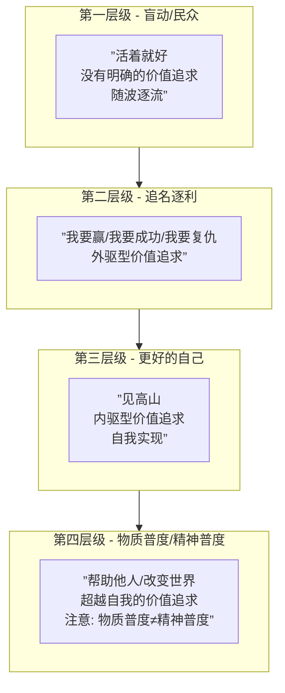

# 第26课：人物共鸣与价值观

## Learning Objectives

- 掌握人格混合的高阶技巧（以1989版与2007版小丑为范本）
- 理解人物价值四个层级与编剧层级的关系
- 辨析生存焦虑与自我价值实现焦虑在剧本中的表现
- 认识创作者自我暴露对角色深度的影响

## Core Idea

### 一、人格混合的高阶技巧

在[[0021-character-pairing|人物性格搭配]]的基础上，人格混合是更高级的技巧——**让同一个人物拥有多个看似矛盾的人格特质。**

> [!NOTE] 明确主次
> 人格混合的关键不是"多加特质"，而是**明确主次**。一个人的性格由**一个主导人格组织 + 2-3个辅助核心特质**构成。主次不分会让人物变成"精分"，主次分明才叫"立体"。

**典型案例：两代小丑的对比**

| 维度 | 1989版小丑（杰克·尼科尔森） | 2007版小丑（希斯·莱杰） |
|------|---------------------------|------------------------|
| 主导人格组织 | 自恋型——需要观众的崇拜 | 反社会型——无规则、无恐惧 |
| 辅助核心特质 | 表演型——夸张、戏剧化 | 强迫型——对计划的执着 |
| 次要特质 | 爱笑、爱跳舞 | 舔嘴唇、讲混乱的笑话 |
| 角色效果 | 令人讨厌的有趣 | 令人着迷的恐惧 |

1989版是"自恋+表演"的混合——小丑要你**看他**。2007版是"反社会+强迫"的混合——小丑要你**崩溃**。同样的角色名，完全不同的人格混合配方，创造了两个经典。

---

### 二、人物价值的四个层级

一个好角色不仅要有性格，还要有**价值追求**。人物价值的四个层级：

- **第一层级 - 盲动/民众**：角色没有自觉的价值追求，只是"活着"。配角和群演通常在此层级。
- **第二层级 - 追名逐利**：角色追求外部认可——财富、地位、复仇、胜利。**大多数商业片主角在此层级**。
- **第三层级 - 更好的自己/见高山**：角色追求内在成长——接纳自己、克服恐惧、找到真实自我。**文艺片和深度商业片的高弧线角色在此层级。**
- **第四层级 - 物质普度/精神普度**：角色追求超越自我——帮助他人、改变世界、传递价值。注意区分物质普度（捐钱建学校）和精神普度（启迪人心）。

> [!WARNING] 编剧层级决定作品深度
> 编剧的价值层级上限决定了作品的深度上限。一个停留在第二层级的编剧写不出第四层级的人物弧线。**创作人物价值弧线时，先问问自己：这个价值我真正理解吗？**

---

### 三、生存焦虑 vs 自我价值实现焦虑

故事中角色的焦虑类型决定了主题的质感：

| 类型 | 核心恐惧 | 典型角色 | 代表作品 |
|------|----------|----------|----------|
| **生存焦虑** | 活不下去、失去所有 | 难民、失业者、病人 | 《我不是药神》 |
| **自我价值实现焦虑** | 不够好、不配被爱 | 成功人士的内心空虚 | 《社交网络》 |

**高明的剧本让两种焦虑共存**：角色同时面临外部生存危机和内部价值危机。例如《疯狂原始人》——咕噜家族既要面对物理世界的生存威胁（生存焦虑），又要面对"要不要改变"的自我价值困惑（实现焦虑）。

---

### 四、创作者自我暴露

[[0023-screenwriting-mindset|编剧思维]]中最重要的一个环节——**敢于把真实的自己放进角色。**

> [!QUOTE] 写作即自我暴露
> 观众能感知到一个角色是"编出来的"还是"活过来的"。活过来的角色里住着创作者的一部分。
> 
> 希斯·莱杰的小丑之所以令人窒息，不是因为希斯·莱杰演了一个疯子，而是因为他把自己对世界规则的困惑和恐惧注入了角色。你的角色有多真实，取决于你敢在角色里暴露多少自己。

**自我暴露的方法：**
1. 问自己："这个角色的哪个部分像我？"
2. 问自己："这个角色的哪个部分是我害怕成为的？"
3. 问自己："这个角色的哪个部分是我渴望成为的？"

---

## Worked Example

**人格混合实战**：设计一个"温柔的暴君"
- **主导人格组织**：控制型（不安全依恋）
- **辅助核心特质**：抑郁特质（自我攻击）+ 强迫特质（秩序需求）
- **人物价值层级**：第二层级（我要建立一个完美的王国）→ 第三层级（我意识到控制的本质是恐惧）
- **生存焦虑**：被推翻、失去权力
- **实现焦虑**：我除了控制别人，还会什么？

---

## Practice

> [!QUESTION] 自测题
> 你正在设计一个"冷酷无情的投资人"角色。以下哪种设定能让这个角色达到第三层级（更好的自己）？
> 
> A. 他投资只是为了赚更多钱
> B. 他冷酷是因为从小被父亲教育"感情是软弱的"，而故事的核心是他学会接纳自己的情感
> C. 他在金融危机中破产，领悟到金钱不重要
> D. 他把所有财富捐给慈善机构

查看答案

**答案：B**

A停留在第二层级（追名逐利）。C是第三层级的结果，但没有展现"见高山"的过程。D是第四层级的行为，但如果缺乏心理转变过程，只是行为层面的跳跃。
B真正体现了第三层级：角色从"我被恐惧驱动"到"我学会面对恐惧"——外在身份不变（投资人），但内在发生了根本转变。**第三层级的核心不是行为的改变，而是自我认知的改变。**

---

## Next Step

继续学习 [[0027-role-functions-structure|第27课：角色功能与结构]]，深入了解英雄之旅角色原型与起承转合大纲框架。