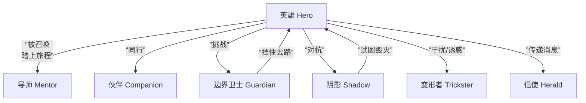
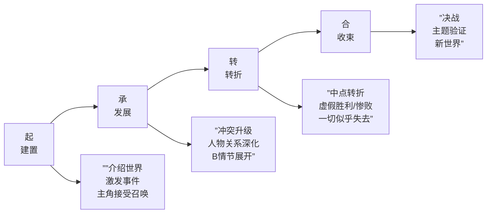

# 第27课：角色功能与结构

## Learning Objectives

- 掌握英雄之旅的七种角色原型
- 理解主角-边界卫士-反派三角动力（Dramatica模型）
- 学会构建起承转合大纲框架与三千字三层铺陈
- 掌握三层次结局体系与B情节作用

## Core Idea

### 一、英雄之旅角色原型

坎贝尔在《千面英雄》中提炼了叙事中的**七种角色原型**，每一种在故事中承担特定功能：

- **英雄**：故事的驱动核心，经历转变
- **导师**：提供智慧和装备（甘道夫、 Obi-Wan）
- **伙伴**：陪伴、支持、补充功能（山姆、楚巴卡）
- **信使**：带来改变的召唤（猫头鹰送信）
- **边界卫士**：拦住英雄去路，考验决心（门卫、审查官）
- **变形者**：身份不确定，带来悬念（间谍、双重身份者）
- **阴影**：英雄的黑暗面或真正的对手

> [!NOTE] 主角-边界卫士-反派三角动力
> 基于Dramatica理论，故事的核心冲突由**三个角色位置**构成：
> 
> | 位置 | 功能 | 《泰囧》示例 |
> |------|------|-------------|
> | **主角** | 推动故事前进，主动决策 | 徐朗 |
> | **边界卫士** | 阻止主角到达目标，但可以被说服/转化 | 王宝（天然呆，无意中挡路） |
> | **反派** | 与主角争夺同一资源，不能被转化只能被击败 | 高博 |
> 
> 注意区分：边界卫士和反派不是同一个人。**边界卫士可以被转化（变成盟友）**，反派只能被击败。缺少边界卫士的故事会显得"太顺"，缺少反派的则会"太软"。

---

### 二、外在结构与内在结构

- **外在结构**：幕的比例——三幕或五幕的时间分配。如"第一幕25%、第二幕50%、第三幕25%"。
- **内在结构**：人物关系的变化——角色之间距离的拉近和推远。**人物关系图谱决定了情节走向。**

> [!TIP] 性格图谱决定人物关系结构
> [[0021-character-pairing|角色性格搭配]]直接决定了结构：
> - 两个强迫特质的人在一起 → 结构上是"争夺控制权"
> - 一个回避型+一个焦虑型 → 结构上是"追逐-逃跑-追逐"
> - 自恋+共依存 → 结构上是"利用-付出-崩溃"

**内在结构比外在结构更重要**——观众记不住幕比例，但记得住人物关系的变化。

---

### 三、起承转合大纲框架

**三千字大纲的三层铺陈方法：**

| 层数 | 内容 | 字数 |
|------|------|------|
| **第一层** | 故事梗概——谁、在哪、发生了什么、结果如何 | ~500字 |
| **第二层** | 人设+结构——每个人的目标是什么，起承转合的每个节点发生什么 | ~1000字 |
| **第三层** | 核心场景——关键的三到五场戏的详细描写 | ~1500字 |

> [!WARNING] 三千字大纲的意义
> 三千字是检验剧本是否"立得住"的最小样本量。如果三千字说不清一个故事，三万字更说不清。**写剧本前先写三千字大纲，让Reader在大纲阶段做判断，而不是在初稿阶段才发现结构性问题。**

---

### 四、激发事件的两个驱动力

- **外在驱动力（灾难）**：世界发生了一件大事，迫使角色行动——火山爆发、亲人被杀、世界末日。
- **内在驱动力（召唤）**：角色内心感到"不能再这样下去了"——中年危机、良心发现、内心觉醒。

**好故事的激发事件同时驱动外在和内在**：一个事件同时是灾难和召唤。如《黑客帝国》中尼奥的选择——外部世界在召唤他，内部"不对劲的感觉"也在召唤他。

---

### 五、三层次结局体系

[[0023-screenwriting-mindset|编剧思维]]中的结局设计是一个从低到高的进阶过程：

1. **坏结局**：角色得到外在目标但付出巨大代价——如《绝命毒师》沃尔特成了毒王但失去了家人。
2. **好结局**：角色同时实现外在目标和内在成长——经典好莱坞大团圆。
3. **超凡结局**：结局超越了"好坏"的二元判断，让观众在震撼中思考。如《功夫熊猫》——阿宝的师傅说"你必须相信"，阿宝说"我现在相信了"。

> [!TIP] 《功夫熊猫》的第三层次结局
> "没有巧合，只有必然。"——《功夫熊猫》的结局超越了"阿宝赢了"的层面，到达了"自我实现"的境界。这不仅是情节的收束，更是**主题的验证**。

---

### 六、B情节对主线的作用

B情节（副线）不是为了凑时长——它必须有以下**三项功能之一**：

1. **补充主题**：从另一个角度验证主题。如《寻梦环游记》主线和Coco线都围绕"记忆与遗忘"。
2. **拓展人物**：揭示主角在主线中无法展示的一面。
3. **调节节奏**：在紧张的主线中提供呼吸空间。

> [!NOTE] 类型片的三个未来创作方向
> 1. **类型融合**：两种不相干的类型碰撞出新火花（如恐怖+喜剧）
> 2. **类型解构**：用反类型的方式拍类型片（如《死侍》解构超级英雄）
> 3. **类型亚文化**：深入类型的细分领域（如科幻+中国乡土）

---

## Worked Example

**三角动力设计**：一个"修仙+职场"的故事
- **主角**：刚入职的实习生（修仙小白）
- **边界卫士**：看似严厉的前辈（其实是保护主角不被高层利用）
- **反派**：公司高层（为了修仙资源不择手段）
- **激发事件**：主角无意中发现了公司的秘密（外在）+ 发现自己有罕见的修仙天赋（内在）

---

## Practice

> [!QUESTION] 自测题
> 以下哪一组角色构成了标准的主角-边界卫士-反派三角动力？
> 
> A. 哈利·波特、赫敏、罗恩
> B. 福尔摩斯、华生、莫里亚蒂
> C. 《功夫熊猫》中的阿宝、师父（一开始拒绝教阿宝）、太郎（叛变的师兄）
> D. 白雪公主、七个小矮人、王子

查看答案

**答案：C**

A中赫敏和罗恩都是伙伴，没有边界卫士。B中福尔摩斯和莫里亚蒂是主角和反派的二元关系，华生是伙伴，缺少边界卫士。D中小矮人和王子都是帮助者，没有明确的边界卫士或反派。

C完美展示了三角动力：阿宝（主角）→ 师父（边界卫士，一开始挡住阿宝的路，后来被转化）→ 太郎（反派，与阿宝争夺"神龙大侠"的身份，只能被击败）。

---

## Next Step

继续学习 [[0028-plot-devices-evaluation|第28课：情节道具与剧本评估]]，深入"逻辑之外"的创作手法与贯穿道具设计。