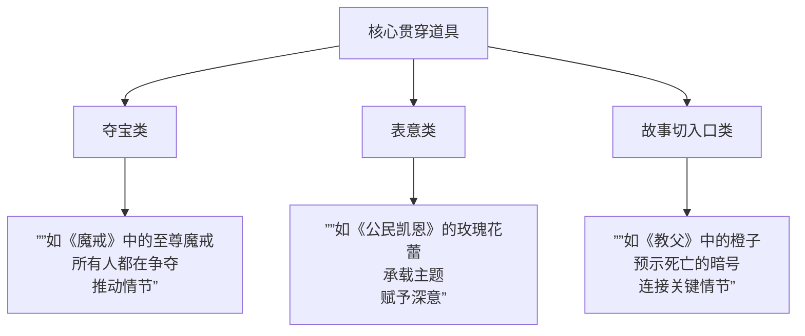
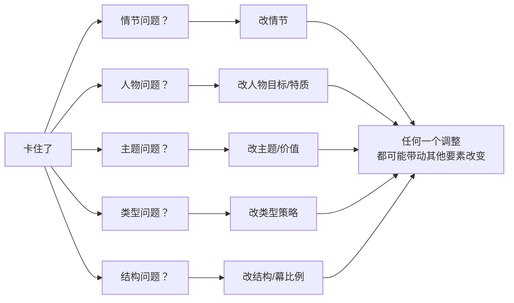

# 第28课：情节道具与剧本评估

## Learning Objectives

- 理解"逻辑之外"的创作手法与贯穿道具的三种类型
- 掌握热开场预算规避策略与激发事件前置技巧
- 学会"没有败笔，三场好戏"的75分剧本评估法
- 建立创作要素的动态调整观

## Core Idea

### 一、"逻辑之外"的创作手法

剧本创作中有一些手法是**逻辑解释不了，但确实有效的**。它们不遵循因果链，却能极大提升故事的感染力。

> [!NOTE] 逻辑之外 ≠ 不讲逻辑
> "逻辑之外"是指在因果链的夹缝中加入**诗意、象征、意象**等非理性元素。例如《花样年华》中周慕云对着树洞说话——从逻辑上讲他不会这样做，但**情感逻辑**上它是完美的。

**逻辑之外的创作手法包括：**
- 象征性重复（同一意象在不同情境下出现）
- 诗意对白（说出来不符合现实，但符合情感真实）
- 超现实片段（梦境、幻觉、幻想）
- 巧合的高级运用（不是"刚好碰上"，而是"命运的安排"）

---

### 二、核心贯穿道具的三种类型

[[0024-genre-hooks-theme|道具]]作为贯穿全剧的线索，可以分为三类：

1. **夺宝类道具**：所有人都在争夺的东西，推动情节前进（魔戒、圣杯、藏宝图）
2. **表意类道具**：承载主题意义，不一定被争夺，但赋予故事深层的诗意（玫瑰花蕾、红色外套）
3. **故事切入口类道具**：连接两段时空或两条叙事线的枢纽（一张老照片、一封信）

> [!TIP] 贯穿道具的三步法
> 设计贯穿道具时，确保它：
> 1. **开场出现**（建立印象）
> 2. **中点重现**（加深意义）
> 3. **结尾升华**（完成主题验证）

---

### 三、热开场预算规避策略

不是每个剧本都有大制作预算。**热开场（action opening）不一定要烧钱**：

| 策略 | 方法 | 示例 |
|------|------|------|
| **情感开场** | 用情感冲击代替视觉冲击 | 一段沉默的对视/一句改变一切的对话 |
| **动作中点** | 把大场面放在第二幕中点，预算集中使用 | 一场精心设计的动作戏 |
| **情感+动作高潮** | 高潮同时是情感顶点和动作顶点 | 主角在最激烈的战斗中做出最重要的选择 |

**核心原则**：**别让观众觉得"预算不够"，要让观众觉得"创作者聪明"**。希区柯克的《后窗》从头到尾在一个房间里，但紧张感不输任何大片。

---

### 四、"没有败笔，三场好戏"——目标75分

> [!QUOTE] 评估哲学
> 一个"好"的剧本不要求每一场戏都惊艳——只要求：
> 1. **没有败笔** —— 没有让观众出戏、尴尬、无聊的场次
> 2. **三场好戏** —— 有三场让观众记住的、可以谈论的好戏
> 
> 这就是**75分剧本**。而在行业里，75分剧本已经足够卖掉或投拍。

**"没有败笔"的标准：**
- 每场戏都推动情节或揭示人物（至少完成一个功能）
- 没有多余的场景
- 没有突兀的逻辑断裂
- 演员有戏可演（有情感空间）

**"三场好戏"的标准：**
- 一场是开场/激发事件（抓人）
- 一场是中点转折/核心冲突（震撼）
- 一场是高潮/结局（余韵）

---

### 五、激发事件前置技巧

传统编剧法建议激发事件发生在第一幕的中间或结尾。但有一种高风险的技巧——**激发事件前置**。

> [!EXAMPLE] 《内布拉斯加》的激发事件前置
> 影片第一场戏：一个老人站在高速公路中间，试图走去内布拉斯加领奖。
> 
> 这就是激发事件——观众在还不知道角色是谁的情况下，已经看到他做了什么。这种前置的好处是：**悬念在先，解释在后**。观众先被"钩住"，再慢慢了解为什么要这样做。

**激发事件前置三原则：**
1. **动作先行**：让角色先做一件让人好奇的事
2. **解释后置**：不急着解释前因后果
3. **信息递进**：随着情节推进，观众逐渐补全信息拼图

---

### 六、创作要素的动态调整观

剧本创作不是"先定死所有要素再动笔"。**所有要素都是活的，可以随时调整**。

[[0023-screenwriting-mindset|编剧思维]]强调：当你发现自己写了三万字但故事走不动——**不要只改情节**。

> [!WARNING] 动态调整的核心态度
> **如果一个要素走不通，不要硬撑——换一个要素动。**
> 
> 人物走不通 → 调结构（换个叙事视角）
> 结构走不通 → 调类型（换个类型框架）
> 情节走不通 → 调人物（改变角色目标）
> 
> 剧本是一个**系统**，任何一个要素的调整都会带动系统重新运转。有时候转机不在你正在撞的那堵墙上，而在你还没看过的另一面墙上。

---

## Worked Example

**75分剧本检查清单**：
- [ ] 开场有没有一个"迎头枪"或"钩子"？（好戏#1）
- [ ] 第二幕中点是否有一个核心冲突场景？（好戏#2）
- [ ] 高潮是否同时完成了外在目标和内在主题的收束？（好戏#3）
- [ ] 是否有任何一个场景观众会感到无聊？（败笔排查）
- [ ] 贯穿道具是否在三步（开场、中点、结尾）中发挥了作用？

---

## Practice

> [!QUESTION] 自测题
> 你写完了一个剧本，评估发现第二幕中间有一个长达8分钟的对话场景，观众可能会感到无聊。按照"没有败笔，三场好戏"的原则，以下最合理的做法是？
> 
> A. 删掉这个场景，哪怕它有一段重要信息
> B. 保留但压缩到3分钟，把必要信息分散到前后场景中
> C. 加入追逐戏让它"热"起来
> D. 不管它，因为"三场好戏"就够了

查看答案

**答案：B**

A太过激进——删掉可能损害情节完整性。C是典型的外行思维——用动作填充无聊，反而让场景更加不伦不类。D不符合"没有败笔"的原则——三场好戏的前提是没有败笔，不能因为有亮点就容忍明显的缺陷。

B是最合理的处理——"没有败笔"要求每一场戏都不能是累赘。压缩+信息再分配既保留了必要内容，又消除了拖沓感。记住：**观众不关心你删了多少，只关心剩下的是不是都好。**

---

## Next Step

本课是"性格分析与人物创作"模块的最后一课。回顾本模块内容，建议重新温习 [[0024-genre-hooks-theme|类型钩子与主题]]、[[0025-character-goals-traits|人物目标与特质改变]]、[[0026-character-resonance-values|人物共鸣与价值观]] 三课的核心框架，完成从人物分析到剧本实战的全链路知识整合。