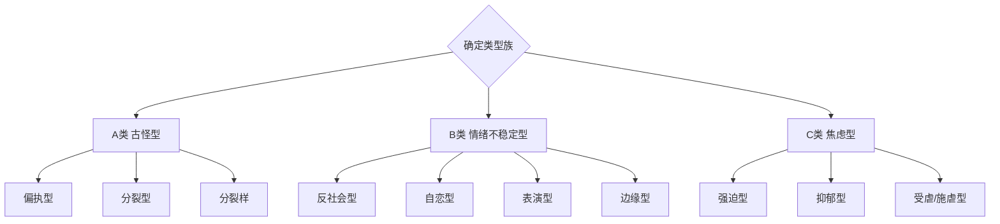
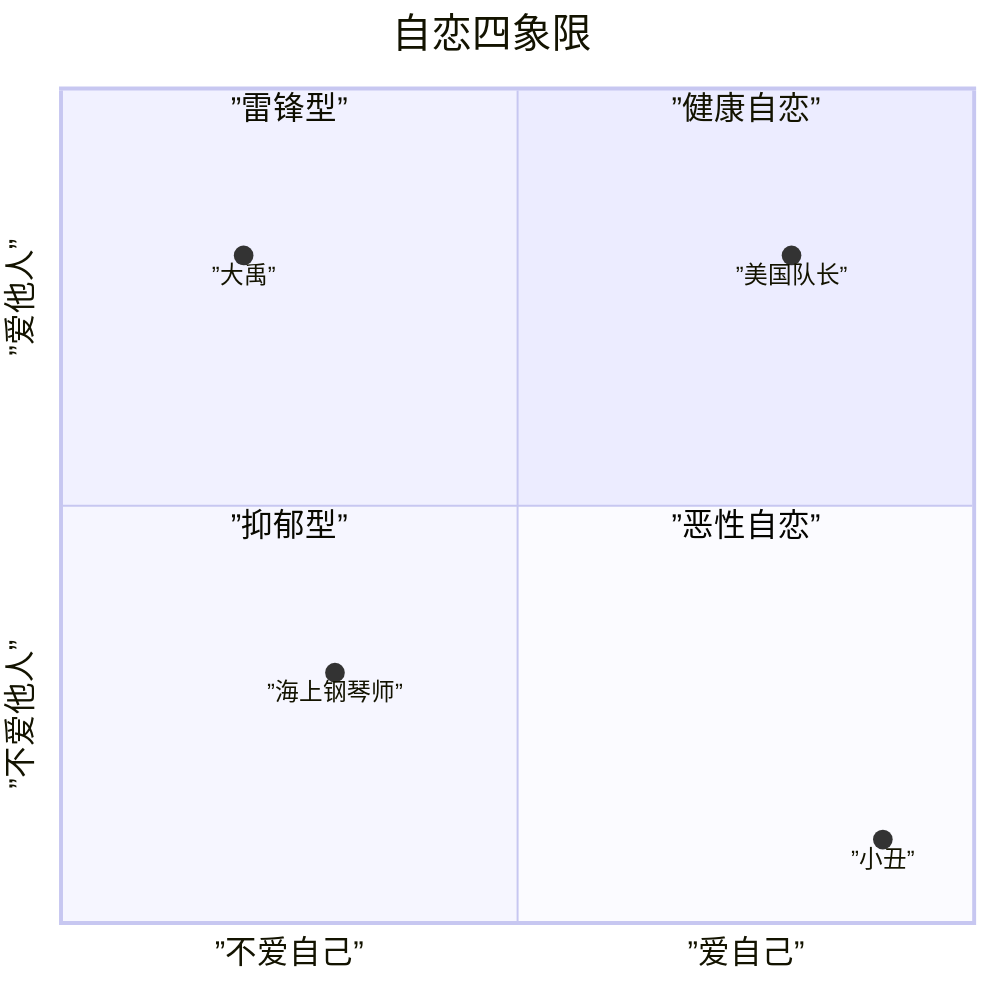
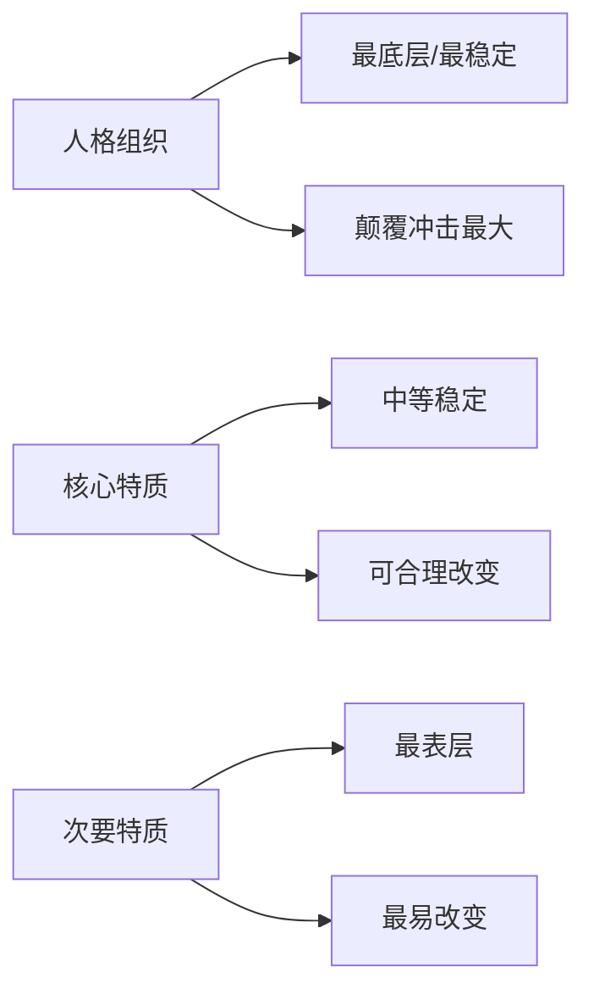

# 人物评估框架

## 一、快速定位：三好标准

用"爱得好、工作得好、玩得好"评估角色基线：

| 维度 | 评估问题 | 低分表现 | 高分表现 |
|------|----------|----------|----------|
| 爱 | 角色有客体爱的能力吗？ | 只有自恋的爱 | 能爱真实的对方 |
| 工作 | 角色能持续投入创造吗？ | 无法坚持 | 有使命感和产出 |
| 社交 | 角色有稳定人际关系吗？ | 孤独/关系破裂 | 有深层连接 |

## 二、Y轴定位：人格组织水平

| 指标 | 精神病性 | 边缘性 | 神经症性 |
|------|----------|--------|----------|
| 现实检验 | 物理现实受损 | 关系检验有问题 | 检验能力尚可 |
| 防御机制 | 原始防御 | 原始防御为主 | 神经症性/成熟防御 |
| 自我认同 | 破碎、分裂 | 不稳定困扰 | 相对稳定 |
| 爱的能力 | 无法建立关系 | 极端波动 | 可具备客体爱 |
| 焦虑类型 | 瓦解/被迫害 | 被抛弃/失去爱 | 超我/被阉割 |
| 攻击性控制 | 极差 | 差、情绪化 | 可调控 |
| 剧情承载力 | 无法承担高张力 | 剧情发动机 | 可承担复杂主题 |

## 三、X轴定位：性格类型

## 四、自恋四象限定位

- **第一象限（爱自己+爱他人）**：实体自恋，英雄角色基线
- **第二象限（不爱自己+爱他人）**：中国式英雄（舍小家为大家）
- **第三象限（不爱自己+不爱他人）**：抑郁型角色
- **第四象限（爱自己+不爱他人）**：恶性自恋、反社会

## 五、实体自恋 vs 虚体自恋

| 维度 | 实体自恋 | 虚体自恋 |
|------|----------|----------|
| 核心比喻 | 实心铅球 | 充气气球 |
| 抗压能力 | 扎不坏、针都会断 | 一扎就破 |
| 眼神 | 坚定 | 闪烁/虚浮 |
| 来源 | 被母亲无条件爱过 | 缺少早期稳定爱 |
| 失败反应 | 扛住、再试 | 崩塌、逃避 |
| 经典角色 | 伊森·亨特《碟中谍》 | 秦舞阳、丁春秋 |
| 设计原则 | 高强压力场景必须用实体自恋 | 适合配角/反派/戏剧性反转 |

## 六、人物特质三层级

| 层级 | 定义 | 改变难度 | 颠覆冲击 | 例子：杀手形象 |
|------|------|----------|----------|---------------|
| 人格组织 | 冷酷/温暖的内核 | 极难 | 最大 | 冷酷杀手→暖男 (Leon) |
| 核心特质 | 沉默寡言/话痨 | 中等 | 中等 | 沉默→话痨 (Pulp Fiction) |
| 次要特质 | 养鸟/养绿萝 | 容易 | 最小 | 养鸟→养绿萝 |

**设计原则**：角色戏份越多，颠覆层级应越深。

## 七、人物价值四层级

| 层级 | 名称 | 核心 | 例子 |
|------|------|------|------|
| 1 | 盲动/民众 | 被困在自身缺点中 | 农民、城市屌丝 |
| 2↓ | 追名逐利(不择手段) | 为名利不择手段 | 反派 |
| 2↑ | 追名逐利(取之有道) | 君子爱财取之有道 | 职业人士 |
| 3↓ | 更好的自己(和自己比) | 今天比昨天好一点 | 成长型主角 |
| 3↑ | 见高山(和所有人比) | 成为最好 | 竞技型主角 |
| 4↓ | 物质普度 | 带领大家致富 | 企业家 |
| 4↑ | 精神普度 | 输出人生观价值观 | 乔布斯、褚时健 |

## 八、评估流程

1. **Y轴定位**：角色在人格组织水平上的位置
2. **X轴定位**：角色属于哪类性格类型
3. **自恋水平**：实体还是虚体？在哪个象限？
4. **特质层级**：哪些是人格组织？哪些是核心特质？哪些是次要特质？
5. **价值层级**：角色的精神追求在哪个层次？
6. **搭配检验**：角色与对手/配角的性格相容性
7. **张力检验**：角色的人格结构是否能承受剧情张力？