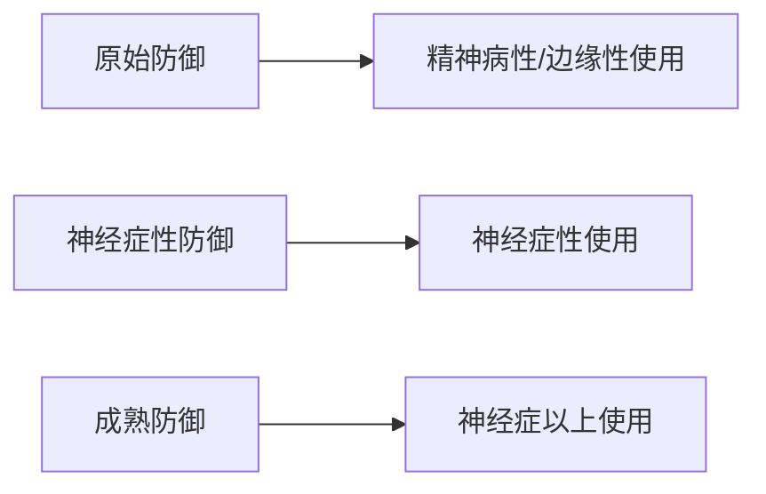
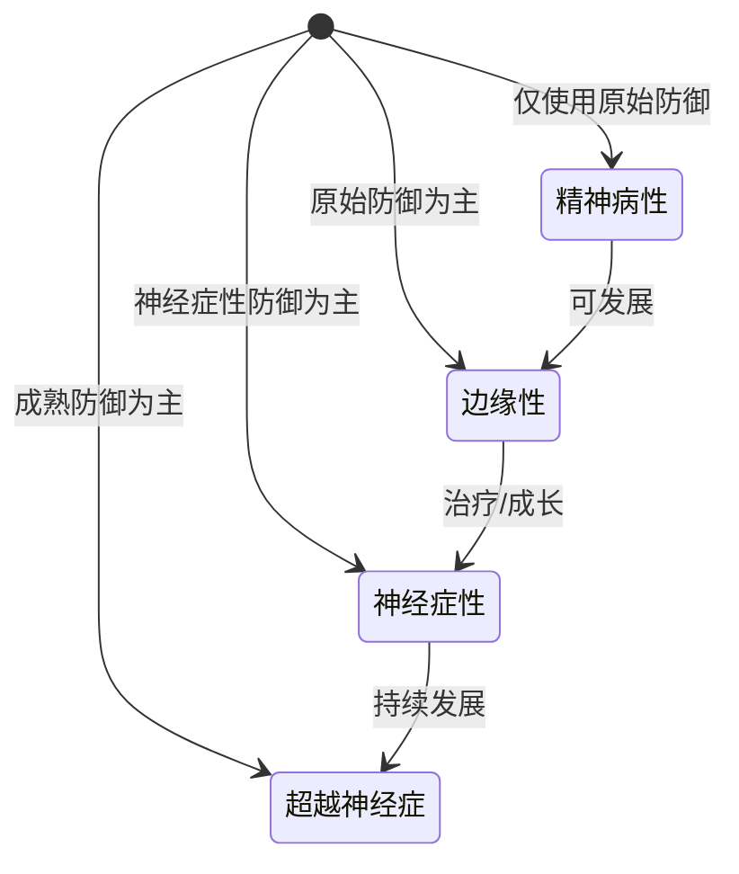

# 防御机制层级表

## 概述

防御机制是自我缓解焦虑、处理冲突的无意识心理策略。**防御机制的使用层级是判断人格组织水平的关键指标。**

## 原始防御机制 (Primitive Defenses)

使用人群：**精神病性、边缘性人格水平**

| 名称 | 英文 | 定义 | 角色设计应用 |
|------|------|------|-------------|
| 投射 | Projection | 把自己的情感、欲望、恨意投射到他人身上 | 偏执型角色："不是我恨他，是他恨我" |
| 投射性认同 | Projective Identification | 投射后认定对方符合，再收回内心验证 | 两人对视即拔枪的紧张关系 |
| 分裂 | Splitting | 非黑即白，好/坏不能整合 | 边缘型角色：今天爱死你明天恨死你 |
| 理想化 | Idealization | 把他人看成完美无缺 | 自恋型配角的盲目崇拜 |
| 贬低 | Devaluation | 把他人看得一无是处 | 反社会型对受害者的轻视 |
| 见诸行动 | Acting Out | 用行动代替言语表达 | 边缘型割腕、反社会型暴力 |
| 否认 | Denial | 拒绝接受现实 | 成瘾角色："我没问题" |

## 神经症性防御机制

使用人群：**神经症性人格水平**

| 名称 | 英文 | 定义 | 角色设计应用 |
|------|------|------|-------------|
| 压抑 | Repression | 把冲突内容压入无意识 | 忘记童年创伤的角色 |
| 隔离 | Isolation | 把情感从认知中分离 | 强迫型角色冷静叙述痛苦经历 |
| 抵消 | Undoing | 用仪式行为抵消内心冲动 | 强迫型反复检查门锁 |
| 理智化 | Intellectualization | 用理性分析替代情感体验 | 强迫型："概率是多少？" |
| 合理化 | Rationalization | 为行为找合理借口 | 不想参加的约会说"太忙了" |
| 反向形成 | Reaction Formation | 用相反态度掩盖真实情感 | 越在意越装作不在乎 |

## 成熟防御机制

使用人群：**神经症性及以上**

| 名称 | 英文 | 定义 | 角色设计应用 |
|------|------|------|-------------|
| 升华 | Sublimation | 把原始冲动转化为社会可接受行为 | 攻击性→运动竞技；性欲望→艺术创作 |
| 幽默 | Humor | 用幽默表达攻击而不伤害关系 | 《Her》男主西奥多在抑郁中保持幽默 |
| 利他 | Altruism | 从帮助他人中获得满足 | 无私的导师角色 |
| 预期 | Anticipation | 提前为未来压力做准备 | 高功能偏执型的周密计划 |
| 克制 | Suppression | 有意识地推迟满足 | 健康主角延迟满足的选择 |

## 防御机制与人格水平的对应

## 创作者自检

> [!QUESTION] 自检：你的角色使用什么防御机制？
> 1. 角色面对压力时的第一反应是什么？
> 2. 这个反应属于哪个防御层级？
> 3. 这个防御机制是否与其人格组织水平一致？
> 4. 如果角色成长了，防御机制会如何升级？

检查要点

- 精神病性角色使用原始防御 → 角色行为"不可理喻"
- 边缘性角色以原始防御为主 → 关系极端波动
- 神经症性角色使用压抑、理智化 → 有内心冲突感
- 角色成长时防御机制会从原始→神经症性→成熟 逐步升级

