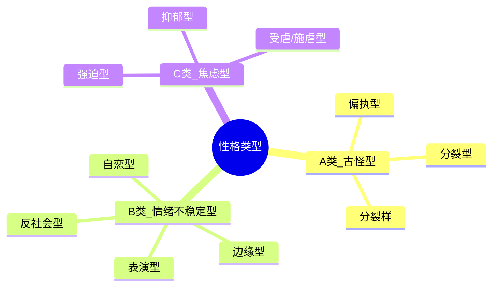

# 性格类型速查表

## A/B/C 三族分类



## 心理成熟度阶梯

```
功能最好  ←——  C类（焦虑型）—— 强迫型、抑郁型、受虐型（最接近神经症）
               B类（情绪不稳定型）—— 反社会、自恋、表演型、边缘型（中间）
功能最差  ←——  A类（古怪型）—— 偏执型、分裂型、分裂样（最接近精神病性）
```

## 九种类型速查

### A类：古怪型

| 维度 | 偏执型 | 分裂型 | 分裂样 |
|------|--------|--------|--------|
| 核心驱动力 | 不安全感、恨 | 幻想、渴求交往 | 无欲无求 |
| 防御机制 | 投射、高度警觉 | 幻想、退缩 | 退缩、情感隔离 |
| 人际关系 | 多疑、难信任 | 被疏离、渴求但不会 | 不需要、孤独但不痛苦 |
| 攻击性 | 强的攻击投射 | 弱、被动 | 几乎无攻击 |
| 认知风格 | 春江水暖鸭先知 | 古怪思维、联觉 | 专注单一领域 |
| 高功能表现 | FBI探员、律师、科学家 | 艺术家 | 理论物理学家、数学家 |
| 低功能表现 | 偏执型精神障碍 | 接近精神分裂症 | 严重孤独症谱系 |
| 经典角色 | 安迪《肖申克》、林彪 | 松子《被嫌弃的松子》 | 少年派、爱因斯坦 |
| 人物小传关键 | 一岁前分离、母亲产后抑郁 | 母亲孕期事件 | 先天多巴胺系统脆弱 |

### B类：情绪不稳定型

| 维度 | 反社会型 | 自恋型 | 表演型 | 边缘型 |
|------|----------|--------|--------|--------|
| 核心驱动力 | 残忍、操控 | 维持自大自我 | 获得关注 | 害怕被抛弃 |
| 共情能力 | 有认知共情无情感共情 | 自我中心 | 表面共情 | 不稳定共情 |
| 防御机制 | 操控、见诸行动 | 理想化、贬低 | 解离、转换 | 分裂、投射认同 |
| 情感稳定性 | 稳定冷酷 | 易受伤 | 肤浅波动 | 极端不稳定 |
| 核心恐惧 | 被控制 | 自恋受损 | 被忽视 | 被抛弃 |
| 高功能表现 | 政客、CEO | 英雄领袖 | 明星、主持人 | 艺术家、作家 |
| 低功能表现 | 连环杀手 | 恶性自恋 | 专业粉丝 | 高频自残 |
| 经典角色 | 汉尼拔、小丑 | 美国队长、超人 | 艾丽《律政俏佳人》 | 玉娇龙、玛蒂尔达 |
| 人物小传关键 | 童年虐待(身体) | 溺爱/忽视两极 | 创伤被隔离 | 童年性侵/无效环境 |

### C类：焦虑型

| 维度 | 强迫型 | 抑郁型 | 受虐/施虐型 |
|------|--------|--------|-------------|
| 核心驱动力 | 完美主义 | 空心感、假自体 | 道德的胜利 |
| 情感特征 | 情感隔离、酷 | 深层抑郁、无力 | 悲愤、享受受苦 |
| 防御机制 | 理智化、隔离 | 投射、抑郁性防御 | 反向形成、道德化 |
| 人际关系 | 稳定但有距离 | 深沉渴望 | 极端投入 |
| 攻击性 | 用理性施虐 | 向内攻击 | 向外施虐+向内受虐 |
| 原型起源 | 肛欲期固着 | 口欲期不足 | 俄狄浦斯期暴力 |
| 高功能表现 | 霸道总裁(理性型) | 喜剧演员 | 革命领袖(非暴力) |
| 低功能表现 | 强迫症OCD | 严重抑郁 | 自残、施虐者 |
| 经典角色 | 《尽善尽美》男主 | 《海上钢琴师》1900 | 耶稣、甘地 |
| 人物小传关键 | 肛欲期规则冲突 | 前6个月母爱不足 | 被遗弃感、暴力关注 |

## 角色搭配相容性

| 组合 | 相容性 | 例子 | 说明 |
|------|--------|------|------|
| 反社会+偏执 | ★★★★★ | 《猫鼠游戏》 | 一个死追一个逃 |
| 回避+边缘 | ★★★★★ | 《这个杀手不太冷》 | 边缘突破回避防御罩 |
| 反社会+分裂样 | ★★★★ | 常见搭档 | 一个做饭一个吃饭 |
| 边缘+分裂型 | ★★★★ | — | 分裂型不介意边缘折腾 |
| 自恋+偏执 | ★★★ | 蝙蝠侠vs超人 | 嫉妒推动剧情 |
| B类+B类 | ★★ | 不推荐 | 除非有特殊理由 |
| A类+A类 | ★ | 会"玩死" | 不推荐 |