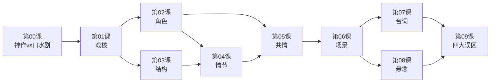

# 课程地图

## 学习路径

## 三大模块

### 模块一：基石概念（第00-01课）
建立编剧的基本认知框架：什么是好作品、如何评估一个创意是否值得写。

### 模块二：核心技法（第02-08课）
编剧的七大核心能力：
1. **角色** — 四步打造魅力角色
2. **结构** — 三幕剧框架
3. **情节** — 既合理又惊奇的原则
4. **共情** — 让观众代入主角
5. **场景** — 用节拍制造紧张感
6. **台词** — 潜台词与金句
7. **悬念** — 信息控制的艺术

### 模块三：避坑进阶（第09课）
新手最常见的四个误区及纠正方法。

## 学习建议

- **顺序学习**：建议按课程编号顺序学习，后课会引用前课的概念
- **交叉对照**：第09课四大误区是对前8课的总结性反思，学完前8课后阅读效果最佳
- **重点实践**：每课后的思考题建议尝试回答，加深记忆