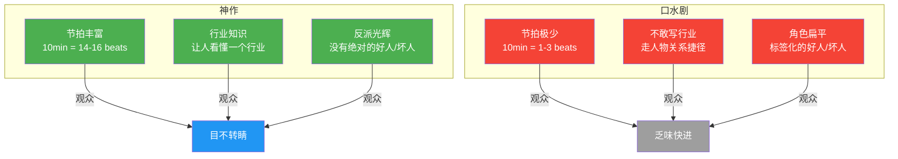

# 第00课：神作与口水剧

好的，开始。不管你是冲着创作爆款剧本来的，还是只想做个**高级观众**，这门课都为你准备。

课程体系的源头：

> [!NOTE] 课程渊源
> **USC南加州大学电影学院** + 与好莱坞编剧合作经验 + **十年一线实战**。

普通人学编剧能收获什么？

1.  成为**高级观众**——看懂门道，不再被烂片糊弄。
2.  学会**编剧吸引力法则**——把戏剧冲突、角色塑造的原理应用到生活，比如**约会、演讲、职场沟通**。

---

## 一、神作的三个特质

### 1. 节拍丰富

**节拍（Beat）** 的定义：

> 节拍 = 主角**每一次**克服障碍、实现目标的**努力**。

> [!TIP] 直观理解
> 一个场景里，主角想达成某个目的，但**对手/障碍不断制造新的麻烦**，主角见招拆招——**每过一招就是一个节拍**。
> 节拍越密，戏剧冲突越强，观众越舍不得眨眼。

**对比数据：**

| 维度 | 神作 | 口水剧 |
|------|------|--------|
| 10分钟重点戏的节拍数 | **14-16个** | **1-3个** |
| 观众感受 | 目不暇接、屏住呼吸 | 乏味、想快进 |
| 信息密度 | 极高，每句话都在推进 | 低，大量无效对话 |

**案例：过场戏 vs 有效戏**

> [!WARNING] 反面教材
> 《都挺好》**第一场**被李新老师点名——这是一场典型的"过场戏"：**零节拍**。角色只是在交代信息，没有遇到任何障碍，没有努力克服任何困难。

**节拍拆解示范：**

以经典谈判场景为例——主角想说服对手同意方案：

| 节拍 | 内容 | 障碍 |
|------|------|------|
| 节拍1 | 主角提出方案 A | 对手直接否决 |
| 节拍2 | 主角退让，提出方案 B | 对手提出附加条件 |
| 节拍3 | 主角接受条件，但要求对等交换 | 对手临时加价 |
| 节拍4 | 主角亮出底牌 / 杀手锏 | ——达成 / 破裂 |

> [!NOTE]
> 重点戏每个节拍大约 **30-45秒**，10分钟戏可以有 14-16 个来回。

---

### 2. 提供行业知识

神作让观众**搞懂一个行业的底层逻辑**。

**经典案例：**

| 神作 | 行业 |
|------|------|
| 《亿万》（Billions） | 对冲基金、金融监管 |
| 《纸牌屋》（House of Cards） | 美国政治运作 |
| 《绝命毒师》（Breaking Bad） | 毒品制造与交易链条 |
| 《芝加哥医院》（Chicago Med） | 医疗体系 |
| 《公关》（Flack） | 危机公关行业 |

> [!TIP] 编剧方法论
> 神作编剧会做大量**调研**、请**专业顾问**，甚至亲自体验行业生活。观众看完觉得"我好像也能去华尔街面试了"——这是最高的行业剧评价。

**口水剧**恰好相反——不敢深挖行业，喜欢走人物关系捷径：

- ❌ **医疗爱情剧**（披着白大褂的偶像剧）
- ❌ **创业爱情剧**（披着创业外壳的恋爱戏）
- ❌ **律政爱情剧**（律所只是背景板）

> 行业知识 = **真实感** + **稀缺信息** = 观众离不开的理由。

---

### 3. 反派人性的光辉

> 神作不带偏见写**所有人**——给恶人辩护的机会。

**最核心的技巧**：为反派找到**弱点 + 人性闪光点**。

**"救猫咪"理论**（Save the Cat）：

> 一个角色出场做了件"救猫咪"式的善事，观众立刻会对他产生好感——哪怕他后面是个混蛋。

**案例对比：**

| 维度 | 神作 | 口水剧 |
|------|------|--------|
| 反派塑造 | 有弱点，有人性闪光 | 纯粹的坏，符号化 |
| 正派塑造 | 有缺点，有灰色地带 | 完美主角，伟光正 |
| 观众感受 | 可怜反派、理解反派 | "他怎么还没死" |

> [!NOTE]
> **没有绝对的好人和坏人**——这是神作编剧的第一信条。

---

## 二、神作 vs 口水剧：全景对比

---

## 三、口水剧的三大特征

1.  **节拍稀疏** → 一场戏一个意思，对话像白开水。
2.  **不敢写行业** → 怕观众看不懂，怕调研成本高。
3.  **角色标签化** → 好人全好，坏人全坏，观众看了开头猜中结尾。

> [!WARNING]
> 如果你发现自己写的剧本有以上任何一个特征——**警惕**，它正滑向口水剧。

---

## 四、课后思考

1.  **节拍练习**：选一部你最喜欢的电影/剧集，截取一个 **10分钟** 的片段，手动数一数有多少个**节拍**（主角克服障碍的努力）。
2.  **行业剧拆解**：找一部你没接触过行业的剧（如《亿万》），看完后试着重述**你对对冲基金的新认知**。
3.  **反派观察**：从你看过的剧里选一个让你**既恨又爱**的反派，分析他的"人性闪光点"是什么。

---

*下一课：[[0001-戏核|第01课：戏核——好的创意一句话就能说清]]*

*参考文档：[[编剧术语表]] | [[编剧工具箱]]*