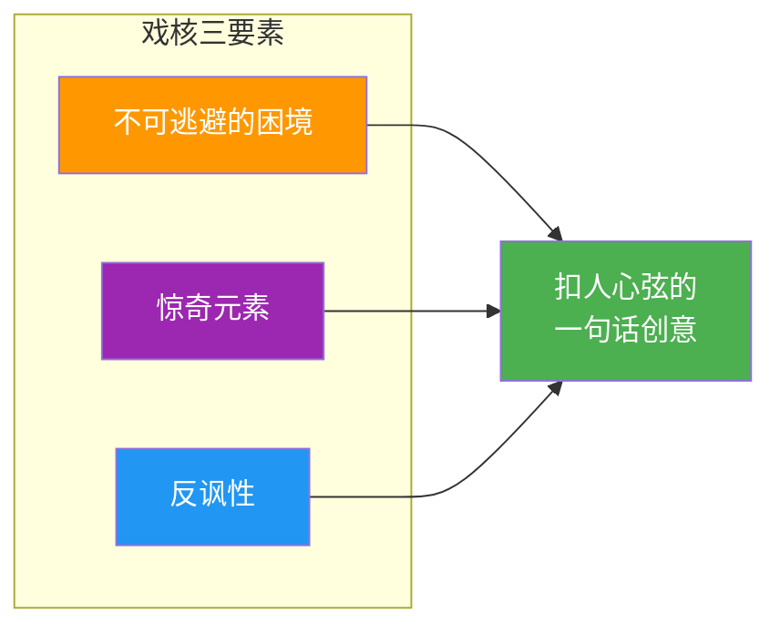

# 第01课：戏核——好的创意一句话就能说清

## 一、什么是戏核？

**戏核**（Logline / 核心创意）的定义：

> 戏核 = **一句话**概括剧本的核心创意。

> [!NOTE]
> 如果**一句话说不清你的剧本讲什么**——说明你自己都没想清楚。

**经典戏核案例：**

| 作品 | 戏核 |
|------|------|
| 《权力的游戏》 | 一片大陆上，几个大家族从争夺铁王座到联合对抗异鬼 |
| 《金刚》 | 巨型猿猴爱上女人，为救她来到纽约献出生命 |
| 《肖申克的救赎》 | 一个被冤入狱的银行家用二十年挖通隧道重获自由 |
| 《泰坦尼克号》 | 富家女与穷画家在沉船上的跨阶级爱情 |
| 《侏罗纪公园》 | 科学家用恐龙DNA复活史前生物，公园失控 |

> [!TIP] 判断标准
> 你的戏核往外一说，如果对方反应是**"然后呢？"** ——说明吸引力不够。
> 如果对方反应是**"哇，这个有意思！"** ——成了。

---

## 二、戏核三要素

一个好的戏核包含三个要素，缺一不可。

---

### 要素一：不可逃避的困境

> 主角面对一个绕不过去的困境——**不努力就会失去至关重要的东西**。

**案例：《肖申克的救赎》**

> 银行家安迪被冤入狱，**如果不逃出去，他将在监狱度过余生**——这不是选择题，这是**生存题**。

**困境的三个层次：**

| 层次 | 含义 | 例子 |
|------|------|------|
| 物理困境 | 生死攸关、无法脱身 | 监狱、荒岛、追杀 |
| 心理困境 | 内心的冲突与挣扎 | 道德两难、身份危机 |
| 关系困境 | 人际关系破裂的威胁 | 家庭破裂、信任崩塌 |

> 困境越残酷，观众越紧张，主角的胜利越令人振奋。

---

### 要素二：惊奇元素

> 新奇、不寻常、让人拍大腿——**"我怎么没想到！"**

**案例：《黑袍纠察队》（The Boys）**

> 传统超级英雄故事都是"正义超人拯救世界"——但《黑袍纠察队》颠覆了这个框架：
> **如果超级英雄全是道德败坏的、被大公司包装的、滥用权力的混蛋呢？**

这个**反超级英雄视角**就是最大的惊奇元素——它把一个老掉牙的类型玩出了全新的味道。

> [!WARNING]
> 惊奇元素 ≠ 无脑噱头。它必须服务于故事的**真实性与逻辑**，而不是为了奇怪而奇怪。

---

### 要素三：反讽性

> 两个**矛盾对抗的元素**被组合在一起，产生化学反应。

**案例：《绝命毒师》（Breaking Bad）**

> | 元素 A | 元素 B | 反讽效果 |
> |--------|--------|----------|
> | 老实巴交的化学老师 | 制毒贩毒的大毒枭 | **越老实→越讽刺** |

**更多反讽案例：**

| 作品 | 矛盾元素 | 反讽公式 |
|------|----------|----------|
| 《这个杀手不太冷》 | 冷血杀手 + 保护邻家小女孩 | 杀手身份 vs 守护者本能 |
| 《穿普拉达的女王》 | 朴实文艺女 + 时尚杂志巨头 | 价值观 vs 职场生存 |
| 《疯狂动物城》 | 偏见、食肉 vs 食草的动物城 | 乌托邦表象 vs 现实歧视 |

> [!TIP]
> 反讽性 = **"意料之外，情理之中"**。两个矛盾元素碰撞，讲出来既惊奇又有说服力。

---

## 三、练习：从普通到反讽

**普通戏核**（只有困境，没有反讽）：

> 六个退休老人（六个大爷）一起去完成遗愿清单。

→ 这听起来就像一部普通的温情剧。

**加上反讽：**

点击查看参考答案

| 改造方向 | 新戏核 |
|----------|--------|
| 🎯 **去高考** | 六个退休大爷一起报名参加高考 |
| 🎸 **组摇滚乐队** | 六个退休大爷一起组了个摇滚乐队 |
| ✈️ **执行飞行任务** | 六个退休大爷受命执行最后一次秘密飞行任务 |
| 💃 **参加选秀** | 六个退休大爷组团去参加街舞选秀 |

> [!NOTE]
> 反讽的作用：**让一个平淡的故事产生"会心一笑"的张力**。

---

## 四、戏核的作用总结

1.  **厘清思路**——一句话说不清，说明核心没想透。
2.  **吸引投资/观众**——制片人/读者没耐心看完整剧本，戏核决定第一印象。
3.  **创作指南针**——写偏了，回来看看戏核，你知道自己要讲什么。

---

## 五、课后思考

1.  **拆解练习**：选三部你最喜欢的电影，用**一句话**写出它们的戏核。然后检查：三要素齐了吗？
2.  **反讽改造**：取一个普通故事（如"一个医生救死扶伤"），给它加上一层反讽（医生本身是……？），看看能变出什么新故事。
3.  **惊奇实验**：选一个老套的类型片（如"校园恋爱"），加入一个"惊奇元素"颠覆它——你的新戏核是什么？

---

*上一课：[[0000-神作与口水剧|第00课：神作与口水剧]]*
*参考文档：[[编剧术语表]] | [[编剧工具箱]]*