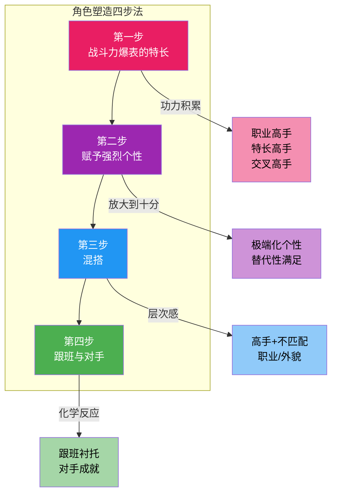

# 第02课：角色塑造四步法

> 观众忘掉剧情，但不会忘掉角色。

这四步法来自好莱坞编剧工业的成熟方法论，帮你从零到一打造**让观众过目不忘**的角色。

---

## 第一步：战斗力爆表的特长

让角色成为**某领域的顶尖高手**。

> 观众最爱看的，就是**看一个高手做他擅长的事**。

**四大类型：**

| 类型 | 说明 | 案例 |
|------|------|------|
| 职业高手 | 在正儿八经的职业里做到顶尖 | 《肖申克的救赎》金融才俊安迪、《硅谷》数据压缩大神理查德 |
| 特长高手 | 在特殊/小众领域里出类拔萃 | 《天才枪手》作弊高手、《琅琊榜》谋略高手梅长苏 |
| 交叉领域高手 | A + B 两个领域都很强，这样的人现实中极少 | 会黑客技术的 FBI 探员、会格斗的医生 |
| 隐藏特长 | 看似普通人，但在某个方面是高手 | 《甄嬛传》甄嬛 = 人际关系高手 |

> [!NOTE]
> **普通人也有隐藏特长**——这个设定让观众产生"我也可以"的代入感。

**为什么一定要"高手"？**

> 因为观众在现实中大多是普通人，看剧是为了一种**替代性满足**——想象自己也能开挂。

---

## 第二步：赋予强烈个性

> 个性五分 → 做到**十分**。

**核心逻辑：**

1.  **极端化** → 强烈的**记忆点**（让人想起这个角色就记住那个特质）
2.  **替代性满足** → 观众不敢做的事，角色替他们做了

**放大技巧对比：**

| 原始设定（五分） | 放大到十分后的效果 |
|-----------------|-------------------|
| 性格内向 | 有社交恐惧症，和人说话会发抖 |
| 脾气暴躁 | 一言不合就砸东西，全警局没人敢惹 |
| 完美主义 | 连床单折角都要量角度，偏执到病态 |
| 爱开玩笑 | 葬礼上也在讲段子，完全不分场合 |

> [!TIP]
> 想想你身边最有特点的人——把他的个性**再放大一倍**，就是你的角色。

---

## 第三步：混搭

> 高手 + 不匹配的职业 / 外貌 / 身份 = 让人眼前一亮。

**经典例子：**

| 角色 | 高手身份 | 不匹配的包装 | 混搭效果 |
|------|----------|-------------|----------|
| 扫地僧 | 绝世武功 | 扫地老僧 | **"最不起眼的人最厉害"** |
| 炸鸡叔（《绝命毒师》） | 大毒枭 | 温文尔雅的炸鸡店老板 | **"微笑背后的寒意"** |
| 《这个杀手不太冷》里昂 | 顶级杀手 | 不善言辞、养盆栽的怪人 | **"冷酷外表下的柔软"** |
| 《神探夏洛克》福尔摩斯 | 天才侦探 | 社交白痴、吸毒者 | **"天才与疯子的边界"** |

> [!WARNING]
> 混搭不是乱搭。两个身份之间要有**内在联系**或**强烈对比**，不是为了奇怪而奇怪。

**混搭的作用：**

1.  **增强层次感**——角色不再单调，每个场景都有多面性。
2.  **暴露弱点**——不匹配的身份天然会产生弱点（如炸鸡叔不能报警、扫地僧不能暴露武功）。
3.  **制造惊喜**——观众永远猜不到角色的下一步。

---

## 第四步：找跟班和对手

> 角色不是孤岛——有了**跟班**和**对手**，角色才立体。

### 跟班（Sidekick）

| 功能 | 要求 | 经典组合 |
|------|------|----------|
| **笨拙朴实**→衬托主角聪明 | 比主角弱，但不是废物 | 福尔摩斯 + **华生** |
| **情感锚点**→让主角有人情味 | 跟主角有真实的情感纽带 | 哈利·波特 + **罗恩 & 赫敏** |
| **吐槽役**→替观众说出心声 | 偶尔比主角清醒 | 唐顿庄园小姐 + 女仆 |

> 跟班的存在意义：**让主角看起来更厉害**，同时**让观众有代入入口**。

### 对手（Antagonist）

| 原则 | 说明 | 案例 |
|------|------|------|
| **尽可能优秀** | 对手越强，战胜他越爽 | 《蝙蝠侠》的小丑——智商碾压所有人 |
| **高智商** | 不是靠蛮力，是靠计谋 | 《纸牌屋》弗兰克·安德伍德 |
| **要有"正当理由"** | 对手不觉得自己是坏人 | 《绝命毒师》古斯——他只是在经营自己的帝国 |

> [!NOTE]
> 对手的价值：**对手的水平决定了主角的高度**。一个low逼对手只会拉低主角的档次。
> （参考[[0000-神作与口水剧|第00课：神作与口水剧]]——反派人性的光辉）

---

## 四步法完整案例拆解

以**《绝命毒师》的沃尔特·怀特**为例：

| 步骤 | 怀特的设定 |
|------|-----------|
| 特长 | 全球顶尖化学家，制毒纯度 99.1%——没有第二个人能做到 |
| 个性 | 极度自尊膨胀 + 控制欲爆棚（"我才是危险人物"——放大到十分） |
| 混搭 | 温和胆怯的化学老师 / 癌症晚期患者 × 冷酷无情的海森堡 |
| 对手 | 跟班 小粉（笨拙的小毒贩，烘托老白的智商） 对手 古斯·弗林（冷静、高效、残忍——配得上老白的对手） |

---

## 课后思考

1.  **特长诊断**：你最喜欢的角色是什么高手？把他归到上面四大类型中的哪一类？
2.  **放大实验**：选一个你认识的人（或你自己），把他的个性放**大到十分**，写一段100字的角色小传。
3.  **混搭练习**：取一个常见职业（如律师、老师、医生），给它配一个不匹配的身份（如杀手、小偷、外星人），写一句角色介绍。
4.  **对手设计**：为你的主角设计一个对手。为什么这个对手是最"配得上"主角的？

---

*上一课：[[0001-戏核|第01课：戏核——好的创意一句话就能说清]]*
*参考文档：[[编剧术语表]] | [[编剧工具箱]]*