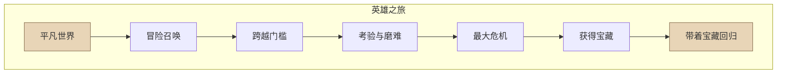

# 第03课：结构——三幕剧

## 为什么要重视结构

[[0000-神作与口水剧|第00课：神作与口水剧]] 中提到，好故事和差故事的差距往往不在素材，而在结构。剧本结构就像一根线，把散落的珍珠串起来。没有这根线，再精彩的桥段也只是各自发光，无法形成整体的力量。

## 三幕剧概述

三幕剧是好莱坞主流的剧本结构方法，也是被验证过最有效的叙事框架。

| 幕 | 篇幅占比 | 核心任务 |
|---|---|---|
| 第一幕 | ~25% | 提出问题 |
| 第二幕 | ~50% | 尝试解决问题 |
| 第三幕 | ~25% | 真正解决问题 |

## 第一幕三件事

> [!tip] 第一幕的本质
> 第一幕就是把主角从"舒适区"推出去，让他不得不面对挑战。

1. **展现模式** —— 展示主角的日常状态。比如渔夫每天出海捕鱼，生活平静而有规律。
2. **打破模式** —— 意外事件打破日常。魔鬼抓走渔夫的妻儿，他不得不踏上冒险之路。
3. **给出行动理由** —— 揭示主角的内在冲突和心魔，让观众理解他为什么必须行动。

## 第二幕：虐待才智

> [!danger] 好编剧都是虐待狂
> 第二幕的核心是不断设置障碍，把主角逼到墙角。越是让主角走投无路，观众越是投入。
>
> 案例：[[0001-戏核|第01课：戏核]] 中提到的《绝命毒师》编剧，经常把主角老白逼入连自己都想不到解法的绝境，然后再想办法让他脱困。

**恐惧清单法**：把主角最害怕的事情列出来，然后——让它们全部发生。这就是第二幕的创作密码。

## 第三幕两件事

1. **设置反转** —— 需要一个超大的反转把主角从绝境中救出来。这个反转要既出乎意料又在情理之中。
2. **让观众满意** —— 根据**峰终定律**，结局对整体观感的影响最大。结尾好，观众就会觉得整部剧好。

## 英雄之旅

三幕剧的底层是"英雄之旅"概念：主人公就是英雄，他要做出常人做不到的事。这个旅程不仅是外在冒险，更是内心成长。

## 思考题

> [!question] 课后练习
> 1. 选一部你喜欢的电影，用三幕结构拆解它的剧情。每幕的关键事件是什么？
> 2. 试想你正在构思的故事，为主角列一份"恐惧清单"。第二幕中，你会让哪些恐惧成真？
> 3. 参照 [[编剧术语表]] 中的相关概念，检查你的故事是否具备完整的"英雄之旅"弧线。

---

*相关课程：[[0000-神作与口水剧|第00课：神作与口水剧]] · [[0001-戏核|第01课：戏核]] · [[0004-情节-既合理又惊奇|第04课：情节——既合理又惊奇]]*
*参考文档：[[编剧术语表]] · [[编剧工具箱]]*