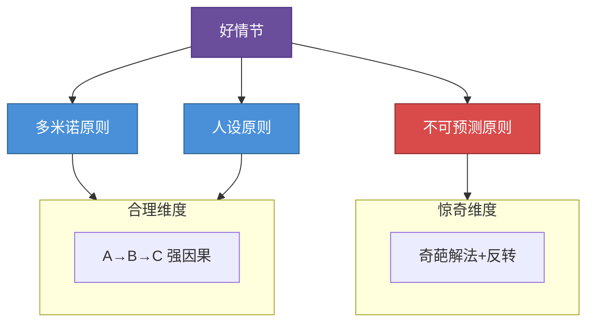

# 第04课：情节——既合理又惊奇

## 好剧情的两个标准

好剧情需要同时满足两个看似矛盾的标准：**合理性** 和 **惊奇感**。观众要觉得"原来如此"（合理），又要觉得"竟然如此"（惊奇）。

[[0003-结构-三幕剧|第03课：结构——三幕剧]] 提供了骨架，而情节则是血肉。没有好的情节，再完美的结构也只是空壳。

## 三大原则

### 1. 多米诺原则（合理）

剧情要像多米诺骨牌一样，A推倒B，B推倒C，形成强烈的因果逻辑。观众能清晰地看到"因为这样，所以那样"的链条。

**七句话模板** —— 用七句话检验你的故事逻辑：

| 步骤 | 句式 | 说明 |
|---|---|---|
| 1 | 很久很久以前... | 设定世界观和主人公 |
| 2 | 直到有一天... | 激励事件发生 |
| 3 | 因为A所以B... | 因果链条开始 |
| 4 | 因为B所以C... | 因果持续推进 |
| 5 | 因为C所以D... | 因果层层递进 |
| 6 | 因为D所以E... | 到达高潮前夜 |
| 7 | 最后... | 结局 |

**《泰坦尼克号》七句话示范**：

> 1. 很久很久以前，一个穷画家杰克在码头赌赢了两张船票。
> 2. 直到有一天，他在泰坦尼克号上遇到了贵族女孩罗丝。
> 3. 因为杰克爱上罗丝，所以他带她体验了下层阶级的自由快乐。
> 4. 因为罗丝被杰克打动，所以她决定放弃未婚夫跟杰克在一起。
> 5. 因为泰坦尼克号撞上冰山，所以船正在下沉。
> 6. 因为杰克为了救罗丝留在冰冷的海水中，所以他把生的希望留给了她。
> 7. 最后，罗丝获救，带着对杰克的记忆活完了精彩的一生。

> [!warning] 反例：《夺宝奇兵》
> 印第安纳·琼斯遇到纳粹追捕，纳粹被机关杀死 —— 但是纳粹的死跟主角的行为没有因果关系。这不符合多米诺原则，观众会觉得"太巧了"。

### 2. 人设原则（合理）

**性格决定命运**。情节的发展必须符合角色的人设。一个胆小如鼠的人突然英勇赴死，观众不会感动，只会觉得假。

> [!example] 《越狱》
> 约翰·阿布鲁齐是个有仇必报的黑帮老大。越狱后明明可以远走高飞，但他选择回去复仇——结果被杀。观众虽然惋惜，但觉得"这就是约翰会做的事"。

情节要服务人设，人设要支撑情节。二者不可偏废。相关概念见 [[编剧工具箱]]。

### 3. 不可预测原则（惊奇）

观众能猜到下一步的剧情是最糟糕的体验。怎么制造惊奇？

**提供奇葩的解决方案**：当观众以为主角只能这样了，给他一个意想不到的出路。

> [!tip] 《致命魔术》
> 两个魔术师互相斗法，观众以为主角会靠技巧取胜。结果他用了特斯拉的克隆机器——每次表演都亲手杀死一个自己的复制品。这个解法如此疯狂又如此合理。

**反转两大类型**：

| 类型 | 公式 | 案例 |
|---|---|---|
| 类型一：身世反转 | 你以为的A其实是B | 你以为的亲生父亲其实是仇人 |
| 类型二：前提反转 | 你以为的前提根本不存在 | [[0001-戏核|第01课：戏核]] 中《第六感》——你以为医生在治疗男孩，其实医生已死 |

> [!question] 反转的边界
> 反转要既意外又合理。纯粹为了反转而反转会让观众觉得被愚弄。好的反转让观众回头想时恍然大悟："原来前面都是伏笔！"

## 思考题

> [!question] 课后练习
> 1. 用"七句话模板"拆解一部你喜欢的电影或剧集，检查它的因果链条是否完整。
> 2. 你故事的主角遇到了一个困境。请列出三种不同的解决方案——其中至少一种要足够"奇葩"但又符合人设。
> 3. 对比 [[0000-神作与口水剧|第00课：神作与口水剧]] 中提到的案例，分析它们的剧情分别在"合理"和"惊奇"两个维度上做得如何。

---

*相关课程：[[0000-神作与口水剧|第00课：神作与口水剧]] · [[0001-戏核|第01课：戏核]] · [[0003-结构-三幕剧|第03课：结构——三幕剧]] · [[0005-共情-让观众代入|第05课：共情——让观众代入]]*
*参考文档：[[编剧术语表]] · [[编剧工具箱]]*