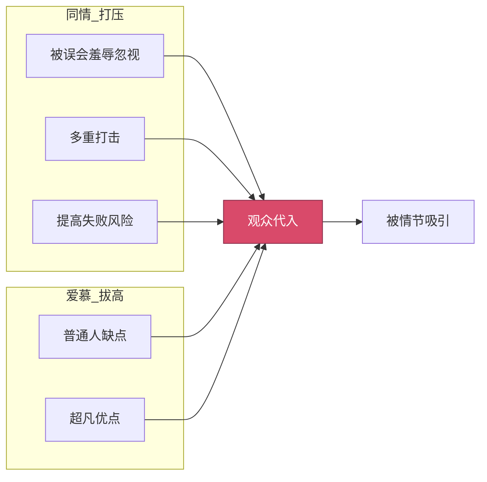

# 第05课：共情——让观众代入

## 共情是入场的门票

没有共情，观众就只是旁观者。他们不在乎主角是死是活，也不会为故事中的悲欢离合而动容。有了共情，观众才会代入主角，和他一起哭一起笑。

共情的两把钥匙：**同情** 与 **爱慕**。

> [!quote] 共情的本质
> 同情让观众说"他好惨"，爱慕让观众说"他好棒"。一把钥匙推，一把钥匙拉，两把合力才能让观众完全代入主角。

## 同情：打压主角

越打压主角，观众越同情。这是一个看似反直觉但极其有效的技巧。

### 三招打压术

| 招数 | 方法 | 案例 |
|---|---|---|
| **被误会/羞辱/忽视** | 让主角受到不公正对待 | [[0001-戏核|第01课：戏核]] 中提到《喜剧之王》——周星驰饰演的尹天仇想当演员，却被吴孟达饰演的场务刁难，连盒饭都不给 |
| **多重打击** | 打掉帮手、渲染敌人、诅咒命运 | 孤儿设定（没有后援）、敌人异常强大（《杀死比尔》新娘 vs 整个杀手组织）、命运不公（《绝命毒师》老白患癌+朋友背叛+妻子出轨） |
| **提高失败风险** | 失败的成本越高，观众越关心 | 《拯救大兵瑞恩》中每个士兵都是血肉之躯，牺牲就是真的死亡 → 观众揪心；《复仇者联盟》中超级英雄即使被揍也知道死不了 → 观众放松 |

> [!danger] 残酷公式
> 主角越惨 → 观众越同情 → 情绪卷入越深 → 观影体验越好

## 爱慕：拔高主角

纯粹被打压的主角只会让人可怜，不会让人崇拜。观众还需要一个仰望的理由。

### 高一厘米原则

主角应该是"大多数普通人的缺点 + 一两个超凡的优点"。他比观众**高一厘米**，而不是高一个珠峰。

| 角色 | 普通缺点 | 超凡优点 | 高一厘米在哪 |
|---|---|---|---|
| 千颂伊（《来自星星的你》） | 懒惰、强势、爱面子 | 超高的颜值和天赋 | 颜值高一厘米 |
| 韦小宝 | 好色、贪财、滑头 | 关键时刻讲义气 | 智商高一厘米 |
| 至尊宝（《大话西游》） | 懦弱、逃避、市井气 | 为爱牺牲的勇气 | 勇气高一厘米 |
| 蜘蛛侠 | 穷、挫、被欺负的高中生 | 被蜘蛛咬后的超能力 | 运气高一厘米 |

> [!warning] 反例：都教授（《来自星星的你》）
> 都教授什么都完美：颜值高、超能力、学识渊博、道德高尚、还很深情。男性观众看完只觉得"这怎么可能"——无法共情。一个没有缺点的角色，就是没有灵魂的角色。

### 同情 vs 爱慕 对比

| 维度 | 同情 | 爱慕 |
|---|---|---|
| 方向 | 打压主角 | 拔高主角 |
| 心理机制 | 让观众心疼 | 让观众崇拜 |
| 距离感 | 近（"他和我一样惨"） | 远（"他比我好一点"） |
| 效果 | 产生保护欲 | 产生向往感 |
| 过犹不及 | 打压过头 → 丧气 | 拔高过头 → 假大空 |

[[0000-神作与口水剧|第00课：神作与口水剧]] 中提到的神作，无一不是在同情和爱慕之间找到了完美的平衡点。

## 思考题

> [!question] 课后练习
> 1. 选一个你喜欢的影视角色，分别列出他是如何被"同情"和"爱慕"的。
> 2. 设计一个主角初稿：先写出他的三个普通人缺点，再加一两个超凡优点。确保他"高一厘米"即可，别写成超人。
> 3. 用 [[编剧工具箱]] 中的人物塑造工具检验你设计的主角，看看他是否缺少"同情"或"爱慕"的要素。

---

*相关课程：[[0000-神作与口水剧|第00课：神作与口水剧]] · [[0001-戏核|第01课：戏核]] · [[0003-结构-三幕剧|第03课：结构——三幕剧]] · [[0004-情节-既合理又惊奇|第04课：情节——既合理又惊奇]]*
*参考文档：[[编剧术语表]] · [[编剧工具箱]]*