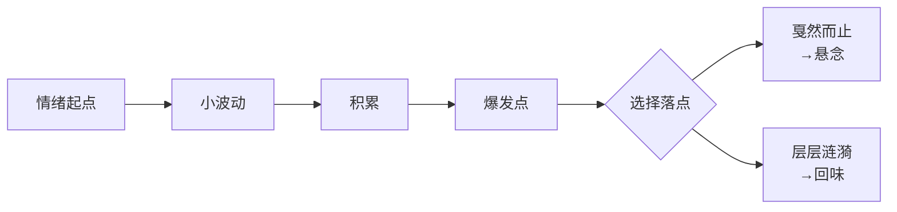

# 第06课：场景、节拍与紧张感

## 节拍（Beat）回顾

> **节拍**是剧本的最小叙事单位。主角克服障碍的**每一次尝试**，就是一个节拍。

在 [[0005-共情-让观众代入|第05课：共情——让观众代入]] 中我们已经学习了节拍的基本概念。本节课将深入探讨：如何让每一个节拍都充满**紧张感**。

让剧情紧张刺激，有三个核心方法：

---

## 方法一：增加障碍

> [!important] 核心原理
> **障碍越多 → 克服行动越多 → 信息量越大 → 戏越好看**

障碍不是用来难倒主角的，而是用来**释放信息量**的。每克服一个障碍，观众就对角色和世界多一分了解。

### 案例：《甄嬛传》"滴血认亲"

这场戏长达 **12 分钟**，全程无尿点。甄嬛要面对的障碍接近 10 个：

| 序号 | 障碍来源 | 具体攻击 | 甄嬛对策 |
|:---:|:---------|:---------|:---------|
| 1 | 齐妃 | 发难指控 | 镇定应对 |
| 2 | 皇后 | 帮腔施压 | 以退为进 |
| 3 | 众人 | 发毒誓验证 | 顺势而为 |
| 4 | 第三方 | 证人出场作证 | 质疑证词 |
| 5 | 佣人 | 提亲往事 | 巧妙解释 |
| 6 | 皇帝 | 当面质问 | 委屈示弱 |
| 7 | 皇后 | 提议滴血认亲 | 被迫接招 |
| 8 | 水碗 | 血滴融合 | 发现被陷害 |
| 9 | 皇帝 | 盛怒动手 | 绝地反击 |

> [!tip] 障碍来源要多样化
> 障碍可以来自三个方面：
> 1. **对手**——外部人物制造的阻力
> 2. **环境**——客观条件限制（时间、空间、资源）
> 3. **主角内心**——自我怀疑、恐惧、道德困境
>
> 案例：《完美陌生人》 中的手机游戏——一个"公开手机信息"的提议，让每个人的内心秘密成为最大的障碍。

---

## 方法二：增加策略

> [!important] 核心原理
> 即使只有一个障碍，也要把**单回合战斗**变成**多回合交锋**。

### 案例：说服宿管阿姨

当只有一个障碍（宿管阿姨不让进门）时，主角可以不断切换策略：

```
利诱 → 威逼 → 恐吓 → 动武 → 服软 → 吹捧
```

每一次**变招**都在切换行为模式，带来**新鲜感**，从而拉快节奏。

> [!note] 策略切换的要点
> - 不要重复同一套话术——观众会疲劳
> - 每次变招要**反差足够大**（从强硬到服软，从理性到感性）
> - 策略切换要符合人物性格和处境

---

## 方法三：梳理情绪线

> [!important] 核心原理
> 写出**每个节拍中的情绪转折**，让观众的心跟着角色一起起伏。

### 案例：讨薪场景的情绪线

同一场景，不同写法产生完全不同的情绪曲线：

**版本一（硬汉路线）：**
```
焦躁 → 胆怯 → 紧张 → 愤怒 → 狂暴
```

**版本二（隐忍路线）：**
```
低声下气 → 屈辱 → 压抑 → 冲动 → 出手 → 害怕
```

### 找准情绪落点

> [!question] 什么时候戛然而止？什么时候写层层涟漪？

- **戛然而止**：在情绪最高点时打断——制造悬念，迫使观众等待下一集
- **层层涟漪**：在爆发后继续描摹余波——让观众品味情绪的余韵

> 案例：谍战剧中，主角不得已打死女朋友后，**静静站立十几秒**。没有台词，没有动作，只有镜头凝固在主角脸上——此时无声胜有声。



---

## 总结

紧张刺激的公式：

> [!abstract] 紧张刺激 = 障碍数 × 策略数 × 情绪转折深度

- **增加障碍**：让主角面对更多挑战，释放更多信息
- **增加策略**：每个障碍都用多回合交锋来应对
- **梳理情绪线**：让每一次攻防都带有情绪的起伏

三者相乘，而非相加——任何一个维度为零，紧张感都会归零。

下一课我们将探讨如何写好 [[0007-台词-潜台词与金句|台词、潜台词与金句]]。

---

> **本课笔记基于《跟着李新学编剧》课程整理**。