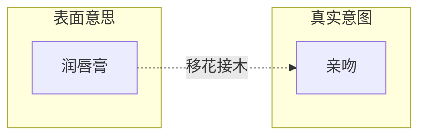
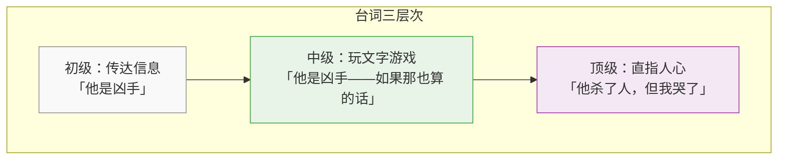

# 第07课：台词、潜台词与金句

> 好的台词让角色活起来，烂的台词让观众出戏。

### 好台词 vs 烂台词

《笑傲江湖》中岳不群挑战左冷禅，两个版本高下立判：

| 对比 | 烂台词版本 | 好台词版本 |
|:----:|:-----------|:-----------|
| 内容 | 直接说出内心想法："我要当五岳剑派掌门" | 通过行动和暗示表达意图 |
| 效果 | 观众觉得假、生硬、说教 | 观众需要思考、品读、回味 |
| 问题 | 信息直给，侮辱观众智商 | 留有空白，激发参与感 |

> [!tip] 黄金法则
> 不要把台词当**说明书**——让观众自己去发现，而不是被直接告知。

---

## 方法一：利用潜台词

> [!important] 核心原理
> 潜台词的本质是：**给真实意图加密，让观众解码**。

潜台词→观众解码→获得成就感→参与感增强→沉浸体验

### 案例：《甄嬛传》

皇后想拉拢甄嬛，没有直说，而是说：

> "香炉里的死灰又复燃了……"

翻译成大白话："你选择我是明智的。"但这么说就毫无趣味了。

潜台词的**三招**：

### 第一招：话只说一半

把另一半留给观众**脑补**。

> 案例：电影《夜长梦多》
>
> **角色 A：**"你介不介意……"
> **角色 B：**"白天还是晚上？"

对话戛然而止，观众自动补全了省略的内容——这种参与感远比直说更强烈。

### 第二招：移花接木

用**比喻、类比**置换真实意图。

> 案例：《喜剧之王》
>
> 尹天仇对柳飘飘说："要不要……**润唇膏**？"
>
> ——"润唇膏" 暗示 "亲吻"，既含蓄又有画面感。



### 第三招：木马计

> 主要信息伴随**干扰信息**一起传递——让对方在不知不觉中接收到你的真实意图。

**案例：**
> "最近看的那个房子真贵，**首付都够我买半辆车了**。"

- 表面意思：抱怨房价
- 干扰信息：我买得起车
- 真实意图：**炫耀财富**

> [!warning] 潜台词的度
> 潜台词太直白→没意思
> 潜台词太隐晦→观众看不懂
> 好的潜台词：**让观众刚好能解码，只需再想一步**

---

## 方法二：用金句打动人心

### 经典金句

| 作品 | 金句 |
|:----|:-----|
| 《阿甘正传》 | "生活就像一盒巧克力，你永远不知道下一颗是什么味道。" |
| 《纸牌屋》 | "权力就像房地产，位置就是一切。" |
| 《教父》 | "永远不要让别人知道你的想法。" |

### 金句改写公式

> [!abstract] 金句公式
> **"生活/XX 就像 [比喻物 A]，你永远不知道 / 关键在于 [反转 B]"**

**公式拆解：**
1. 选取一个**熟悉的事物**作为比喻物
2. 加入一个**意外的转折**
3. 让转折**揭示深层道理**

### 练习示例

```
生活就像节假日的高速公路——
你永远不知道下一个出口要堵多久。

生活就像一面镜子——
你对它笑，它不一定对你笑，
但你对它哭，它一定对你哭。
```

> [!tip] 金句创作要点
> - 比喻物要**具体、熟悉**（巧克力、房地产、镜子）
> - 转折要**意外但合理**
> - 道理要**普世但不说教**

---

## 方法三：建立角色间的连接

> [!important] 核心原理
> **对话既要传达信息，更要传达关系。**

### 案例对比：刑侦剧领导到现场

**干巴巴版（只传达信息）：**
> **警员：**"局长，现场已经封锁，死者是男性，35 岁，初步判断死亡时间在凌晨 2 点。"
> **局长：**"好，继续调查。"

**带态度版（传达关系）：**
> **警员：**"哟，您老人家亲自来了？不会又是哪个领导打电话了吧？"
> **局长：**"少贫嘴。现场什么情况？"
> **警员：**"和上个月那个案子一模一样——您猜怎么着？"

第二种写法不仅传递了信息，还传递了：两人关系熟络、上个月有过类似案件、警员的性格特点等**多层次信息**。

### 台词的三层次



- **初级**：能把事情说清楚——及格
- **中级**：能在字面上玩技巧——良好
- **顶级**：能一句话击中观众内心——优秀

---

## 总结

| 方法 | 核心 | 目标 |
|:----|:-----|:-----|
| 潜台词 | 加密信息，让观众解码 | 激发参与感 |
| 金句 | 比喻 + 意外转折 | 打动人心 |
| 连接 | 对话传达关系 | 塑造角色 |

> [!abstract] 台词的本质
> 台词不是作者在说话，而是**角色在行动**。每一句台词，都是角色为了实现自己的目的而采取的**语言行动**。

下一课我们将学习 [[0008-悬念-控制信息的艺术|悬念：控制信息的艺术]]。

---

> **本课笔记基于《跟着李新学编剧》课程整理**。