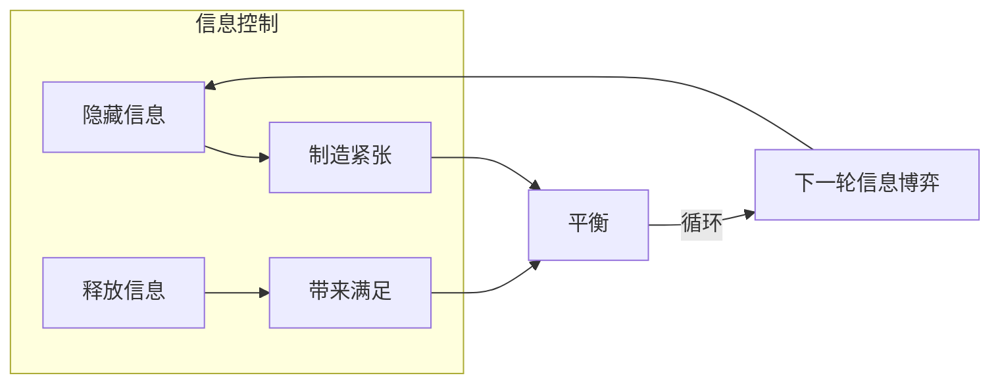
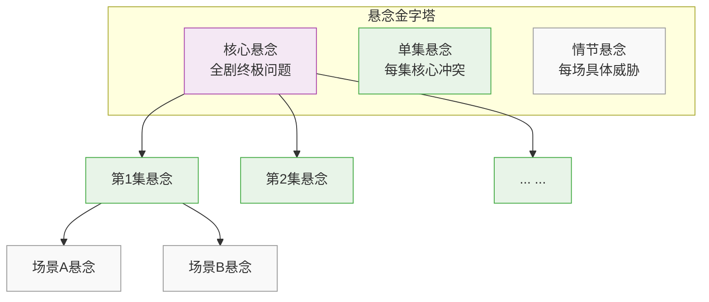
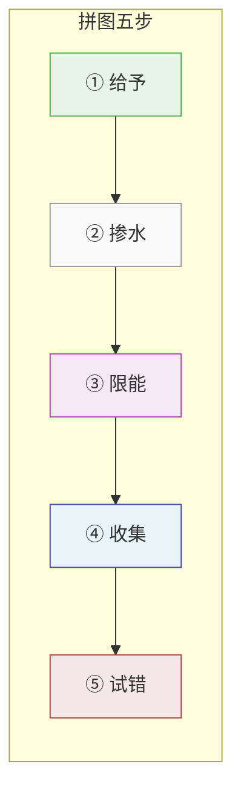

# 第08课：悬念——控制信息的艺术

> [!important] 核心定义
> **悬念**的本质是：**控制信息披露的技巧**。
>
> 不是"藏着不说"，而是"在正确的时间说正确的话"。

观众不知道全部信息 → 产生好奇 → 渴望知道 → 欲罢不能。

---

## 方法一：拆分问题

> [!important] 核心原理
> 把一个巨大的悬念，拆成**层层递进**的小悬念。

### 悬念分级结构

| 层级 | 名称 | 范围 | 案例：《甄嬛传》 |
|:----:|:-----|:-----|:-----------------|
| 1 | **核心悬念** | 贯穿全剧 | 甄嬛能不能在后宫生存下去？ |
| 2 | **单集悬念** | 一集之内 | 能顺利进宫吗？能遇到皇上吗？能得到宠幸吗？ |
| 3 | **情节悬念** | 一个场景/段落 | 产后宫殿失火——能逃出去吗？能查出谁放火吗？皇上会主持公道吗？ |

> [!tip] 拆分的意义
> - 核心悬念负责**留住观众**（追完整部剧）
> - 单集悬念负责**每天追更**（看完想接着看）
> - 情节悬念负责**不换台**（广告期间不离开）
>
> 三级悬念必须同时工作。

---

## 方法二：悬崖抓手（Cliffhanger）

> [!important] 核心原理
> 在**关键时刻戛然而止**——把主角逼到绝路，截断所有出路。

### 经典案例

| 案例 | 手法 | 效果 |
|:----|:-----|:-----|
| 《一千零一夜》 | 每夜故事讲到高潮天就亮了 | 国王不得不留她性命听下一夜 |
| 斩首前插广告 | 刽子手举刀→切广告 | 观众必须看完广告 |
| 警探看到照片 | 神情大变→切场景 | 观众抓狂想知道看到了什么 |

> [!note] 悬崖抓手不一定是生死关头
> 也可以是：
> - 一个令人震惊的**线索**（警探看到旧照片神情大变）
> - 一个**身份揭示**（"他就是那个……"）
> - 一个**意外的决定**（"我退出。"）

### 编剧的关键任务

> [!warning] 关键
> 编剧在制造悬崖之前，必须**已经想好了解决困境的方法**。
>
> - 不提前埋线 → 后续救场显得生硬、开挂
> - 提前埋线 → 观众回想时会觉得"原来如此"——获得双倍满足感

---

## 方法三：拼图游戏

悬念不是一直捂着不说，而是让观众像玩拼图一样**一块一块地拼出真相**。

### 五步法

### 第一步：给予

> 先透露**一大块信息**，让观众有个大致方向。

**案例**：先描述"独角兽"——给出一条后腿的信息。观众知道大概是什么东西，但看不清全貌。

> 避免"不知所云"——观众如果完全不知道在讲什么，就会失去耐心。

### 第二步：掺水

> 掺杂**误导信息**，让观众误入歧途。

**案例**：在独角兽的拼图中混入河马的拼图块。

> 观众以为自己在接近真相，实际上走错了方向——等到真相揭晓时才会有"原来如此！"的惊喜感。

### 第三步：限能

> **不让任何一个角色知道全貌**。

**案例**：盲人摸象——每个角色只摸到一部分。

> - 角色 A 知道动机
> - 角色 B 掌握不在场证明
> - 角色 C 发现关键物证
>
> → 主角必须不断切换视角，从不同角色那里获取碎片。

### 第四步：收集

> 主角与各配角互动，**一块一块收集碎片**。

- 每收集一块，观众离真相近一步
- 每一块碎片都必须通过**克服障碍**才能获得
- 碎片之间有**间隙**——观众会自己脑补连接

### 第五步：试错

> 先得出**几个错误结论**，再逼近真相。

**案例：侦探剧三段式**
1. 第一轮推理："凶手是管家！"（错误）
2. 第二轮推理："不对，是律师！"（错误但接近）
3. 真相大白："凶手是死者的双胞胎兄弟！"（震惊但合理）

> [!tip] 试错的心理机制
> 观众猜测→被推翻→重新猜测→再次被推翻→最终揭晓
>
> 这个过程本身就在**放大最终的满足感**。每一次错误推测都像弹簧被压紧，最终的真相就是弹簧弹开的瞬间。

---

## 总结

| 方法 | 核心操作 | 作用 |
|:----|:---------|:-----|
| **拆分问题** | 核心→单集→情节三级悬念 | 不同层面持续抓住观众 |
| **悬崖抓手** | 关键时刻戛然而止 | 迫使观众等待/回来 |
| **拼图游戏** | 给予→掺水→限能→收集→试错 | 让观众主动参与推理 |

> [!abstract] 悬念的本质
> 悬念不是"欺骗"观众，而是**邀请**观众参与一场解谜游戏。
>
> 你给的信息越多（而不是越少），悬念越强——关键在于**给什么、什么时候给、以什么方式给**。

---

> [!question] 延伸思考
> 回顾 [[0006-场景-节拍与紧张感|第06课]] 中的"戛然而止"，它与 Cliffhanger 有什么联系和区别？
>
> - **联系**：都是在关键时刻打断
> - **区别**：Cliffhanger 是**结构性的**（必须等到下一集/下一场），而情绪上的戛然而止可以是**瞬间的**（同一场景内的沉默/停顿）
>
> 参见 [[0005-共情-让观众代入|第05课：共情——让观众代入]] 了解更基础的叙事单位。

---

> **本课笔记基于《跟着李新学编剧》课程整理**。