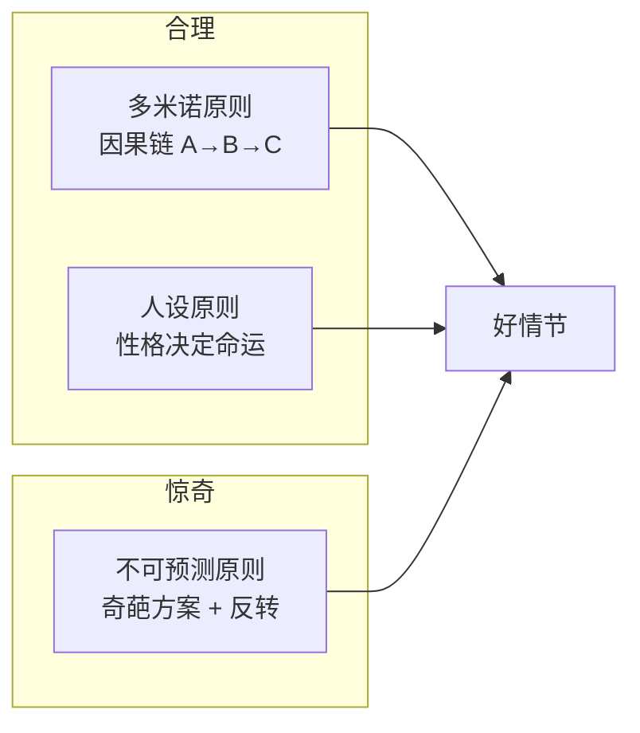

# 编剧工具箱

## 戏核三要素

> 一句话判断创意是否值得写

```
好戏核 = 不可逃避的困境 + 惊奇元素 + 反讽性
```

## 魅力角色四步法


## 三幕剧结构

| 幕 | 时长占比 | 任务 |
|:--:|:--------:|------|
| 第一幕 | ~25% | 展现模式 → 打破模式 → 给出行动理由 |
| 第二幕 | ~50% | 虐待才智：设置障碍，把主角逼到墙角 |
| 第三幕 | ~25% | 设置反转 + 提供让观众满意的完结方案 |

## 情节三原则



## 共情两把钥匙

1. **同情** — 打压主角
   - 让主角被羞辱、被忽视
   - 多重打击（打掉帮手、渲染敌人、命运诅咒）
   - 提高失败风险（失败成本越高，观众越关心）

2. **爱慕** — 拔高主角
   - 比普通人**高一厘米**（不是高不可攀）
   - 大多数普通缺点 + 一两个超凡优点

## 节拍加速法

```
紧张刺激 = 增加障碍数 × 丰富策略数 × 情绪转折深度
```

- **增障碍**：从单一障碍变多重障碍（对手、环境、内心）
- **增策略**：把单回合战斗变成多回合交锋
- **理情绪**：写出每个节拍中的情绪转折

## 台词三层次

| 层次 | 能力 | 做法 |
|:---:|------|------|
| 初级 | 传达信息 | 直白表达 |
| 中级 | 玩文字游戏 | 潜台词（话只说一半、移花接木、木马计） |
| 顶级 | 直指人心 | 通过台词建立角色关系 |

## 悬念三板斧

1. **拆分问题**：核心悬念 → 单集悬念 → 情节悬念
2. **悬崖抓手**：在关键时刻（广告前、集末）戛然而止
3. **拼图游戏**：给予 → 掺水 → 限能 → 收集 → 试错

## 新手四大误区

| 误区 | 正解 |
|------|------|
| 驱动故事的是情节 | 驱动故事的是**人物** |
| 吸引观众的是逻辑 | 吸引观众的是**情感** |
| 塑造人物用作者视角 | 塑造人物用**人物视角**（"我相信"） |
| 剧本呈现生活素材 | 剧本是**艺术加工**（高于生活十倍） |