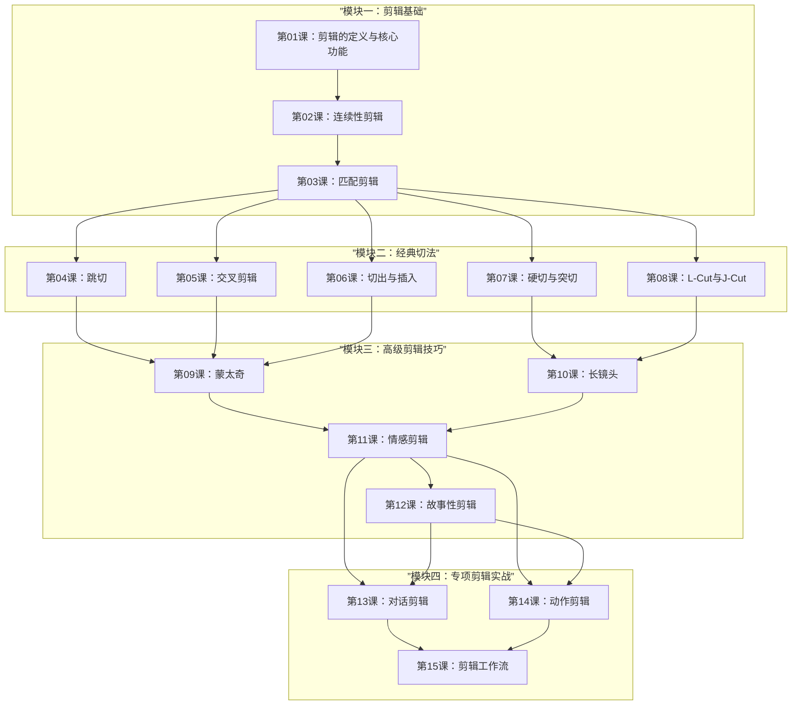

# 课程地图

## 学习路径说明

- **模块一**是所有后续学习的基础，建议逐课学习
- **模块二**各课相对独立，可按兴趣顺序学习，但建议先学第03课再进入
- **模块三**建立在模块二的基础上，需要理解基本切法后再学习
- **模块四**为综合应用，建议完成前三个模块后再学习

## 预计时间

| 模块 | 课程数 | 预计学习时间 |
|---|---|---|
| 模块一：剪辑基础 | 3 课 | 2-3 小时 |
| 模块二：经典切法 | 5 课 | 4-5 小时 |
| 模块三：高级剪辑技巧 | 4 课 | 3-4 小时 |
| 模块四：专项剪辑实战 | 3 课 | 2-3 小时 |
| **总计** | **15 课** | **11-15 小时** |