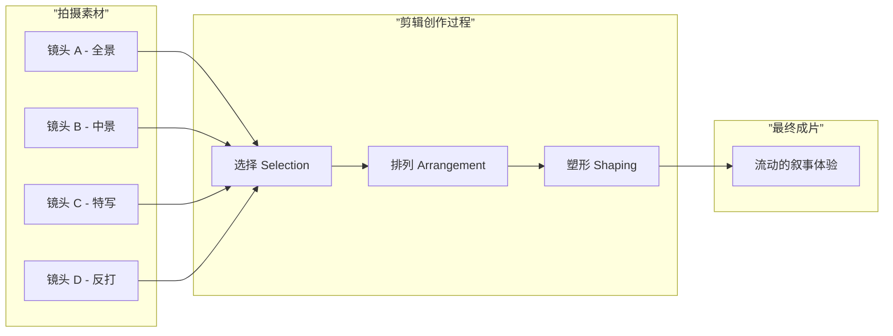

# 第01课：剪辑的定义与核心功能

## Learning Objectives

完成本课后，你将能够：

- 用自己的语言定义电影剪辑（Film Editing）并解释其本质
- 描述剪辑师在电影制作中的核心角色与价值
- 理解"隐形艺术"的含义——好剪辑为何不让观众察觉
- 区分并举例说明剪辑的三大功能：叙事、情感、节奏
- 运用剪辑点选择的两个核心问题：何时切、为何切
- 分析电影片段中剪辑的存在动机

## 剪辑的定义：选择与拼接的艺术

电影剪辑（Film Editing）是**选择并拼接镜头以讲述故事的艺术**。它是电影制作中最后一道创作工序，也是唯一完全在时间维度上工作的创作环节。编剧写的是文字，导演拍的是画面，而剪辑师将零散的素材转化为流动的时间体验。

从最朴素的层面看，剪辑就是"剪切"（cut）和"拼接"（splice）素材。但从创作层面看，剪辑是在做三件事：

1. **选择（Selection）**：从大量拍摄素材中选取最佳镜头
2. **拼接（Arrangement）**：将这些镜头按特定顺序排列
3. **塑形（Shaping）**：确定每个镜头的时长和节奏

## 剪辑师的核心角色

剪辑师（Editor）通常是导演在后期制作中最亲密的合作者。导演带着对影片的愿景进入剪辑室，而剪辑师则用客观的眼光和专业的节奏感，帮助导演从素材中看到真正的可能性。

> [!TIP] Key Insight
> 剪辑师并非简单按照剧本"拼图"。最优秀的剪辑师能够从素材中发现剧本阶段未曾设想的叙事可能。有时一个镜头的顺序调换、一个剪辑点的微调，就能彻底改变一场戏的情感走向。

剪辑师的具体职责包括：

- **提炼表演**：从多条拍摄中选取最佳表演瞬间
- **控制节奏**：决定每个镜头的停留时长，从而控制整体节奏
- **构建叙事**：决定信息揭示的顺序和方式
- **修复问题**：通过剪辑弥补拍摄中的问题（表演欠佳、连续性错误等）
- **提供新视角**：在剪辑过程中发现影片新的可能

## 隐形艺术

"最好的剪辑是你未曾注意到的剪辑。"

这句行业箴言揭示了剪辑的核心美学：**好剪辑不让观众察觉**（Invisible Editing）。当观众沉浸在故事中，完全忘记了摄像机和剪辑的存在，剪辑师就成功了。

为什么好剪辑必须"隐形"？

- 观众应该关注故事和角色，而不是意识到剪辑的存在
- 每一次让观众"注意到"剪辑，都是叙事沉浸感的断裂
- 剪辑师的工作是为故事服务的，而非展示技巧

当然，这并不是绝对的。有些电影刻意使用显眼的剪辑手法（见[[0004-tiao-qie|跳切]]和[[0007-ying-qie-yu-tu-qie|硬切]]），但这些"可见"的剪辑都有明确的**叙事动机**——导演就是要观众注意到这个切，因为它传达了特定的情绪或含义。

## 剪辑的三大功能

所有剪辑技巧都可以归结为以下三大功能，这三者相互交织、无法完全割裂：

| 功能 | 核心问题 | 具体手段 | 案例 |
|------|----------|----------|------|
| **叙事（Narrative）** | 故事讲清楚了吗？ | 信息揭示顺序、时空建构、因果链呈现 | 建立镜头交代场景，正反打推进对话 |
| **情感（Emotion）** | 观众感受到了什么？ | 镜头时长控制、反应镜头插入、留白 | 延长告别场景的镜头停留渲染伤感 |
| **节奏（Rhythm）** | 张力在正确的时间点释放了吗？ | 剪辑频率、场景长度变化、动静交替 | 追车戏加快剪辑频率提升紧张感 |

### 叙事功能

剪辑最基本的任务是**讲故事**。观众需要知道：这是在哪里？谁在和谁说话？发生了什么？为什么发生？好的叙事剪辑用最少的镜头传递最清晰的信息。

### 情感功能

剪辑不仅仅是传达信息，更要**制造感受**。同样的对话场景，在角色说台词后立刻切走 vs 多停留两秒，观众的情感体验天差地别。这两秒的"呼吸时间"让情感在观众心中发酵。

### 节奏功能

节奏是剪辑的脉搏。一场追逐戏可能需要半秒一切的急促节奏，而一场离别戏可能需要几十秒的长镜头。节奏决定了观众的心理紧张程度。

## 何时该切——剪辑点的选择原则

剪辑点（Cutting Point）的选择没有绝对公式，但有指导原则：

1. **在动作中点切（Cut on Action）**：当角色正在做动作时切，动作的连续性会掩盖剪辑的生硬感
2. **在心理完成点切**：等观众"消化"完一个信息后再切，不要抢在观众前面
3. **在音乐/节奏的节拍上切**：利用声音的起伏引导剪辑点
4. **视线引导切**：角色看向画面外，观众自然想看到ta在看什么——这就是切的最佳时机

## 为什么要切——剪辑的动机分析

每次下剪刀前，问自己：**这个切有动机吗？**

常见的剪辑动机包括：

- **信息需求**：观众需要看到另一个角度的信息
- **情感需求**：需要接近角色以感受ta的情绪
- **节奏需求**：当前镜头的张力已经达到峰值，需要释放
- **空间需求**：需要重新建立空间关系
- **注意力引导**：需要将观众注意力转移到关键元素上
- **时间压缩**：需要略过无关紧要的时间片段

> [!WARNING]
> 没有动机的剪辑就是"为了切而切"。初学者最常见的错误就是在没有明确理由的情况下频繁切换镜头，导致观众迷失方向或感到疲劳。每次切换前，问自己：观众现在**需要**看到什么？

## 剪辑动机分析流程图

```mermaid
flowchart TD
    Q[当前镜头该切了吗？] --> D1{观众信息是否已满足？}
    D1 -->|否| K1[保持当前镜头]
    D1 -->|是| D2{是否有情感冲击需要强化？}
    D2 -->|是| K2[切到反应镜头或特写]
    D2 -->|否| D3{节奏是否需要变化？}
    D3 -->|是| K3[按节奏节拍切换]
    D3 -->|否| D4{空间关系是否清晰？}
    D4 -->|否| K4[切回建立镜头或宽广景别]
    D4 -->|是| K5[等待下一个动机出现]

    style Q fill:#1a1a2e,stroke:#e94560
    style K5 fill:#1a1a2e,stroke:#16213e
```

## 扩展阅读

- [[0002-lian-xu-xing-jian-ji|第02课：连续性剪辑]]将深入讲解如何让剪辑"隐形"
- [[reference/glossary|电影剪辑术语表]]中查阅本课涉及的关键术语

> [!QUESTION] 自测题
>
> **题1**：剪辑的三大核心功能是什么？请各举一个电影中的例子说明。
>
> **题2**：为什么好的剪辑被称为"隐形艺术"？在什么情况下剪辑师可以有意识地打破这种"隐形"原则？
>
> **题3**：分析以下场景中可能的剪辑动机：角色A坐在房间里读书，突然听到门外传来脚步声。在A抬起头看向门的方向后，下一个镜头应该是什么？请说明理由。

查看答案

**题1答案**：
- **叙事功能**：如一个侦探推理场景，通过剪辑展示线索的先后顺序来引导观众推理
- **情感功能**：如告别场景，在角色说完再见后多停留两秒捕捉微表情
- **节奏功能**：如追车戏中剪辑频率逐渐加快来提升紧张感

**题2答案**：
好剪辑不让观众察觉，因为观众一旦注意到"这是个剪辑"，就会从故事中抽离，打破沉浸感。但如果导演想让观众感受到剪辑的冲击力（如[[0004-tiao-qie|跳切]]用来表现焦虑），或者通过显眼的匹配剪辑建立隐喻（如[[0003-pi-pei-jian-ji|匹配剪辑]]），可以有意打破"隐形"原则。

**题3答案**：
下一个镜头应该切到门的方向（A的视线方向），展示脚步声的来源。剪辑动机包括：**信息需求**（观众想知道A在看什么）和**视线引导**（A的视线指向画外，勾起了观众的好奇心）。如果此时不切，观众会产生焦躁感。

## Next Step

完成本课后，请进入 [[0002-lian-xu-xing-jian-ji|第02课：连续性剪辑]]，学习如何通过系统化的剪辑规则保持时空的连贯性。