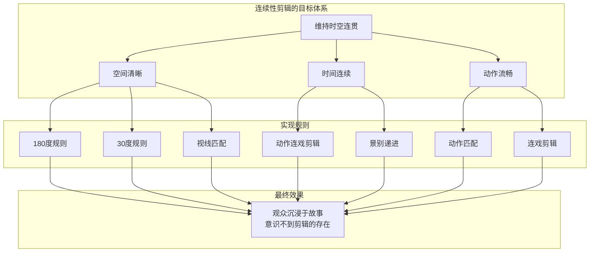
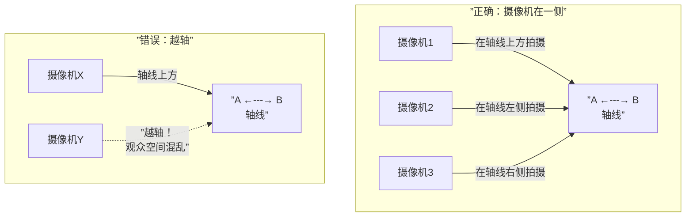
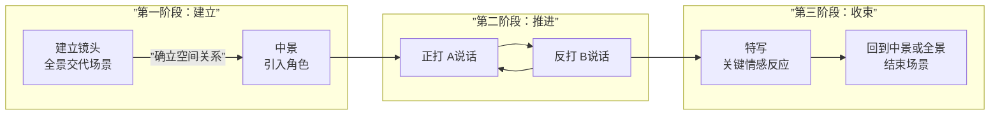

# 第02课：连续性剪辑

## Learning Objectives

完成本课后，你将能够：

- 定义连续性剪辑及其核心目的（保持时空连贯）
- 解释动作连戏剪辑（Cutting on Action）的原理并演示其应用
- 运用视线匹配（Eye-line Match）原则分析对话场景
- 理解180度规则与轴线概念，识别越轴（Crossing the Line）错误
- 说明30度规则及其防止视觉跳跃的作用
- 描述经典的三段式镜头结构：建立镜头-正反打-细节镜头

## 连续性剪辑的定义与目的

连续性剪辑（Continuity Editing）是好莱坞经典叙事电影的核心剪辑体系，其根本目的是**保持银幕时空的连贯性和逻辑一致性**，让观众感觉每一帧画面都自然地接续前一刻。

如果说[[0001-ji-jian-de-ding-yi|剪辑]]的基本任务是选择与拼接，那么连续性剪辑就是让这种拼接变得"不可见"的规则系统。它是一套经过百年实践总结出的技术规范，旨在：

- 维持空间关系的清晰性
- 保持时间流动的连续性
- 不让剪辑本身干扰故事讲述

> [!TIP] Key Insight
> 连续性剪辑本质上是"欺骗"观众的艺术。它让观众相信银幕上的时空是连续的、真实的，但事实上电影中的每一秒都是由完全不连续的片段拼接而成。规则越严格，欺骗越成功。

## 动作连戏剪辑

动作连戏剪辑（Cutting on Action，也称Cutting on Movement）是最基础也最有效的连续性剪辑技巧。

**原理**：当角色正在做一个动作时切换镜头，观众的注意力会被动作本身吸引，从而忽略剪辑的存在。动作的"动量"在镜头切换后持续流动，使两个镜头无缝衔接。

典型用法：角色推门——手碰到门把手时从全景切到特写——动作的连贯性掩盖了剪辑点。

> [!WARNING]
> 动作连戏剪辑对动作的"接帧"要求极高。如果前一个镜头中角色的手在位置X，下一个镜头中手突然出现在位置Y，观众会立刻察觉到不自然。这就是所谓的"连戏错误"（Continuity Error），即动作在剪辑点前后不匹配。

## 视线匹配

视线匹配（Eye-line Match）是基于视线方向来连接两个镜头的剪辑原则。

**原理**：当角色看向画面外，下一个镜头展示ta所看的内容——且观众相信这个内容正处于角色视线的方向上。

视线匹配是对话场景剪辑的核心。在[[0013-dui-hua-jian-ji|对话剪辑]]中，视线方向的一致性决定了观众能否理解谁在对谁说话。

视线匹配的关键：

1. **视线方向一致性**：人物A看向右方，A的视线应该指向B（在画面左侧）；B看向左方，B的视线指向A（在画面右侧）
2. **视线高度匹配**：如果A站着B坐着，A的视线应略微向下，B的视线应略微向上
3. **视线-物体匹配**：当角色看向一个方向，下一个镜头必须展示ta所看的内容

## 180度规则与轴线

180度规则（180-degree Rule）是连续性剪辑中最基本的空间定位原则。

**定义**：在拍摄和剪辑场景时，在动作周围建立一条虚拟的"轴线"（Axis of Action / 180-degree Line），摄像机只能停留在轴线的一侧（180度半圆内），不能越过轴线拍摄。

**轴线**通常由以下因素确定：

- 两个对话角色之间的连线
- 一个运动物体的行进方向
- 角色视线方向

违反180度规则称为"越轴"（Crossing the Line），会导致观众对空间关系的认知产生混乱。

180度规则的实质是：**让观众始终清楚每个角色在空间中的相对位置**。当A始终在画面左侧看向右方，B始终在画面右侧看向左方，观众就知道他们在面对面交谈。一旦越轴，A和B就会"跳"到同一侧，观众会误以为他们在看同一个方向。

## 30度规则

30度规则（30-degree Rule）规定：**同一主体的两个连续镜头之间的摄像机角度变化不能小于30度**。

违反30度规则会产生"跳切"效果（详见[[0004-tiao-qie|跳切]]），因为角度变化过小时，画面看起来像是"抖动"了一下，既不完全是新镜头也不完全是旧镜头。

| 角度变化 | 效果 | 是否推荐 |
|----------|------|----------|
| 0-10度 | 明显跳切，视觉不适 | 不推荐（除非刻意为之） |
| 10-30度 | 轻微跳跃感 | 避免 |
| 30-60度 | 流畅过渡 | 推荐 |
| 60-90度 | 视角明显变化 | 推荐 |
| 90度以上 | 大角度跳跃 | 可用（需搭配景别变化） |

## 镜头景别递进

镜头景别递进（Shot Progression）是连续性剪辑中控制信息揭示节奏的原则。

**核心思想**：在场景开始时通常从较宽的景别逐步推进到更近的景别，而不是来回跳跃。

**经典递进模式**：

1. **建立镜头（Establishing Shot）**：全景或大远景，交代场景位置和人物关系
2. **中景（Medium Shot）**：聚焦到主要角色或动作
3. **正反打（Shot / Reverse Shot）**：对话场景中交替展示说话人
4. **特写/细节镜头（Close-up / Detail Shot）**：在最关键的时刻推进到角色面部反应或关键道具

## 经典三段式镜头结构

结合以上所有规则，连续性剪辑建立了一种经典的叙事镜头结构：

| 阶段 | 镜头类型 | 目的 | 景别 |
|------|----------|------|------|
| 建立 | 建立镜头（Establishing Shot） | 告知观众"我们在哪里" | 全景或大远景 |
| 推进 | 主镜头（Master Shot） | 展示角色的空间关系 | 中景或双人镜头 |
| 细化 | 正反打（Shot / Reverse Shot） | 推进对话、展示反应 | 中特写、特写 |
| 强调 | 插入镜头（Insert Shot） | 突显关键细节 | 大特写 |
| 收束 | 回归建立镜头 | 结束场景、过渡到下一场 | 全景 |

这种模式并非机械教条。优秀的剪辑师会在三段式基础上进行各种变体，但其背后的逻辑始终是**从宏观到微观、从整体到局部**的信息揭示策略。

## 扩展阅读

- [[0001-ji-jian-de-ding-yi|第01课：剪辑的定义与核心功能]]回顾剪辑的基本原则
- [[0003-pi-pei-jian-ji|第03课：匹配剪辑]]学习另一种完全不同的剪辑逻辑
- [[0004-tiao-qie|第04课：跳切]]了解当剪辑师刻意打破连续性时会发生什么
- [[reference/glossary|电影剪辑术语表]]查阅本课涉及的关键术语

> [!QUESTION] 自测题
>
> **题1**：什么是180度规则？什么情况下可以故意打破它？
>
> **题2**：假设你正在剪辑一场两个人的对话戏。角色A在左边（画面左侧），角色B在右边（画面右侧）。A看向右边说话，你应该用哪个方向的镜头展示B？为什么？
>
> **题3**：一个中景镜头紧接着另一个非常相似的中景镜头，相机仅向右移动了15度。请判断这个剪辑是否符合30度规则，并解释原因。

查看答案

**题1答案**：
180度规则要求剪辑师保持在同一侧剪辑，不越过两个角色之间的轴线。保持规则让观众始终清楚每个角色的空间位置。刻意打破180度规则（越轴）可以用来制造混乱、眩晕或角色心理状态的不稳定感——但这需要明确的叙事动机。

**题2答案**：
应该用B看向左边的镜头（即从A的肩后方向拍摄B）。原因：A在左侧看向右侧，ta的视线指向画面右方。B应该在画面的右侧，视线指向左方（看向A）。这样观众从视觉上感知到A和B正在面对面交谈。视线方向的一致性由[[reference/glossary|视线匹配]]原则保证。

**题3答案**：
不符合30度规则（只有15度变化）。这种小角度变化在切换时会产生"跳切"效果，画面像是抖动了一下，让观众感到不适。应该要么将角度增大到30度以上，要么改变景别（如中景切到特写），或者如果是刻意追求跳切效果，则需要明确的叙事动机。

## Next Step

完成本课后，请进入 [[0003-pi-pei-jian-ji|第03课：匹配剪辑]]，学习另一种基于相似性而非连续性的剪辑手法。