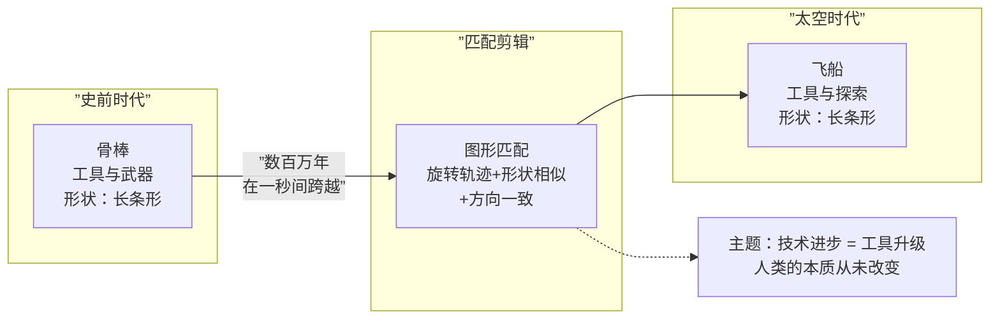

# 第03课：匹配剪辑

## Learning Objectives

完成本课后，你将能够：

- 定义匹配剪辑（Match Cut）并解释其核心原理
- 区分三种匹配类型：图形匹配、动作匹配、概念匹配
- 分析《2001太空漫游》骨棒-飞船匹配的叙事功能
- 理解匹配剪辑如何跨越时空、建立隐喻
- 在剪辑实践中运用匹配剪辑强化叙事

## 匹配剪辑的定义与原理

匹配剪辑（Match Cut）是将两个视觉上具有相似性的镜头拼接在一起，以建立两者之间的关联、过渡或隐喻关系的剪辑手法。

与[[0002-lian-xu-xing-jian-ji|连续性剪辑]]追求"无缝"不同，匹配剪辑追求的是**"可见的关联"**。观众确实会注意到这个剪辑，但这种注意不是干扰——导演就是要让观众看到两个镜头之间的联系，从而在心理上建立跨越时空的桥梁。

匹配剪辑的核心原理是**视觉认知的连续性**：当人眼看到两个在形状、颜色、运动或构图上相似的事物时，大脑会自动建立连接。剪辑师利用这种心理机制，用画面的相似性在观众潜意识中"焊接"两个世界。

> [!TIP] Key Insight
> 匹配剪辑的本质是一种视觉隐喻。它告诉观众：这两个画面虽然在叙事时空上相距甚远，但在含义上是相连的。好的匹配剪辑能让观众在潜意识层面理解影片的主题，而不需要通过任何台词来明说。

## 匹配剪辑的三种类型

匹配剪辑可以分为三种基本类型，它们在视觉和认知层面建立不同的连接：

| 类型 | 连接基础 | 视觉要素 | 典型案例 |
|------|----------|----------|----------|
| **图形匹配（Graphic Match）** | 形状、颜色、线条 | 圆形与圆形、红色与红色、对角线方向 | 《2001太空漫游》骨棒→飞船 |
| **动作匹配（Action Match）** | 运动轨迹、速度 | 跳跃、旋转、挥手动作 | 《阿拉伯的劳伦斯》火柴→日出 |
| **概念匹配（Conceptual Match）** | 含义、象征 | 十字架与刀剑、婴儿与炸弹 | 《教父》洗礼场景与杀戮交叉剪辑 |

### 图形匹配剪辑

图形匹配（Graphic Match）是最直观的匹配剪辑类型。当两个镜头中占主导地位的图形元素在形状、大小、位置或颜色上高度相似时，切换就像"变形"一样流畅。

图形匹配的关键要素：

- **形状**：圆形匹配圆形、方形匹配方形、线条方向匹配
- **构图位置**：主体在画面中的位置高度一致
- **色彩**：色相、明度、饱和度的相似性
- **纹理**：表面质感的视觉连续性

### 动作匹配剪辑

动作匹配（Action Match）利用动作的轨迹和节奏来建立连接。当一个人物在做某个动作时切到另一个人物或物体在做相似动作，观众会"顺着"动作的动量完成心理过渡。

动作匹配的关键要素：

- **运动方向**：动作的矢量方向必须一致（如从右到左的挥手）
- **运动速度**：动作的节奏变化需要协调
- **运动幅度**：动作的大小和力度相匹配

### 概念匹配剪辑

概念匹配（Conceptual Match）是最抽象但也最强大的匹配类型。它不依赖具体的视觉相似性，而是利用**含义的关联**。当导演将一个镜头与另一个看似无关的镜头并列时，观众会主动寻找两者之间的概念联系。

这种手法背后的理论基础是[[0009-meng-tai-qi|蒙太奇]]思维：两个镜头的组合产生的含义大于它们各自的总和。

## 经典案例：《2001太空漫游》

斯坦利·库布里克（Stanley Kubrick）在《2001太空漫游》（2001: A Space Odyssey, 1968）中创造的骨棒-飞船匹配是有史以来最著名的匹配剪辑之一。

**场景背景**：一个人猿将手中的骨棒抛向空中。当骨棒旋转着升到最高点时，镜头切换——骨棒的形状"变成"了一艘在太空中航行的飞船。

这个剪辑的叙事功能是多层次的：

1. **时间跨越**：从史前文明直接跳到太空时代，跨越了数百万年
2. **主题隐喻**：骨棒是工具（也是武器），飞船同样是工具——暗示人类文明的进步只是工具的升级，暴力和征服的本性从未改变
3. **视觉震撼**：完美的图形匹配（骨棒与飞船的长条形轮廓）让过渡既出人意料又无比自然

> [!WARNING]
> 匹配剪辑需要精确到帧的节奏控制。在《2001》的案例中，库布里克反复调整骨棒旋转到切换的精确帧数，直到达到"刚刚好"的节奏——太早则关联不强，太晚则失去冲击力。匹配剪辑的成功往往取决于这种对毫秒级节奏的敏感度。

## 匹配剪辑的叙事功能

匹配剪辑不仅是一种炫技手法，它承载着重要的叙事功能：

### 跨越时空

匹配剪辑最直接的叙事功能是**在瞬间完成时空跳跃**，而观众能自然地跟上这种跳跃。与需要文字说明或模糊过渡（如溶化、淡入淡出）不同，匹配剪辑用视觉本身的逻辑来说服观众："我们已经到了另一个地方/时间。"

经典用法：
- 过去与现在之间的闪回过渡
- 梦境与现实之间的切换
- 不同地理空间之间的快速转换
- 同一动作在不同时间点的并置

### 建立隐喻

匹配剪辑的第二大功能是**在观众潜意识中建立隐喻关系**。这不需要任何台词或解说，纯粹通过视觉的并置完成。

例如：
- 婴儿的出生 → 鸡蛋的破裂（新生命的诞生）
- 军队的行进 → 机器的运转（个体的非人化）
- 点燃火柴 → 日出的光芒（希望或觉醒）

这种隐喻往往比文字更有力量，因为它直接作用于观众的视觉直觉。

## 匹配剪辑 vs 连续性剪辑

理解匹配剪辑的关键在于对比它与[[0002-lian-xu-xing-jian-ji|连续性剪辑]]的根本差异：

| 维度 | 连续性剪辑 | 匹配剪辑 |
|------|------------|----------|
| 核心目的 | 隐藏剪口，维持时空连贯 | 突出关联，建立隐喻连接 |
| 观众感知 | 不应察觉剪辑存在 | 可（且应该）察觉剪辑 |
| 时空关系 | 保持时空连续 | 跨越时空 |
| 选择逻辑 | 视线的自然引导 | 视觉形式的相似性 |
| 情感效果 | 沉浸与真实感 | 惊奇与思考 |
| 典型场景 | 对话场景、日常动作 | 转场、蒙太奇段落 |

## 扩展阅读

- [[0001-ji-jian-de-ding-yi|第01课：剪辑的定义与核心功能]]回顾剪辑的基本原理
- [[0002-lian-xu-xing-jian-ji|第02课：连续性剪辑]]对比理解两种剪辑体系
- [[0004-tiao-qie|第04课：跳切]]了解另一种"反连续性"的剪辑手法
- [[0009-meng-tai-qi|第09课：蒙太奇]]深入学习镜头组合创造新含义的理论
- [[reference/glossary|电影剪辑术语表]]查阅本课涉及的关键术语

> [!QUESTION] 自测题
>
> **题1**：图形匹配、动作匹配、概念匹配三种匹配类型的区别是什么？请各举一个日常生活中的视觉类比。
>
> **题2**：分析《2001太空漫游》骨棒-飞船匹配剪辑，这个剪辑在主题层面传达了怎样的含义？
>
> **题3**：假设你要设计一个匹配剪辑来连接"主角在2020年关掉电脑"和"主角在1950年打开一本书"两个镜头，你会选择哪种匹配类型？请描述镜头画面的具体构图和运动。

查看答案

**题1答案**：
- **图形匹配**：基于形状/颜色/构图的相似。类比：两个红色圆形的并置
- **动作匹配**：基于运动方向/速度的相似。类比：两个人用相同姿势挥手的剪影
- **概念匹配**：基于含义/象征的关联。类比：一张战争照片与一张和平鸽的照片并置

**题2答案**：
在主题层面，骨棒到飞船的匹配传达了一种对"技术进步"的深刻反思：人猿用来狩猎和统治的骨棒，在数百万年后变成了人类探索宇宙的飞船。工具（Technology）在升级，但使用工具的人类本性是否改变了？库布里克暗示：人类的本质——征服、扩张、使用工具——从未改变，只是工具本身变得更加精密了。

**题3答案**：
建议使用**动作匹配**。具体设计：主角在2020年按下笔记本电脑的屏幕（一个"合上"的动作的起始），在动作进行到一半时切到——主角在1950年拿起一本书并翻开（同一"合上/打开"动作的延续）。两个动作的手臂运动轨迹高度一致，方向相同，速度匹配。这种动作匹配让观众在潜意识中建立了"关闭电脑"和"打开书"之间的联系，暗示两者是同一行为在不同时代的等价形式。

## Next Step

完成本课后，请进入 [[0004-tiao-qie|第04课：跳切]]，了解这种与连续性剪辑截然对立的革命性剪辑手法，以及它如何彻底改变了电影语言。