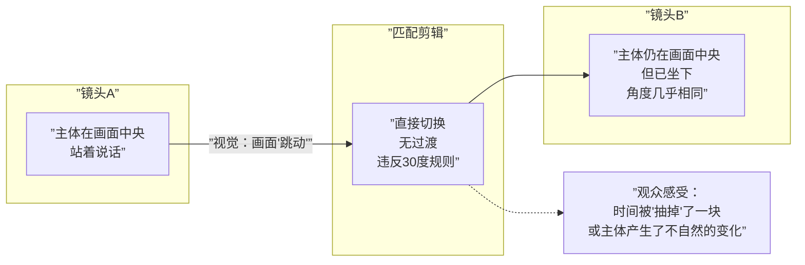
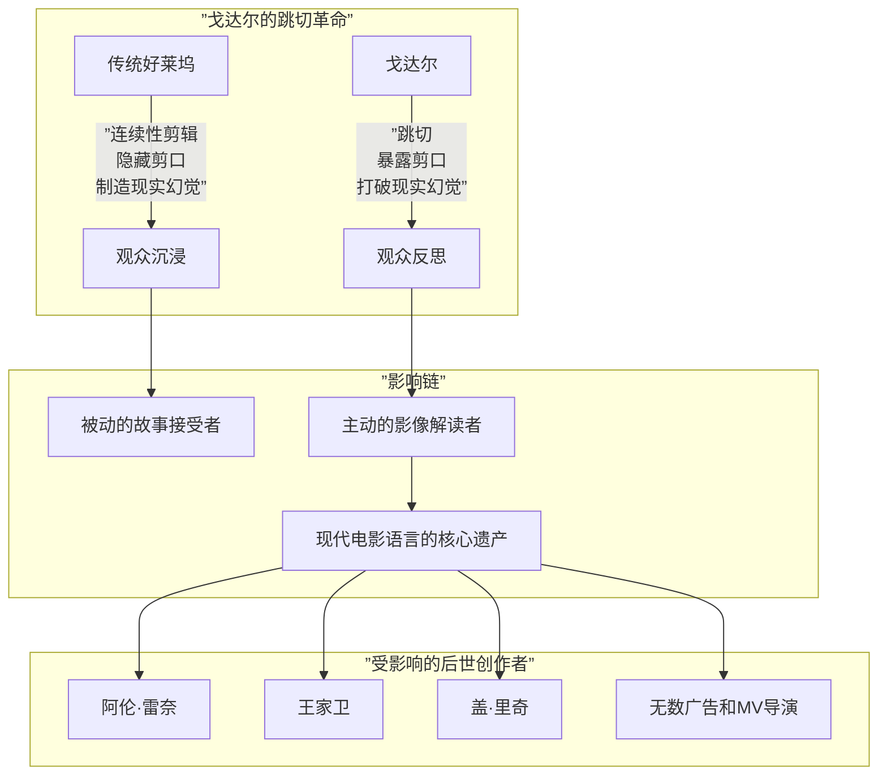

# 第04课：跳切

## Learning Objectives

完成本课后，你将能够：

- 定义跳切（Jump Cut）并识别其视觉特征
- 解释跳切与连续性剪辑的原则性对立
- 区分三种跳切类型：时间跳切、空间跳切、视角跳切
- 描述跳切在艺术电影中的叙事和情感用途
- 分析戈达尔与法国新浪潮对跳切的革命性贡献
- 评估现代电影中跳切的运用策略

## 跳切的定义与特征

跳切（Jump Cut）是指**同一主体在相似角度和景别之间进行突兀切换**，导致画面在剪辑点处产生"跳动"或"跳跃"感的一种剪辑手法。

从技术层面看，跳切违反了[[0002-lian-xu-xing-jian-ji|连续性剪辑]]的核心规则——特别是30度规则（镜头角度变化不得小于30度）和动作连戏原则（动作应保持连续）。当两个镜头的机位接近、主体位置发生变化但不够显著时，观众会感知到一种视觉上的"不连贯"。

跳切的典型视觉特征：

1. **主体在画面中的位置发生突变**（如从画面左侧跳到右侧）
2. **背景几乎不变但主体状态改变**（如衣服、姿势、表情突然变化）
3. **动作的连续性被打断**（前一个动作未完成就跳到动作的中段）
4. **画面抖动或"闪烁"感**（类似视频剪辑中帧被抽掉的效果）

> [!TIP] Key Insight
> 跳切之所以让观众感到"不适"，是因为它暴露了电影的本质——电影本来就是由不连续的片段拼接而成的。连续性剪辑的所有规则都在试图掩盖这个事实，而跳切则选择直面它、甚至强调它。这种"诚实"带来了一种独特的审美震撼。

## 跳切与连续性剪辑的对立

跳切与[[0002-lian-xu-xing-jian-ji|连续性剪辑]]并非简单的技术差异，而是两种电影哲学的对抗：

| 维度 | 连续性剪辑 | 跳切 |
|------|------------|------|
| 哲学态度 | 电影应该"隐藏"自己的技术手段 | 电影应该"暴露"自己的技术手段 |
| 时空观 | 创造时空连续的自然假象 | 承认时空断裂的客观事实 |
| 观众角色 | 被动沉浸于故事 | 主动意识到电影的"构造性" |
| 叙事态度 | 故事是天然的、无缝的 | 故事是被建构的、可被干预的 |
| 代表运动 | 好莱坞经典叙事 | 法国新浪潮/现代主义电影 |

跳切之所以在传统好莱坞中被视为"错误"，正是因为它破坏了观众沉浸的基础——时空的连续性。然而，从[[0001-ji-jian-de-ding-yi|剪辑的定义]]角度看，跳切只是选择了不同的剪辑目标：它不追求"隐形"，而追求"表达"。

## 三种跳切类型

跳切可以根据其"跳跃"的维度分为三种类型：

### 1. 时间跳切（Temporal Jump Cut）

**原理**：同一场景中，通过去掉中间的时间片段，让人物或物体的状态在瞬间发生明显变化。

**效果**：压缩时间，创造出紧迫感或时间流逝感。

**典型用法**：
- 角色正在化妆——切——妆容已变，服装已换
- 角色坐在桌前——切——桌上的咖啡杯空了，天色变暗
- 角色在打电话——切——通话还在继续，但表情从平静变成了愤怒

### 2. 空间跳切（Spatial Jump Cut）

**原理**：同一主体在同一空间内，机位角度或距离发生小幅度变化，产生画面"跳动"。

**效果**：制造不安、焦虑或能量的不稳定性。

**典型用法**：
- 人物在发表演讲，画面在几个相似的近景构图中来回切换，制造紧张感
- 追逐戏中同一动作的短促跳跃切换，强化混乱感

### 3. 视角跳切（Perspective Jump Cut）

**原理**：在同一段连续动作中，从一个视角突然切换到另一个视角，且两个视角之间没有合理的视线关联。

**效果**：打破观众的视角稳定性，使其感到"无立足点"的不安。

**典型用法**：
- 从角色主观视角突然切到客观视角
- 从全景直接跳到别人看不到的特殊视角，暗示角色的"出离"感

## 艺术用途：跳切在叙事中的作用

跳切的用途远不止制造"突兀感"。它是一把精细的叙事工具，可以实现以下功能：

### 表现时间流逝

跳切是压缩时间最高效的手法之一。无需蒙太奇段落，无需字幕提示，连续两三个跳切就足以让观众理解：时间过去了，而且过得很快。

### 传达焦虑与不安

当角色的心理状态趋于不稳定时，跳切是最直观的视觉对应。画面本身的"跳动"映射了内心的混乱。这种手法在心理惊悚片和犯罪片中常见。

### 制造纪录片式真实感

跳切在纪录片中很常见，因为纪录片往往无法控制拍摄对象，只能从有限的素材中提炼。在剧情片中使用跳切，可以刻意营造一种"未经修饰"的真实感，让观众感觉在看非虚构的内容。

### 自我反思与间离效果

受[[0009-meng-tai-qi|蒙太奇]]理论和布莱希特"间离效果"（Verfremdungseffekt）的影响，跳切可以让观众从故事中抽离，反思电影媒介本身。这是一种元电影（Meta-cinema）手法。

> [!WARNING]
> 跳切是一把双刃剑。在有明确叙事动机时，它是强有力的表达工具；在没有动机时，它只是业余的剪辑错误。在使用跳切前，请确认：你是因为这个场景需要跳切（角色的焦虑、时间压缩、风格追求），还是仅仅因为缺少合适的素材？如果答案是后者，请重新思考剪辑策略。

## 戈达尔与法国新浪潮

跳切被广泛认可为一种艺术手法，要归功于法国新浪潮（French New Wave）导演让-吕克·戈达尔（Jean-Luc Godard）和他的电影《精疲力尽》（Breathless / À bout de souffle, 1960）。

### 历史背景

在戈达尔之前，跳切在主流电影中几乎是不存在的——它被视为技术错误，剪辑师会不遗余力地避免它。但戈达尔和他的剪辑师塞西尔·德库吉（Cécile Decugis）在《精疲力尽》中刻意使用了跳切，原因并非技术限制：

- 戈达尔觉得传统剪辑过于"润滑"，失去了电影的活力
- 他想要一种更直接的表达方式，匹配影片主角米歇尔（Michel）的躁动不安
- 他故意"违反规则"，以此挑战观众对电影应该是什么样子的固有认知

### 《精疲力尽》中的跳切

影片中最著名的跳切场景：米歇尔开车时，画面在同一个中景角度中反复切换，道路背景变化但机位几乎不变。每次切换都让观众明确地"看到"剪辑的存在。

这个跳切的情感功能如下：
- **表现角色心理**：米歇尔是一个冲动、不安、不按规矩行事的角色，跳切在形式上呼应了他的精神状态
- **制造节奏**：跳切的打断感让场景充满了无法预料的能量
- **挑衅观众**：戈达尔在告诉观众——你在看的是一部电影，不是现实

## 现代电影中跳切的运用

跳切早已从"实验手法"变成了电影语言的标准组成部分。当代电影中跳切的使用更加多样化：

### 《社交网络》（The Social Network, 2010）

大卫·芬奇（David Fincher）的电影在对话场景中大量使用跳切。例如，马克·扎克伯格（Mark Zuckerberg）与律师的对话通过一系列细微的跳切压缩对话节奏，让观众感受到扎克伯格的思维速度远远快于正常人的对话节奏。这里的跳切：

- **压缩时间**：去掉对话中"多余的"停顿和呼吸
- **表现智商**：扎克伯格的思维像电脑一样高速运转
- **制造紧张**：对话被切得越来越碎，张力逐渐升级

### 其他现代应用

| 电影/导演 | 跳切用途 | 具体手法 |
|-----------|----------|----------|
| 《兰博之子》（Son of Rambow, 2007） | 儿童的想象力视觉化 | 主体位置跳跃强化夸张效果 |
| 王家卫《重庆森林》 | 表现城市生活的疏离与随机性 | 跟拍中的跳切增加急促感 |
| 《谍影重重》系列 | 打斗场景的急促混乱 | 动作跳切增强体能冲击感 |
| 电视剧《办公室》（The Office） | 伪纪录片风格 | 频繁跳切模拟真实摄像机的局限 |
| 广告与MV | 节奏驱动、风格化呈现 | 节拍上的跳切制造视觉律动 |

## 扩展阅读

- [[0001-ji-jian-de-ding-yi|第01课：剪辑的定义与核心功能]]回顾剪辑的基本原理
- [[0002-lian-xu-xing-jian-ji|第02课：连续性剪辑]]对比理解跳切所"违反"的规则体系
- [[0003-pi-pei-jian-ji|第03课：匹配剪辑]]对比另一种"反连续性"的剪辑手法
- [[0007-ying-qie-yu-tu-qie|第07课：硬切与突切]]了解另一种具有冲击性的剪辑手法
- [[reference/glossary|电影剪辑术语表]]查阅本课涉及的关键术语

> [!QUESTION] 自测题
>
> **题1**：跳切违反连续性剪辑的哪些具体规则？这些规则的违反分别产生了什么视觉效果？
>
> **题2**：戈达尔在《精疲力尽》中使用跳切的动机是什么？这对电影语言的发展产生了什么影响？
>
> **题3**：分析以下情况是否应该使用跳切：一段角色独自坐在房间里的戏，角色没有说台词，镜头需要展示他从平静到焦虑的心理变化。请说明理由并设计一个简短的剪辑方案。

查看答案

**题1答案**：
跳切主要违反三条连续性规则：
1. **30度规则**：角度变化小于30度，画面看起来"抖动"而非流畅过渡
2. **动作连戏规则**：动作在剪辑点前后不匹配，出现跳跃感
3. **视线匹配规则**：角色的视线方向在跳切中可能失去逻辑关联违反了以上规则，跳切产生了"画面跳动"、"时间被抽掉"、"主体位置突变"的视觉效果。

**题2答案**：
戈达尔的动机是多重的：他想要挑战好莱坞的"透明"电影语言，让观众意识到自己正在看电影而非沉浸在幻觉中；他需要用形式上的"断裂"呼应主角米歇尔的躁动和不羁；他也受到当时法国存在主义哲学的影响，认为电影应该诚实地面对自己的媒介特性。对电影语言的影响：跳切换从"错误"变成了"选项"，极大地扩展了电影表达的词汇库，开启了现代主义电影的新篇章。

**题3答案**：
适合使用跳切。理由：角色的心理变化（从平静到焦虑）正适合跳切的形式特征——画面的"跳动"直接映射内心的"不安"。剪辑方案建议：
- 镜头A（5秒）：角色坐在窗边，表情平静，中景
- 跳切1 → 镜头B（3秒）：角色姿势微变，手指开始敲击桌面（景别几乎不变）
- 跳切2 → 镜头C（2秒）：角色换了个姿势，开始看向窗外（角度略变）
- 跳切3 → 镜头D（2秒）：角色站起来走到窗边（跳切加速了动作）
- 跳切4 → 镜头E（4秒）：特写，角色的手紧握窗框，指节发白

这个方案通过跳切的频率递增（5秒→3秒→2秒→2秒→4秒的节奏变化）来表现焦虑感的逐步升级，最后一镜的4秒留白让观众"看到"焦虑的结果。

## Next Step

完成本课后，请进入 [[0005-jiao-cha-jian-ji|第05课：交叉剪辑]]，学习如何通过平行叙事制造悬念和紧张感。