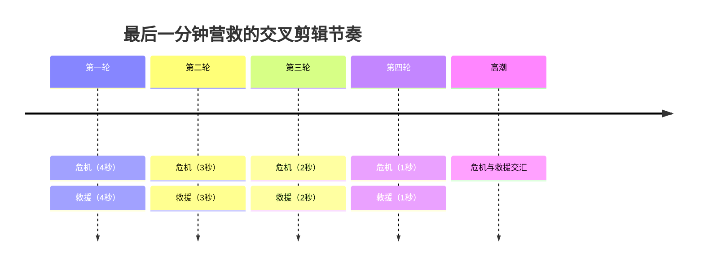

# 第05课：交叉剪辑

## 学习目标

- 理解交叉剪辑（Cross-Cutting）的定义及其与平行剪辑（Parallel Editing）的区别
- 掌握"最后一分钟营救"的悬念制造原理与节奏控制方法
- 了解格里菲斯（D.W. Griffith）在交叉剪辑发展史上的开创性贡献
- 学会在多线叙事中运用交叉剪辑策略

## 核心概念

### 交叉剪辑的定义与目的

交叉剪辑（Cross-Cutting），也称交叉剪接或交替剪辑，是一种在两个或多个不同场景之间交替切换的剪辑手法。英文中也常称为 Parallel Editing（平行剪辑），但这两个术语存在细微差别，后文将详细辨析。

交叉剪辑的核心目的是让观众同时感知多条故事线的进展，并在它们之间建立心理联系。当观众看到两个场景交替出现时，会本能地在它们之间寻找因果或主题关联，这正是交叉剪辑的叙事力量所在。

### 平行剪辑与交叉剪辑的区别

许多教材将 Cross-Cutting 与 Parallel Editing 混用，但在精确的技术讨论中，二者存在以下区别：

| 维度 | 平行剪辑 (Parallel Editing) | 交叉剪辑 (Cross-Cutting) |
|------|-----------------------------|--------------------------|
| 核心含义 | 强调两条或多条线索在时间上的**同时性** | 强调镜头在不同空间之间的**交替切换**动作本身 |
| 时间关系 | 通常暗示事件同时发生 | 不一定同时，可以是闪回、闪进或不同时间线 |
| 剪辑节奏 | 节奏可以保持稳定 | 常伴随渐进的节奏变化，尤其是悬念场景 |
| 叙事目的 | 展示"同一时间不同地点"的并列关系 | 制造对比、平行、悬念或主题呼应 |

简言之：平行剪辑关注的是"同时发生"这一时间关系，而交叉剪辑关注的是"交替呈现"这一剪辑操作。在实际创作中，剪辑师往往同时运用两种概念。

### "最后一分钟营救"与悬念制造

"最后一分钟营救"（Last-Minute Rescue）是交叉剪辑最经典的悬念模式。其基本结构如下：

1. **建立危机**：展示受害者面临迫在眉睫的危险
2. **引入救援**：展示救援者正在赶来的路上
3. **交替呈现**：在危机场景和救援场景之间来回切换
4. **加速节奏**：随着截止时间逼近，切换频率逐渐加快
5. **高潮汇合**：救援者在最后一刻赶到，危机化解

这种手法之所以有效，是因为它利用了观众的心理时间感受。当危机场景和救援场景交替呈现时，观众的焦虑感会随着剪辑节奏的加快而持续累积。

> [!NOTE] 格里菲斯与交叉剪辑的起源
> 交叉剪辑并非由某一个人发明，但美国导演 D.W. 格里菲斯（D.W. Griffith）在1915年的《一个国家的诞生》（The Birth of a Nation）中将其推向成熟。格里菲斯在片中运用交叉剪辑来制造悬念——尤其是著名的"救援场景"中，他在受威胁的家庭和赶来的骑兵队之间交替切换，建立了这一手法的经典范式。电影史学家普遍认为这是叙事剪辑发展的重要里程碑。格里菲斯的另一部作品《党同伐异》（Intolerance, 1916）更是将交叉剪辑发挥到极致，在四个不同历史时代的故事之间交叉切换。

### 节奏控制技巧

交叉剪辑的效果很大程度上取决于节奏控制。以下是关键原则：

- **起始节奏宜慢**：在悬念建立初期，给观众足够时间理解每个场景的空间和情境
- **逐渐加快**：随着紧张感升级，逐渐缩短每个镜头的持续时间
- **利用关键事件加速**：某个场景中发生重大事件时，可以突然加速切换频率
- **节奏变化制造意外**：在加速过程中突然放慢，可以制造强烈的戏剧性转折

### 多线叙事中的交叉剪辑策略

当代电影中，交叉剪辑不仅用于制造悬念，还广泛用于多线叙事（Multi-Plot Narrative）：

- **主题交叉**：在不同故事线之间建立主题联系，而非因果关系。如《撞车》（Crash）通过交叉剪辑揭示种族主题
- **时间交叉**：在不同时间线之间切换，如《教父2》（The Godfather Part II）在年轻维多和迈克尔两条时间线之间交叉
- **对比交叉**：展示不同角色面对相似情境的不同反应，强化戏剧对比

> [!TIP] 实战建议
> 在剪辑多线叙事时，建议先分别剪辑每条故事线，再通过交叉剪辑将它们编织到一起。注意每条故事线应该有独立的视觉风格或色彩基调，帮助观众在切换时快速定位。同时，每条故事线的长度比例应有所控制——不要让某条线占据过多时间，以免观众忘记另一条线的进展。

## 自测题

> [!QUESTION] 为什么"最后一分钟营救"中剪辑节奏要逐渐加快？如果全程保持同样节奏会有什么问题？

查看答案

逐渐加快的节奏模拟了观众心理紧张程度的递增。随着截止时间逼近，观众对时间的感知被压缩，更快的切换频率传达了"来不及了"的紧迫感。

如果全程保持同样的节奏，会产生以下问题：
1. 缺乏紧张感的累积——观众无法感受到"越来越危险"的心理变化
2. 高潮与低潮无法区分——每个镜头段落的重量相等，削弱了戏剧冲击力
3. 节奏变成机械重复——观众会习惯这种模式，从而降低注意力

速度变化本身就在"讲故事"，这是交叉剪辑最强大的叙事工具之一。

## 下一步

完成本课后，建议学习 [[0006-qie-chu-yu-cha-ru|第06课：切出与插入]]，了解如何通过切出镜头和插入镜头进一步丰富剪辑的叙事层次。也可以回顾 [[0004-tiao-qie|第04课：跳切]]，对比跳切与交叉剪辑在节奏处理上的不同思路。