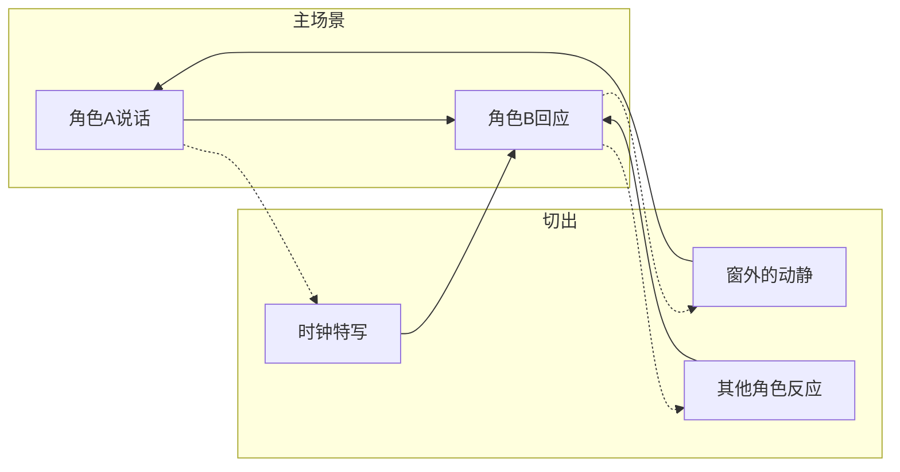

# 第06课：切出与插入

## 学习目标

- 理解切出镜头（Cutaway）与插入镜头（Insert）的定义及其核心区别
- 掌握切出镜头的四大功能：压缩时间、掩饰跳跃、提供信息、制造悬念
- 理解插入镜头的叙事力量：揭示信息、强调情感、设置伏笔
- 能够在剪辑实践中准确判断何时使用切出、何时使用插入

## 核心概念

### 切出镜头（Cutaway）的定义与用途

切出镜头（Cutaway Shot，简称 Cutaway）是指摄影机离开主要动作，去展示与场景相关的其他内容，然后再切回主要动作。

切出的关键特征是：它展示的是**主要动作空间之外**的内容。例如：

- 两人对话时，切向窗外路过的行人
- 主角紧张等待时，切向墙上的时钟
- 角色倾听时，切向远处传来的声音来源

### 切出镜头的四大功能

| 功能 | 说明 | 典型场景 |
|------|------|----------|
| 压缩时间 (Compress Time) | 切出可以掩盖实际时间的流逝，让观众感觉不到跳跃 | 角色开车出发，切出标志性建筑，再切回时已到达目的地 |
| 掩饰跳跃 (Cover Jump) | 在素材不够完美时，用切出遮盖两个镜头间的不连贯 | 两个同机位同景别的镜头之间插入切出，制造流畅感 |
| 提供信息 (Provide Information) | 向观众展示主场景之外的信息，丰富叙事层次 | 侦探讨论案情时，切出真凶在暗处偷听的画面 |
| 制造悬念 (Create Suspense) | 展示观众知道但角色不知道的信息，制造戏剧反讽 | 角色即将开门，切出门后潜伏的危险 |

> [!TIP] 切出的节奏感
> 优秀的切出不是随意插入的，而是有节奏的。剪辑师通常会寻找主场景中的"呼吸点"——也就是观众注意力稍有松弛的瞬间——来安排切出。切出的时长也有讲究：信息性切出可以短一些（1-2秒），氛围性切出可以适当延长（3-5秒）。

### 插入镜头（Insert）的定义与用途

插入镜头（Insert Shot）是指摄影机聚焦于主要场景中某个**细节**的特写镜头。与切出不同，插入镜头展示的内容**仍然位于主要场景的空间内**，只是改变了观众的关注焦点。

- 角色查看手机时，插入手机屏幕的特写
- 角色准备开枪时，插入手指扣在扳机上的细节
- 场景中出现一封信，插入信上文字的镜头

### 特写插入的叙事力量

插入镜头虽然只是一个细节放大，却承载着强大的叙事功能：

1. **揭示关键信息**（Reveal Critical Information）：让观众看到角色未能察觉的细节。例如在悬疑片中，插入一个被忽略的线索特写。
2. **强调情感**（Emphasize Emotion）：通过细节放大人物的内心状态。颤抖的手、紧握的拳头、滑落的眼泪——这些细节替代了台词的表达。
3. **设置伏笔**（Foreshadowing）：在早期场景中插入看似无关的细节，后期揭示其重要性。这是"契诃夫之枪"（Chekhov's Gun）原则在剪辑层面的体现。
4. **打断节奏**（Break Rhythm）：在快速剪辑中插入一个静态细节特写，可以制造短暂的喘息空间。

### 插入镜头与切出镜头的区别

| 维度 | 插入镜头 (Insert) | 切出镜头 (Cutaway) |
|------|-------------------|-------------------|
| 空间关系 | 存在于主要场景**内部** | 指向主要场景**外部** |
| 景别 | 通常是特写或大特写 | 任何景别均可 |
| 功能侧重 | 放大细节、强调情感 | 提供额外信息、压缩时间 |
| 对主场景的影响 | 强化主场景 | 暂离主场景 |
| 观众感知 | "让我看清楚这个" | "让我看看别处在发生什么" |

> [!NOTE] 一个容易混淆的例子
> 假设角色正在厨房做饭：
> - 插入镜头：切向锅里正在沸腾的汤的特写（仍在厨房空间内）
> - 切出镜头：切向客厅里孩子在玩耍的画面（离开厨房空间）
> 
> 区分两者的关键在于：镜头内容是否与当前角色共享同一物理空间。

## 自测题

> [!QUESTION] 某场戏中，主角正在阅读一封来信。剪辑师分别使用了以下两个镜头：
> 1. 镜头A：信纸上文字的特写
> 2. 镜头B：窗外阴雨天气的空镜
> 请问哪个是插入镜头，哪个是切出镜头？为什么？

查看答案

- **镜头A**（信纸文字特写）是**插入镜头**。因为它展示的内容（信纸）位于主要场景的空间内部——主角正在阅读这封信，信纸是场景中的一部分。插入的目的是让观众看清关键信息。

- **镜头B**（窗外阴雨天气）是**切出镜头**。因为它展示的是主要动作空间之外的内容。窗外天气虽然与场景氛围相关，但它位于不同空间。切出的目的可能是营造情绪氛围或暗示主角的内心状态。

需要注意的是：插入和切出的区别并不取决于景别大小，而是取决于**是否与主要角色共享同一物理空间**。

## 下一步

完成本课后，建议学习 [[0005-jiao-cha-jian-ji|第05课：交叉剪辑]]，理解如何在多场景之间交替切换，与切出/插入形成互补。接下来可以进入 [[0007-ying-qie-yu-tu-qie|第07课：硬切与突切]]，探索更具冲击力的剪辑手法。