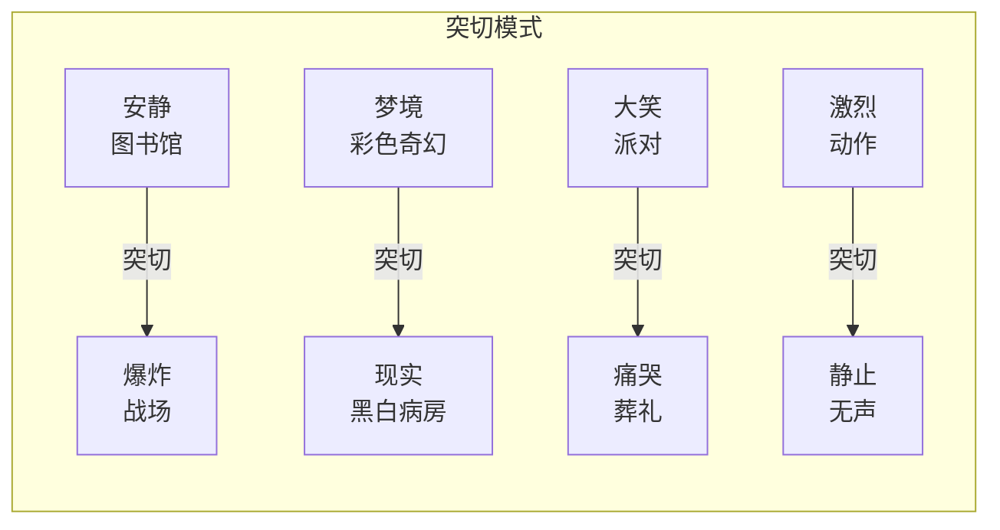

# 第07课：硬切与突切

## 学习目标

- 理解硬切（Hard Cut）与突切（Smash Cut）的定义及其区别
- 掌握突切制造冲击和对比效果的原理
- 了解从梦境/闪回中切出的经典用法
- 理解音量突切（Audio Smash Cut）的概念与应用

## 核心概念

### 硬切（Hard Cut）的定义

硬切（Hard Cut）是指从一个镜头直接切换到下一个镜头，不使用任何光学过渡效果（如溶化 Dissolve、划变 Wipe、淡入淡出 Fade）。硬切是电影剪辑中最基础、最常见的切换方式。

在数字剪辑时代，几乎所有的剪辑操作默认都是硬切，因此它往往不被视为一种"技巧"。但在叙事语境中，有意识地使用硬切——尤其是在观众预期会看到过渡效果的地方使用硬切——可以产生独特的冲击力。

### 突切（Smash Cut）的定义与效果

突切（Smash Cut）是硬切的一种特殊形式，特指从一个极端状态突然切换到另一个极端状态，制造强烈的戏剧性对比或冲击。突切的核心在于**反差最大化**。

常见的突切类型：

| 类型 | 第一个镜头 | 第二个镜头 | 效果 |
|------|-----------|-----------|------|
| 静→暴 | 安静的日常场景 | 突然的暴力/灾难 | 震惊观众，打破安全预期 |
| 暴→静 | 激烈的动作高潮 | 突然的静止/安静 | 制造失重感，让观众感受余波 |
| 笑→悲 | 喜剧/欢乐时刻 | 悲剧/悲伤揭示 | 情绪急转直下 |
| 梦境→现实 | 奇幻的梦境场景 | 平淡/压抑的现实 | 突出梦境与现实的落差 |
| 年轻→年老 | 角色年轻时 | 同一角色年老时 | 时间流逝的强烈冲击 |

> [!NOTE] 突切的心理学基础
> 突切之所以有效，是因为人类大脑对突变极其敏感。从进化心理学角度看，环境中突然的变化（巨响、快速移动、光线骤变）往往意味着危险，因此大脑会立刻将注意力完全转移到新刺激上。剪辑师利用这一本能反应，在叙事的关键节点通过突切来"强迫"观众集中注意力。
>
> 库布里克（Stanley Kubrick）在《2001太空漫游》中著名的"骨头到太空船"突切——猿人抛向空中的骨头直接切换为太空飞船——就是利用了两个镜头在外形上的相似性（匹配切 Match Cut）和内涵上的巨大反差（突切），同时实现了流畅与冲击两种效果。

### 从梦境/闪回中切出的经典用法

梦境或闪回场景的切出是突切最经典的运用场景之一。这里的核心技术问题是：**如何让观众感知到"回到现实"的瞬间冲击？**

常见手法有两种：

1. **节奏反差法**：梦境中节奏缓慢、画面柔和，切回现实时使用硬切，配合突然的环境声或静音。
2. **元素呼应法**：梦境中的某个元素（声音、物体、台词）在现实中出现，成为切出的触发点。

大卫·林奇（David Lynch）在《穆赫兰道》（Mulholland Drive）中运用了大量从梦境到现实的突切。林奇的手法特点是不给观众任何过渡准备——没有淡出、没有音效提示，直接从梦幻场景硬切到现实场景。这种处理让观众与主角一起经历那种从梦中惊醒的迷失和不安。

> [!TIP] 梦境切出的节奏控制
> 在处理梦境/闪回场景时，不要急于切出。给梦境场景足够的时间让观众"沉浸"进去，突切的效果才会更强。具体来说：
> 1. 建立梦境：用柔和的过渡方式（如溶解）进入梦境
> 2. 沉浸梦境：让场景持续至少15-20秒，建立稳定的梦境节奏
> 3. 突切打断：在梦境中的某个关键时刻突然切回现实
> 4. 留白处理：切回现实后，给角色（和观众）1-2秒的反应时间，让冲击感沉淀

### 音量突切（Audio Smash Cut）

音量突切（Audio Smash Cut）是突切在声音设计层面的延伸。其核心特征是：**画面还没到，声音已经爆裂**——或反过来，画面已经切换，但上一场景的声音突然消失。

- **先声后画**：画面仍是安静的A场景，但B场景的声音已经爆发。观众在视觉上还没有做好准备，听觉已经被拉入新场景。这种"声音先行"的手法本质上也是一种 [[0008-l-cut-yu-j-cut|J-Cut]] 的极端形式。
- **静音突切**：在嘈杂的场景中突然切至完全静音，制造令人不安的效果。科恩兄弟（Coen Brothers）经常使用此手法——当角色遭遇重大打击时，环境音被完全抽离。

音量突切打破了"画面和声音同步切换"的常规预期，让声音成为独立的叙事工具，而不仅仅是画面的附属。

## 自测题

> [!QUESTION] 你正在剪辑一场戏：主角在喧闹的夜店中喝酒，镜头特写他的脸。下一个镜头是他第二天早上在安静的卧室中醒来，宿醉头痛。
> 1. 如果使用突切，你会如何设计从夜店到卧室的转换？
> 2. 如果使用音量突切（Audio Smash Cut），还有哪些创意可能？
> 3. 如果需要强调"昨晚喝断片了"的感觉，突切和音量突切应该如何组合使用？

查看答案

**1. 基础突切设计**：
从夜店中最热闹的时刻——音乐最响、灯光最闪——直接硬切到卧室的安静画面。景别上从夜店的特写切到卧室的中景或全景，让观众感受到空间和情绪的巨大落差。

**2. 音量突切创意**：
- 画面仍是夜店特写，但声音已经切到早晨的安静（只有时钟滴答声或鸟鸣）——制造"声音先于画面回到现实"的效果，暗示主角的意识已经开始模糊
- 或者画面已切到卧室，但夜店的音乐仍在继续——然后突然中断，模拟耳鸣消退的过程

**3. 组合方案**：
- 第一步：在夜店场景中，先做音量突切——音乐突然降低到几乎听不见，但画面仍在夜店（"断片"的感觉）
- 第二步：画面硬切到卧室，同时声音彻底安静（"断片后的空白"）
- 第三步：几秒钟后，逐渐加入环境音（时钟、街道噪音），让观众和角色一起"慢慢回到现实"

这种组合手法可以非常好地模拟醉酒断片的主观体验——先是听不清，然后是记不起，最后是宿醉的清醒。

## 下一步

完成本课后，建议学习 [[0008-l-cut-yu-j-cut|第08课：L-Cut与J-Cut]]，进一步理解声音与画面不同步切换的精细控制技巧。也可以回顾 [[0004-tiao-qie|第04课：跳切]]，对比跳切与突切在制造断裂感时的不同逻辑。