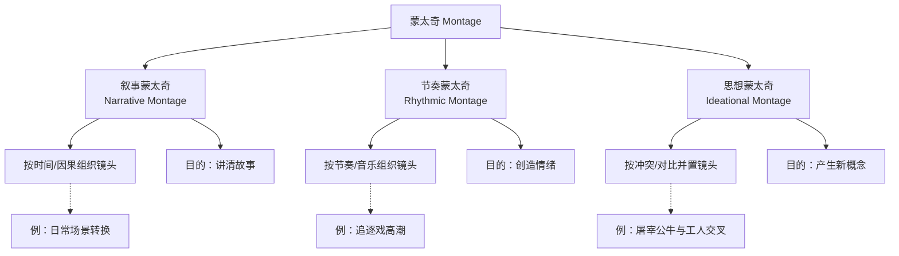

# 第09课：蒙太奇

## 学习目标

- 理解蒙太奇（Montage）的核心定义：通过镜头组合创造大于个体之和的新含义
- 掌握苏联蒙太奇理论的两大支柱：库里肖夫效应（Kuleshov Effect）与爱森斯坦的吸引力蒙太奇（Montage of Attractions）
- 区分叙事蒙太奇、节奏蒙太奇与思想蒙太奇三类剪辑方式
- 理解蒙太奇段落中音乐与节奏的配合原理
- 掌握蒙太奇的时间压缩功能及其在叙事中的应用

## 核心概念

### 蒙太奇的定义：1 + 1 > 2

"蒙太奇"（Montage）源自法语词汇"monter"，本意为"装配"或"安装"。在电影语境中，蒙太奇指的是通过将不同镜头组合、剪辑在一起，创造出单个镜头本身不具备的全新含义。其核心公式是：**镜头A + 镜头B = 含义C**，而含义C远远大于A与B的简单相加。

这一原理决定了剪辑不仅仅是"把片段接起来"的技术工作，而是一种 **创造意义** 的创作过程。两个看起来毫无关联的镜头，一旦被并置在一起，观众的大脑会自动寻找它们之间的逻辑关系，从而产生新的理解。

> [!NOTE] 关键洞察
> 蒙太奇的力量不在于镜头本身的内容，而在于镜头之间的"关系"。剪辑师的工作本质上是 **关系设计**（Relationship Design）——决定每个镜头与前后镜头之间产生什么样的碰撞、对话或共鸣。

### 苏联蒙太奇理论

20世纪20年代，苏联电影学派将蒙太奇推向了前所未有的理论高度，其中最重要的两个发现是：

#### 库里肖夫效应（Kuleshov Effect）

苏联电影人列夫·库里肖夫（Lev Kuleshov）做了一个经典实验：他将同一张演员面无表情的脸部分别与一碗汤、一口棺材和一个玩耍的女孩三个镜头剪辑在一起。观众观看后，纷纷称赞演员"演得好"——面对汤时表现出"饥饿"，面对棺材时表现出"悲伤"，面对女孩时表现出"喜悦"。

这个实验揭示了一个革命性的原理：**观众对镜头含义的解读，根本上取决于前后镜头的上下文关系**。同一个镜头在不同的剪辑语境中，可以产生完全相反的情感解读。这就是蒙太奇作为意义创造工具的终极证明。

#### 爱森斯坦的吸引力蒙太奇（Montage of Attractions）

谢尔盖·爱森斯坦（Sergei Eisenstein）进一步发展了蒙太奇理论。他认为蒙太奇不是镜头的"柔和连接"，而应该是 **镜头的冲突**——通过两个截然不同的镜头之间的碰撞，在观众脑海中迸发出全新的概念。

在他的电影《战舰波将金号》（Battleship Potemkin）中，著名的"敖德萨阶梯"段落就是将沙皇军队的行进镜头与平民惊慌逃命的镜头交替剪辑，创造出强烈的压迫感和恐怖感。更极端的是，他将一头狮子的雕像（沉睡-苏醒-站立）三个镜头强行剪辑在一起，让观众"看到"了一头因愤怒而站起的狮子。

### 三种蒙太奇的类型比较

| 类型 | 英文名称 | 核心目的 | 组合方式 | 典型案例 |
|------|---------|---------|---------|---------|
| 叙事蒙太奇 | Narrative Montage | 按时间顺序讲述故事 | 线性组合，强调因果关系 | 任何常规剧情片中的场景转换 |
| 节奏蒙太奇 | Rhythmic Montage | 通过剪辑节奏创造情绪 | 依据镜头长度与音乐节拍组合 | 追逐戏、动作高潮段落 |
| 思想蒙太奇 | Ideational Montage | 通过镜头冲突产生新概念 | 对比性或象征性镜头的并置 | 爱森斯坦的《罢工》中屠杀工人与屠宰公牛交叉剪辑 |

**叙事蒙太奇**（Narrative Montage）是最基础的蒙太奇形式，它按照事件发生的时间顺序或因果逻辑来组织镜头，目的是让观众清晰地理解故事的发展。

**节奏蒙太奇**（Rhythmic Montage）关注的是镜头的 **时长模式**——短的镜头创造紧张和兴奋，长的镜头创造平静和沉思。当节奏蒙太奇与音乐配合时，剪辑点往往会落在音乐的强拍上，形成视听同步的冲击力。

**思想蒙太奇**（Ideational Montage）是最抽象的蒙太奇形式。它通过将表面上不相关的镜头并置，迫使观众在脑海中形成某种比喻或概念。爱森斯坦称这种碰撞产生的结果为"第三种东西"——既不是A也不是B，而是从A与B的冲突中诞生的全新含义。

### 蒙太奇段落的音乐与节奏配合

在蒙太奇段落中，音乐不仅仅是背景装饰，它往往是 **剪辑的结构骨架**。剪辑师通常会先确定音乐的节奏型，然后根据音乐的节拍、乐句和段落来安排剪辑点。

具体操作方法包括：

- **按拍剪辑**（Cutting on Beat）：在音乐的每一个强拍上切换镜头，制造强烈的同步感
- **按乐句剪辑**（Cutting on Phrase）：在音乐的自然呼吸处切换，适合叙事性蒙太奇
- **按情绪高潮剪辑**：在音乐到达高潮点时切入最具冲击力的镜头

> [!TIP] 实践提示
> 在剪辑蒙太奇段落时，先不要看画面，只听音乐并在时间线上标记出关键节拍点。然后再将镜头素材对准这些标记位置。这种方法确保剪辑的节奏感永远服从于音乐的流动。

### 蒙太奇的时间压缩功能

蒙太奇最实用的功能之一是 **时间压缩**（Time Compression）。通过精心挑选的几个代表性镜头，剪辑师可以在几十秒内表现原本需要几小时、几天甚至几年的事件过程。

经典的"训练蒙太奇"就是时间压缩的完美范例：在《洛奇》（Rocky）中，西尔维斯特·史泰龙扮演的拳击手从凌晨起床、跑步、打沙袋到做俯卧撑的整个过程，通过一系列快节奏剪辑在短短三分钟内完成。观众不会觉得"跳跃"或"不完整"，反而通过这种压缩感受到了主角的坚持和蜕变。

时间压缩的关键在于选择 **最具代表性的瞬间**——不是展示整个过程，而是展示过程的"精华片段"，让观众的大脑自动补全中间的空缺。

## 经典案例：《战舰波将金号》敖德萨阶梯

爱森斯坦的《战舰波将金号》（1925）中的敖德萨阶梯段落是蒙太奇理论的终极实践。这个时长约6分钟的段落包含了超过150个剪辑，通过节奏不断加快的剪辑模式、反复出现的士兵靴子、倒下的母亲和滚落的婴儿车等意象，创造出令人窒息的紧张感。

值得注意的是，实际的敖德萨阶梯远没有电影中表现的那么长——爱森斯坦通过 **重复使用不同角度的相同动作**（同一群人反复走下同一段阶梯），创造出了一个"无限延伸"的恐怖空间。这正是蒙太奇重塑现实的力量。

## 自测题

> [!QUESTION] 根据库里肖夫效应，如果我们将一个演员微笑的镜头与以下三个镜头分别剪辑在一起，观众分别会如何解读演员的情绪？
> 1. 一片废墟
> 2. 刚刚出炉的美食
> 3. 一个哭泣的孩子

查看答案

根据库里肖夫效应，**同一个微笑镜头**在不同的上下文中会产生截然不同的解读：

1. **与废墟剪辑**：观众可能会认为演员在"冷笑"或"幸灾乐祸"（面对别人的不幸感到高兴）或者"精神异常"。
2. **与美食剪辑**：观众会认为演员在"愉悦地期待"或"满足地微笑"。
3. **与哭泣的孩子剪辑**：这会产生最复杂的解读——可能是"残忍地无视"，也可能是"安慰性地微笑"（试图用笑容安抚孩子）。

这个实验的核心启示是：**观众不是被动接收镜头内容的容器，而是主动参与意义建构的创作者**。剪辑师通过镜头之间的组合，可以引导观众得出导演想要的结论——无论原始素材本身是什么含义。

## 下一步

完成本课学习后，建议继续学习 [[0010-chang-jing-tou|第10课：长镜头]]，了解与蒙太奇完全对立的电影美学——通过保持时空连续性来创造真实感。同时可以回顾 [[0004-tiao-qie|第04课：跳切]]，理解另一种打破时间连续性的剪辑手法。