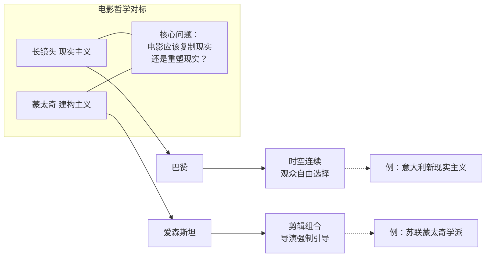

# 第10课：长镜头

## 学习目标

- 理解长镜头（Long Take / Plan-Sequence）的定义及其美学追求
- 掌握长镜头与蒙太奇之间的两种电影哲学对立
- 理解长镜头如何创造叙事沉浸感
- 分析经典长镜头案例的技术与艺术特点
- 掌握数字时代"隐藏剪辑"的常用技巧

## 核心概念

### 长镜头的定义与美学追求

长镜头（Long Take），在法语中称为"段落镜头"（Plan-Sequence），指的是一次连续的拍摄（通常超过30秒到数分钟不等），在拍摄过程中没有剪辑中断。与蒙太奇通过拼接镜头来创造意义不同，长镜头追求的是 **时空的完整连续性**（Spatiotemporal Continuity）。

长镜头的核心美学追求包括：

- **时空统一**：摄影机启动到停止之间的时间与实际经过的时间完全重合，空间也是连续的
- **真实感**：没有剪辑意味着没有人为操控的痕迹，观众"看到"的就是实际发生的
- **沉浸感**：观众不会被剪辑打断，他们可以全身心投入到场景的氛围中
- **动态构图**：通过摄影机运动（轨道、斯坦尼康、手持）来不断重新构图，取代剪辑的切换功能

> [!NOTE] 关键洞察
> 长镜头并非"什么都不做"——它只是将剪辑师的工作从剪辑室转移到了拍摄现场。在长镜头中，剪辑的"切口"被替换为摄影机的运动、演员的走位、灯光的变化和焦点的转移。长镜头本质上是一种 **在镜头内部完成的蒙太奇**（Montage Inside the Frame）。

### 长镜头 vs 蒙太奇：两种电影哲学

长镜头与蒙太奇代表了两套截然不同的电影哲学，它们构成了电影美学史上最核心的辩论之一。

| 维度 | 长镜头美学 | 蒙太奇美学 |
|------|-----------|-----------|
| 哲学根源 | 现实主义（Realism） | 建构主义（Constructivism） |
| 代表人物 | 安德烈·巴赞（Andre Bazin） | 谢尔盖·爱森斯坦（Sergei Eisenstein） |
| 时间观 | 尊重真实时间的流逝 | 通过剪辑重构时间 |
| 空间观 | 保持空间的完整性 | 通过镜头组合重塑空间 |
| 观众角色 | 主动选择——观众自己决定看什么 | 被动引导——导演强行带观众看什么 |
| 真实感来源 | "发生了什么"就是"看到了什么" | "剪辑在一起的就是真实" |

法国电影理论家安德烈·巴赞（Andre Bazin）是长镜头美学的坚定捍卫者。他认为电影的本质是 **复制现实**（Reproduction of Reality），而蒙太奇则破坏了现实的完整性。巴赞提出"景深镜头与长镜头"理论，认为只有在时空不被切割的情况下，观众才能自由选择关注画面中的哪个细节。

而爱森斯坦则认为电影的本质是 **塑造现实**（Sculpting Reality），通过剪辑的组合与冲突创造出现实本身不具有的含义。两人各执一端，但都深刻地影响了后来电影语言的发展方向。

### 长镜头的叙事沉浸感

长镜头最显著的叙事优势是 **沉浸感**（Immersion）。当你观看一镜到底（One-shot）的段落时，你会产生一种"实时在场"的感觉——你没有被剪辑师"拉出去"重新定位，而是始终被锁定在一个连续的空间和时间中。

这种沉浸感在以下场景中尤其有效：

- **紧张追逐**：连续镜头让追逐显得没有喘息机会（《人类之子》车中长镜头）
- **战争场面**：对战的混乱和持续性通过连续镜头更真实（《1917》战壕奔跑）
- **开场定调**：用一个长镜头建立整个世界的空间关系（《历劫佳人》开场）
- **情绪累积**：不打断的表演让情感累积到爆发点（《鸟人》后台行走）

一个设计精良的长镜头会让观众完全忘记摄影机的存在，沉浸在故事中。反之，一个设计糟糕的长镜头只会让观众不断思考"这个镜头到底有多长"——这是长镜头的大忌。

> [!WARNING] 常见陷阱
> 长镜头不是越长越好。当一个长镜头没有内在的戏剧张力和视觉变化时，观众会感到无聊。长镜头的长度必须与场景的戏剧能量相匹配——当场景的能量耗尽时，就是该"剪辑"的时刻（即使是在长镜头内部，也需要通过摄影机运动或演员走位来创造新的视觉焦点）。

### 经典案例

#### 《1917》：全片伪一镜到底

萨姆·门德斯（Sam Mendes）执导的《1917》（2019）以其"全片一镜到底"的呈现方式闻名。实际上，影片并非真正的单次拍摄——它由多个长镜头拼接而成，每个长镜头最长约9分钟。

影片的剪辑团队通过"隐藏剪辑"（Invisible Cuts）将这些长段落无缝衔接。最常用的技巧包括：

1. **遮挡物转场**：当角色走过一棵树或墙壁时，画面完全变黑的一瞬间进行剪辑
2. **天空转场**：镜头甩向天空，画面过曝时进行剪辑
3. **CG融合**：利用数字技术将两个镜头的首尾帧进行过渡融合

#### 《鸟人》：后台与舞台的虚实交织

亚利桑德罗·冈萨雷斯·伊纳里图（Alejandro G. Inarritu）的《鸟人》（2014）同样采用"伪一镜到底"结构。影片的剪辑师道格拉斯·克瑞斯（Douglas Crise）和斯蒂芬·米廖内（Stephen Mirrione）通过精密的隐藏剪辑将一个个长达10分钟的长镜头拼接在一起。

《鸟人》的长镜头独特之处在于，它利用长镜头的连续性来模糊 **现实与幻觉的边界**——主角在后台走廊中行走，镜头跟随他穿过一扇门，下一秒他已经站在了舞台之上。观众无法确定这中间"跳过了多长时间"，这种不确定性恰恰是影片想要表达的主题。

#### 《历劫佳人》开场：长镜头的教科书

奥逊·威尔斯（Orson Welles）的《历劫佳人》（Touch of Evil, 1958）开场是一个3分20秒的长镜头：摄影机从放置炸弹的手开始，跟随着一对夫妇穿过边境小镇的街道，最终到达目的地，炸弹爆炸。

这个镜头的精妙之处在于，它同时完成了多项任务：
- 建立了小镇的空间布局
- 引入了主要角色关系
- 设定了炸弹的悬念（观众知道炸弹存在但角色不知道）
- 营造了闷热不安的氛围

### 数字时代长镜头的"隐藏剪辑"技巧

在数字时代，剪辑师发展出了一套成熟的"隐藏剪辑"（Invisible Cut）技术，让看似一镜到底的段落通过巧妙的技巧实现无缝转场。以下是四种最常见的隐藏剪辑方法：

| 技巧 | 英文名称 | 原理 | 适用场景 |
|------|---------|------|---------|
| 暗缝 | Wipe to Black | 利用物体或墙壁完全遮挡画面的瞬间剪辑 | 人物走过树干、柱子等前景物体时 |
| 甩镜转场 | Swish Pan | 快速摇摄导致画面完全模糊的瞬间剪辑 | 快速转身或追逐转向时 |
| 过曝转场 | Overexposure Cut | 镜头指向强光源导致画面过曝的瞬间剪辑 | 从室内走向室外、打开窗户时 |
| CG融合 | CG Blend | 数字合成两个镜头的首尾帧并做渐变过渡 | 上述技巧均不可用时 |

最关键的原则是：**剪辑必须发生在观众的注意力被其他元素吸引的时刻**。当观众正在关注角色表情或动作时，背景中的一次遮挡或甩镜就自然地"藏"起了一个剪辑点。

## 自测题

> [!QUESTION] 假设你需要为一个3分钟的餐厅对话场景设计长镜头，但实际条件限制你每次只能拍摄45秒。请列出至少三种"隐藏剪辑"方案，让最终拼接看起来是一个完整的长镜头。

查看答案

以下是可以使用的三种隐藏剪辑方案：

**方案一：利用服务员上菜做遮挡**
当服务员端着托盘从摄影机前走过时，画面被完全遮挡的一瞬间进行剪辑。剪入从不同角度或不同时间拍摄的片段。观众会认为这只是"服务员经过了一下"。

**方案二：利用摄影机甩向窗外**
让摄影机从角色A的脸上摇向窗户（窗外阳光强烈导致过曝），在过曝的瞬间剪辑。等从窗户摇回角色B时，已经是另一条拍摄片段。观众会以为这只是"看了一眼窗外"。

**方案三：利用角色的背影遮挡**
让某位角色起身离开餐桌，走向摄影机，其背部完全遮挡画面（暗缝），此时剪辑。下一段从同样的暗缝状态开始，角色走开，露出不同的场景状态（例如菜品已经上齐，或时间已到黄昏）。

隐藏剪辑的黄金法则是：**操纵注意力，而不是隐藏技术**。观众不会注意到一个剪辑，前提是他们的注意力被故事或角色所吸引。

## 下一步

完成本课学习后，建议继续学习 [[0011-qing-gan-jian-ji|第11课：情感剪辑]]，探索剪辑如何通过节奏、时长和镜头选择来操控观众的情感反应。也可回顾 [[0009-meng-tai-qi|第09课：蒙太奇]]，对比这两种截然不同的电影哲学。