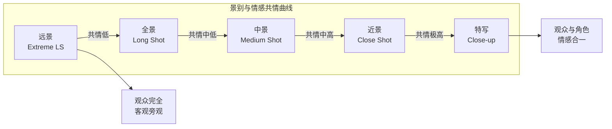

# 第11课：情感剪辑

## 学习目标

- 理解情感剪辑（Emotional Editing）的核心目标：以观众情感反应为导向，而非以逻辑清晰为目标
- 掌握节奏与时长如何影响观众与角色之间的情感共情深度
- 理解"留白"（Pacing Gap）在情感剪辑中的作用机制
- 学会从多条表演素材中选取最佳瞬间
- 掌握利用景别控制观众共情程度的方法
- 理解剪辑的"呼吸感"——何时收紧节奏制造紧张，何时放松给观众喘息

## 核心概念

### 情感剪辑：以情感为第一优先级

传统剪辑的首要目标是 **叙事清晰度**——确保观众理解"谁在哪里做了什么"。而情感剪辑（Emotional Editing）则将优先级完全颠倒：**第一优先是观众的情感反应，叙事清晰度是次要的**。

这意味着，有时候剪辑师会选择一条在时间线上"不合理"的镜头，只因为它在情感上更有冲击力；有时候剪辑师会故意"打破"轴线规则，只因为打破规则的那一刻能制造更大的情绪波动。

情感剪辑的核心理念是：观众走出影院后，他们记住的不是"这个情节的逻辑"，而是"当时的感觉"。剪辑师的工作就是设计这些"感觉"。

> [!NOTE] 关键洞察
> 逻辑是通往大脑的，情感是通往心的。剪辑的最终目标不是让观众"理解"，而是让观众"感受"。如果必须在"观众明白发生了什么"和"观众感受到了什么"之间做选择，情感剪辑永远选择后者。

### 节奏与时长对情感的影响

镜头的时长（Duration）直接决定了观众与角色之间的情感共情（Empathy）深度。这一原理可以用一条简单的曲线来表示：

- **极短镜头（< 1秒）**：产生兴奋和紧张感，但阻止深度共情
- **中等镜头（1-3秒）**：舒适的叙事节奏，观众有足够时间读取信息
- **长镜头（3-10秒）**：开始产生角色共情，观众有足够时间观察角色的表情和心理变化
- **超长镜头（> 10秒）**：深度共情，观众"进入"角色的内心世界

剪辑师可以通过控制镜头长度来"调节"观众对某一角色的情感投入程度。

| 剪辑节奏 | 镜头平均时长 | 情感效果 | 适用场景 |
|---------|------------|---------|---------|
| 急骤式剪辑 | 0.5 - 1.5秒 | 兴奋、焦虑、紧迫感 | 动作戏、追逐、恐慌段落 |
| 正常叙事节奏 | 2 - 4秒 | 舒适、清楚、中性 | 对话场景、日常叙事 |
| 缓慢节奏 | 5 - 10秒 | 沉思、沉重、情感深度 | 浪漫场景、悲伤段落 |
| 静止节奏 | 10秒以上 | 压抑、窒息、或宁静 | 戏剧高潮、角色独处 |

### 留白的力量

在情感剪辑中，"留白"（Gap / Pause）是一个被初学者严重低估的工具。留白指的是在剪辑中刻意留下的 **沉默、空旷或静止的段落**——没有对白、没有动作、没有音乐，只有画面和氛围。

留白在情感发酵中扮演着不可替代的角色：

- **悲伤场景**：角色说出震撼性话语后，留出3-5秒的空镜头（窗外的雨、空荡荡的房间），让观众的悲伤情绪"发酵"
- **紧张场景**：在危机爆发前，突然插入一个"安静的时刻"，让观众的心悬起来
- **喜剧节奏**：关键笑点前后的短暂停顿（Beat），让观众有时间反应和笑
- **重大发现**：角色发现关键信息后，不急于切下一场戏，而是"停在"反应上

> [!TIP] 实践提示
> 剪辑师常见的错误是"切得太快"——刚拍完一个情感高潮就立刻切换到下一个场景。记住：**高潮不在行动中，而在反应里**（The emotion is in the reaction, not the action）。你的角色被震撼到了，那就给观众时间看他的震撼。你的角色悲伤到了，那就让观众陪他一起呼吸空气里的悲伤。

### 表演的剪辑选择

情感剪辑的核心工作之一是从多条拍摄素材（Takes）中选取最佳表演瞬间。典型的好莱坞剧情片会从3-10条拍摄素材中挑选每一段的最佳组合。

这个过程通常分为两步：

1. **选条（Selecting）**：通看所有素材，标记出每一条中表演最出色的段落
2. **拼合（Assembling）**：从不同条中选取最佳片段，拼合成完整的场景

举例来说，一场对话场景可能涉及三个不同的表演时刻：A条的"情绪积累"部分更好，B条的"情绪爆发"部分更好，C条的"情绪消退"部分更好。情感剪辑师会从三条中分别取出一段，拼接成一条"黄金表演"。

> [!WARNING] 常见陷阱
> 并不是所有"好表演"都需要被保留。有时候一个演员演得"太过"或者演绎方向与整体基调不符，即使是技术上最好的表演也必须被舍弃。剪辑师的选择标准不是"哪条更好"，而是"哪条更适合这个场景的情感目标"。

### 景别与情感距离

剪辑师可以通过景别（Shot Scale）的变化来控制观众对角色情感的共情程度：

- **特写（Close-up）**：拉近情感距离，观众无法逃避角色的情绪细节
- **中景（Medium Shot）**：适中的情感距离，观众观察但不被"侵入"
- **全景（Wide Shot / Long Shot）**：疏离情感，让观众保持客观观察者的姿态
- **远景（Extreme Long Shot）**：情感抽离，角色变得渺小，观众以"上帝视角"观看

经典的剪辑策略是：在情感高潮时 **切至特写**（Push to Close-up），在情感需要释放时 **拉至全景**（Pull to Wide Shot）。通过这种景别的"推拉"，剪辑师成为观众情感的遥控器。

### 剪辑的"呼吸感"

剪辑的"呼吸感"（Breathing Rhythm）是情感剪辑中最微妙的概念之一。它指的是剪辑节奏像人类呼吸一样，有 **紧张的吸入期** 和 **放松的呼出期**，两者交替循环。

在剪辑实践中，"呼吸感"表现为：

- **收紧（Tighten）**：加快剪辑频率，使用更短的镜头，让观众屏住呼吸（对应"吸气"）
- **放松（Release）**：放慢剪辑频率，使用更长的镜头，让观众呼气（对应"呼气"）

一个没有"呼吸感"的剪辑段落会让人感到"窒息"——节奏一直很快，没有喘息的机会；或者相反，节奏一直很慢，没有起伏，让人昏昏欲睡。

优秀的情感剪辑师会为每一段设计清晰的"呼吸曲线"：紧张累积（吸气）--> 高潮释放（呼气）--> 平静恢复（深呼吸）--> 下一轮紧张累积。

## 经典案例：《沉默的羔羊》地下室追逐

在《沉默的羔羊》（The Silence of the Lambs, 1991）的高潮段落——克拉丽丝在杀手"水牛比尔"的地下室中摸索前进的场景中，剪辑师克雷格·麦凯（Craig McKay）展现了极精湛的情感剪辑技艺：

- **开始**：中景为主，节奏平稳，"正常"的紧张感
- **发现线索**：越来越紧的特写，剪辑频率逐渐加快
- **比尔突然出现**：快速切换多个极短镜头（0.5-1秒），制造惊吓效果
- **枪战之后**：突然放慢，插入一个长时间的空镜头——等待是否还活着
- **放松**：节奏恢复正常，但观众刚刚经历了从恐惧到解脱的完整曲线

这个段落的"呼吸曲线"是典型的：紧张-更紧张-爆发-突然停止-缓慢恢复。

## 自测题

> [!QUESTION] 你在剪辑一场"丈夫发现妻子出轨"的戏剧场景。妻子说出了关键台词"没错，我确实在骗你"。拍摄了两条素材：
> - A条：妻子说完台词后，镜头停留在丈夫脸上4秒钟，他慢慢从震惊变为愤怒
> - B条：妻子说完台词后，立即切到一个全景，丈夫起身离开房间
>
> 如果目标是最大化观众的情感共情，你会选择哪个版本？为什么？

查看答案

答案是 **选择A条**（留在丈夫脸上4秒），理由如下：

情感剪辑的核心原则是"高潮不在行动中，而在反应里"。丈夫的"反应"（从震惊到愤怒的转变过程）远比他的"行动"（离开房间）更具情感冲击力。

留在这张脸上的4秒钟会让观众完成以下心理过程：
- 第1秒：理解话语的含义（认知延迟）
- 第2秒：与丈夫一起"消化"这个消息
- 第3秒：开始感受到丈夫的震惊和痛苦
- 第4秒：预感到即将爆发的愤怒

而B条虽然推进了剧情（幕位推进），但它剥夺了观众与角色共同经历情感变化的机会。切到全景抽离了情感，观众变成了"在旁边看着有人离开房间"的旁观者，而不是"和丈夫一起感受痛苦"的共情者。

如果非要使用B条，更好的方案是：**先留在特写上3秒，再切到全景**——既让情感发酵，又完成了场景的转场。

## 下一步

完成本课学习后，建议继续学习 [[0012-gu-shi-xing-jian-ji|第12课：故事性剪辑]]，掌握如何通过信息揭示顺序、闪回和因果逻辑来构建叙事。也可回顾 [[0010-chang-jing-tou|第10课：长镜头]]，理解长镜头如何通过保持时空连续性来创造情感沉浸。