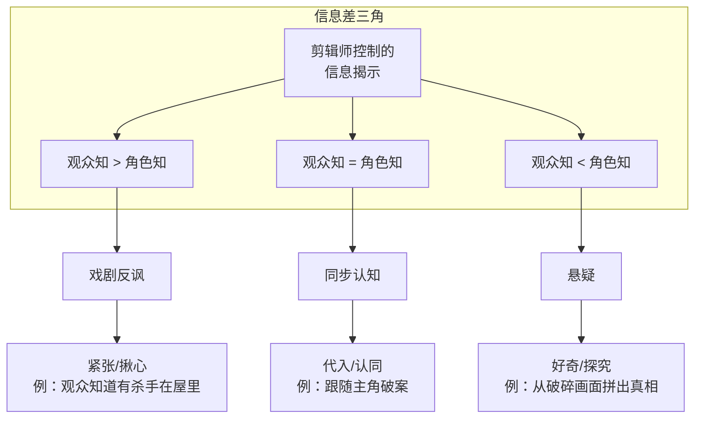
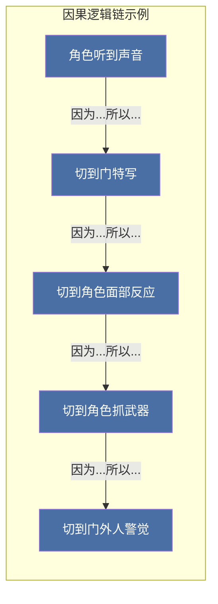

# 第12课：故事性剪辑

## 学习目标

- 理解信息揭示顺序对叙事效果的决定性影响
- 掌握通过剪辑控制"观众所知"与"角色所知"之间的信息差
- 理解红鲱鱼（Red Herring）与误导性剪辑在悬疑片中的应用
- 掌握闪回（Flashback）与闪前（Flash-forward）的剪辑处理技巧
- 理解保持叙事清晰度的核心原则
- 掌握因果逻辑链条在剪辑中的构建方法

## 核心概念

### 信息揭示的顺序决定叙事效果

故事性剪辑（Narrative Editing）的核心任务不是"把故事讲完"，而是 **决定以什么顺序、在什么时间、通过谁的视角来揭示信息**。同样的故事素材，不同的揭示顺序会产生截然不同的叙事效果。

考虑下面这个简单场景的两个剪辑版本：

- **线性版本**：A买花 --> A去见B --> A向B表白 --> B拒绝 --> A伤心回家
- **倒叙版本**：A伤心回家 --> （闪回）A买花 --> A见B --> A表白 --> B拒绝 --> （回到现在）A坐在空房间里

线性版本让观众跟随角色的行动线，情绪逐渐累积。倒叙版本则一开始就"剧透"了结果，观众的注意力从"结果会怎样"转移到"为什么会这样"——他们不再关心A是否成功，而是关注**过程中的每一个细节**，因为他们已经知道了结局。

> [!NOTE] 关键洞察
> 剪辑师的终极权力是 **控制观众"知道的时间点"**。当观众比角色知道得更多，产生的是"紧张感"（他会掉进坑里！）；当观众和角色知道得一样多，产生的是"代入感"（我跟他一起发现真相）；当观众比角色知道得更少，产生的是"好奇心"（到底发生了什么？）。

### 观众所知 vs 角色所知

故事性剪辑最强大的工具之一是 **信息差**（Information Gap）——即观众所知道的信息量与角色所知道的信息量之间的差异。根据这种差异的性质，可以产生三种不同的叙事效果：

| 信息差类型 | 观众信息量 vs 角色信息量 | 叙事效果 | 典型应用 |
|-----------|----------------------|---------|---------|
| 戏剧反讽 | 观众 > 角色 | 紧张感：观众知道角色即将遭遇危险但角色不知道 | 希区柯克的"炸弹理论" |
| 同步认知 | 观众 = 角色 | 代入感：观众与角色一同发现和体验 | 侦探片跟随主角查案 |
| 悬疑 | 观众 < 角色 | 好奇心：观众想知道"到底发生了什么" | 悬疑片的开场谜团 |

**戏剧反讽**（Dramatic Irony）是希区柯克最钟爱的技巧。他著名的"炸弹理论"说明了这一点：如果四个角色围坐在桌前聊天，突然炸弹爆炸了，观众得到的是"震惊"（持续15秒）。但如果剪辑师在对话开始前先给观众看了一颗炸弹正在桌下倒计时的镜头，然后回到四人聊天，那么同样十分钟的对话，观众会经历"极度的紧张"（持续10分钟）。**观众知道炸弹存在而角色不知道，这就是戏剧反讽的力量**。

### 红鲱鱼与误导性剪辑

**红鲱鱼**（Red Herring）是侦探和悬疑片中最经典的叙事技巧——它指的是故意插入误导性线索，引导观众做出错误的推断。在剪辑层面，红鲱鱼通过 **强调错误信息** 来实现误导。

误导性剪辑的常见手法包括：

- **故意强调**：给一个实际上无关紧要的角色或物品过多的特写镜头，让观众误以为它很重要
- **可疑的剪辑节奏**：当某个"无辜"角色出现时，剪辑节奏突然变化，制造"这个人有问题"的错觉
- **错误的因果关系**：将两个无关的事件交叉剪辑（Cross-cutting），让观众认为A导致了B，实际上A和B毫无关系
- **省略关键信息**：剪辑时故意"跳过"某个角色的反应，让观众以为这个角色"不在场"或"不知情"

最经典的案例之一是《非常嫌疑犯》（The Usual Suspects, 1995）——整部影片的剪辑都在"证明"凯文·史派西扮演的角色是一个无足轻重的边缘人物，直到最后一刻揭示他就是真正的幕后黑手"凯泽·苏泽"。剪辑师通过刻意弱化他的存在感、减少他的特写镜头、将他的反应镜头放置在不显眼的位置，成功地误导了所有观众。

> [!WARNING] 伦理边界
> 误导性剪辑必须服务于叙事目标，而不是纯粹为了"骗"观众。一个好的误导需要经得起第二次观看的检验——当观众看完结局再回头看时，应该发现"所有的线索都在那里，只是我的注意力被引导到了错误的方向"。**绝对不能使用"作弊剪辑"**（例如在一个时间线上展示了一个角色不可能看到的画面），那是对观众信任的破坏。

### 闪回与闪前的剪辑处理

**闪回**（Flashback）和**闪前**（Flash-forward）是叙事性剪辑中处理时间跳跃的两大工具。

| 特性 | 闪回 (Flashback) | 闪前 (Flash-forward) |
|------|-----------------|---------------------|
| 方向 | 回到过去 | 跳到未来 |
| 叙事功能 | 揭示背景、补充动机、解释现状 | 预兆、制造悬念、暗示结局 |
| 常见的剪辑信号 | 溶接（Dissolve）、焦点模糊、色调变化、声音延续 | 硬切（Hard Cut）、声音预告（Audio Flash）、色调突变 |
| 风险 | 过度使用会破坏当前叙事节奏 | 使用不当会剧透后续情节 |

闪回剪辑的四个黄金法则：

1. **要有触发点**：闪回不能凭空出现，必须有一个当下的"触发器"——一个味道、一个声音、一个物件，让观众明白"这个角色被某样东西触发了回忆"
2. **保持空间锚定**：当闪回结束时，必须给观众一个清晰的"回到现在"的视觉标记，避免时间线混淆
3. **控制时长和频率**：闪回越短越有效，越频繁越削弱冲击力
4. **声音先于画面**：在画面切到闪回之前，先让闪回场景的声音"提前"进入，帮助观众做好时间跳跃的心理准备

> [!TIP] 实践提示
> 处理闪回的剪辑信号时，"声音搭桥"（Sound Bridge）是最有效的方法之一：在当前场景快要结束时，提前切入闪回场景的声音（环境音或对话），然后画面跟随声音进入闪回。这种方法利用观众的听觉感知优先于视觉感知的生理特性，让时间跳跃变得自然流畅。

### 叙事清晰度的原则

无论剪辑多么富有创意，一个基本底线必须被遵守：**叙事清晰度**（Narrative Clarity）。如果观众"看不懂"或者"不知道现在在哪里"，再好的情感设计也毫无意义。

保持叙事清晰度的三条铁律：

1. **时间线不能混乱**：观众必须始终知道"现在是故事的哪一天/哪个时刻"。可以通过视觉标记（时间字幕、日照变化、服装变化）或听觉标记（旁白、角色对话中的时间暗示）来锚定时间
2. **空间关系必须明确**：在场景开场时，至少用一个交代镜头（Establishing Shot）或通过角色走位来让观众建立空间认知。观众如果不知道角色A和角色B在同一个房间还是不同城市，就无法理解对话的张力
3. **不要混淆主体**：每次剪辑切换时，观众需要知道"我现在应该看谁/看什么"。避免在关键信息刚出现时就切走，给观众至少1-2秒的时间来"读取"画面内容

### 因果逻辑链条

故事性剪辑的最底层原则是：**每一个剪辑都应该有明确的因果逻辑**。观众的大脑天生会寻找剪辑之间的因果关系，剪辑师必须确保这种"寻找"是有结论的。

因果逻辑链条（Causal Chain）在剪辑中的表现是：

- **因为** 角色听到门外的声音，**所以** 切到门外的特写
- **因为** 角色感到害怕，**所以** 切到她的面部特写（展示反应）
- **因为** 角色决定反击，**所以** 切到她抓起武器的中景
- **因为** 武器被拿起来，**所以** 切到门外人听到动静的反应

如果剪辑中出现了"无因之果"（观众不明白为什么突然切到这个画面），那就说明剪辑的因果链条断裂了。一条基本原则是：**永远不要因为"这个画面很好看"而剪辑，只应该因为"这个画面传达了当前叙事所需要的信息"而剪辑**。

## 经典案例：《囚徒》中的误导性剪辑

丹尼斯·维伦纽瓦（Denis Villeneuve）的《囚徒》（Prisoners, 2013）是误导性剪辑的教科书级案例。影片讲述两个女孩失踪后，警方锁定了一个嫌疑人"亚历克斯"。剪辑师乔·沃克（Jo Walker）通过以下手法成功误导观众：

- **可疑的表演选择**：保留亚历克斯行为异常的镜头（即使这些异常有合理解释）
- **环境暗示**：将亚历克斯家中的可疑物品（儿童衣物、绳索）与其镜头交叉剪辑
- **省略澄清信息**：警方发现亚历克斯有不在场证明的镜头被剪得极短且放在不显眼的位置

观众因此被牢牢引导到"亚历克斯就是凶手"的错误判断上，当真相揭示时，这种被欺骗的感觉不是愤怒，而是对影片叙事技巧的赞叹。

## 自测题

> [!QUESTION] 你在剪辑一部悬疑短片，场景如下：主角进入一间黑暗的房间寻找线索，他听到了一声响动。你有以下素材：
> 1. 主角打开门，进入房间（全景）
> 2. 房间另一端，一扇窗户开着，窗帘被风吹动（特写）
> 3. 主角脸上紧张的表情（特写）
> 4. 衣柜的门缓缓打开一条缝（过肩镜头，从主角背后视角）
> 5. 主角慢慢走向窗口（中景）
>
> 问题A：如果要制造"观众知道房间里有人而主角不知道"的戏剧反讽，你应该如何排列这些镜头？
> 问题B：如果要制造"观众和主角同时发现异常"的同步认知效果，顺序又该如何？

查看答案

**问题A的答案（戏剧反讽版本）：**

排列顺序：**4 --> 1 --> 3 --> 5 --> 2**

先给观众看衣柜门缓缓打开（第4个镜头），再切到主角进门。这样观众知道"衣柜里有人"，而主角还在茫然地搜索。接下来的每个镜头观众都会紧张地想"他会发现衣柜里的人吗？"。这就是希区柯克所说的"炸弹理论"的实践。

**问题B的答案（同步认知版本）：**

排列顺序：**1 --> 3 --> 4 --> 5 --> 2**

观众跟随主角的视角逐步探索：进门 -> 紧张表情 -> 看到衣柜（过肩镜头）-> 走向窗户 -> 发现窗户开着。观众和主角在同一时间发现"窗户开着，人可能已经跑了"。这种顺序让观众代入主角的探索过程，而不是以"上帝视角"监视一切。

**两者的核心区别**：戏剧反讽版本利用了"信息前置"（先展示危险信号），同步认知版本利用了"信息随动"（跟随主角的探索节奏）。

## 下一步

完成本课学习后，建议继续学习 [[0013-dui-hua-jian-ji|第13课：对话剪辑]]，掌握对话场景的正反打剪辑技巧。同时可回顾 [[0011-qing-gan-jian-ji|第11课：情感剪辑]]，理解故事性剪辑如何与情感剪辑协同作用。也可回头复习 [[0009-meng-tai-qi|第09课：蒙太奇]]，了解蒙太奇如何在更宏观的层面参与叙事构建。