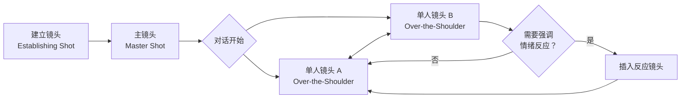

# 第13课：对话剪辑

## Learning Objectives

- 理解对话场景的基本剪辑模式：建立镜头（Establishing Shot）到正反打（Shot / Reverse Shot）的结构逻辑
- 掌握单人对白与双人对白的切换策略，区分不同场景下的剪辑选择
- 认识多人对话场景的剪辑复杂度，学会在发言镜头与反应镜头之间取得平衡
- 学会根据台词节奏选择切点，在语气间隙中完成剪辑
- 掌握反应镜头（Reaction Shot）的运用时机，利用表情变化丰富对话层次

## Core Idea

对话场景是电影中最常见也最容易被低估的剪辑挑战。观众往往不会注意到精心剪辑的对话戏，却会立刻察觉到一段糟糕的对话剪辑。优秀的对话剪辑应当是**隐形的**——它让观众专注于演员的表演和故事的信息流动，而非剪辑本身。

对话剪辑的核心思维可以用一条公式概括：

> **空间建立 + 信息传递 + 情绪捕捉 = 有效的对话剪辑**

具体而言，剪辑师需要在三个维度上做出决策：

1. **空间维度**：让观众清楚"谁在哪，和谁说话"
2. **信息维度**：让观众准确接收到每句对白的信息
3. **情绪维度**：让观众感受到角色之间的情感张力

### 基本剪辑模式：建立镜头到正反打

绝大多数对话场景遵循一个经典结构：

- **建立镜头（Establishing Shot）**：广角镜头展示对话发生的空间环境，告诉观众角色所处的位置关系。这是[[0010-chang-jing-tou|长镜头]]之外最有效的空间定位方式。
- **主镜头（Master Shot）**：覆盖整场对话的连续广角镜头，是剪辑的安全网，也是正反打的基础参照。
- **正反打（Shot / Reverse Shot）**：在对话双方之间交替切换的剪辑模式，通常使用过肩镜头（Over-the-Shoulder Shot）或单人镜头（Single Shot）。

### 单人对白与双人对白的切换策略

**单人对白**（如角色对着电话讲话、对着镜头独白）的剪辑相对简单：
- 剪辑师需要处理的是台词节奏而非切换视角
- 可以在角色思考、停顿或情绪转折处插入切出镜头（[[0006-qie-chu-yu-cha-ru|Cutaway]]），缓解单一看点的视觉疲劳
- 运用[[0008-l-cut-yu-j-cut|J-Cut]]让画外音先行进入，形成自然的"声音引导画面"效果

**双人对白**的剪辑策略则更为丰富：

| 场景类型 | 推荐策略 | 说明 |
|---------|---------|------|
| 平静交谈 | 慢速正反打 | 每句台词留足够反应时间，切速均匀 |
| 争论冲突 | 快速正反打 | 缩短每个镜头时长，切速随情绪升级加快 |
| 暧昧沉默 | 延长反应镜头 | 让镜头停留在听者脸上，捕捉微妙表情 |
| 信息揭示 | 切向听者 | 重要信息说出后切到听者反应，而非说话者 |

### 多人对话场景的剪辑复杂度

当对话参与者在三人及以上时，剪辑的复杂度呈指数级增长。基本原则是"**谁说话切谁**"，但这一规则有重要的限制条件：

1. **反应镜头不能缺席**：即使某位角色没有说话，也需要适时切到他的反应，否则观众会忘记他的存在
2. **三角关系的视线匹配**：三人的视线方向需要保持一致性，避免违反[[0010-chang-jing-tou|180度规则]]
3. **权力动态影响镜头时长**：主导地位的角色获得更多镜头时间和更长的单镜头，从属地位的角色镜头更短

> [!TIP] Key Insight
> 好的对话剪辑不仅仅是"谁说话切谁"，更是"谁在倾听就切谁"。反应镜头是对话剪辑的灵魂——它告诉观众如何理解这段对话。

### 对话节奏与台词语气的配合

切点的选择至关重要。黄金法则是：**在台词间隙中切，而不是在台词中间切**。

| 切点位置 | 效果 | 适用情景 |
|---------|------|---------|
| 完整句子结束时 | 自然流畅，不易察觉 | 常规对话 |
| 语气停顿处 | 保持节奏，强化语气 | 角色斟酌用词时 |
| 情绪爆发前 | 增强冲击力 | 争吵高潮 |
| 台词中间(硬切) | 突兀、制造不安 | 表现混乱或失控 |
| 沉默中 | 营造张力 | 意味深长的停顿 |

剪辑师需要仔细分析每一句台词的波形和语气曲线。通常，在语气能量下降至谷底时（即一句话说完后的自然间隙）切入下一个镜头最为流畅。

### 利用反应镜头丰富对话场景

反应镜头（Reaction Shot）是对话剪辑中最强大的工具之一。它实现的功能包括：

- **引导观众情绪**：当角色听到令人震惊的消息时切到他的反应，告诉观众"这件事很重要"
- **制造戏剧张力**：在说话者不知情的情况下，切到听者意味深长的表情，暗示隐藏信息
- **调节节奏**：在密集对白中插入反应镜头，给观众"呼吸"的空间
- **建立角色关系**：通过反应镜头的时长和频率，暗示角色之间的亲疏关系和权力对比

**运用反应镜头的典型场景**：
1. 角色A说出一句关键台词，切到角色B的面部特写，捕捉其反应
2. 角色A发现重要信息，切到角色B的表情变化，暗示B知道内情
3. 在沉默中切到多个角色的反应，展示群像状态

## Worked Example

**案例：《教父》（The Godfather, 1972）开场对话**

科莱昂（白兰度饰）与包纳萨拉（John Cazale饰）在昏暗书房中的对话是对话剪辑的教科书级案例：

1. **建立镜头**：广角展示书房环境，确立两人的空间关系
2. **主镜头**：覆盖整个对话，作为安全备份
3. **正反打**：使用过肩镜头，每次切换都严格遵循视线匹配
4. **反应镜头**：科莱昂听完包纳萨拉的请求后，画面停留在科莱昂脸上——他的沉默反应比任何台词都更有力量
5. **节奏控制**：科莱昂的台词节奏缓慢、从容，剪辑与之完全同步，每个切点都在台词的"气口"处

这场戏中，剪辑师有意让科莱昂的镜头时长长于包纳萨拉，从视觉层面确立了科莱昂的权力主导地位。

## Practice

> [!QUESTION] Self-check
> 
> 1. 在一场三人对话场景中，角色A正在讲述一个长故事，角色B专心倾听，角色C表现得不耐烦。如果你是剪辑师，你会如何分配镜头？请说明你的剪辑策略及其理由。
> 
> 2. 你剪完一场对话戏后，导演觉得"太慢了"。你认为最快调整节奏的方法是什么？请列出至少两种操作方案。
> 
> 3. 以下哪种情况最适合使用反应镜头？（多选）
>    A. 角色A说"我爱你"，切到角色B的反应
>    B. 角色A在讲述一个平淡无奇的故事中间
>    C. 角色A说"你被开除了"，切到角色B的表情
>    D. 角色A在收拾房间时切到角色B

Reveal answer

1. **剪辑策略建议**：
   - 角色A说话时，大部分镜头给A（信息传递的核心）
   - 但要在A说话期间，适时切到B（专注于A的倾听反应，强化观众对A故事的兴趣）
   - 穿插切到C的反应（不耐烦的表情，暗示剧情张力——C可能另有图谋）
   - 这种"**发言+倾听+第三方反应**"的三段式循环，能让观众同时获取信息层、情绪层和戏剧张力层的信息

2. **加速方案**：
   - 方案一：缩短每个镜头的时长，减少反应镜头的停留时间，加快正反打切换频率
   - 方案二：去除部分反应镜头和切出镜头，减少冗余的画面信息，让对话更紧凑
   - 方案三：尝试在台词中段重叠（使用J-Cut或L-Cut），让画面切换略微领先或落后于声音，制造更快的节奏感

3. **正确答案：A和C**
   A和C都是传递重要信息的时刻，需要通过反应镜头强调对方的态度。B是平淡叙事，不需要额外强调。D是动作场景，不在对话剪辑的讨论范围内。
   

## Next Step

掌握对话剪辑之后，下一课将进入一个截然不同的领域——[[0014-dong-zuo-jian-ji|动作剪辑]]。你将学习如何在激烈的打斗和追逐场景中运用剪辑技巧，保持节奏感和空间清晰度。

继续学习 [[0014-dong-zuo-jian-ji|第14课：动作剪辑]]。