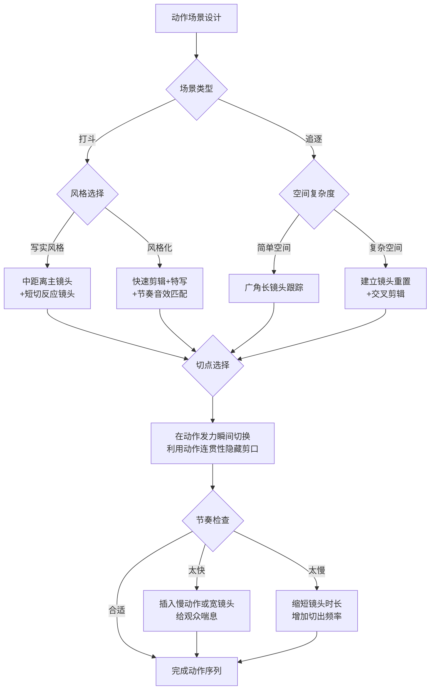

# 第14课：动作剪辑

## Learning Objectives

- 理解动作场景的剪辑节奏原则，掌握快速剪辑与慢速拉伸的适用场景
- 学会在打斗和追逐戏中选择切点的时机——在动作发力的瞬间切换
- 区分快速剪辑风格与长镜头动作场面的美学差异和技术要求
- 认识动作场景中的空间清晰度要求，避免观众在动作中"迷路"
- 了解现代动作片的剪辑趋势和常用的技术手段

## Core Idea

动作剪辑与[[0013-dui-hua-jian-ji|对话剪辑]]截然不同。如果说对话剪辑追求的是"隐形"，那么动作剪辑的终极挑战则是：**在保持节奏冲击力的同时让观众始终看得懂**。

动作剪辑需要在两个看似矛盾的目标之间取得平衡：

1. **冲击力**：让每一拳、每一次追击都充满力量感
2. **清晰度**：让观众始终清楚谁在打谁、空间位置关系如何

### 动作剪辑决策树

### 切点的选择：在发力瞬间切换

动作剪辑最重要的技巧之一就是**在动作发力的瞬间切换镜头**。这种做法基于心理学原理——观众的目光会被动作的高潮点吸引，眼睛会随着发力点移动，恰好在这时切换镜头，剪口就变得"隐形"了。

具体操作示例：

| 动作类型 | 切点位置 | 说明 |
|---------|---------|------|
| 出拳 | 拳头击中的那一刻 | 第一个镜头：出拳开始；第二个镜头：击中后的反应 |
| 踢击 | 脚即将接触目标时 | 利用动作惯性覆盖剪口 |
| 挥剑 | 剑的最高点或下落的起点 | 借助弧线运动的视觉焦点转移 |
| 跳跃 | 起跳离地的瞬间 | 地面交待在第一个镜头，空中在第二个镜头 |
| 汽车追逐转弯 | 方向盘打转的瞬间 | 入弯在第一个镜，出弯在第二个镜 |

### 快速剪辑 vs 长镜头动作场面

现代动作片形成了两种截然不同的美学流派：

**伯恩式（Bourne Style）——快速剪辑+抖动手持**

以《谍影重重》系列为代表：
- 镜头时长远低于平均水平，常在1-3秒之间
- 手持摄影（Handheld）增加临场感和紧张感
- 密集的短切配合快速音效，营造强烈的冲击感
- 弱点：过度使用时会导致观众空间认知混乱，被批评为"摇晃电影"

**突袭式（The Raid Style）——长镜头打斗**

以印尼电影《突袭》及其续集为代表：
- 使用长镜头（Long Take）拍摄完整的打斗套招
- 剪辑点极少，强调动作的完整性和空间透明度
- 需要演员具备极高的动作执行能力
- 效果：观众能清晰看到每一次攻防，震撼力来自动作本身而非剪辑技巧

| 对比维度 | 快速剪辑风格 | 长镜头风格 |
|---------|------------|-----------|
| 镜头平均时长 | 1-3秒 | 10秒以上 |
| 空间清晰度 | 较低，需要频繁重置 | 高，观众始终了解空间 |
| 对演员要求 | 较低，多个镜头拼接 | 极高，需完整表演 |
| 对剪辑师要求 | 极高，节奏控制是关键 | 较低，但同步匹配要求高 |
| 情绪效果 | 紧张、压迫、眩晕 | 沉浸、震撼、真实感 |
| 代表作品 | 《谍影重重》系列、《飓风营救》 | 《突袭》系列、《老男孩》( hallway scene ) |

### 空间清晰度要求

动作场景中最致命的错误是**让观众迷路**。当观众搞不清楚角色之间的空间位置关系时，动作戏就失去了意义。

保持空间清晰度的三个关键技巧：

1. **建立镜头重置**：在动作激烈进行中，插入一个广角建立镜头，重新告诉观众"谁在哪"
2. **180度规则维持**：即使在混乱的打斗中，也尽量保持[[0010-chang-jing-tou|轴线的一致性]]，避免观众产生方向混乱
3. **视线匹配**：角色的视线方向应始终与对手的实际位置一致，这是观众理解动作关系的基石

### 现代动作片的剪辑趋势

近年来，动作剪辑呈现以下几个明显趋势：

- **回归长镜头美学**：受《突袭》《疾速追杀》影响，越来越多的动作片选择用较长的镜头呈现动作，强调"可见的真实感"
- **数字缝合技术**：利用CGI和数字遮罩，将多个镜头中的最佳动作片段无缝拼接，创造出"伪长镜头"效果
- **节奏变异**：不再追求全程高频快切，而是在慢与快之间制造节奏对比——慢动作建立张力，快切释放冲击
- **第一人称联动**：在关键时刻切换到第一人称视角（POV），增强观众的代入感
- **动态帧率处理**：在关键打击瞬间插入抽帧或变速，模拟真实的冲击感知

> [!TIP] Key Insight
> 动作剪辑的核心矛盾在于：观众想看清晰的，又想看激烈的。好的动作剪辑不是在两个极端之间选择，而是在它们之间建立节奏——用清晰的长镜头建立空间，用快速剪辑提供冲击，两者交替使用，各取所长。

## Worked Example

**案例：《疾速追杀3》（John Wick 3, 2019）刀具店打斗**

这场戏是动作剪辑的典范，完美展示了上述原则：

1. **空间建立**：以广角全景镜头建立刀具店的纵向空间
2. **发力切点**：每一次武器交手的关键瞬间，剪辑师都精准切换——在刀即将砍中目标时切，确保动作连贯性
3. **节奏交替**：大动作使用中景长镜头（持续3-5秒），小动作使用快速短切（1-2秒）
4. **反应镜头**：在约翰受伤后切到他的表情，强调疼痛感
5. **空间重置**：每经过一个空间转移（如移动至柜台另一侧），都会插入一个广角镜头重置观众的空间认知

## Practice

> [!QUESTION] Self-check
> 
> 1. 假设你正在剪辑一场二人打斗戏，空间设定在一个狭小的厨房内。导演希望同时达到"真实感"和"冲击力"。你会如何设计剪辑方案？请说明你的剪辑策略。
> 
> 2. 在动作剪辑中，"在发力瞬间切换"的核心原理是什么？请用50字以内解释。
> 
> 3. 以下哪种情况最适用建立镜头（Establishing Shot）重置空间？
>    A. 打斗从客厅转移到走廊时
>    B. 两个角色的脸部特写交替了6次以上时
>    C. 角色从窗户跳出时
>    D. 以上所有情况

Reveal answer

1. **厨房打斗剪辑方案**：
   - **主镜头策略**：固定一台广角摄影机拍摄全貌作为安全主镜头
   - **特写序列**：在每次发力瞬间切到特写——刀落、闪避、击中身体
   - **空间提示**：每两次交锋后切回广角镜头，重置观众的空间认知
   - **节奏设计**：前三次交锋使用较长镜头（建立真实感），后三次加快切速（升级紧张感）
   - **环境利用**：用[[0006-qie-chu-yu-cha-ru|切出镜头]]展示厨房的特殊道具（刀具、锅具）被用作武器

2. **核心原理**：人的视觉注意力在动作高潮点达到峰值，注意力集中在动作目标上，此时切换镜头不会被察觉——动作本身的视觉惯性"掩盖"了剪口。

3. **正确答案：D**
   所有三种情况都需要空间重置：A是空间变化，B是正反打过多导致空间迷失，C是位移幅度大。建立镜头在这三种情况下都能有效帮助观众重新定位。

## Next Step

动作剪辑让你的场景充满力量，但要让一部电影从零到完成，还需要掌握完整的[[0015-jian-ji-gong-zuo-liu|剪辑工作流]]。下一课将带你俯瞰剪辑师的工作全流程——从素材管理到最终定剪。

继续学习 [[0015-jian-ji-gong-zuo-liu|第15课：剪辑工作流]]。