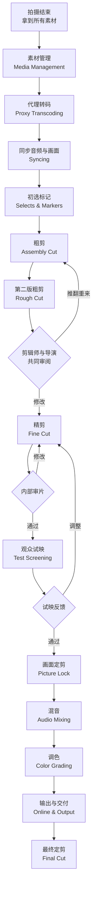

# 第15课：剪辑工作流

## Learning Objectives

- 掌握剪辑工作流的完整流程：从素材管理到最终定剪
- 区分粗剪（Assembly Cut / Rough Cut）与精剪（Fine Cut）的阶段目标和操作差异
- 理解剪辑师与导演的合作关系，认识不同工作模式的优势
- 了解观众试映如何驱动剪辑调整
- 认识剪辑工作的道德责任，特别是纪录片中的真实性原则

## Core Idea

剪辑不是一蹴而就的，它是一个**分层递进**的过程。从数百小时的素材到最终100分钟的电影，剪辑工作遵循一套成熟的工作流。理解这个流程，不仅让剪辑师知道"当前该做什么"，也帮助导演和制片人合理规划后期制作周期。

### 完整工作流

### 粗剪（Assembly Cut / Rough Cut）vs 精剪（Fine Cut）

这是剪辑流程中最核心的区分：

| 对比维度 | 粗剪（Assembly / Rough Cut） | 精剪（Fine Cut） |
|---------|---------------------------|-----------------|
| 目标 | 搭建故事骨架，确定结构 | 打磨节奏，优化每一帧 |
| 素材使用 | 按剧本顺序排列所有可用素材 | 筛选最佳取景，删除冗余 |
| 镜头时长 | 偏长，保留充分空间 | 精确到每一帧的节奏 |
| 音效处理 | 使用临时音轨（Temp Track） | 精细调整音频过渡（L-Cut / J-Cut） |
| 视觉效果 | 无调色，保留原始色彩 | 基本色彩校正已完成 |
| 剪辑师状态 | 探索可能性，不怕犯错 | 锁定决策，收敛选项 |
| 时长 | 通常比最终版本长20-40% | 接近最终时长 |
| 观众可看性 | 仅限内部看片 | 可向小范围外部观众展示 |

**粗剪的注意事项**：
- 不要过早删除"多余"的素材，粗剪阶段的核心是讲故事结构，而非删减
- 使用标记（Markers）标注问题片段和待定区域，方便后续精剪时快速定位
- 粗剪通常由剪辑师独立完成，不受导演干扰——这正是剪辑师需要的创作自由度

**精剪的注意事项**：
- 精剪是减法艺术：每一帧都应当为故事服务
- 打磨过渡镜头和音画衔接——这时[[0008-l-cut-yu-j-cut|L-Cut和J-Cut]]的精细调整发挥最大作用
- 精剪阶段的每一次修改都可能产生连锁反应，建议使用版本管理（Versioning）记录不同方案

### 剪辑师与导演的合作关系

剪辑师与导演的关系是整个电影制作中最特别、最微妙的创作关系之一。

**两种主流合作模式：**

1. **导演初版剪辑模式（Director's Cut First）**
   - 导演在粗剪基础上提出修改方向，剪辑师据此执行
   - 优势：导演的初始意图得到充分保留
   - 风险：导演可能过于依赖拍摄时的设想，缺乏客观视角

2. **剪辑师独立版本模式（Editor's Cut First）**
   - 剪辑师在不受导演影响的前提下完成粗剪，然后提交给导演
   - 优势：剪辑师能用"第一观众"的视角看待素材，发现导演可能忽略的其他可能性
   - 风险：如果剪辑师的理解与导演意图偏差过大，可能需要大量返工

许多经典电影的合作关系正是第二种模式的成功案例。例如，剪辑师沃尔特·默奇（Walter Murch）与导演安东尼·明格拉的合作，就是剪辑师独立工作后提交"惊喜版"给导演，从而发现新的叙事可能。

> [!TIP] Key Insight
> 好的剪辑师不是"导演的双手"，而是"导演的第三只眼"。剪辑师的价值在于提供一个独立的、不受拍摄过程影响的客观视角。

### 观众试映与剪辑调整

观众试映（Test Screening）是好莱坞成熟工业体系中不可或缺的一环：

- **定量反馈**：观众在试映后填写详细的问卷，评分电影的情感节奏、角色好感度等指标
- **定性反馈**：焦点小组（Focus Group）讨论，了解观众对特定情节的理解和感受
- **数据驱动调整**：根据试映数据，剪辑师可能调整：
  - 删减观众失去兴趣的片段
  - 增加观众喜欢的角色的戏份
  - 调整高潮段落的位置和时长
  - 重新组织闪回与时间线

### 剪辑的道德责任

剪辑师掌握着强大的叙事权力——通过选择和排列镜头，剪辑师可以塑造观众对事件的理解。这种权力伴随道德责任：

**对于剧情片：**
- 不应通过剪辑改变故事的核心主题
- 不应通过误导性剪辑制造虚假的情感效果

**对于纪录片（尤为关键）：**
- 不能通过剪辑歪曲被摄者的原意
- 反应镜头和切出镜头的使用不应改变事件的真实含义
- 时间顺序的重新排列不应扭曲因果关系
- 使用[[0005-jiao-cha-jian-ji|交叉剪辑]]制造虚假的并列关系是不道德的做法

> [!TIP] Key Insight
> 剪辑的最终目的不是"欺骗观众"，而是"让真相更清晰"。当剪辑技巧不是为了更好地讲述故事，而是为了掩盖事实时，剪辑师就跨越了职业道德的边界。

## Worked Example

**案例：一部独立电影的典型剪辑周期**

假设一部低预算独立电影拍摄了30小时的素材，最终成片时长100分钟：

| 阶段 | 时间线 | 具体工作 |
|------|-------|---------|
| 素材管理与同步 | 第1周 | 整理存储介质，创建代理文件，同步音频 |
| 初选与标记 | 第2周 | 逐日审看素材，标记最佳取景（Selects） |
| 粗剪（Assembly） | 第3-4周 | 按剧本顺序排列所有可用镜头，时长约160分钟 |
| 第二版粗剪（Rough Cut） | 第5-6周 | 删除明显冗余片段，时长压缩至130分钟 |
| 导演首次看片 | 第6周 | 导演第一次看到剪辑版，提出13处调整意见 |
| 精剪（Fine Cut） | 第7-10周 | 逐场逐镜精修，细化L-Cut和J-Cut，时长压至105分钟 |
| 内部审片 | 第10周 | 制片人和核心团队看片，提出5处调整 |
| 观众试映 | 第11周 | 组织50人试映，根据反馈调整第三幕高潮 |
| 画面定剪 | 第12周 | 锁定时间线，移交调色和混音 |
| 混音与调色 | 第13-14周 | 同期协作进行 |
| 最终交付 | 第15周 | 输出成片，制作DCP |

## Practice

> [!QUESTION] Self-check
> 
> 1. 你作为剪辑师拿到导演的拍摄素材，导演明确表示希望亲自参与粗剪阶段的每一个决策。你会如何处理这种情况？请从合作关系和剪辑工作流效率两个角度分析。
> 
> 2. 粗剪版比目标时长长了50%。精剪阶段应当优先从哪些方面入手压缩时长？请列出至少三个具体方向。
> 
> 3. 关于剪辑的道德责任，以下哪种做法是合理的？
>    A. 在纪录片中，将A在宴会上大笑的镜头剪到B讲述悲伤故事的段落中，以制造反讽效果
>    B. 在纪录片中，将采访中说话者的多处口误和不连贯之处剪辑掉，让发言更清晰
>    C. 在剧情片中，将配角的表现最佳镜头替换到主角的戏份中，以增强主角魅力
>    D. 在纪录片中，重新排列采访回答的顺序以改变被访者的立场

Reveal answer

1. **处理方案**：
   - **合作角度**：尊重导演意愿，在粗剪阶段采用"协作模式"——导演可以坐在旁边提供反馈，但实际的剪辑操作由你来完成。这样可以保持剪辑效率，同时满足导演的参与需求。
   - **效率角度**：建议向导演解释粗剪阶段的价值在于"快速探索可能性"。如果导演参与每个决策，粗剪时间会大幅延长。折中方案是：你先独立完成一版"快速粗剪"（3天），然后与导演一起逐场审阅修改。
   - **核心原则**：不要让导演坐在剪辑室里逐帧看片——这会严重降低效率。一起在审片室里看大银幕，做笔记，然后你再回到剪辑室执行修改。

2. **精剪压缩方向**：
   - **删除冗余的建立镜头**：很多场景的建立镜头时长过长，压缩至1/3即可。
   - **收紧反应镜头**：反应镜头经常偏长，缩短至"足够捕捉表情变化"的最短时长。
   - **删减迟滞段落**：台词之间的空白区、动作完成后的收尾动作、行走到达目的地的部分过程——这些都是压缩的重点区域。
   - **合并重复信息**：如果两个镜头表达了相同的信息，只保留更优的那个。

3. **正确答案：B**
   去掉口误和结巴让发言更清晰，属于"让真相更清晰"的合理剪辑。A是歪曲情绪语境，C是篡改表演归属（属于欺骗），D直接改变了被访者的立场和观点——所有这些都违反了剪辑的道德责任。

## Next Step

恭喜你完成了电影剪辑课程的核心内容！回顾所学，从[[0001-ji-jian-de-ding-yi|剪辑的基本定义]]开始，到[[0002-lian-xu-xing-jian-ji|连续性剪辑]]、[[0003-pi-pei-jian-ji|匹配剪辑]]、[[0004-tiao-qie|跳切]]、[[0005-jiao-cha-jian-ji|交叉剪辑]]、[[0008-l-cut-yu-j-cut|L-Cut和J-Cut]]、[[0009-meng-tai-qi|蒙太奇]]、[[0010-chang-jing-tou|长镜头]]，再到[[0012-gu-shi-xing-jian-ji|故事性剪辑]]、[[0013-dui-hua-jian-ji|对话剪辑]]和[[0014-dong-zuo-jian-ji|动作剪辑]]，你已经建立起完整的电影剪辑知识体系。

继续参考 [[../../电影剪辑/reference/glossary|术语表]] 和 [[../../电影剪辑/reference/cuts-cheatsheet|切法速查表]] 巩固记忆。