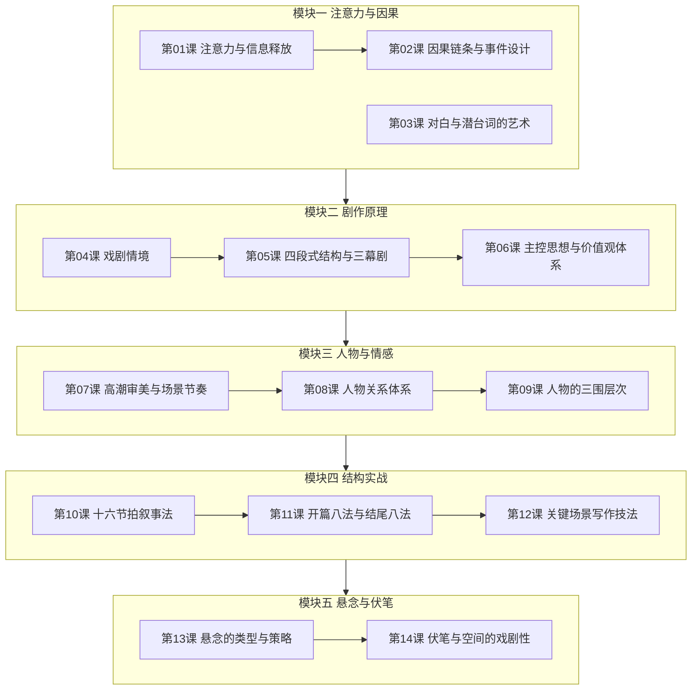

# 课程地图

## 学习路径

### 推荐顺序
严格按照模块一至模块五的顺序学习。每个模块建立在前一个模块的基础上：

1. **模块一** 建立最基本的注意力机制和因果思维
2. **模块二** 搭建剧作原理体系——戏剧情境、结构、主控思想
3. **模块三** 深入人物塑造和情感设计
4. **模块四** 落地到具体的叙事节拍和场景写作技法
5. **模块五** 进阶悬念设计和伏笔布局

### 各课关系

| 关系类型 | 说明 |
|---------|------|
| **递进关系** | 第01-02-03课、第04-05-06课、第07-08-09课、第10-11-12课 均为递进 |
| **总分关系** | 第04课（戏剧情境总论）→ 第05课（结构应用）→ 第06课（思想升华） |
| **并列关系** | 第11课（开篇结尾）与第12课（关键场景）侧重不同维度 |
| **总结关系** | 第13-14课作为全课收尾，综合运用前面所有理论 |

### 时间分配建议

| 模块 | 建议学习时间 | 重点投入 |
|------|------------|---------|
| 模块一 | 2-3 小时 | 因果链条思维 |
| 模块二 | 3-4 小时 | 3/4两难抉择设计 |
| 模块三 | 2-3 小时 | 人物关系体系 |
| 模块四 | 3-4 小时 | 十六节拍叙事法 |
| 模块五 | 2-3 小时 | 悬念策略 |

## 实践项目建议

学习过程中，建议同步进行一个剧本项目：

- 学完模块一：写出剧本的激励事件
- 学完模块二：画出故事的因果链条
- 学完模块三：完成人物小传
- 学完模块四：完成大纲和关键场景
- 学完模块五：检查悬念设计并修改