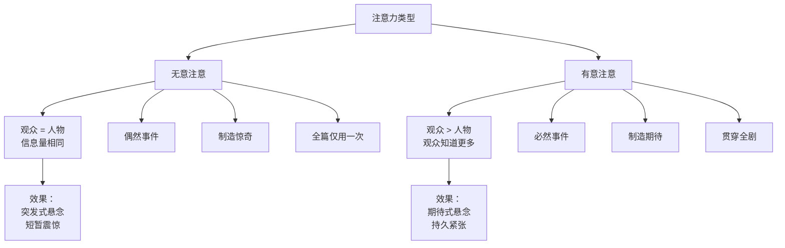
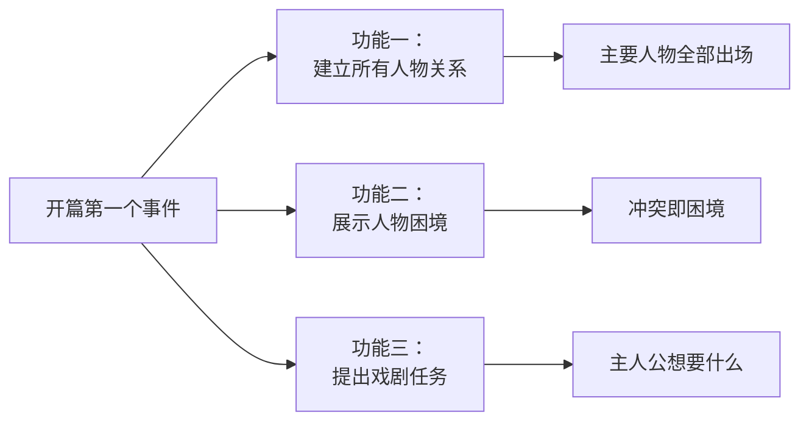

# 第01课：注意力与信息释放

## 概述

编剧是一场信息控制的魔术。你手中握着所有信息，但观众并不知道。你要像一个魔法师一样，决定在什么时候释放什么信息、对谁保密、对谁透露。**注意力的控制**与**信息释放的技巧**，是编剧的基本功，也是悬念建构的底层逻辑。

---

## 一、无意注意 vs 有意注意

### 1.1 无意注意（偶然事件）

**无意注意**指观众和人物在同一时间获知相同的信息，观众没有提前收到任何预告。当意外事件发生时，观众和人物一起感到震惊。

> [!example] 经典案例：《大白鲨》开场
> 影片第一场戏——女孩独自在海中游泳，水下鲨鱼突然袭击。观众事先毫不知情，与角色共同经历恐惧。这是一种**突发式**的注意力唤起，使用一次足够。

**无意注意的特点**：
- 观众和人物知道的信息量相同
- 制造惊奇和意外
- 维持注意力的时间较短
- 全片中最好只使用 **一次**（通常用于开篇）

### 1.2 有意注意（必然事件）

**有意注意**指观众比人物知道得更多，因此产生期待和担忧。编剧提前向观众释放部分信息，让观众带着"已知"去观看人物的"未知"。

> [!example] 经典案例：《西游降魔篇》鱼妖吃人段落
> 镜头先给到水面下的鱼妖，再给到水中嬉戏的孩童。父亲指向水面说"水里有妖怪"。观众预先知道了危险的存在，而水中的人一无所知——观众于是处于煎熬的期待之中。

**有意注意的特点**：
- 观众知道的比人物多 → 产生 **期待式悬念**
- 持续注意力时间长
- 可以贯穿全剧使用

### 1.3 两种注意力的对比

---

## 二、三种悬念类型

基于观众与人物之间的信息差，悬念可以分为三种基本类型：

| 类型 | 信息关系 | 观众心理 | 典型用法 |
|------|----------|----------|----------|
| **期待式悬念** | 观众知道 > 人物知道 | 期待、担忧、焦急 | 恐bu片已知危险、爱情片观众知道误会即将发生 |
| **揭秘式悬念** | 观众知道 < 人物知道 | 好奇、探究、猜测 | 悬疑推理片、人物身世之谜 |
| **突发式悬念** | 观众知道 = 人物知道 | 惊讶、震惊 | 惊吓镜头、意外转折（亚里士多德所谓"突转"） |

> [!tip] 悬念的核心公式
> **悬念 = 信息差 + 情感卷入**
> 
> 没有信息差就没有悬念，没有情感卷入就没有观看的动力。

### 期待式悬念详解

期待式悬念是三种悬念中**最有力、最持久**的一种。它的运作机制是：

1. 编剧向观众**透露**部分信息（如：鲨鱼就在水下）
2. 观众由此产生对未来的**预期**（鲨鱼会攻击人吗？）
3. 观众带着预期观看人物活动，产生强烈的**情感张力**

### 揭秘式悬念详解

揭秘式悬念的核心策略是**保密**。编剧刻意向观众隐藏某些信息，让观众产生探究欲望。

> [!question] 思考：为什么神秘感会让人着迷？
> 恋爱心理学告诉我们："千万不要让对方对你产生好奇心——好奇心会让人想要探究，探究的结果就是深深爱上他。"人物设计也是如此——给人物包裹一层迷雾，让观众一层层剥开。

### 突发式悬念详解

突发式悬念来源于亚里士多德的"**突转与发现**"（Peripeteia and Discovery）：
- **突转**：事件向预期相反的方向发展
- **发现**：人物对真相的新的认知

突发式悬念制造短暂的震惊，适用于场景内部的转折，但**不适合作为全篇的总悬念**。

---

## 三、信息释放技巧

### 3.1 透露 vs 保密

编剧手中的信息可以分为两大类：

| 策略 | 定义 | 效果 | 对应悬念 |
|------|------|------|----------|
| **透露** | 提前向观众释放信息 | 制造期待 | 期待式悬念 |
| **保密** | 对观众隐藏信息 | 制造好奇 | 揭秘式悬念 |

### 3.2 场外信息 vs 场内信息

- **场外信息**：观众和角色都知道的信息（共享信息）
- **场内信息**：仅在场角色知道的信息（角色内部信息）

> [!warning] 注意
> 信息释放的关键不在于你想告诉观众多少，而在于你**在什么时候**告诉观众多少。信息释放的节奏，决定了观众注意力的节奏。

### 3.3 偶然事件 vs 必然事件

| 对比项 | 偶然事件 | 必然事件 |
|--------|----------|----------|
| 伏笔 | 无提前埋藏 | 有充分伏笔 |
| 信息释放 | 无提前释放 | 提前释放关键信息 |
| 观众感受 | 惊奇、突然 | 情理之中、意料之外 |
| 心理效应 | 短暂 | 持久 |
| 使用频率 | 开篇最多用一次 | 贯穿全剧 |

> [!example] 偶然事件的陷阱：《练练江湖》
> 剧中充斥着大量偶然事件——女主角一掀盖头发现丈夫是傻子，遇到的下人恰好是坏人，所有突发事件毫无伏笔地砸在主人公身上。结果是观众产生"为什么全天下所有倒霉事都发生在她身上"的质疑，戏剧可信度崩塌。

### 3.4 如何将偶然事件转化为必然事件

**答案是：埋藏伏笔。**

> [!tip] 方法
> 如果你要在第三幕揭示"这两个人其实是兄妹"，请在**第一幕和第二幕**中悄悄埋下至少三个伏笔：比如相似的胎记、被收养的对话片段、长辈欲言又止的神情。当分晓到来时，观众会恍然大悟"原来编剧早有安排"。

---

## 四、开篇第一个事件的功能（KP-009）

开篇的第一个事件承担**三大功能**：

### 案例分析：《父母爱情》第一场戏

> [!example] 大庄结婚事件
> 这场戏的巧妙之处：
> 1. 所有主要人物一次性出场（大庄、庄嫂、妹妹、男女主人公、同事）
> 2. 男女主人公因"道德立场"发生冲突，各自困境浮现
> 3. 戏剧任务被提出：这个婚怎么结？这对冤家怎么发展？

**为什么选择这场戏作为开篇？** 因为在男女主人公身上发生了许多事，但编剧选择从**最具冲突性**的一场戏切入，以此瞬间抓住观众注意力。

> [!tip] 开篇法则
> 不要从"最早发生的事件"写起，要从"最能提起观众注意力的事件"写起。

---

## 五、持续注意力（KP-010）

提起注意力只是第一步，更重要的是**保持注意力**。方法如下：

1. **主次分明**：主线情节与支线情节要有轻重缓急的分配，支线为主线服务
2. **张弛有度**：人物在"达成任务"和"未达成任务"之间循环，正负价值交替
3. **因果链条**：上一个事件的结果成为下一个事件的原因，形成环环相扣的悬念链

> [!question] 自己检查
> 你的故事前20场戏，有没有让观众知道"主人公到底要干什么"？如果到第20场戏观众还不清楚戏剧任务，注意力一定已经流失了。

---

## 自我检查

点击展开自测问题

**问题1**：什么是"无意注意"？在全片中应该使用几次？

**答案**：无意注意是指观众和人物在同时间获取相同信息，没有提前释放信息。它制造的是惊奇和意外。全篇最好只使用一次，通常用于开篇。

**问题2**：三种悬念类型分别是什么？它们分别利用了怎样的信息差？

**答案**：（1）期待式悬念——观众知道 > 人物知道；（2）揭秘式悬念——观众知道 < 人物知道；（3）突发式悬念——观众知道 = 人物知道。

**问题3**：偶然事件和必然事件的根本区别是什么？如何将偶然事件转化为必然事件？

**答案**：根本区别在于是否有提前埋藏伏笔和信息释放。偶然事件缺少伏笔，必然事件有充分的伏笔铺垫。将偶然转化为必然的方法就是——在事件发生前提前埋藏信息，让观众隐约感知到结果的可能性。

**问题4**：开篇第一个事件需要完成哪三大功能？

**答案**：（1）建立所有人物关系（主要人物全部出场）；（2）展示人物困境（让观众看到人物的冲突和难处）；（3）提出戏剧任务（让观众知道主人公要干什么）。

**问题5**：什么是"延长悬念"的两种方法？

**答案**：（1）有效释放信息——提前给观众预设，让观众产生期待；（2）一波未平一波又起——每个事件的结果成为下一个事件的原因，因果链条不断延伸。

