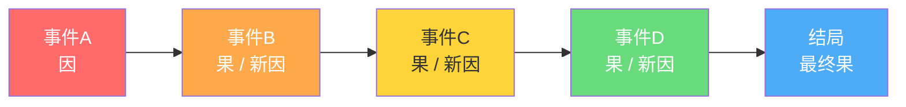
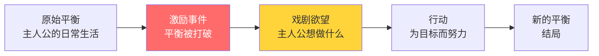
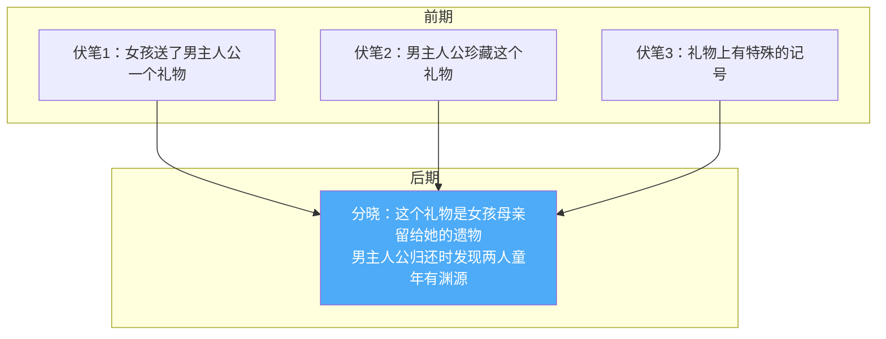
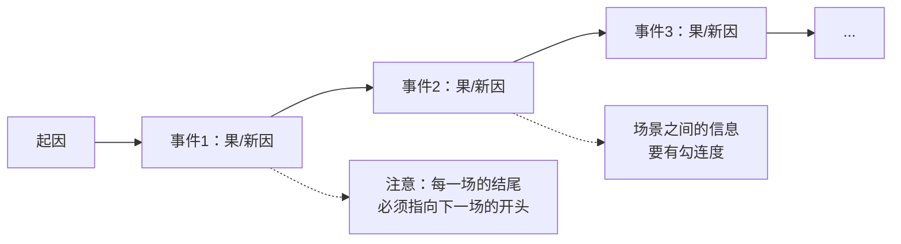
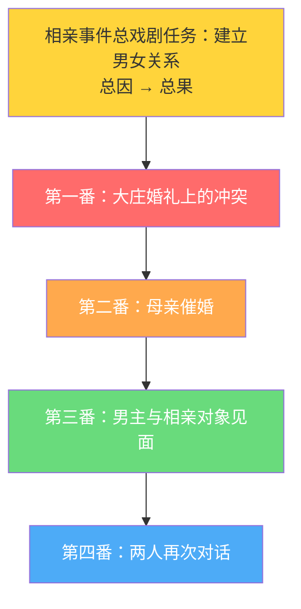

# 第02课：因果链条与事件设计

## 概述

戏剧与生活最大的不同在于**因果性**。生活中很多事情是没有因果的——你今天遇到一个人，你们擦肩而过，可能此生不再相见。但戏剧中的每一件事，都必须处在一条因果链条之中：**有这个因，才有这个果；这个果，又是下一个事件的因。**

---

## 一、戏剧因果链条

### 1.1 什么是因果链条

因果链条（Cause-and-Effect Chain）是戏剧叙事的基本骨架。它确保故事中的每一个事件都有其前因后果，观众能够沿着链条一路追踪到终点。

> [!tip] 核心公式
> 戏剧 = 因果链条 + 情感联系
> 生活 = 时间顺序 + 偶然事件

### 1.2 因果链条的三层结构

因果链条需要体现在**三个层级**上：

| 层级 | 定义 | 举例 |
|------|------|------|
| **全剧层面** | 总因 → 总果 | 激励事件 → 最终结局 |
| **事件层面** | 事件的起因 → 事件的结果 | 相亲事件：从见面到互生好感 |
| **场景层面** | 场景的开始 → 场景的结束 | 一场对话从对立到达成共识 |

> [!example] 经典案例：《父母爱情》第一集的因果链条
> **全剧总因**：男女主人公经人介绍相亲 → **总果**：结婚
> **事件1**：大庄结婚事件（两人初次见面冲突）
> **事件2**：母亲催婚事件（各自面临家庭压力）
> **事件3**：相亲对象见面事件（正式相亲引发再次冲突）
> **事件4**：车间表白事件（关系转折）
> 
> 每一个事件的"果"都指向下一个事件的"因"，层层推进。

---

## 二、偶然事件 vs 必然事件

### 2.1 核心区别

| 对比项 | 偶然事件 | 必然事件 |
|--------|----------|----------|
| 因果性 | 无因果铺垫 | 有因果链条 |
| 伏笔 | 无提前埋藏 | 有充分伏笔 |
| 信息释放 | 无提前释放 | 有信息预设 |
| 观众心理 | "怎么这么巧？" | "果然如此！" |
| 可信度 | 低，易被质疑 | 高，令人信服 |

### 2.2 反例分析：《练练江湖》

> [!warning] 偶然事件的堆砌陷阱
> 剧中女主角一掀盖头发现丈夫是傻子（偶然）→ 遇到家里下人，发现这个下人是坏人（偶然）→ 去找解救丈夫的药，路上又遇到劫匪（偶然）……所有事件都是天上掉下来的，观众不禁要问：**"为什么全天下所有倒霉事都发生在她身上？"**

### 2.3 如何将偶然转化为必然

> [!tip] 方法很简单：埋藏伏笔
> 如果你要让女主角发现丈夫是傻子，请在之前埋下至少一个伏笔——比如婚前丫鬟欲言又止地说"姑爷他……不太爱说话"，或者远远瞥见丈夫的背影显得痴痴呆呆。观众有了心理预期，"发现"的时刻就不再是纯粹的偶然。

---

## 三、激励事件（KP-004）

### 3.1 定义与功能

**激励事件**（Inciting Incident）是打破主人公生活平衡的那个事件。它确立了主人公的**戏剧欲望**——主人公从此有了一个明确的目标。

### 3.2 激励事件三问

好的激励事件必须回答三个问题：

1. **它让人物陷入了什么困境？**
   - 没有冲突就没有困境，没有困境就没有戏剧
2. **它激发了什么戏剧欲望？**
   - 主人公接下来要干什么？
3. **它如何建立观众期待？**
   - 观众为什么想继续看下去？

> [!question] 创作自查
> 你的前20场戏有没有让观众看清楚主人公的戏剧任务？如果前20场都没有，观众可能已经流失了。

---

## 四、伏笔与分晓（KP-011）

### 4.1 什么是伏笔与分晓

- **伏笔**：在故事前期埋藏的信息，为后续事件做铺垫
- **分晓**：伏笔的呼应和解答

有因就有果，但伏笔不是简单地在前面放一个线索就完事了。**伏笔需要有指向性**——它必须指向某个未来的分晓。

### 4.2 《父母爱情》的伏笔设计

从"互相看不上"到"相爱结婚"——这个"果"是观众早就知道的（谁都知道这是个爱情故事），但观众想看的是**如何从因走到果**。编剧设计了精妙的**多层伏笔**：

| 伏笔序列 | 事件 | 关系变化 |
|----------|------|----------|
| **伏笔1** | 大庄婚礼上第一次见面争吵 | 互相厌恶 |
| **伏笔2** | 车间里第二次见面 | 女孩觉得"这人挺逗" |
| **伏笔3** | 男主带着奖状来证明"我是个好人" | 女孩回眸一笑，态度转变 |
| **伏笔4** | 跳舞事件 | 好感加深 |
| **伏笔5** | 上门求婚写保证书 | 确定关系 |

> [!tip] 编剧的"编织"艺术
> 为什么我们叫"编剧"？关键在于"编"——就像勾十字绣一样，你把每一处伏笔都慢慢编进去，到最后全幅画摆在观众面前，观众恍然大悟：原来那个时候留的这个扣，是为后面服务的。

### 4.3 修改剧本阶段是埋伏笔的最佳时机

> [!example] 工作流程
> 第一稿 → 搭建结构和情节 → **修改阶段往里面编织伏笔**
> 
> 很多编剧忽略修改阶段。但恰恰是修改时，当你回头看整个结构，你才会发现："如果前面在这里埋一条线，后面的结果就更必然、更合理了。"

---

## 五、突转与发现（KP-014）

### 5.1 亚里士多德的智慧

亚里士多德在《诗学》第13-14卷中专门讨论了**突转**和**发现**：

- **突转**（Peripeteia）：事件向预期的相反方向发展
- **发现**（Discovery）：从不知到知的转变

这两个技巧是避免"平铺直叙"的关键武器。

> [!example] 《诺丁山》经典突转
> 男主人公终于约到心仪的女明星，上楼准备共度良宵——结果开门发现她男朋友在家。
> 
> 这就是突转：戏剧任务与真实处境之间的颠覆性反差。

### 5.2 突转的三种层次

| 层次 | 范围 | 效果 |
|------|------|------|
| **全剧突转** | 整部影片的结构翻转 | 观众对整个故事的认知被颠覆 |
| **事件突转** | 一个事件内部的转折 | 观众预期落空，情绪被重新调动 |
| **场景突转** | 一场戏内部的转折 | 瞬间的意外感，场景不再平淡 |

---

## 六、延长悬念的两种方法（KP-018）

### 6.1 方法一：有效释放信息

提前将信息预设给观众，让观众产生期待。悬念的长度 = 信息释放到结果揭晓之间的距离。

**悬念距离越大，观众的紧张感越强。**

### 6.2 方法二：一波未平一波又起

因果链条的延伸：**上一个事件的"果"成为下一个事件的"因"**。只要链条不断，悬念就一直在延续。

> [!warning] 常见错误
> 很多编剧的分场景设计没有信息勾连度——第一场写张三喝茶，第二场跳到李四跳舞，两场之间毫无指向性。这会让观众完全看不懂故事在讲什么。

---

## 七、场景因果指向性（KP-007）

### 7.1 每个场景的指向性

每个场景的结尾信息，必须向观众暗示下一个场景即将发生什么。这叫**指向性**。

> [!example] 好例子
> 第一场结尾：女主角说"我明天要去见他"
> 第二场开头：女主角在咖啡馆等人
> 
> 两场之间有明确的因果指向。

> [!example] 坏例子
> 第一场结尾：女主角在办公室工作
> 第二场开头：男主角在健身房跑步
> 
> 两场之间毫无关联，观众困惑。

### 7.2 事件内部的分层设计（KP-008）

一个事件内部也需要有分层结构——它不能是一条直线，而应该有多个"番"（层次）。

以《父母爱情》第一集中的**相亲事件**为例：

---

## 自我检查

点击展开自测问题

**问题1**：什么是戏剧因果链条？它和生活的时间顺序有什么区别？

**答案**：戏剧因果链条指每个事件都有前因后果，上一个事件的结果成为下一个事件的原因。生活是按时间顺序排列的偶然事件集合，而戏剧是按因果逻辑编织的必然事件序列。

**问题2**：偶然事件和必然事件的核心区别是什么？

**答案**：是否有伏笔埋藏和信息预设。偶然事件没有提前信息释放，观众感到"惊奇"但不可信；必然事件有充分的伏笔铺垫，观众感到"情理之中、意料之外"。

**问题3**：什么是激励事件？它需要完成哪三个功能？

**答案**：激励事件是打破主人公生活平衡的事件。三个功能：（1）让人物陷入困境；（2）激发人物的戏剧欲望；（3）建立观众对全剧的期待。

**问题4**：什么是伏笔和分晓的关系？

**答案**：伏笔是在前期埋藏的信息，分晓是对伏笔的呼应和解答。伏笔必须有指向性——它必须指向未来的分晓。

**问题5**：什么是场景因果指向性？

**答案**：每个场景的结尾信息必须指向下一个场景的开头。场景之间要有信息勾连度，不能是跳跃的、断裂的。

**问题6**：延长悬念的两种方法是什么？

**答案**：（1）有效释放信息——提前预设，拉开悬念距离；（2）一波未平一波又起——让每个事件的果成为下一个事件的因，链条不断延伸。

