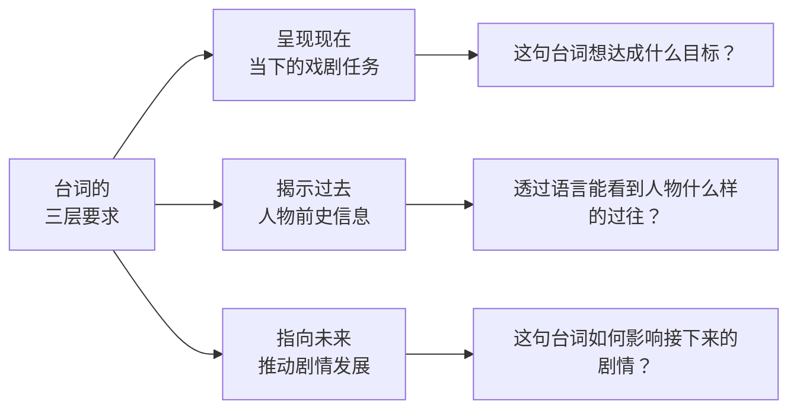
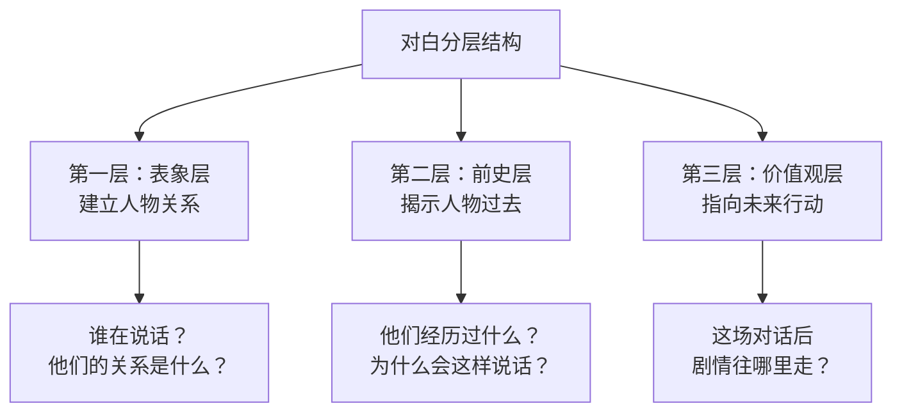

# 第03课：对白与潜台词的艺术

## 概述

台词是人物戏剧动作的一部分。好的台词不只是"说"，它本身就是在**行动**。一流编剧懂得：**语言不是万能的**——能用一句话说完的事，绝不用两句话；能用动作表达的，绝不用语言堆砌。

---

## 一、台词的三层要求（KP-DB-01）

每一句台词都必须同时完成三件事：

> [!tip] 冰山模型
> 角色说出来的话是冰山**露出水面的一角**，下面隐藏的是人物的全部前史、性格、价值观。观众通过这一角，洞察到整座冰山。

### 案例分析：《甄嬛传》——皇后的台词艺术

> [!example]
> 皇后说："臣妾不敢——陛下在气头上会迁怒于臣妾。"
> 
> 表面上她在推让，实际上：
> - **呈现现在**：她不想卷入当前的纷争
> - **揭示过去**：她深知皇帝的脾气，说明她长期在后宫小心翼翼地生存
> - **指向未来**：她越推让，皇帝越觉得她识大体，这件事反而绕不过她去

---

## 二、无声独白与留白

### 2.1 有声独白 vs 无声独白

大多数编剧遇到"人物心理无法外化"的时候，第一反应就是写有声独白。但真正高明的做法是：**无声独白**——什么都不说，却什么都说清楚了。

> [!tip] 无声独白的魅力
> 比如酒桌上，你和你喜欢的女孩坐在一起，众目睽睽之下你们不能互诉衷肠，但她冲你眨了一下眼睛，你回她一个微笑——**什么都没说，但什么都说了**。

### 2.2 经典案例：《知否知否》书院表白戏

> [!example]
> 小公爷借祭奠母亲的机会在寺庙堵住明兰表白。明兰全程没有一句"我也喜欢你"，但她的**微表情**和**身体动作**——拿起书遮住脸、偷偷窃喜、故作镇定——这些无声的"表演"比任何语言都更有力量。

**编剧的任务**：不只是写台词，还要写人物的**行为状态**。动作细节为演员提供表演支点，也让人物更加立体。

### 2.3 留白的艺术

"此处无声胜有声"——当对话达到高潮时，适当地**断开语言**，给观众一个"气口"，让观众有思考的空间。

> [!warning] 常见错误
> 很多编剧怕观众看不懂，拼命用台词去"填"。结果一场戏五六页纸全是对话，演员记不住，观众也喘不过气。

---

## 三、潜台词概念

### 3.1 什么是潜台词

**潜台词**是台词下面的那层含义——说出来的话不是真正的意思，真正的意思藏在话的背面。

> [!tip] 公式
> 优秀对白 = 表面台词（20%）+ 潜台词（80%）
> 平庸对白 = 表面台词（100%）

### 3.2 有意潜台词 vs 无意潜台词

| 类型 | 定义 | 特点 |
|------|------|------|
| **有意潜台词** | 双方都知道对方在想什么，但都不挑明 | 表面聊A事，实际在较量B事 |
| **无意潜台词** | 人物自己都没有意识到自己的真实想法，被对话激发出来 | 通过对话发现自己的内心 |

> [!example] 《国王的演讲》——无意潜台词
> 医生问乔治六世："你认为自己能成为一个好国王吗？"
> 国王反复逃避，最后才意识到——他从未真正相信自己配得上王位。
> 
> 这就是无意潜台词：人物自己不自知的内心真相，通过对话被层层揭示出来。

---

## 四、潜台词六种写法

### 4.1 六种技法总览

| 技法 | 定义 | 示例 |
|------|------|------|
| **1. 比喻** | 用比喻暗示真实意图 | "你长得很像一个人……" |
| **2. 暗示** | 不直接说，用侧面表达 | "是你让我成为一个更好的人" |
| **3. 欲言又止** | 话说一半留一半，制造悬念 | "其实我……算了，不说了" |
| **4. 误解** | 文化/认知差异导致话不对板 | 《BJ单身日记》跨文化误会 |
| **5. 重复** | 反复使用同一句话，形成人物标志 | "哎呀"说了三遍，观众就知道他要打退堂鼓了 |
| **6. 一语双关** | 同一句话有两层含义 | 表面说A，实际说B |

### 4.2 技法详解：一语双关

> [!example] 《甄嬛传》"到底该不该去"
> 皇帝问皇后："周大人犯了罪，到底该不该让他离京？"
> 
> 表面在问政务，实际在问："朕该不该去看即将生产的华妃？"
> 
> 一语双关的背后是人物关系——皇帝和皇后正在冷战，皇帝想通过这个问题试探皇后还在不在意他。

### 4.3 技法详解：欲言又止

> [!tip] 心理学原理
> 越是欲言又止，观众越想探究背后的真相。这其实就是**揭秘式悬念**在台词层面的应用——信息被隐藏了，观众的好奇心被调动了。

### 4.4 技法详解：比喻与暗示

> [!example] 《父母爱情》
> 男主人公在相亲时聊起苏联小说，女主发现他居然读过《钢铁是怎样炼成的》，并且能说出里面的名言。她没有说"我喜欢有文化的人"，但她的眼神已经泄露了内心的好感——**语言背后的暗示，比语言本身更重要**。

### 4.5 技法详解：误解

误解来源于信息不对等——你说的话和我理解的话不是同一个意思。

> [!example] 经典场景
> 女主角说"我再也不想见到你"——**表层含义**是赶你走，**潜台词**是"你为什么还不来追我？"
> 如果男主真的走了，就是一场由误解引发的戏剧冲突。

---

## 五、对白戏分层写作

### 5.1 三层建制

一场精彩的对话戏，必须有清晰的**层次递进**：

### 5.2 经典案例分析：《知否知否》明兰与小公爷表白戏

| 层次 | 内容 | 功能 |
|------|------|------|
| **表象层** | 小公爷表白，明兰拒绝 | 确立人物关系——一个追、一个躲 |
| **前史层** | 明兰提到小时候的礼物："你送我的笔，我还留着" | 揭示两人有感情基础，不是一见钟情 |
| **价值观层** | 明兰说："女子与男子不同——男子浪子回头仍可出将入相，女子一步走错就是身败名裂" | 揭示社会规训对女性的压迫，指向未来的冲突 |

> [!tip] 对白分层的关键
> 每一层之间要有**人物走位**（舞台调度）。明兰在对话过程中三次变换位置——从远处到近处，从正对到背对。走位的变化本身就是潜台词，暗示人物心理的变化。

### 5.3 同样的分层逻辑适用于各种类型

> [!example] 《金婚》相亲戏、《诺丁山》表白戏、《泰坦尼克号》甲板戏
> 所有优秀对白场景都遵循相同的三层建制：
> 1. 表层的"我在说什么"
> 2. 中层"我为什么这么说"
> 3. 深层的"我将要怎么做"

---

## 六、音乐音响的五种叙事功能（KP-DB-02）

音乐和音响不只是"配乐"——它们是**叙事工具**。

| 功能 | 说明 | 示例 |
|------|------|------|
| **1. 渲染环境气氛** | 建立场景的情绪基调 | 恐怖片中的低沉弦乐 |
| **2. 推动情节发展** | 音乐成为情节的一部分 | 《爱乐之城》中音乐连接两人的关系 |
| **3. 帮助转场** | 音乐连贯衔接两个场景 | 同一首歌贯穿两个不同时空 |
| **4. 外化人物心理** | 音乐替代台词表达内心 | 《甜蜜蜜》中邓丽君歌声响起，两人回头一笑 |
| **5. 表达主题** | 主题曲承载全篇价值观 | "真爱至上"主题曲贯穿全片 |

> [!tip] 音乐音响的隐喻功能
> 希区柯克在《蝴蝶梦》中通过音乐晕染神秘气氛——没有那个音乐，曼德利庄园就没有神秘感。音乐本身就在"说话"。

---

## 七、语言对白的风格与气质

### 7.1 人物语言 = 人物本身

什么样的人说什么样的话。语言体系是塑造人物最重要的工具之一。

> [!example]
> - **甜宠剧**的语言：轻柔、含蓄、小清新
> - **年代剧**的语言：有文言断句、讲究语气
> - **知识分子剧**的语言：有条理、有学术术语
> 
> 你写不出甜宠剧的质感，可能是因为你的语言体系本身就是"刀子嘴豆腐心"的风格。编剧要找到**适合自己的语言气质**。

### 7.2 民国戏的语言考察

> [!example] 创作经验
> 写民国戏《蝴蝶与潘有声离婚》一场戏时，初稿写的是"我要跟你离婚"。后来发现民国时期的人不这么说——他们说"合离"。
> 
> 台词断句方式也不同："是啊"代替"是的"，"死已哀哉"代替"太难过了"。
> 
> 写一个行业/时代的戏，必须做**语言采访**——和行业从业者聊天，从二手资料中学习语言的真实质感。

---

## 自我检查

点击展开自测问题

**问题1**：台词的三层要求是什么？请用自己的话复述。

**答案**：（1）呈现现在的戏剧任务——这句台词要完成什么；（2）揭示人物前史——从这句话观众能看出人物什么过往；（3）指向未来——这句台词如何推动剧情。

**问题2**：什么是"无声独白"？为什么它比有声独白更有力？

**答案**：无声独白是人物通过微表情、身体动作、行为举止来表达内心，不说一句话但观众完全明白他的感受。它更有力，因为它更接近真实生活——人的情感往往是通过"做"而不是"说"来传达的。

**问题3**：潜台词的六种写法分别是什么？

**答案**：（1）比喻；（2）暗示；（3）欲言又止；（4）误解；（5）重复；（6）一语双关。

**问题4**：对白戏的三层建制是什么？

**答案**：第一层：表象层——建立人物关系；第二层：前史层——揭示人物过去；第三层：价值观层——指向未来行动。

**问题5**：音乐音响的五种叙事功能是什么？

**答案**：（1）渲染环境气氛；（2）推动情节发展；（3）帮助转场；（4）外化人物心理；（5）表达主题。

**问题6**：什么是有意潜台词和无意潜台词的区别？

**答案**：有意潜台词——双方都明白对方的心思，但都不挑明；无意潜台词——人物自己都没意识到自己的内心，通过对话才被激发出来。

