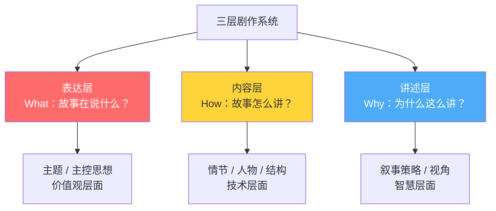
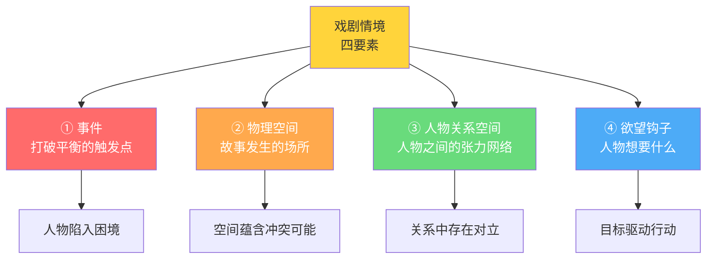

# 第04课：戏剧情境——剧作的基本单元

## 概述

戏剧情境是剧作最基本的单元。它不是一个抽象的概念，而是一个**可操作的工具**。理解戏剧情境，就是理解故事如何在微观层面运转——人物为什么行动、冲突如何产生、观众为什么被吸引。

---

## 一、三层剧作系统

要理解戏剧情境，首先需要建立一套**剧作系统的思维模型**。韩佳彤老师将剧作分为三个层级：



| 层级 | 关注点 | 问题 |
|------|--------|------|
| **表达层** | 主题与价值观 | 你这个故事最终想说什么？ |
| **内容层** | 情节、人物、结构 | 你用什么样的故事来说？ |
| **讲述层** | 叙事策略与视角 | 你用什么方式来讲这个故事？ |

> [!tip] 编剧的智慧在于"如何讲"
> 情节可能不是最重要的——最重要的是**你如何讲述情节**。这就是编剧的智慧。你反复看一部电影还喜欢它，不是因为你喜欢它的情节，而是因为你喜欢它编讲故事的方式。

---

## 二、戏剧情境的定义

### 2.1 什么是戏剧情境

**戏剧情境**是人物所处的具体环境，包括事件、空间、人物关系和欲望驱动四个要素。它规定了人物面对的条件，并由此产生行动。

> [!quote] 核心观点
> 戏剧情境是戏剧的基本细胞——它包含了戏剧的一切可能。没有情境，就没有戏剧。

### 2.2 事件 vs 事情——根本区别

这是本课最重要的概念之一：

| 对比 | 事情 | 事件 |
|------|------|------|
| 逻辑 | 时间顺序 | 因果联系 + 情感联系 |
| 结构 | 发生了就过去了 | 有因有果，指向未来 |
| 角色 | 纯功能性的 | 推动人物命运变化 |
| 观众感受 | 无所谓 | 关切、期待 |

> [!example] 什么是"事情"？
> 一个人去喝了一杯咖啡，然后吃了鸡蛋——这只是"事情"。它按时间顺序发生，但没有因果关联，没有情感联系，观众看完就忘。

> [!example] 什么是"事件"？
> 一个人想喝咖啡，刚端起杯子，电话响了——说恐怖组织袭击了他家那栋楼。他必须立刻逃命。
> 
> 这就是**事件**——它有因果（咖啡杯和电话之间的对比），有情感联系（生命受到威胁），有指向性（接下来他要怎么办？）。

**根本区别一句话：事情只需要"发生了"，事件需要"引发了什么"。**

---

## 三、戏剧情境四要素



### 3.1 要素一：事件

事件是戏剧情境的触发器。它的功能是：

- 打破人物的生活平衡
- 迫使人物做出选择
- 产生向前推进的动力

### 3.2 要素二：物理空间

空间不只是背景——它本身就含有戏剧性。

> [!example] 《追击者》中的杀人空间
> 凶手用来杀人的主场景，同时也是他童年目睹母亲被家暴的地方。空间本身就成了恐怖的象征，每次出现都唤起观众的心理紧张。

**空间的戏剧功能**：
- 规定人物活动的范围
- 蕴含冲突的潜在可能性
- 承载象征意义

### 3.3 要素三：人物关系空间

人物关系不是"朋友/敌人"的标签，而是一个**动态的张力网络**。每个人物都携带着自己的欲望和秘密，当他们在同一个空间相遇，戏剧就发生了。

> [!tip] 关系空间的设计原则
> 每一组人物关系都必须有**不对等**或**对立**的要素，否则就没有冲突。

### 3.4 要素四：欲望钩子

欲望钩子 = 人物的戏剧任务。它是驱动整个情境向前发展的动力源。

**没有欲望钩子，情境就是静态的。**

---

## 四、戏剧情境链条

戏剧情境不是孤立的——它构成一条链条，推动整个故事向前发展：


| 环节 | 定义 | 示例 |
|------|------|------|
| **情境** | 人物面对的客观条件 | 单身、30岁、母亲催婚、遇到了一个讨厌的人 |
| **动机** | 情境激发的内心驱动 | 不想被母亲摆布，但也不想孤独终老 |
| **任务** | 人物决定要做什么 | 去相亲，证明自己不需要相亲也能找到 |
| **动作** | 为完成任务采取的行动 | 去见了相亲对象、和对方吵架、又忍不住关注他 |
| **反应** | 外界对动作的回应 | 对方觉得她有意思、开始追求她 |
| **结果** | 动作+反应的最终状态 | 两人在一起了——新的情境产生 |

> [!tip] 关键洞察
> 结果永远不是终点——**结果是新的情境的开始**。这就是为什么故事可以一直讲下去。

---

## 五、案例分析：《BJ单身日记》开篇

### 5.1 开篇的情境分析

《BJ单身日记》的开篇是戏剧情境写作的典范：

**情境要素拆解**：

| 要素 | 内容 |
|------|------|
| **事件** | 新年第一天，BJ决定改变自己——记录日记、减肥、戒烟、找到真爱 |
| **物理空间** | 伦敦——一个冷漠又充满可能的都市 |
| **人物关系空间** | 她有一个毒舌但关心她的母亲、一个风流倜傥的上司（马克·达西）、一个花花公子（丹尼尔） |
| **欲望钩子** | BJ想要：爱 + 被认可 + 更好的自己 |

**情境链条的启动**：

```
情境（30岁单身/生活一团糟）→ 动机（不想再这样下去）→ 
任务（改变自己，找到真爱）→ 动作（写日记、减肥、主动社交）→ 
反应（意外不断，计划赶不上变化）→ 
结果（在跌跌撞撞中成长——新情境产生）
```

### 5.2 为什么这个开篇有效

> [!question] 思考
> 为什么我们看BJ独自在公寓里喝酒、写日记、吃外卖——这些无聊的日常活动——却一点都不觉得无聊？

**答案**：因为这些"事情"在情境中变成了"事件"。BJ的独居日常不是纯粹的时间顺序，而是**指向了她的欲望**——她的孤独本身就是她改变的动力。每一个"无聊"的细节都在说："她不想再这样下去了。"

---

## 六、戏剧任务（KP-005）的实战应用

### 6.1 戏剧任务 = 故事的发动机

戏剧任务就是人物在情境中想要达成的东西。没有戏剧任务，人物就只是"漂在故事里"。

### 6.2 设计未来 vs 心中一计（KP-015）

这是人物完成戏剧任务的两种策略：

| 策略 | 定义 | 信息状态 |
|------|------|----------|
| **设计未来** | 人物提前设计好一套战术/方案，并告诉观众 | 透露信息（期待式悬念） |
| **心中一计** | 人物不告诉观众他想怎么做，观众跟着他一步步探索 | 保密信息（揭秘式悬念） |

> [!example] 设计未来
> 人物和同伴说："我一会先去吸引他的注意力，然后你从后面包抄。"观众知道了计划，接下来的执行中如果出现意外，观众就会紧张："糟了，计划被发现了！"

> [!example] 心中一计
> 人物什么都不说，默默开始行动。观众好奇："他要干什么？"等到招式使出来，观众恍然大悟。

两种策略各有优劣。**设计未来**更费脑子——你需要设计两套招式（一套抛给观众看，一套真正执行），但效果更丰富。**心中一计**更简单，悬念感更强，但变化性少。

---

## 七、戏剧情境的实操法则

### 法则一：每个情境都要有明确的"因"

没有无源之水的情境。每个情境的建立，都要让观众明白：**它从何而来。**

### 法则二：每个情境都要指向下一个情境

一个情境的任务解决后，必须产生新的情境。戏与戏之间环环相扣。

### 法则三：情境的变化 = 价值的变化

人物在情境中经历**从正到负**或**从负到正**的变化。这种价值变化是观众情感投入的基础。


---

## 自我检查

<details>
<summary>点击展开自测问题</summary>

**问题1**：三层剧作系统是哪三层？每一层关注什么？

**答案**：（1）表达层——关注主题和价值观（故事想说什么）；（2）内容层——关注情节、人物、结构（故事怎么讲）；（3）讲述层——关注叙事策略和视角（为什么这么讲）。

**问题2**：什么是"事件"和"事情"的根本区别？

**答案**：事情只按时间顺序发生，没有因果联系和情感联系；事件则有因果联系和情感联系，并指向未来。事情只需要"发生了"，事件必须"引发了什么"。

**问题3**：戏剧情境的四要素是什么？

**答案**：（1）事件——打破平衡的触发点；（2）物理空间——故事发生的场所；（3）人物关系空间——人物之间的张力网络；（4）欲望钩子——人物想要什么。

**问题4**：戏剧情境链条的六个环节是什么？

**答案**：情境 → 动机 → 任务 → 动作 → 反应 → 结果（结果又成为新的情境，循环继续）。

**问题5**："设计未来"和"心中一计"有什么区别？

**答案**：设计未来是人物提前设计好方案并告知观众（透露信息，制造期待式悬念）；心中一计是人物不告诉观众他想怎么做（保密信息，制造揭秘式悬念）。设计未来需要两套招式，心中一计只需要一套。

**问题6**：为什么《BJ单身日记》中BJ独自在公寓吃外卖的场景不无聊？

**答案**：因为这些"事情"在戏剧情境中变成了"事件"——她的独居日常指向了她的欲望（改变自己），每一个细节都在说"她不想再这样下去了"。情境让无意义的事情变得有意义。

</details>