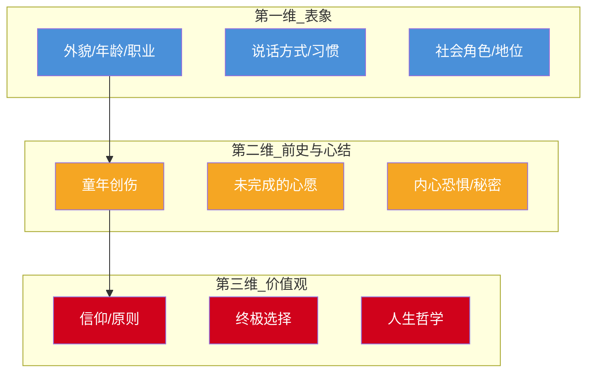

# 第09课：人物的三围层次

## 学习目标

- 理解人物"三围"的递进关系与各自在剧本中的功能
- 掌握冰山原则在人物塑造中的具体运用
- 识别三种主人公弧光及其叙事效果
- 学会运用意志力三要素增强人物感染力

## 核心概念：人物的三围层次

人物不是一张扁平的剪影，而是一个立体的、有纵深的生命体。韩佳彤老师提出**人物三围**的概念，打破了"圆形人物vs扁平人物"的二元划分，给出了一个更具操作性的三维模型：



### 第一维：表象——第一幕的任务

第一幕最重要的是让观众**认识**这个人。观众看到的是人物的外在——长相、衣着、职业、说话的口头禅、对待服务员的态度……这些都是"一维"信息。

一维塑造的关键在于**细节的精准**，而非数量的堆砌。一个动作胜过十句描述。例如一个出场时把公文包里的文件按颜色分类排列的角色，观众瞬间就知道他有强迫症倾向。

> [!TIP] 一维塑造技巧
> 用"反常"制造记忆点。如果一个人物出场时在做一件与身份不符的事（比如西装革履的大律师蹲在路边喂流浪猫），观众就会产生好奇——这扇门就打开了。

### 第二维：前史与心结——第二幕的核心

第二维是水面之下的部分。人物为什么是今天这个样子？这背后有一段**前史**，前史的末端有一个**心结**。

心结是人物一切行为的内在驱动力：
- 一个害怕承诺的人，可能因为童年目睹了父母离异
- 一个拼命赚钱的人，可能因为小时候家里穷被嘲笑过
- 一个过于好胜的人，可能因为从未得到父亲的认可

第二幕的主要戏剧动作就是**揭开**这些前史。如同剥洋葱，每剥一层，观众就离人物的真实内心更近一步。

> [!WARNING] 常见误区
> 前史不是写在人物小传里就够了，它必须**通过戏剧动作进入故事**。观众不是在读人物小传，而是在看人物的行为，然后在心里倒推出他的过去。

### 第三维：价值观——第三幕的决战

第三维是人物在最极端的情境下做出的**终极选择**，这个选择暴露了他的价值观。

价值观不是在人物嘴上说出来的，而是在**两难抉择**中体现的：
- 救爱人还是救世界？
- 说实话还是保护家人？
- 坚持原则还是获得成功？

第三幕之所以叫"决战"，不是指外部冲突的解决，而是人物**内心价值观的最终确认或转变**。

### 冰山原则

```mermaid
graph LR
    subgraph ”水面之上”
        A[表象<br/>第一维]
    end
    subgraph ”水面之下”
        B[前史与心结<br/>第二维]
        C[价值观<br/>第三维]
    end
    A -.->|可见| B
    B --> C
    style A fill:#4A90D9,color:#fff
    style B fill:#F5A623,color:#fff
    style C fill:#D0021B,color:#fff
```

水面之上（一维）只占冰山的八分之一，水面之下（二维、三维）才是人物真正的重量。**观众不需要在故事中看到所有的前史**，但编剧必须知道所有的前史。你知道得越多，人物就越可信。

> [!EXAMPLE] 冰山原则实践
> 在《三傻大闹宝莱坞》中，兰彻的"一维"是一个快乐、叛逆、热爱拆解机器的学生。到了第二幕我们才知道他的"二维"——他其实不是真的大学生，而是替富人家的仆人去读书的替身。而他的"三维"价值观是：追求卓越，成功自然会追上你。这个价值观在第三幕的终极选择（放弃巨额财富，选择当老师）中得到完美体现。

## 三种主人公弧光

人物在故事中的变化轨迹称为**弧光**。以下是三种基本类型：

| 弧光类型 | 起点 | 终点 | 核心机制 | 经典案例 |
|----------|------|------|----------|----------|
| **成长型弧光** | 负面/缺陷 | 正面/成熟 | 克服心结，获得成长 | 《肖申克的救赎》安迪、《千与千寻》千寻 |
| **失败型弧光** | 正面/优秀 | 负面/堕落 | 被欲望吞噬，走向毁灭 | 《教父》麦克、《黑天鹅》妮娜 |
| **静止型弧光** | 正面 | 正面（不变） | 保持本色，影响世界 | 《阿甘正传》阿甘、《大智若愚》佛瑞斯特 |

> [!QUESTION] 思考一下
> 静止型弧光看似"没有变化"，为什么仍然能让观众感到满足？——因为虽然主人公没有变，但世界因他而变了。观众在人物不变中获得了一种"信仰的确认"。

### 成长型弧光：反→正

最经典的弧光类型。人物从有缺陷的状态出发，经历故事中的磨难和考验，最终克服了自身的局限性，成为一个更好的人。

### 失败型弧光：正→反

人物从正面出发，但因为内心的欲望或外部的诱惑，一步步走向堕落。这类弧光往往带有悲剧色彩，给观众以警醒。

### 静止型弧光：正→正

人物从头到尾保持自己的本色。他的价值观在故事开始时就已成熟，故事的核心不是让他改变，而是检验这种价值观的可靠性，并让世界因此被触动。

## 人物意志力三要素

有了三围和弧光还不够——观众必须**在意**这个人物。韩老师提出了三个关键要素：

1. **真实感**：人物的行为逻辑是自洽的。一个平常懦弱的人不会突然变成英雄，除非我们看到了他的内心转变过程。
2. **意志力**：人物必须有强烈的欲望和行动力。被动的主人公是编剧的大敌。
3. **观众认同**：观众能理解人物的选择——不一定赞同，但必须理解。理解的桥梁是**共情**，共情的基础是**普遍人性**。

## 交朋友理论

韩佳彤老师用"交朋友"来比喻人物塑造的过程：

- **第一次见面**（第一幕/一维）: 你看到的是对方的衣着、谈吐、职业 —— 这是表象
- **喝了几次酒**（第二幕/二维）: 他开始聊自己的过去、家庭、创伤 —— 这是前史与心结
- **生死之交**（第三幕/三维）: 你最清楚他的原则和底线是什么 —— 这是价值观

> [!TIP] 实操建议
> 写完人物小传后，问自己三个问题：
> 1. 如果我在街上遇见TA，我第一眼会注意到什么？（一维）
> 2. 如果TA请我喝酒，TA会告诉我什么秘密？（二维）
> 3. 如果TA面临生死抉择，TA会怎么做？（三维）
> 如果三个问题都能回答得具体，你的人物就站住了。

## 案例分析：《三傻大闹宝莱坞》人物三围拆解

| 人物 | 一维（表象） | 二维（前史与心结） | 三维（价值观） |
|------|-------------|-------------------|---------------|
| **兰彻** | 快乐叛逆、热爱拆机器、挑战权威 | 真实身份是仆人替身，不是真大学生；童年被迫替人读书 | "追求卓越，成功自然会追上你" |
| **法尔罕** | 听话的好学生、犹豫不决 | 热爱野生动物摄影但被父亲逼着学工程 | 最终选择追随激情，成为摄影师 |
| **拉朱** | 迷信、焦虑、背负家庭期望 | 家庭极度贫困，父亲瘫痪，母亲操劳，姐姐嫁不出去全靠他 | 克服恐惧，不再为别人活 |

三个人物分别代表了面对同一困境的不同反应——兰彻反抗、法尔罕犹豫、拉朱恐惧。三人的"三围"在互相碰撞中逐步展现，这正是群戏的魅力所在。

## 检索练习：自我检测

> [!QUESTION] 自测题
> 1. 人物三围分别对应剧本的哪三幕？为什么是这个对应关系？
> 2. 冰山原则中，水面之下的部分占多少？这给编剧什么启示？
> 3. 三种主人公弧光分别是什么？请各举一个你知道的电影例子。
> 4. 意志力三要素是哪三个？为什么"观众认同"是必不可少的？
> 5. 交朋友理论的核心是什么？它如何帮助你检查人物塑造的深度？

<details>
<summary>查看参考答案</summary>

1. 一维对应第一幕（让观众认识人物）、二维对应第二幕（揭开前史和心结）、三维对应第三幕（在终极选择中暴露价值观）。之所以一一对应，是因为每一幕的戏剧功能正好需要人物的相应维度作为支撑。

2. 水面之下占八分之七。启示：编剧需要知道的人物背景远远多于呈现在剧本中的内容。你知道得越多，即使只展示一小部分，观众也能感受到人物的"厚度"。

3. 成长型弧光（反→正，如《功夫》中的阿星）、失败型弧光（正→反，如《教父》麦克）、静止型弧光（正→正，如《阿甘正传》阿甘）。

4. 真实感、意志力、观众认同。观众认同之所以必不可少，是因为没有认同就没有情感投入，一个让观众"无感"的人物即使结构再完美也是失败的。

5. 交朋友理论的核心是用"交往的层次"来类比人物揭示的过程。从外在表象到内心秘密再到核心价值观，逐层深入。如果编剧本人在"交往"中只能说出人物的一维，就说明人物塑造还没到位。

</details>

## 下一步

确认掌握三围层次后，进入下一课"十六节拍叙事法"，学习如何用节拍把控故事的戏剧节奏。