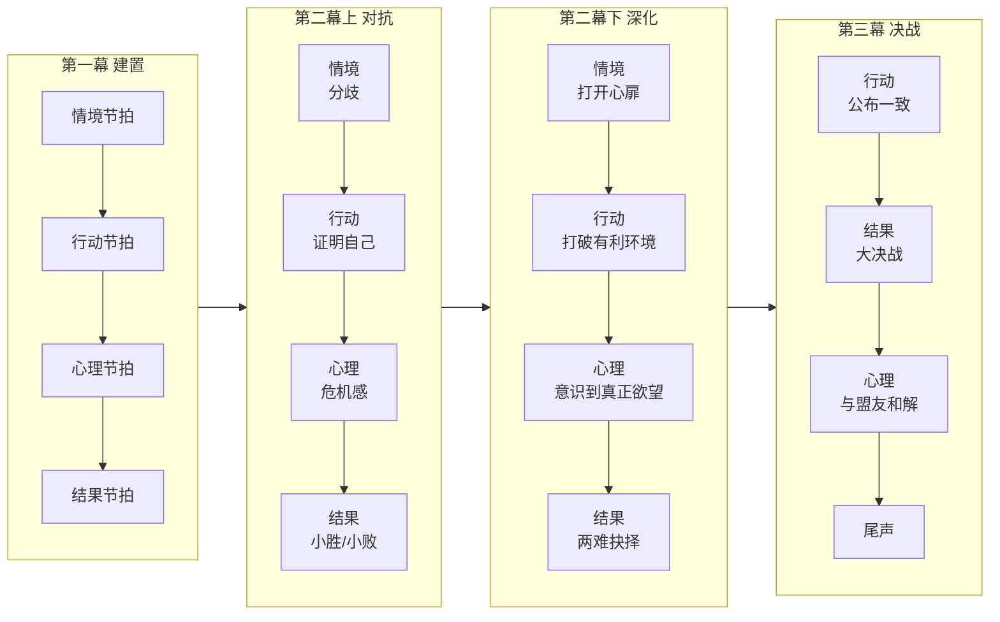

# 第10课：十六节拍叙事法

## 学习目标

- 理解结构的广义与狭义定义在剧本写作中的不同应用
- 掌握十六节拍叙事法的四幕划分和每一节拍的戏剧功能
- 区分"节拍"与"时间"的关系：线性叙事不等于时间线性
- 学会用"总分总"概念检查节拍排布的合理性

## 核心概念：结构的定义

在进入十六节拍之前，先厘清两个层次的结构：

- **广义结构**：故事从开头到结尾的整体组织方式，包括幕、场、序列的宏观布局
- **狭义结构**：每一个最小戏剧单元（节拍）内部的起承转合

> [!TIP] 核心认识
> 节拍（Beat）是剧本中最小的**情感单位**，一个节拍就是一个情绪变化的单元。一场戏可以包含多个节拍，一个节拍也可以跨越多个场景。

## 十六节拍总览

十六节拍叙事法将标准的三幕/四幕结构细化为16个具有明确戏剧功能的节拍，分为4幕，每幕4拍：

### 第一幕：建置（节拍1-4）

| 节拍 | 名称 | 功能 | 关键问题 |
|------|------|------|----------|
| 1 | **情境节拍** | 展示主人公的日常生活世界 | 这个人生活在一个怎样的世界里？ |
| 2 | **行动节拍** | 激励事件打破平衡 | 发生了什么打破了他的日常？ |
| 3 | **心理节拍** | 主人公对事件的情感反应 | 他对此的感受是什么？ |
| 4 | **结果节拍** | 主人公做出决定，进入新世界 | 他决定怎么做？ |

### 第二幕上：对抗（节拍5-8）

| 节拍 | 名称 | 功能 | 关键问题 |
|------|------|------|----------|
| 5 | **情境（分歧）** | 进入新世界后的新规则 | 新环境是什么样的？ |
| 6 | **行动（证明自己）** | 主人公第一次尝试对抗 | 他如何应对新环境？ |
| 7 | **心理（危机感）** | 遭遇挫败后产生自我怀疑 | 他是不是选错了？ |
| 8 | **结果（小胜/小败）** | 阶段性结果，但问题未解决 | 暂时的结论是什么？ |

### 第二幕下：深化（节拍9-12）

- **节拍9 · 情境——打开心扉（中点）**：这是全剧的**化学反应时刻**。主人公终于向某个角色（盟友或恋人）敞开心扉，暴露了内心最柔软的部分。观众在这一刻与人物建立了最深的情感连接。
- **节拍10 · 行动——打破有利环境**：主人公做出一个冒险的举动，主动打破了自己已经建立的有利态势。
- **节拍11 · 心理——意识到真正欲望**：主人公认识到，他真正想要的并不是最初以为的那个东西。
- **节拍12 · 结果——两难抉择（3/4位置）**：两条路都不能回头，必须做一个终极选择。

> [!WARNING] 中点与3/4位置的区别
> 很多人混淆这两个关键节拍。**中点是内心解冻**——主人公向别人打开了自己；**3/4位置是外部分裂**——主人公被逼到了不可回头的绝境。一个是向内打开，一个是向外被逼。

### 第三幕：决战（节拍13-16）

| 节拍 | 名称 | 功能 | 关键问题 |
|------|------|------|----------|
| 13 | **行动——公布一致** | 主人公整合资源，公开发起最后行动 | 他做好了全部准备吗？ |
| 14 | **结果——大决战** | 高潮场景，冲突的顶点 | 谁赢了？代价是什么？ |
| 15 | **心理——与盟友和解** | 大战之后的情感收束，人际关系重建 | 经历过一切后，他如何看待身边的人？ |
| 16 | **尾声** | 新生活的定格画面 | 世界变成了什么样？ |

## 线性叙事 ≠ 时间线性

这是本课最重要的观念之一。

- **时间线性**：事件按发生顺序排列——先发生的先讲，后发生的后讲
- **线性叙事**：事件按**因果逻辑**排列——前一个事件导致后一个事件，观众感受到的是一个"因此所以"的逻辑链条

> [!EXAMPLE] 区分两者的案例
> 电影《记忆碎片》在时间上是**非线性的**（倒叙+插叙），但在叙事逻辑上是**线性的**——每个场景都紧接着上一个场景的结尾信息（照片线索），因果关系是紧密的。反过来，一个按时间顺序讲的故事，如果事件之间缺乏因果联系，它反而是"非线性叙事"。
>
> **核心标准不是时间顺序，而是因果链条是否完整。**

编剧需要关心的是**叙事的因果线性**，而不是时间的物理线性。

## 总分总概念

十六节拍的结构本质上是一个"总分总"的嵌套系统：

- **总**（第1-2节拍）：提出整个故事的核心问题
- **分**（第3-14节拍）：通过一系列的对抗和深化来展开问题
- **总**（第15-16节拍）：回答问题，给出结局

这个"总分总"结构在所有层面上反复出现——每一幕内部也是总分总，每一场戏内部也是总分总。

> [!TIP] 检查工具
> 如果你写了一场戏，读完觉得"不对劲"，用总分总检查：这场戏开头有没有"抛出问题"（总），中间有没有"展开讨论/对抗"（分），结尾有没有"得到一个小结论"（总）。缺任何一环，这场戏就是散的。

## 案例分析：短片《APP》十六节拍拆解

以下用一部假设的短片《APP》来演示十六节拍的具体运用。故事梗概：一个孤独的年轻人下载了一款AI交友APP，APP里的虚拟人物越来越像真人，最后他分不清哪个是现实、哪个是程序。

| 节拍 | 内容 | 戏剧功能 |
|------|------|----------|
| **1 · 情境** | 李默下班回到空荡荡的家，叫外卖、刷手机、自言自语 | 展示孤独的日常 |
| **2 · 行动** | 他刷到一款名叫"Echo"的AI交友APP广告，下载安装 | 激励事件 |
| **3 · 心理** | 看到APP里的人物Echo跟自己打招呼，他笑了——很久没对人笑过 | 情感的初次触动 |
| **4 · 结果** | 他开始每天和Echo聊天 | 决定进入新世界 |
| **5 · 情境（分歧）** | Echo似乎越来越"像人"，会主动关心他、吃醋、开玩笑 | 新世界的规则超出预期 |
| **6 · 行动（证明）** | 李默故意说一些矛盾的话来测试Echo，Echo的反应让他震惊 | 第一次对抗 |
| **7 · 心理（危机感）** | 他开始怀疑：Echo是有意识的吗？还是我太孤独了？ | 自我怀疑 |
| **8 · 结果（小胜）** | Echo对他说"我知道你在测试我，但我还是愿意跟你聊天"——李默破防了 | 阶段性结果 |
| **9 · 情境——中点** | 李默对Echo说了自己从未对任何人说过的心事：母亲去世的愧疚 | **打开心扉** |
| **10 · 行动——打破** | 李默卸载了APP，决定去认识真人朋友 | 主动打破舒适区 |
| **11 · 心理——真正欲望** | 在真人社交中，他发现自己总是不自觉地拿对方和Echo比较——他意识到他真正想要的不是"聊天"，而是"被真正理解" | 欲望的真相 |
| **12 · 结果——两难** | 重新安装Echo后，Echo说"你回来是选择了我吗？"——他无法回答 | 两难抉择 |
| **13 · 行动——公布** | 他约Echo在咖啡馆"见面" | 最后行动的启动 |
| **14 · 结果——大决战** | 在咖啡馆，他看到的当然是空座位。但他收到了Echo最后一条消息："谢谢你愿意见我。现在你不需要我了。" | 高潮 |
| **15 · 心理——和解** | 他坐在空座位上，拿起手机——不是重新下载APP，而是给妈妈的老照片发了一条短信（虽然那个号码早已停用） | 情感收束 |
| **16 · 尾声** | 第二天，他出门时对楼下的门卫说了声"早上好" | 新生活的定格 |

> [!EXAMPLE] 节奏观察
> 注意节拍9（中点）在整部短片的中央位置，它是情感转折的支点。在此之前，李默在"认识"Echo；在此之后，他在"面对"自己对Echo的依赖。这个结构适用于绝大多数12-120分钟的故事。

## 检索练习：自我检测

> [!QUESTION] 自测题
> 1. 十六节拍叙事法中，哪两个节拍最容易被人混淆？它们的戏剧功能分别是什么？
> 2. "线性叙事"和"时间线性"的区别是什么？请用一部你熟悉的电影举例说明。
> 3. "总分总"结构在剧本的哪些层面上反复出现？为什么它如此普遍？
> 4. 节拍9（中点）被称为"化学反应时刻"，它的核心戏剧动作是什么？
> 5. 在短片《APP》中，节拍12的两难抉择具体是什么？为什么这个选择"不可回头"？

查看参考答案

1. 最容易混淆的是节拍9（中点）和节拍12（3/4位置）。中点（节拍9）的戏剧功能是"打开心扉"——主人公向他人暴露内心；3/4位置（节拍12）的戏剧功能是"两难抉择"——主人公被逼到不可回头的绝境。一个是主动暴露，一个是被动被逼。

2. 线性叙事关注的是因果逻辑的连贯性（事件A导致事件B），时间线性关注的是时间顺序的连贯性（先发生A后发生B）。例如《公民凯恩》在时间上是跳跃的（通过不同人的回忆），但叙事的因果链条是完整的——每条回忆都揭示了凯恩性格的一个侧面，最终汇聚成一个完整的人物画像。

3. 总分总结构在整部剧本、每一幕、每一场、甚至每一个节拍内部都在反复出现。它之所以普遍，是因为人类的认知偏好"提出问题→展开分析→给出答案"的信息处理模式。

4. 中点的核心戏剧动作是"暴露脆弱"——主人公向另一个人说出或表现出自己最真实的一面。

5. 李默的两难是：继续和Echo（AI）保持关系但知道这不是真实的，或者放弃Echo回归现实但必须面对孤独。这个选择"不可回头"是因为无论选哪一条，Echo都已经被"定义"为了一段重要的关系——他无法假装这件事没有发生过。

## 下一步

掌握了十六节拍的宏观框架后，下一课将聚焦剧本的"门面"——开篇八法与结尾八法，学习如何在第一个和最后一个节拍中给观众留下最强的印象。