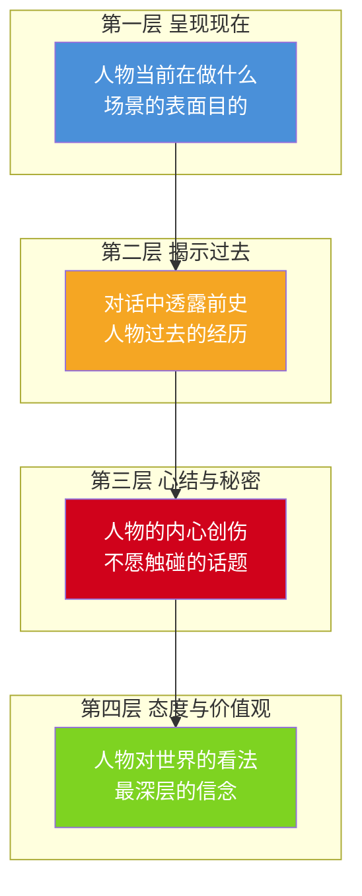

# 第12课：关键场景写作技法

## 学习目标

- 掌握"一唱三叹"的节奏控制方法，在关键情境中制造最大情感冲击
- 学会打斗戏的四段式结构，让动作场面具有叙事功能
- 理解追逐戏中空间隔断创造节拍的原理
- 运用对白四层结构写出有深度的人物对话
- 识别三种高潮类型和五种人物转变方法
- 区分电影时间与生活时间的叙事差异

## 一唱三叹：关键时刻的反复渲染

"一唱三叹"源自中国古典文学中的反复咏叹手法，用在剧本写作中指的是：在**关键的情感时刻**，从一个事件/意象出发，用不同的角度反复渲染，让情感的强度逐次升级。

> [!EXAMPLE] 《逃离德黑兰》的一唱三叹
> 影片结尾机场离境的"三叹"堪称经典：
> - **第一叹**：登机口工作人员打电话核实身份。观众和主人公一起紧张——这是第一层压力。
> - **第二叹**：长官已经发现了逃跑计划，追兵赶赴机场。同时飞机还在跑道上滑行——这是第二层压力叠加。
> - **第三叹**：飞机已经起飞，追兵赶到跑道，但看清楚人后只能放弃。观众在这一刻才真正释放——这是第三层压力的解除。
>
> 每一次"叹"都比前一次更紧，就像海浪一波高过一波。如果只有"一通电话核实身份→顺利登机"，这场戏的情感浓度就会大打折扣。

### 一唱三叹的四步操作法

1. **建立目标**：明确角色在这个场景中最想要的到底是什么（登机、告白、复仇……）
2. **设置障碍链**：障碍不是一次性的，而是至少三次递进式的阻碍
3. **分级升级**：第一次障碍=轻度紧张，第二次=中度紧张，第三次=几乎绝望
4. **释放**：最后一次障碍解除时，观众得到了最大程度的满足

> [!WARNING] 一唱三叹的滥用
> 不是所有场景都用一唱三叹。只有当这个场景是**全片的关键情感节点**时才值得用它。日常过渡场景如果也用"三叹"，观众会疲劳，真正的高潮时刻反而失去了力量。

## 打斗四段式

电影中的打斗不能只是"打"，它必须**讲故事**。韩佳彤老师总结了打斗戏的四段式结构：

| 阶段 | 内容 | 戏剧功能 | 节拍要求 |
|------|------|----------|----------|
| **劣势** | 主人公处于不利局面，被压制 | 建立紧张感 | 短促、密集 |
| **夺兵器** | 主人公在劣势中找到机会，扭转局势 | 能力与意志的证明 | 突然、意外 |
| **转机** | 主人公开始反攻，局势逆转 | 情感释放 | 加速 |
| **收尾** | 胜负已分，呈现结果 | 主题表达或情感收束 | 放慢、定格 |

> [!EXAMPLE] 《斯巴达克斯》打斗四段式
> 在库布里克的《斯巴达克斯》中，角斗场的一场打斗堪称教科书：
> - **劣势**：斯巴达克斯被对手压制，身上带伤，只能被动防守
> - **夺兵器**：他在躲闪中一把握住了对手的矛，用力折断
> - **转机**：他用断矛反击，对手节节败退
> - **收尾**：斯巴达克斯赢了，但他没有杀死对手——这个选择定义了他的价值观
>
> 注意：最后一阶段（收尾）才是这场打斗的"文眼"。前面的三段都是为了最后这一刻做铺垫——斯巴达克斯选择不杀，让这场打斗从一个动作场面变成了一个**品德宣示**。

## 追逐戏：空间隔断创造节拍

追逐戏的核心不是"跑得快"，而是**空间的变化制造节奏**。一个优秀的追逐戏最少经过4-5个不同的空间：

| 空间变换 | 节拍效果 | 举例 |
|----------|----------|------|
| 开阔空间（街道）→ 狭窄空间（巷子） | 紧迫感升级 | 跑者被迫进入危险区域 |
| 低处 → 高处（楼梯/天台） | 风险升级 | 高度增加，容错率归零 |
| 内部 → 外部（破窗/破门） | 动作强度升级 | 物理阻隔被打破 |
| 人群密集 → 空旷无人 | 孤立感升级 | 无人可以求助 |
| 追者与被追者互换 | 权力关系反转 | 猎人与猎物的身份变化 |

> [!EXAMPLE] 《火锅英雄》追逐戏
> 在《火锅英雄》的经典追逐场景中，刘波被追杀穿越了至少5个空间：火锅店（熟悉环境）→ 小巷（进入未知）→ 菜市场（利用障碍物周旋）→ 居民楼（上下楼梯改变垂直高度）→天台（终极对决）。每一个空间切换都伴随着一次节拍变化，观众的呼吸也随之起伏。

## 对白四层结构

这是本课**最有实操价值**的技法之一。一段好对白之所以让人物显得立体，是因为它在四个层次上同时工作：

> [!EXAMPLE] 《夏洛特烦恼》对白四层分析
> 夏洛和马冬梅在楼顶的一场对话：
> - **第一层·呈现现在**：马冬梅来找夏洛，让他别喝酒了回家（表面场景任务）
> - **第二层·揭示过去**：她提到当年夏洛是怎么追她的（透露前史）
> - **第三层·心结与秘密**：夏洛说"我恨你，你毁了我的人生"——他的心结是：觉得自己被婚姻困住了，错失了大好前程
> - **第四层·态度与价值观**：马冬梅说"我知道你后悔了，但我不后悔"——她的价值观是：爱就是不后悔地付出
>
> 这段对话之所以动人，是因为它从"叫回家吃饭"开始，最后触达了两个人物最深层的价值观碰撞。

> [!TIP] 检查对白深度的三个问题
> 写完一段对白后，逐层检查：
> 1. 这段对白有没有推进现在的情境？（第一层）
> 2. 有没有让观众知道更多关于人物过去的事？（第二层）
> 3. 有没有触及人物最不想谈的那个点？（第三层）有没有说出人物最相信的那个道理？（第四层）
> 如果三层以上的回答是"否"，这段对白就是信息性的，应该删掉或重写。

## 三种高潮类型

| 类型 | 定义 | 驱动力 | 经典案例 |
|------|------|--------|----------|
| **性格使然型** | 高潮由人物的性格选择所决定 | 内在驱动力 | 《肖申克的救赎》安迪越狱——他从不认命 |
| **环境使然型** | 高潮由外部环境的逼迫所导致 | 外在驱动力 | 《釜山行》石宇被感染——环境让他别无选择 |
| **意外事件型** | 高潮由不可预测的偶然事件引爆 | 偶然性 | 《老无所依》硬币决定生死——纯粹的意外 |

> [!QUESTION] 哪种高潮最"高级"？
> 没有绝对的高级和低级。三种高潮服务于不同的叙事目标：
> - 性格使然型最**感人**（观众在人物身上看到了自己渴望的品质）
> - 环境使然型最**合理**（观众觉得"换了我也会这样"）
> - 意外事件型最**震撼**（观众感到世界是无常的）
>
> 高级的编剧会在一个高潮场景中融合两种甚至三种类型。例如《教父》结尾，麦克在教堂同时进行洗礼仪式和刺杀行动——这是他性格的选择（性格使然），也是家族利益所迫（环境使然），更是他早已计划的时机（算准了米兰不会防备）。

## 人物转变的五个方法

人物转变不是靠"一道闪电劈下来就变了"，必须有一个可信的过程。韩老师总结了五个方法：

| 方法 | 机制 | 使用场景 | 优点 | 风险 |
|------|------|----------|------|------|
| **反省回忆式** | 人物通过回忆过往事件，意识到自己错了 | 内心戏多、时间跨度大的故事 | 情感深度大 | 拖慢节奏 |
| **被说服式** | 其他角色用逻辑或情感说服主人公 | 群戏、师徒关系 | 展示他人的影响力 | 容易变成"说教" |
| **英雄式成长** | 人物在极端考验中发现自己有某种能力或品质 | 冒险、战争、体育题材 | 观赏性强 | 容易落入俗套 |
| **支线情节式** | 通过支线人物的经历，间接影响主人公 | 多线叙事、社会题材 | 叙事层次丰富 | 注意支线收束 |
| **环境力量式** | 社会/自然力量迫使人物改变生存策略 | 灾难、时代剧、政治惊悚 | 格局宏大 | 人物容易被"淹没" |

## 电影时间 vs 生活时间

这是每一个编剧都必须意识到的核心差异：

- **生活时间**：物理时间，一分钟就是一分钟，不可压缩不可拉伸
- **电影时间**：叙事时间，可以压缩、拉伸、暂停、重复、倒流

电影时间的操控手法：

| 手法 | 定义 | 效果 |
|------|------|------|
| **压缩** | 用蒙太奇把数天/数月/数年缩成几十秒 | 提高叙事效率 |
| **拉伸** | 用慢动作把一瞬间展开成几十秒 | 强化情感冲击 |
| **暂停** | 用画外音或定格让时间"静止" | 深入内心世界 |
| **重复** | 从不同视角反复呈现同一时间段的同一事件 | 揭示多面真相 |
| **倒流** | 按时间倒序叙事 | 创造宿命感 |

> [!TIP] 实操建议
> 在写关键场景之前，先问自己这个问题：**"观众在这个场景中感觉过了多久？"** 而不是"这个场景实际有多长？"——因为观众感受到的那个"多久"，才是电影时间。一场戏可以只拍了3分钟，但观众感觉得到了暴风骤雨般的10分钟，这种"密度"就是电影时间的魅力。

## 检索练习：自我检测

> [!QUESTION] 自测题
> 1. "一唱三叹"的核心操作步骤是什么？为什么不能对每一个场景都使用？
> 2. 打斗四段式中，哪一段的戏剧功能最容易被忽视？请说明理由。
> 3. 追逐戏中，空间隔断的核心作用是什么？
> 4. 对白四层结构从表层到深层分别是哪四层？以你最近看的一部电影为例做一层层分析。
> 5. 电影时间和生活时间的区别是什么？请举一个电影中"拉伸"时间的例子。

查看参考答案

1. 四步操作：建立目标→设置障碍链→分级升级→释放。不能对每一个场景使用的原因：其一，一唱三叹需要较长的篇幅，日常过渡场景用它会拖慢节奏；其二，一唱三叹的力量在于"关键时刻的重磅渲染"，如果处处都是重磅，就没有重磅了。

2. 第四段"收尾"最容易被忽视——很多编剧把打斗写成"打赢了就完了"。但真正优秀的打斗场景在"谁赢"之后还有一个节拍：赢的人做了什么、说了什么、或者选择了不做什么——这是整场打斗的"主题句"。

3. 空间隔断的核心作用是**制造叙事的节拍变化**。每一次空间切换都自动带来节奏的变化（快→慢、开阔→狭窄、熟悉→陌生），让观众在视觉变化中获得呼吸和紧张交替的节奏感。没有空间变化的追逐戏会变得单调而疲劳。

4. 四层：呈现现在→揭示过去→心结与秘密→态度与价值观。实践题需要自行选片分析。

5. 电影时间是**被操控的叙事时间**，生活时间是不可改变的物理时间。拉伸的例子：《黑客帝国》中尼奥躲子弹的慢动作——物理上子弹飞过只需不到一秒，但电影把它拉长到几十秒，让观众看清每一个细节，同时获得视觉上的震撼和美学享受。

## 下一步

本课涵盖了从对白到打斗、从一唱三叹到电影时间的系列场景写作技法。至此，核心叙事技法课程暂告一段落。接下来可以进入"悬念的类型与策略"，学习如何用悬念牵引观众的注意力到最后一分钟。